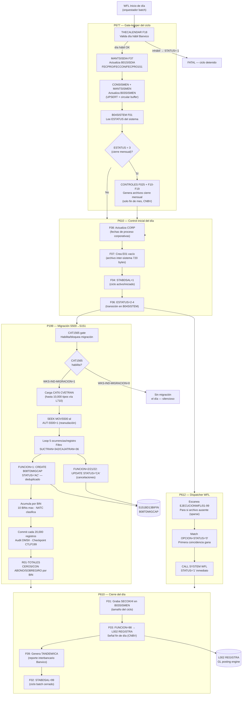

# BC-18 · Control Batch y Extracción Regulatoria
> Capacidad bancaria: T.3.4 · Nombre anterior: "Analytics/Reporting" — renombrado tras revisión taxonómica 2026-07-20
> Sistemas: S151 (Contabilidad General Ledger) · Unisys ClearPath MCP / DMSII
> Programas: P677 (Gate-keeper diario) · P610 (Dispatcher control batch) · P612 (WFL Launcher) · P199 (Bridge S500→S151)
> Reglas: RN-S151-421..490 (P199/P610/P612/P677) · 70 reglas
> Generado: 2026-07-16 · Swarm GemCog Capa 3 · QC 2026-07-21: P120 removido → T.4.1 · total reglas actualizado a 70
> Indexado: ✅ 2026-07-27 — correlacionado vocab↔reglas↔capacidad (build-traceability.py)
> QC taxonómico: ✅ QC 2026-07-21: P120 reclasificado a T.4.1 cap-cfr. Esta capacidad (T.3.4) cubre únicamente P199 · P610 · P612 · P677 = 70 reglas.
> bian_ref: T.3.4 Batch Control & Regulatory Extraction

---

## Contexto funcional

La capacidad T.3.4 de S151 agrupa cinco programas que constituyen la **infraestructura de control del ciclo batch diario**, el **único puente de integración de datos entre S500 (Captación) y S151 (Contabilidad GL)**, y la **extracción regulatoria SAR para Banxico**. Ninguno de ellos produce reportes analíticos en el sentido moderno (BI, dashboards, agregaciones ad-hoc). Son la capa transversal que orquesta, sincroniza y extrae el estado del sistema al cierre de cada jornada bancaria.

> **Nota taxonómica (QC 2026-07-20):** Esta capacidad fue etiquetada inicialmente como "Analytics/Reporting" siguiendo la heurística BIAN T.3.4. Tras revisión: P677 es infraestructura de scheduling (candidato 8.1.1), P610 es dispatcher de control batch (candidato T.5.1), P612 es launcher WFL (T.5.1), P199 es integración cross-system (candidato propio T.x.x), y P120 es extracción regulatoria SAR (candidato T.4.1 CFR). El nombre de la capacidad ha sido actualizado a "Batch Cycle Control & Regulatory Extraction". Los IDs de reglas y la asignación T.3.4 en bian-mapping-s151.md se mantienen en esta versión; una reclasificación completa requiere re-run de build-traceability.py.

**P677** (CTRLGEN, 1,094 LOC) es el gate-keeper absoluto: el primer programa en ejecutarse cada día hábil. Valida contra el calendario bancario Banxico (THECALENDAR F18) que la fecha de proceso sea hábil, reconstruye los datasets de control B01SISDIA (fechas del sistema), B03SISMEN (ciclos mensuales en buffer circular) y B04SISTEM (estado global del sistema), y cuando ESTATUS=3 al cierre mensual, dispara la generación de los archivos de control F10-F19. Sin P677, ningún otro programa de S151 puede ejecutarse ese día. **P610** (CALLLIBCTL, 1,768 LOC) es el dispatcher de nueve funciones de control que gobiernan el ciclo batch: graba el tamaño del ciclo (F01), gestiona los estados STABDSAL de la base mensual (F02/F04/F05), envía la señal regulatoria de fin de día a L002 en formato 6DIG u 8DIG según el sistema receptor (F03 — impacto directo CNBV), inicializa el archivo E01 inter-sistema (F07), actualiza el archivo corporativo de fechas CORP (F08) y genera el archivo TANDEM de reporte interbancario ICA para Banxico (F09). Ambos programas se invocan desde WFLs de orquestación: no tienen lógica de negocio propia, son los interruptores del pipeline batch.

**P199** (CTASMIGCAP, 2,753 LOC) es el único punto de integración entre S500 (Captación/operativo) y S151 (General Ledger). Cada día después del cierre de S500, lee el archivo secuencial MOVS500 y persiste los movimientos migrados en la tabla DMSII S151B08TDMIGCAP de la base S151BD13BIFIN. La migración es habilitada por un catálogo diario (CAT1565), soporta cuatro funciones operativas (alta=1, cancelación por AUT=2, cancelación masiva=21, cancelación por rango=22), acumula totales por BIN para hasta 10 BINs distintos, y genera el reporte regulatorio R01-TOTALES con tres categorías por BIN: CEROS, CON ABONO y SOBREGIRO. El checkpoint de reanudación (CTLP199) permite reiniciar desde el último registro procesado ante una interrupción. **P612** (WFL Dispatcher, 87 LOC) es el más simple del grupo: un launcher sin dependencias externas que escanea hasta 99 archivos EJECUCIONWFL, busca la OPCION solicitada con STATUS=0, lanza el WFL correspondiente y marca el registro como ejecutado (STATUS=1) para prevenir relanzamiento.

**Alerta de migración transversal:** P199 es el artefacto de mayor riesgo de equivalencia del proyecto. Ambos sistemas que integra — S500 (Captación) y S151 (Contabilidad GL) — serán reemplazados simultáneamente. Este puente no puede migrarse as-is: toda su lógica de transformación debe rediseñarse como integración event-driven o API entre los sistemas modernos equivalentes, preservando la deduplicación, el manejo de cancelaciones por rango, y la clasificación NATC=9 (sobregiro) que tiene base regulatoria en Banxico Circular 3/2012.

---

## Inventario de Tareas

### P199 — CTASMIGCAP: Puente Migración S500→S151

| ID | Tipo | Descripción | Reglas fuente |
|----|------|-------------|---------------|
| **T-RPT-001** | `arquitectura` | Identidad del puente cross-system: P199 lee MOVS500 de S500 y persiste en B08TDMIGCAP de S151BD13BIFIN. No genera asientos GL directamente — crea registros de migración que el GL usa para sus propios postings. Parámetro W77-PARAMETRO = número de sistema. | RN-S151-421 |
| **T-RPT-002** | `control` | Gate de migración diario: carga CAT1565 de S080BD01CON y valida si existe entrada con campo2=FECPRO-6D. WKS-IND-MIGRACION=1 → procesa; WKS-IND-MIGRACION=0 → termina sin procesar el día silenciosamente. Es el interruptor maestro de la ejecución diaria. | RN-S151-422 |
| **T-RPT-003** | `control` | Reanudación por posición: lee CTLP199 para obtener el último AUT-S500 procesado (W77-AUT-MIGS500) y hace SEEK al registro AUT+1 en MOVS500. Permite reiniciar tras interrupción sin reprocesar desde el inicio del archivo. | RN-S151-423 |
| **T-RPT-004** | `validación` | Filtro hardcodeado de sucursal: en 462000-VALIDA-MIG, solo registros con A00-R01-SUCTRAN=342 Y A00-R01-CAJATRAN=36 son procesados. Cualquier otra sucursal o caja es descartada silenciosamente sin log ni contador de exclusión. | RN-S151-424 |
| **T-RPT-005** | `dato-negocio` | Carga paginada de catálogos L710: CAT6 (CVETRAN — hasta 10,000 entradas) y CAT1565 (habilitación de migración) se cargan vía L710_CONSUL_DETALLE de S080L710 con paginación de 10 registros. Solo las entradas CAT6 con campo[14] = 4, 5 o 6 se incluyen en la tabla interna de migración. | RN-S151-425, RN-S151-426, RN-S151-450 |
| **T-RPT-006** | `dato-negocio` | Loop de 5 ocurrencias: cada registro de 450 bytes de MOVS500 contiene hasta 5 pares CVETRAN/IMPORTE en A00-R01-CVEIMP-OC (OCCURS 5 TIMES). La rutina 462000-VALIDA-MIG itera VARYING WKS-NUM-OCURR FROM 1 TO 5. Ocurrencia con CVETRAN=0 es ignorada. | RN-S151-427 |
| **T-RPT-007** | `escritura` | Alta FUNCION=1: crea registro en B08TDMIGCAP si (1) no existe duplicado por B08SXFECTAR, (2) CVETRAN está en CAT6, (3) FUNCION=1. STATUS="AC". Deduplicación por FIND FIRST con clave compuesta (FEC-MIG, BIN, CTA, AUT-S151, NUMOCURRS). | RN-S151-428 |
| **T-RPT-008** | `escritura` | Cancelaciones: FUNCION=2 — cancela todos los B08 con (FEC-MIG, AUT-S151) via LOCK FIRST/NEXT; FUNCION=21 — cancelación masiva por tipo de proceso (B08SXFECNUMPRO); FUNCION=22 — cancelación por rango de autorización AUT-S151 > límite (B08SXFECAUT). STATUS="CA". Descuenta totales BIN (462255-RESTA). | RN-S151-429, RN-S151-430, RN-S151-431 |
| **T-RPT-009** | `dato-negocio` | Estructura del registro B08TDMIGCAP: campos FEC-MIG (CAMD), MDA-SUC, MDA-TARJETA, AUT-S151, SUC-PROM, CONTRATO, IMPORTE, STATUS (X02), CVE-TRANS, NUMOCURRS (1-5), NUM-PRO. Ciclo de vida binario: alta="AC", cancelación="CA" — sin estados intermedios ni flujo de aprobación. | RN-S151-432, RN-S151-433 |
| **T-RPT-010** | `contable` | Acumulación por BIN y clasificación NATC: tabla en memoria de hasta 10 BINs (primeros 6 dígitos de tarjeta). Por cada migración exitosa, NATC del CAT6 determina la categoría: IMPORTE=0 → "CEROS" (WKS-NUM-01); NATC=9 → "SOBREGIRO" (WKS-NUM-S1, WKS-IMP-S1); NATC≠9 → "CON ABONO" (WKS-NUM-A1, WKS-IMP-A1). Base regulatoria Banxico Circular 3/2012. | RN-S151-434, RN-S151-435 |
| **T-RPT-011** | `persistencia` | Persistencia transaccional y resiliencia DMSII: commit por lotes de 20,000 registros (END-TRANSACTION AUDIT / BEGIN-TRANSACTION NO-AUDIT); retry hasta 6 intentos (WAIT=10s) para abrir S151BD13BIFIN; tres índices compuestos (B08SXFECTAR, B08SXFECNUMPRO, B08SXFECAUT); auditoría via S151B99REINICTL; duplicados no fatales — log y continúa. | RN-S151-436, RN-S151-437, RN-S151-438, RN-S151-439, RN-S151-440 |
| **T-RPT-012** | `reporte` | Reporte R01-TOTALES e interrupciones de operador: R01-TOTALES escrito al finalizar con encabezado fecha/hora y líneas por BIN (CEROS, CON ABONO, SOBREGIRO, TOTAL). HI-4 — parada controlada que actualiza CTLP199 (reanudable); HI-6 — parada de emergencia sin actualizar CTLP199 (reprocesa hasta 20,000 registros al relanzar). | RN-S151-441, RN-S151-442, RN-S151-443 |
| **T-RPT-013** | `arquitectura` | Configuración dinámica de rutas y entorno: override de fecha por TASKVALUE (para reprocesos); CSI routing VDM/MTY según NUMCSI-HOST=04; rotación de L01-DISPLAY a 6,500 registros; inicialización de CTLP199 si no existe (primer día); ruta MOVS500 construida dinámicamente `S151/FILE/MOVS{sys}/{AAMMDD}`; CTLP199 siempre en pack CMEMP. | RN-S151-444, RN-S151-445, RN-S151-446, RN-S151-447, RN-S151-448, RN-S151-449 |

### P610 — CALLLIBCTL: Dispatcher de LibCtl

| ID | Tipo | Descripción | Reglas fuente |
|----|------|-------------|---------------|
| **T-RPT-014** | `arquitectura` | Identidad del dispatcher: P610 recibe (W77-FUNCION, W77-SISTEMA, W77-NUMREG) y despacha 9 funciones (F01-F09) sobre LibCtl y datasets de control. No ejecuta lógica de negocio propia — es el punto de entrada de todos los controles del ciclo batch desde los WFLs de S151. | RN-S151-451 |
| **T-RPT-015** | `control-ciclo` | F01 — Graba tamaño del ciclo: CONSISMEN F11 persiste en B03SISMEN el conteo de registros OK procesados en el ciclo (W77-NUMREG = SECOKHI). Ejecutado por el WFL al finalizar el procesamiento de cada dataset del ciclo mensual. | RN-S151-452 |
| **T-RPT-016** | `control-ciclo` | F02/F04 — Gestión de estados STABDSAL: F02 establece STABDSAL=99 (base desactivada completamente — cierre del ciclo); F04 establece STABDSAL=1 (ciclo activo/iniciado) solo para el período AAMM actual. Ambas llaman 000320-DESACTIVA pero con STABDSAL y alcance distintos. | RN-S151-453, RN-S151-454 |
| **T-RPT-017** | `control-ciclo` | F03 — Señal fin de día CNBV: envía FUNCION=98 a L002 REGISTRA (S151L002R{sys}) via CTLVERS. Si el sistema es 84, 87, 335, 336, 408, 703 o 711 usa formato 6DIG; todos los demás usan 8DIG. Sin esta señal el ciclo GL queda abierto — impacto regulatorio CNBV en el cierre diario de registros contables. | RN-S151-455, RN-S151-456 |
| **T-RPT-018** | `control-ciclo` | F05/F06 — Transición de estados intermedios: F05 actualiza STABDSAL en B03SISMEN validando que W77-NUMREG esté en {1,3,5,99} (silencioso fuera de rango); F06 actualiza ESTATUS en B04SISTEM validando rango 2-4 (ESTATUS=3 dispara generación de archivos en P677 — efecto en cadena). | RN-S151-457, RN-S151-458 |
| **T-RPT-019** | `control-ciclo` | F07 — Inicializa archivo E01 vacío: construye ruta `(S151)S{sys}/FILE/E01/10/S151/{date}.`, abre, escribe HEADER (sistema+fecha) + TRAILER (TOTREG=0, TOTCLAVES=0, TOTIMPORTE=0) y cierra con SAVE. Inicializa el protocolo de intercambio inter-sistema E01 de 720 bytes para el día. | RN-S151-459 |
| **T-RPT-020** | `reporte` | F08/F09 — Reportes corporativos e interbancarios: F08 actualiza FECPRO en el archivo CONTROL/CORP (lista de sistemas; sentinel SIST=999); F09 genera archivo TANDEM para ICA con valores hardcodeados APL-ORI=0236, APL-DES=0264, COD-SER=20 (abono), IMP=1.1 — destino XFER hacia INFOICA. Base regulatoria Banxico (CECOBAN/ICA). | RN-S151-460, RN-S151-461, RN-S151-462 |
| **T-RPT-021** | `arquitectura` | Infraestructura de carga y limpieza: función inválida (fuera 1-9) → STATUS=-1 (terminación anormal); carga de LIBCTL vía CTLVERS con fallback hardcodeado `(S151)S151/OBJECT/L001/CONTROL/02MTP009 ON CMEMP`; CANCEL de SOPORTECOMS y CTLVER al finalizar para liberar memoria del task MCP. | RN-S151-463, RN-S151-464, RN-S151-465 |

### P612 — Dispatcher WFL Online LINEA

| ID | Tipo | Descripción | Reglas fuente |
|----|------|-------------|---------------|
| **T-RPT-022** | `arquitectura` | Identidad del dispatcher WFL: P612 (87 LOC, sin dependencias externas) recibe WKS-PARAMETRO (OPCION de 5 caracteres) y lanza el WFL correspondiente desde archivos EJECUCIONWFL/NN (NN=01..99). Único programa de S151 sin carga de bibliotecas externas — CALL SYSTEM WFL como operación central. | RN-S151-466, RN-S151-475 |
| **T-RPT-023** | `control` | Escaneo y match en EJECUCIONWFL: itera archivos 01-99 construyendo ruta `S151/FILE/EJECUCIONWFL/{NN}.`; si ATTRIBUTE RESIDENT=0 detiene el scan (lista sparse — gap termina la búsqueda). En cada archivo busca el primer registro con WKS-WFL-OPCION=WKS-PARAMETRO AND WKS-WFL-STATUS="0" (pendiente). | RN-S151-467, RN-S151-468 |
| **T-RPT-024** | `operación` | Lanzamiento WFL e idempotencia: si PARAM=SPACES → `CALL SYSTEM WFL USING WKS-START-WFL` (`START (S151){nombre} ON CMEMP`); si PARAM≠SPACES → `CALL SYSTEM WFL USING WKS-START-WFL2` (agrega parámetro entre comillas). Tras el lanzamiento: STATUS="1" + WRITE inmediato (idempotencia); W77-EOF=1 (detiene loop — primera coincidencia gana). | RN-S151-469, RN-S151-470, RN-S151-471, RN-S151-472 |
| **T-RPT-025** | `persistencia` | Gestión I-O y riesgo operativo: A04-WFLS se abre OPEN I-O para leer y actualizar STATUS en el mismo archivo; CLOSE WITH SAVE preserva el archivo en MCP. Sin ON EXCEPTION en CALL SYSTEM WFL: si el WFL falla al iniciar, STATUS se marca "1" de todas formas — la omisión es silenciosa y permanente. | RN-S151-473, RN-S151-474 |

### P677 — Generador de Datasets de Control B01/B03/B04

| ID | Tipo | Descripción | Reglas fuente |
|----|------|-------------|---------------|
| **T-RPT-026** | `arquitectura` | Gate-keeper del ciclo batch: P677 (1,094 LOC) recibe (WKS-PARAM-SIS=9(04), WKS-PARAM-FECHA=9(08) AAAAMMDD). Es el primer programa del ciclo diario; si falla, ningún otro programa de S151 puede ejecutarse ese día. La primera operación es siempre CONSISDIA F01 — si falla → STATUS=-1 inmediato. Parámetros equivalentes modernos: payload JSON `{"sistema":"S151","fecha_proceso":"AAAAMMDD"}`. | RN-S151-476, RN-S151-490 |
| **T-RPT-027** | `control-calendario` | Validación y reconstrucción del calendario bancario (Banxico): THECALENDAR F18 valida que WKS-PARAM-FECHA sea día hábil (resultado "00000001" → inhábil → STATUS=-1); THECALENDAR F06 retorna día de semana (0=Dom..6=Sáb) para indexar FECARCMOV; loop hacia atrás con THECALENDAR F08 (resta 1 día) + F06 reconstruye todos los días hábiles del ciclo semanal, excluyendo fines de semana. Base regulatoria: Banxico Circular 14/2017 (días hábiles bancarios). | RN-S151-477, RN-S151-478, RN-S151-479 |
| **T-RPT-028** | `control` | Generación y actualización de B01SISDIA: MANTSISDIA F37 actualiza tres fechas en B01SISDIA con WKS-PARAM-FECHA — FECPRO (fecha oficial), FECCON (fecha de contabilización) y FECPRO151 (fecha S151); normalmente iguales, pueden diferir en recuperaciones. CONSISDIA F01 como gate inicial: B01SISDIA debe estar accesible y coherente antes de cualquier otro procesamiento. | RN-S151-480, RN-S151-481 |
| **T-RPT-029** | `control-ciclo` | Gestión de ciclos B03SISMEN: CONSISMEN F01 lee la tabla de ciclos; P677 busca el AAMM del período actual (extraído de WKS-PARAM-FECHA); si existe → actualiza in-place (MANTSISMEN F37); si no existe Y tabla llena → reemplaza la entrada con el menor AAMM (circular buffer); MANTSISMEN F37 solo se llama si W77-NUMCICDIA>0 (evita registros de ciclo vacío en lunes o primer día hábil del mes). | RN-S151-482, RN-S151-483, RN-S151-484 |
| **T-RPT-030** | `control-ciclo` | Control de estado B04SISTEM y archivos de cierre mensual: B04SISTEM F01 leído con PRODUCTO=0, INSTRUM=0 (nivel sistema); WKS-B04-ESTATUS determina el flujo — si ESTATUS=3 (cierre mensual): carga LIB-L002 (S151L002R{sys}) vía CTLVERS (lazy loading) y llama CONTROLES F025 para generar archivos de control del ciclo. Loop computado `WKS-DEL-FUNCION = W77-IND + 9` cierra archivos F10..F(10+días_hábiles_ciclo). LIB-L002 no se carga en días ordinarios. Impacto regulatorio CNBV en cierre mensual. | RN-S151-485, RN-S151-486, RN-S151-487, RN-S151-488 |
| **T-RPT-031** | `control-calidad` | Manejo de errores universal fail-fast: cualquier fallo en P677 (CONSISDIA, THECALENDAR, CONSISMEN, B04SISTEM, CONTROLES) sigue el mismo patrón: TEXTO-LJ con contexto + `CALL "LJ IN LIB-DISP"` (log estructurado) + `CHANGE ATTRIBUTE STATUS OF MYSELF TO -1`. No hay recuperación ni retry — P677 es fail-fast en todos sus errores y detiene el ciclo batch completo al fallar. | RN-S151-489 |

---

## Casuísticas

### CS-RPT-01: Happy path — Migración diaria P199 completa

**Descripción:** Día hábil estándar. S500 cerró y generó MOVS500 con 85,000 registros. P199 se lanza con W77-PARAMETRO=151.

**Precondiciones:**
- CAT1565 tiene entrada con campo2=FECPRO-6D del día → WKS-IND-MIGRACION=1
- CTLP199 tiene AUT-MIGS500=0 (primera ejecución del día) → SEEK a registro 1
- CAT6 contiene 4,200 CVETRAN cargados (tipos 4/5/6 del catálogo)
- S151BD13BIFIN abre OK en el primer intento

**Flujo exitoso:**
1. **T-RPT-005**: CAT6 y CAT1565 cargados por paginación L710 en 420 llamadas de 10 registros.
2. **T-RPT-002**: CAT1565 encuentra entrada con fecha del día → WKS-IND-MIGRACION=1.
3. **T-RPT-003**: CTLP199 leído → AUT=0 → SEEK registro 1 de MOVS500.
4. **T-RPT-006**: Para cada registro MOVS500 con FUNCION=1, itera 5 ocurrencias CVETRAN/IMPORTE.
5. **T-RPT-004**: Filtra solo SUCTRAN=342 Y CAJATRAN=36. Registros de otras sucursales: descartados.
6. **T-RPT-007**: Por cada ocurrencia válida: FIND en B08SXFECTAR → no existe → CREATE B08TDMIGCAP con STATUS="AC".
7. **T-RPT-011**: Cada 20,000 migraciones: END-TRANSACTION AUDIT → actualiza CTLP199 → BEGIN-TRANSACTION NO-AUDIT.
8. **T-RPT-010**: Por cada STORE exitoso: clasifica en CEROS/CON ABONO/SOBREGIRO por BIN (hasta 10 BINs).
9. **T-RPT-012**: Al finalizar: 480000-GUARDA-TOTALES escribe R01-TOTALES con detalle por BIN.

**Resultado esperado:** 62,400 registros migrados en B08TDMIGCAP (STATUS="AC"), 4 lotes de 20,000 commits + 1 lote parcial, R01-TOTALES con 7 BINs documentados, CTLP199 actualizado con el último AUT procesado.

---

### CS-RPT-02: Error — CAT1565 sin entrada para la fecha del día (migración bloqueada silenciosamente)

**Descripción:** El operador omitió cargar la entrada del día en el catálogo 1565 de S080BD01CON.

**Precondiciones:**
- CAT1565 cargado vía L710 pero sin ninguna entrada con campo2=FECPRO-6D de hoy.
- MOVS500 existe y tiene registros válidos.

**Flujo de error:**
1. **T-RPT-005**: L710 carga CAT1565 — retorna resultado=20 (EOF del catálogo) sin que ninguna entrada coincida con FECPRO-6D.
2. **T-RPT-002**: 260220-LLENA-CATALOGO1565 nunca activa WKS-IND-MIGRACION=1 → queda en 0.
3. P199 escribe `"EN CAT 1565 NO EXISTEN REG MIGRACION"` al L01-DISPLAY.
4. El programa termina con W77-FIN=1 → STOP RUN. No hay error explícito al WFL caller (terminación normal).
5. B08TDMIGCAP no recibe ningún registro del día. R01-TOTALES no se genera.

**Resultado esperado:** P199 finaliza sin error, pero la migración de S500→S151 del día está completamente omitida. El operador debe detectar la ausencia de R01-TOTALES y el conteo 0 en B08 para ese día. Riesgo de inconsistencia entre saldos S500 y S151 sin alerta automática.

---

### CS-RPT-03: Edge — Más de 10 BINs distintos en una ejecución de P199

**Descripción:** En un día de pico operativo, MOVS500 contiene movimientos de 15 BINs distintos.

**Precondiciones:**
- 15 BINs distintos presentes en los registros de MOVS500.
- Los primeros 10 BINs llenaron la tabla WKS-CVES-BIN (10 entradas).

**Flujo del edge case:**
1. **T-RPT-010**: Los primeros 10 BINs se procesan normalmente y se acumulan en la tabla WKS-CVES-BIN.
2. Para el BIN número 11 (y siguientes): `SEARCH WKS-CVES-BIN ... AT END PERFORM 462256-AGREGA-BIN-A-TAB`. En 462256, la tabla ya está llena (WKS-NUM-BIN = 10). La adición falla silenciosamente — no hay log, no hay error.
3. Los registros de los 5 BINs excedentes se migran correctamente a B08TDMIGCAP (STATUS="AC").
4. **T-RPT-012**: R01-TOTALES solo incluye los 10 BINs que cupieron en la tabla. Los 5 BINs restantes están en B08 pero no aparecen en el reporte.

**Resultado esperado con corrección:** Confirmar con Banamex el número máximo de BINs distintos por día. Si supera 10 regularmente, el reporte R01-TOTALES está incompleto. En el sistema moderno: GROUP BY BIN en SQL o agregación por stream sin límite fijo.

**Impacto regulatorio:** El reporte R01-TOTALES puede estar incompleto para CNBV sin ninguna indicación de que faltan BINs.

---

### CS-RPT-04: Happy path — Señal fin de día P610 F03 a L002 con formato 8DIG

**Descripción:** Al cierre del ciclo diario, el WFL de cierre invoca P610 con W77-FUNCION=3, W77-SISTEMA=151, W77-NUMREG=20260716 (fecha del día).

**Precondiciones:**
- S151 (sistema 151) no está en la lista de sistemas 6DIG (84, 87, 335, 336, 408, 703, 711).
- LIB-L002 (S151L002R151) resuelto correctamente por CTLVERS.

**Flujo exitoso:**
1. **T-RPT-017**: Evalúa W77-FUNCION=3 → ejecuta 000330-ENVIA-98.
2. Evalúa W88-SISTEMAS-6D con W77-SISTEMA=151 → no coincide → formato 8DIG.
3. Carga S151L002R151 vía CTLVERS (DAME_TIT).
4. Establece WKS-8DIG-FUNCION=98, WKS-8DIG-FECMOV/FECCONT/FECVAL=20260716.
5. CALL "CARGAMOV1 IN LIB-REG" con WKS-8DIG-DATOS.
6. L002 cierra el ciclo de posting GL del día para S151.
7. El WFL de cierre puede ahora ejecutar P610 F02 (STABDSAL=99) para cerrar formalmente el ciclo.

**Resultado esperado:** L002 recibe FUNCION=98 con fecha 20260716 en formato 8DIG. Ciclo GL cerrado. El WFL de cierre recibe STATUS=0 (terminación normal) y puede continuar con los pasos siguientes.

---

### CS-RPT-05: Error — EJECUCIONWFL sin match en P612 (WFL no ejecutado silenciosamente)

**Descripción:** El sistema LINEA (P010) solicita a P612 lanzar un WFL con OPCION="CIERD" pero ningún archivo EJECUCIONWFL contiene esa combinación OPCION+STATUS=0.

**Precondiciones:**
- Archivos EJECUCIONWFL/01 a EJECUCIONWFL/05 existen. EJECUCIONWFL/06 no existe (detiene el scan).
- Los 5 archivos existentes contienen OPCIONes distintas a "CIERD", o la única entrada "CIERD" ya tiene STATUS="1".

**Flujo de error:**
1. **T-RPT-023**: P612 escanea EJECUCIONWFL/01 → STATUS="1" para la entrada "CIERD" (ya ejecutada). Continúa.
2. Escanea EJECUCIONWFL/02..05 → ninguna entrada con OPCION="CIERD" Y STATUS="0".
3. Intenta EJECUCIONWFL/06 → ATTRIBUTE RESIDENT=0 → EXIT PERFORM. Scan termina.
4. **T-RPT-022**: P612 termina normalmente sin lanzar ningún WFL. Sin log, sin error, sin STATUS=-1.
5. El WFL no se ejecutó. P010 (LINEA) puede o no detectar la omisión según su lógica de continuación.

**Resultado esperado tras corrección:** Verificar que el archivo EJECUCIONWFL contiene la entrada "CIERD" con STATUS="0" y está dentro de los primeros N archivos (sin gap antes de él). En el sistema moderno: tabla de jobs con SELECT que retorna vacío → excepción explícita "Job no encontrado" y alerta al operador.

---

### CS-RPT-06: Edge — P677 con ESTATUS=3 al cierre mensual (archivos F10-F19 generados)

**Descripción:** Último día hábil del mes. P610 F06 estableció ESTATUS=3 en B04SISTEM antes de que P677 se ejecute. P677 detecta ESTATUS=3 y genera los archivos de cierre mensual.

**Precondiciones:**
- WKS-B04-ESTATUS = 3 al leer B04SISTEM en 02-00300-VERIFICA-B04SISTEM.
- W77-IND = 21 (21 días hábiles en el ciclo mensual).
- LIB-L002 (S151L002R151) resuelto correctamente por CTLVERS.

**Flujo del edge case:**
1. **T-RPT-026**: P677 valida día hábil (THECALENDAR F18), actualiza B01SISDIA y B03SISMEN normalmente.
2. **T-RPT-030**: Lee B04SISTEM → WKS-B04-ESTATUS=3.
3. **T-RPT-030**: Carga LIB-L002 condicionalmente (lazy loading — solo en ESTATUS=3).
4. Llama CONTROLES F025 → genera archivos de control del ciclo.
5. Loop computado: WKS-DEL-FUNCION = 21 + 9 = 30. Llama CONTROLES F10, F11, …, F30 — pero F25-F30 exceden el rango documentado F10-F19. Posible condición de overflow si hay más de 10 días hábiles en el ciclo.
6. Los archivos de cierre mensual CNBV quedan disponibles para el proceso regulatorio.

**Resultado esperado con corrección:** Documentar el máximo de días hábiles posibles en un ciclo mensual (21-23 días) y verificar que CONTROLES acepta funciones F10-F30. Si el límite es F19 (10 archivos), ciclos con más de 10 días hábiles producen error silencioso o terminación anormal.

---

## Diagrama — Flujo del ciclo batch diario

---

## Reglas vinculadas

| Tarea | Regla | Componente fuente | Descripción |
|-------|-------|-------------------|-------------|
| T-RPT-001 | RN-S151-421 | P199 CTASMIGCAP | Identidad puente cross-system: lee MOVS500, persiste en B08TDMIGCAP de S151BD13BIFIN |
| T-RPT-002 | RN-S151-422 | P199 CTASMIGCAP | Gate CAT1565: WKS-IND-MIGRACION=1 habilita; =0 bloquea migración del día silenciosamente |
| T-RPT-003 | RN-S151-423 | P199 CTASMIGCAP | Reanudación SEEK: posiciona MOVS500 en AUT-S500+1 desde CTLP199 para evitar reproceso |
| T-RPT-004 | RN-S151-424 | P199 CTASMIGCAP | Filtro hardcodeado: SUCTRAN=342 Y CAJATRAN=36 — otras sucursales/cajas descartadas sin log |
| T-RPT-005 | RN-S151-425 | P199 CTASMIGCAP | CAT6 CVETRAN: carga paginada (10 registros/página) de S080BD01CON — hasta 10,000 entradas |
| T-RPT-005 | RN-S151-426 | P199 CTASMIGCAP | Filtro tipos 4/5/6 de CAT6: solo campo[14] en {4,5,6} se carga al catálogo interno de migración |
| T-RPT-005 | RN-S151-450 | P199 CTASMIGCAP | S080L710 paginación: L710_CONSUL_DETALLE con bookmark; result=20 = EOF normal del catálogo |
| T-RPT-006 | RN-S151-427 | P199 CTASMIGCAP | CVEIMP-OC OCCURS 5 TIMES: cada registro MOVS500 tiene hasta 5 pares CVETRAN/IMPORTE |
| T-RPT-007 | RN-S151-428 | P199 CTASMIGCAP | FUNCION=1: alta en B08 con triple condición — no existe + CVETRAN en CAT6 + no duplicado |
| T-RPT-008 | RN-S151-429 | P199 CTASMIGCAP | FUNCION=2: cancela B08 por (FEC-MIG, AUT-S151) vía LOCK FIRST/NEXT B08SXFECTAR-F2 |
| T-RPT-008 | RN-S151-430 | P199 CTASMIGCAP | FUNCION=21: cancelación masiva por tipo de proceso vía LOCK FIRST/NEXT B08SXFECNUMPRO |
| T-RPT-008 | RN-S151-431 | P199 CTASMIGCAP | FUNCION=22: cancelación por rango AUT-S151 > límite vía LOCK FIRST/NEXT B08SXFECAUT |
| T-RPT-009 | RN-S151-432 | P199 CTASMIGCAP | Estructura B08TDMIGCAP: FEC-MIG (CAMD), MDA-TARJETA, AUT-S151, STATUS, CVE-TRANS, NUMOCURRS, NUM-PRO |
| T-RPT-009 | RN-S151-433 | P199 CTASMIGCAP | Ciclo de vida AC/CA: alta y actualización escriben "AC"; cancelaciones (F2/F21/F22) escriben "CA" |
| T-RPT-010 | RN-S151-434 | P199 CTASMIGCAP | Tabla BIN: WKS-CVES-BIN de 10 entradas; desbordamiento silencioso si hay más de 10 BINs distintos |
| T-RPT-010 | RN-S151-435 | P199 CTASMIGCAP | Clasificación NATC: IMPORTE=0→CEROS; NATC=9→SOBREGIRO (Banxico C3/2012); NATC≠9→CON ABONO |
| T-RPT-011 | RN-S151-436 | P199 CTASMIGCAP | Commit por lotes de 20,000: END-TRANSACTION AUDIT → checkpoint CTLP199 → BEGIN-TRANSACTION |
| T-RPT-011 | RN-S151-437 | P199 CTASMIGCAP | Resiliencia BD: retry hasta 6 intentos (WAIT 10s) al abrir S151BD13BIFIN; DMTERMINATE si agota |
| T-RPT-011 | RN-S151-438 | P199 CTASMIGCAP | Índices DMSII: B08SXFECTAR (5 campos alta/dedup), B08SXFECNUMPRO (F21), B08SXFECAUT con range> (F22) |
| T-RPT-011 | RN-S151-439 | P199 CTASMIGCAP | Auditoría DMSII: BEGIN-TRANSACTION NO-AUDIT / END-TRANSACTION AUDIT con S151B99REINICTL |
| T-RPT-011 | RN-S151-440 | P199 CTASMIGCAP | Duplicados no fatales: DMSTATUS(DUPLICATES) → log en L01-DISPLAY y continúa; otros errores → DMTERMINATE |
| T-RPT-012 | RN-S151-441 | P199 CTASMIGCAP | R01-TOTALES: encabezado + líneas CEROS/CON ABONO/SOBREGIRO/TOTAL por BIN; ruta incluye CSI y fecha |
| T-RPT-012 | RN-S151-442 | P199 CTASMIGCAP | HI-4 parada controlada: actualiza CTLP199 con AUT actual → cierra BD → STOP RUN (reanudable) |
| T-RPT-012 | RN-S151-443 | P199 CTASMIGCAP | HI-6 emergencia: STOP RUN inmediato SIN actualizar CTLP199 → reprocesa hasta 20,000 al relanzar |
| T-RPT-013 | RN-S151-444 | P199 CTASMIGCAP | Override fecha por TASKVALUE: si ATTRIBUTE TASKVALUE OF MYSELF > 0 → sobreescribe FECPRO |
| T-RPT-013 | RN-S151-445 | P199 CTASMIGCAP | CSI routing: NUMCSI-HOST=04 → etiqueta "MTY"; otro → "VDM" en ruta de L01-DISPLAY y R01-TOTALES |
| T-RPT-013 | RN-S151-446 | P199 CTASMIGCAP | Rotación L01-DISPLAY: a 6,500 registros → CLOSE WITH SAVE + nueva timestamp + OPEN OUTPUT |
| T-RPT-013 | RN-S151-447 | P199 CTASMIGCAP | Init CTLP199: si no existe (ATTRIBUTE RESIDENT=FALSE) → OPEN OUTPUT → AUT=1 → CLOSE WITH SAVE |
| T-RPT-013 | RN-S151-448 | P199 CTASMIGCAP | Ruta dinámica MOVS500: `S151/FILE/MOVS{sys}/{AAMMDD}.` en pack obtenido de NOMPACMOV |
| T-RPT-013 | RN-S151-449 | P199 CTASMIGCAP | Ruta CTLP199: `(S151)S151/FILE/CTLP199/{AAMMDD} ON CMEMP.` — siempre en pack CMEMP |
| T-RPT-014 | RN-S151-451 | P610 CALLLIBCTL | Dispatcher 9 funciones: recibe (W77-FUNCION, W77-SISTEMA, W77-NUMREG) vía PROCEDURE DIVISION USING |
| T-RPT-015 | RN-S151-452 | P610 CALLLIBCTL | F01 — CONSISMEN F11: persiste SECOKHI (conteo registros OK) en B03SISMEN para el ciclo |
| T-RPT-016 | RN-S151-453 | P610 CALLLIBCTL | F02 — STABDSAL=99 via MANTSISMEN F37: señal "base completamente desactivada" al cierre |
| T-RPT-016 | RN-S151-454 | P610 CALLLIBCTL | F04 — STABDSAL=1 para el AAMM actual de CONSISDIA F1: señal "ciclo activo/iniciado" |
| T-RPT-017 | RN-S151-455 | P610 CALLLIBCTL | F03 — CARGAMOV1 FUNCION=98: señal de fin de día al GL; cierre regulatorio CNBV |
| T-RPT-017 | RN-S151-456 | P610 CALLLIBCTL | F03 formato: sistemas {84,87,335,336,408,703,711} → 6DIG; resto (incluido S151) → 8DIG |
| T-RPT-018 | RN-S151-457 | P610 CALLLIBCTL | F05 — CONSISMEN F09: actualiza STABDSAL si W77-NUMREG en {1,3,5,99}; fuera de rango — silencioso |
| T-RPT-018 | RN-S151-458 | P610 CALLLIBCTL | F06 — MANTB04SISTEM F37: ESTATUS en rango (1<X<5); =3 dispara generación de archivos en P677 |
| T-RPT-019 | RN-S151-459 | P610 CALLLIBCTL | F07 — Crea S804-E01-MOV vacío: ruta dinámica + HEADER + TRAILER (zeros) + CLOSE WITH SAVE |
| T-RPT-020 | RN-S151-460 | P610 CALLLIBCTL | F08 — Actualiza CONTROL/CORP: FECPRO en header y todos los detalles hasta sentinel SIST=999 |
| T-RPT-020 | RN-S151-461 | P610 CALLLIBCTL | F09 — TANDEM ICA: OPEN OUTPUT + nombre-destino XFER + HDR(S030) + DET + TLR(NUM-REG=1) |
| T-RPT-020 | RN-S151-462 | P610 CALLLIBCTL | F09 ruta XFER: primer registro = `S151/XFER/FILE/INFOICA/INTINT/{date}.` para transporte inter-nodo |
| T-RPT-021 | RN-S151-463 | P610 CALLLIBCTL | Función inválida: mensaje "PARAMETRO INVALIDO" + LJ log + `SET MYSELF(STATUS) TO -1` |
| T-RPT-021 | RN-S151-464 | P610 CALLLIBCTL | LIBCTL vía CTLVERS: DAME_TIT "S151L001CTL" con fallback hardcodeado a 02MTP009 ON CMEMP |
| T-RPT-021 | RN-S151-465 | P610 CALLLIBCTL | CANCEL SOPORTECOMS + CANCEL CTLVER: libera segmentos de código de memoria del task MCP |
| T-RPT-022 | RN-S151-466 | P612 dispatcher | Dispatcher WFL: recibe WKS-PARAMETRO (5 chars); lanza WFL desde EJECUCIONWFL/NN; LINEA-online |
| T-RPT-022 | RN-S151-475 | P612 dispatcher | Sin librerías externas: 87 LOC puras — único programa S151 sin CTLVERS, LIBCTL ni LIB-DISP |
| T-RPT-023 | RN-S151-467 | P612 dispatcher | Escaneo sparse 01-99: ATTRIBUTE RESIDENT=0 en primer archivo ausente detiene el scan |
| T-RPT-023 | RN-S151-468 | P612 dispatcher | Match: WKS-WFL-OPCION = WKS-PARAMETRO AND WKS-WFL-STATUS = "0" (pendiente) |
| T-RPT-024 | RN-S151-469 | P612 dispatcher | Launch sin parámetro: `START (S151){nombre} ON CMEMP` via CALL SYSTEM WFL |
| T-RPT-024 | RN-S151-470 | P612 dispatcher | Launch con parámetro: `START (S151){nombre} ON CMEMP("{param}")` — parámetro entre comillas |
| T-RPT-024 | RN-S151-471 | P612 dispatcher | Idempotencia: STATUS="1" + WRITE inmediato tras CALL — previene re-lanzamiento en ejecución posterior |
| T-RPT-024 | RN-S151-472 | P612 dispatcher | Primera coincidencia: W77-EOF=1 tras lanzamiento — un solo WFL por invocación de P612 |
| T-RPT-025 | RN-S151-473 | P612 dispatcher | OPEN I-O + CLOSE WITH SAVE: lectura y escritura in-place de STATUS en el mismo archivo |
| T-RPT-025 | RN-S151-474 | P612 dispatcher | Sin ON EXCEPTION en CALL SYSTEM WFL: WFL fallido → STATUS="1" de todas formas (riesgo activo) |
| T-RPT-026 | RN-S151-476 | P677 control-gen | Gate-keeper: primer programa del ciclo; falla → STATUS=-1 → ningún programa S151 se ejecuta ese día |
| T-RPT-026 | RN-S151-490 | P677 control-gen | Parámetros obligatorios: WKS-PARAM-SIS=9(04) y WKS-PARAM-FECHA=9(08) AAAAMMDD |
| T-RPT-027 | RN-S151-477 | P677 control-gen | THECALENDAR F18: "00000001" = inhábil → CHANGE ATTRIBUTE STATUS OF MYSELF TO -1 (Banxico C14/2017) |
| T-RPT-027 | RN-S151-478 | P677 control-gen | THECALENDAR F06: día semana 0-6 → índice en array FECARCMOV de B01SISDIA |
| T-RPT-027 | RN-S151-479 | P677 control-gen | Reconstrucción ciclo: THECALENDAR F08 (resta 1 día) + F06 hacia atrás hasta Lun; excluye Sáb/Dom |
| T-RPT-028 | RN-S151-480 | P677 control-gen | MANTSISDIA F37: FECPRO, FECCON y FECPRO151 igualadas a WKS-PARAM-FECHA (normalmente idénticas) |
| T-RPT-028 | RN-S151-481 | P677 control-gen | CONSISDIA F01 como gate: W77-RESULT-B01 > 0 → log + STATUS=-1; B01 debe estar accesible y coherente |
| T-RPT-029 | RN-S151-482 | P677 control-gen | B03SISMEN UPSERT: busca AAMM del período actual; encontrado → actualiza in-place; no encontrado → ver 483 |
| T-RPT-029 | RN-S151-483 | P677 control-gen | Circular buffer B03SISMEN: tabla llena + AAMM nuevo → reemplaza la entrada con menor AAMM (más antigua) |
| T-RPT-029 | RN-S151-484 | P677 control-gen | Commit condicional: MANTSISMEN F37 solo si W77-NUMCICDIA > 0 — evita registro de ciclo vacío en Lunes |
| T-RPT-030 | RN-S151-485 | P677 control-gen | B04SISTEM F01 con PRODUCTO=0, INSTRUM=0: registro de nivel sistema (no por producto/instrumento) |
| T-RPT-030 | RN-S151-486 | P677 control-gen | ESTATUS=3 dispara: carga LIB-L002 + CONTROLES F025 → genera archivos F10-F19 de cierre mensual (CNBV) |
| T-RPT-030 | RN-S151-487 | P677 control-gen | Loop F10-F19: COMPUTE WKS-DEL-FUNCION = W77-IND + 9; cierra un archivo de control por día hábil del ciclo |
| T-RPT-030 | RN-S151-488 | P677 control-gen | LIB-L002 lazy loading: solo se carga cuando ESTATUS=3 — patrón de carga condicional MCP |
| T-RPT-031 | RN-S151-489 | P677 control-gen | Error universal fail-fast: TEXTO-LJ + LJ IN LIB-DISP + STATUS=-1; sin recuperación ni retry |

---

## Hallazgos de migración

| Riesgo | Tarea | Severidad | Acción |
|--------|-------|-----------|--------|
| **[RIESGO-EQUIVALENCIA] P199 como puente simultáneo S500↔S151:** Ambos sistemas se reemplazan al mismo tiempo. P199 no puede migrarse as-is — toda su lógica de transformación (loop 5 ocurrencias, cancelaciones por rango, clasificación NATC, tabla BIN) debe rediseñarse como integración event-driven o API entre los sistemas modernos. La deduplicación por (FEC-MIG, BIN, CTA, AUT-S151, NUMOCURRS) y el manejo de cuatro funciones de cancelación son requisitos funcionales que deben preservarse en la nueva integración. | T-RPT-001, T-RPT-007, T-RPT-008 | 🔴 CRÍTICO | Diseñar la integración S500-moderno↔S151-moderno como API o stream de eventos antes del cutover. Mapear FUNCION=1/2/21/22 a operaciones idempotentes en el sistema destino. Preservar deduplicación con UPSERT. No comenzar la migración técnica de P199 sin acuerdo sobre la arquitectura de integración. |
| **Filtro hardcodeado SUCTRAN=342/CAJATRAN=36:** Solo los registros de una combinación sucursal/caja específica son migrados. Registros de cualquier otra sucursal se descartan silenciosamente sin log ni contador. Si SUC=342/CAJA=36 no representa una sucursal específica sino una convención de enrutamiento, la migración está descartando datos de todas las sucursales reales sin saberlo. | T-RPT-004 | 🔴 CRÍTICO | Confirmar urgentemente con equipo funcional de Banamex qué representa SUC=342 y CAJA=36. ¿Es una sucursal física, un identificador de canal, una convención de consolidación? Antes del HITL: revisar estadísticas de MOVS500 para conocer la distribución de SUCTRAN y cuántos registros tienen valores distintos a 342/36. |
| **Tabla BIN acotada a 10 entradas:** La acumulación de totales por BIN tiene un límite fijo de 10 BINs en memoria. BINs más allá del décimo son migrados a B08TDMIGCAP pero no aparecen en R01-TOTALES, que es el reporte regulatorio para CNBV. El reporte puede estar incompleto sin ninguna indicación de que faltan BINs. | T-RPT-010, T-RPT-012 | 🟠 ALTO | Verificar con Banamex el número máximo de BINs distintos procesados en un día (especialmente quincenas y fin de mes). Si supera 10, el reporte R01-TOTALES actual es incompleto. En el sistema moderno: GROUP BY BIN en SQL o agregación por stream sin límite fijo. Implementar alerta cuando se detecten más de 10 BINs distintos en una ejecución. |
| **Patrón LOCK FIRST/NEXT DMSII sin equivalente directo en SQL:** Las cancelaciones FUNCION=21 (masiva) y FUNCION=22 (por rango) usan LOCK FIRST/NEXT sobre índices DMSII. Este patrón de cursor con lock optimista no tiene equivalente directo en SQL estándar y puede causar problemas de concurrencia si se implementa incorrectamente. | T-RPT-008 | 🟠 ALTO | Mapear FUNCION=21 a `UPDATE SET status='CA' WHERE fec_mig=X AND num_pro=Y` dentro de transacción. Mapear FUNCION=22 a `UPDATE SET status='CA' WHERE fec_mig=X AND aut_s151 > :limite AND num_pro=Y`. Ambas con índices compuestos equivalentes a los tres índices DMSII. Validar con pruebas de carga concurrente antes del cutover. |
| **THECALENDAR — biblioteca propietaria Unisys:** P677 usa THECALENDAR F18/F06/F08 para validar días hábiles bancarios y reconstruir el calendario del ciclo. Esta biblioteca no existe en plataformas modernas. El calendario bancario de Banxico (Circular 14/2017) es el que define los días inhábiles. | T-RPT-027 | 🟠 ALTO | Exportar el calendario bancario configurado en THECALENDAR a una tabla relacional antes del cutover. Implementar la validación de día hábil como consulta a esa tabla. Banxico publica el calendario oficial anualmente — incorporar mecanismo de actualización anual. No depender de la tabla estática migrada: el sistema moderno debe tener el proceso de actualización de calendario desde la fuente Banxico. |
| **APL-ORI=0236, APL-DES=0264 e IMP=1.1 hardcodeados en F09 TANDEM/ICA:** Los valores del reporte interbancario ICA para Banxico/CECOBAN están hardcodeados en P610 sin documentación de su significado. Si son identificadores de aplicación o importes de referencia regulatoria, cualquier cambio en el protocolo ICA requeriría recompilación. | T-RPT-020 | 🟠 ALTO | Confirmar con el equipo de Operaciones Bancarias qué representan APL-ORI=0236, APL-DES=0264, COD-SER=20 y el importe IMP=1.1. ¿Siguen vigentes con CECOBAN? El protocolo TANDEM/XFER de Unisys debe reemplazarse por SFTP o API REST al sistema receptor. Parametrizar todos los valores antes de implementar el equivalente moderno. |
| **P612 sin manejo de error en CALL SYSTEM WFL:** Si el WFL no existe, tiene error de sintaxis o el recurso no está disponible, P612 marca STATUS="1" de todas formas (el WFL "se lanzó"). La omisión es permanente — en el siguiente ciclo ese WFL no se relanzará porque STATUS ya es "1". Es un riesgo operativo activo en producción. | T-RPT-025 | 🟡 MEDIO | En el sistema moderno el trigger del job debe retornar un ID de ejecución verificable. El commit del STATUS debe ser condicional al éxito del trigger: `UPDATE status='LAUNCHED' WHERE status='PENDING' AND job_id = :confirmed_id`. Implementar alerta si el job no inicia en N segundos tras el trigger. |
| **Lista sparse EJECUCIONWFL (gap en numeración detiene el scan):** Si el archivo EJECUCIONWFL/03 no existe pero EJECUCIONWFL/04 y /05 sí, el scan se detiene en /03 y los archivos /04-/99 son ignorados. La gestión de la numeración de archivos es crítica para la correcta orquestación del batch. | T-RPT-023 | 🟡 MEDIO | En el sistema moderno reemplazar por tabla de jobs configurados con identificador textual (sin numeración secuencial). Mientras persista el sistema actual, implementar monitoreo que alerte sobre gaps en la numeración de EJECUCIONWFL. Documentar el catálogo completo de OPCIONes y sus archivos. |
| **Commit de CTLP199 no atómico con el commit DMSII:** El checkpoint de reanudación (CTLP199) se actualiza en 422000-ACT-ARCH-CONTROL después del END-TRANSACTION DMSII. Si el sistema falla entre ambas operaciones, el checkpoint queda desincronizado del estado real de B08TDMIGCAP. Ante HI-6 el checkpoint directamente no se actualiza. | T-RPT-011, T-RPT-012 | 🟡 MEDIO | En el sistema moderno el offset del consumer (Kafka) o cursor de BD debe ser atómico con el commit de la migración. Implementar el checkpoint como parte de la misma transacción de BD que persiste los registros migrados. Evaluar idempotencia completa de la migración (incluyendo cancelaciones) para que el reproceso sea siempre seguro. |
| **Tres fechas FECPRO/FECCON/FECPRO151 igualadas por convención:** P677 establece las tres fechas al mismo valor en el ciclo normal, pero en escenarios de recuperación pueden diferir. La distinción conceptual existe pero no está documentada en el código — puede causar confusión en el sistema moderno si las tres se mapean a una sola columna DATE. | T-RPT-028 | 🟢 BAJO | Mantener las tres fechas como columnas separadas en el sistema moderno aunque normalmente sean iguales. Documentar con el equipo funcional los escenarios de recuperación donde FECPRO ≠ FECCON ≠ FECPRO151. Incluir en el runbook de operaciones el procedimiento de ajuste de fechas en recuperaciones. |

---

## Ampliación: P120 — Concentrador SAR (Saldos Regulatorios)

**Programa**: P120 EXTRACTOR · 1,318 LOC · Autor: E. Breacher, 1991  
**Función**: Genera 4 reportes regulatorios de saldos: (1) Concentración de saldos, (2) Saldos por conceptos, (3) **Saldos S.A.R.** — desglose IMSS/ISSSTE/INFONAVIT para Banxico, (4) Concentración Banxico Tesorería.  
**Reglas**: RN-S151-221..232 en rules-s151-p021-p120.md (bloque P120)

### Hallazgos de migración P120

| ID | Descripción | Tipo | Severidad | Acción |
|----|-------------|------|-----------|--------|
| RPT-P120-H01 | **BUG CONFIRMADO — INFONAVIT ANT siempre = 0** (RN-S151-228): línea 1198 de COBOL_P120.txt: `ADD B08-GSAR-ANT-INFO TO 77-ANT-ISTE` — la variable destino es 77-ANT-ISTE (ISSSTE acumulado) en vez de 77-ANT-INFO (INFONAVIT). Consecuencia: DET-ANT-INFO imprime siempre 0 en el reporte SAR; DET-ANT-ISTE queda inflado con el valor INFONAVIT incluido. Solo afecta valores ANT (saldo anterior) — los valores ACT (actual) son correctos. Bug presente desde la creación del programa (1991). | Bug activo en producción — impacto regulatorio SAR | 🔴 CRÍTICO | **HITL URGENTE con equipo Tesorería/SAR**: (1) ¿El equipo funcional sabe que INFONAVIT ANT reporta siempre 0? (2) ¿Los reportes entregados a Banxico/INFONAVIT tienen este error sistemático? (3) Decisión de equivalencia: ¿el target replica el bug (equivalencia exacta histórica) o lo corrige (equivalencia funcional correcta)? Corrección en target: `ADD B08-GSAR-ANT-INFO TO 77-ANT-INFO`. Si se corrige, los reportes SAR del target diferirán del histórico del sistema legado. |

---

*cap-rpt.md · v1.2 · 2026-07-21 — QC 2026-07-21: P120 removido → T.4.1 · total reglas actualizado a 70*
*Capacidad: T.3.4 Batch Cycle Control & Regulatory Extraction · Sistema: S151 · Dominio: T — Transversal*
*Programas: P199 (CTASMIGCAP, 2,753 LOC) · P610 (CALLLIBCTL, 1,768 LOC) · P612 (WFL Dispatcher, 87 LOC) · P677 (Control Generator, 1,094 LOC)*
*Reglas: RN-S151-421..490 (P199/P610/P612/P677) · 70 reglas · 32 tareas*
*Cross-referencia: rules-s151-p199-p600.md · vocab-s151.md · capability-map.md*

---

## Ampliación — P120 Concentrador SAR y Reportes Regulatorios (RN-S151-221..232)

> P120 (PROGRAM-ID: EXTRACTOR, 1,318 LOC, COBOL) concentra saldos diarios de S151BD02ADSALDO y genera 4 reportes: (1) Concentración de saldos por sucursal/sistema, (2) Saldos por conceptos de caja, (3) Saldos SAR (IMSS/ISSSTE/INFONAVIT) para Banxico, (4) Concentración para Banxico Tesorería. Contiene un bug confirmado desde 1991 (RN-S151-228): INFONAVIT saldo anterior siempre = 0, con ISSSTE inflado. Impacto regulatorio SAR potencial — HITL urgente requerido.

### Inventario de Tareas adicionales

| ID | Nombre | Programa | Tipo | Complejidad | Riesgo migración |
|----|--------|----------|------|-------------|------------------|
| T-RPT-032 | Abrir S151BD02ADSALDO (SDOSUC y SDOCNC), configurar 4 encabezados de reportes y determinar fecha base Cronos-2000 (AA1+AA2/MM/DD) | P120 | BATCH | MEDIA | MEDIO — parche Y2K con REDEFINES puede ser incompleto; verificar todos los campos de fecha usan 4 dígitos |
| T-RPT-033 | Loop 2000-PROCESO: leer S151B02SDOSUC e iterar hasta 20 sistemas por sucursal (OCCURS 20) — grabar CVES=10/20/30 en archivo CONCENTRA | P120 | BATCH | MEDIA | ALTO — OCCURS 20 hardcoded; si sucursal supera 20 sistemas, los excedentes se pierden silenciosamente |
| T-RPT-034 | Para cada sistema/sucursal: calcular variación (SACT-SANT) con edición PIC ZZZ,ZZZ,ZZZ,ZZ9.99- y grabar registros CVES=20 (sucursal) y CVES=30 (globales) | P120 | BATCH | BAJA | MEDIO — edición negativa Unisys; en PDF/digital el signo negativo debe renderizarse diferenciado |
| T-RPT-035 | Loop 3000-CONCEPTOS: leer S151B05SDOCNC y acumular 6 conceptos de caja (cobro, caja, IMSS-operativo, aduana, concentraciones Banxico, retiros) en tabla OCCURS 7 | P120 | BATCH | BAJA | BAJO — conceptos estables; distinguir IMSS-operativo del IMSS-SAR del reporte 3 |
| T-RPT-036 | Acumular totales SAR para Banxico: sumar posiciones hardcoded B07-S333 en índices 1,4,6,7,9,10 (CSIs activos) para IMPAB+IMPOR+IMPFV | P120 | BATCH | MEDIA | ALTO — 3 COMPUTE duplicados con las mismas posiciones; si se activa nuevo CSI, los 3 COMPUTE deben actualizarse manualmente |
| T-RPT-037 | Acumular totales globales SAR desde B08-GLOSAR: IMSS/ISSSTE/INFONAVIT × saldo anterior/actual × tipo aportación — con BUG: ANT-INFO siempre=0, ANT-ISTE inflado | P120 | BATCH | MEDIA | CRÍTICO — BUG regulatorio activo desde 1991; HITL obligatorio antes de migrar |
| T-RPT-038 | Generar reporte "SALDOS S.A.R." (módulo 6000) con tabla CSI hardcoded (10 entradas, 6 activos: HER/MON/LEO/VER/CEN/VDM) | P120 | BATCH | MEDIA | ALTO — tabla CSI hardcoded debe externalizarse; verificar vigencia post-separación Citi |
| T-RPT-039 | Generar reporte "CONCENTRACION PARA BANXICO TESORERIA" (módulo 8000) con 13 líneas de aportaciones SAR (OBL/VOL × IMSS/ISSSTE/INFONAVIT + inflación + intereses) | P120 | BATCH | MEDIA | CRÍTICO — afectado por BUG RN-S151-228 (ANT-INFO=0); reporte regulatorio entregado a Banxico puede ser incorrecto |
| T-RPT-040 | Abortar con SET MYSELF(STATUS) TO -1 ante error DMSII (FIND NEXT) o INVALID KEY en WRITE de CONCENTRA — distinguir NOTFOUND (EOF normal) de error real | P120 | BATCH | BAJA | ALTO — archivo CONCENTRA puede quedar parcial al abortar; P130/P131 downstream pueden leer datos incompletos |

### Reglas de negocio vinculadas

| ID regla | Enunciado breve | Programa | Criticidad |
|----------|----------------|----------|-----------|
| RN-S151-221 | Flujo de 8 módulos secuenciales (ABRE→PROCESO→CONCEPTOS→B07→B08→SAR→TESORERIA→CIERRA) con flags 77-EOF=1/2 | P120 | ALTA |
| RN-S151-222 | 4 reportes físicos PRINTER: Concentración saldos (R1), Conceptos caja (R2), SAR (R3), Banxico Tesorería (R4) | P120 | ALTA |
| RN-S151-223 | Archivo CONCENTRA 90 bytes discriminado por CVES: 01=header, 10=cliente, 20=sucursal, 30=globales, 90=trailer — tipos mixtos PIC X vs COMP | P120 | ALTA |
| RN-S151-224 | OCCURS 20 por sucursal: hasta 20 sistemas de saldo; sistema=0 excluido; desbordamiento silencioso | P120 | ALTA |
| RN-S151-225 | 6 conceptos de caja por sucursal en S151B05SDOCNC: cobro, caja, IMSS-oper, aduana, concentraciones Banxico, retiros | P120 | MEDIA |
| RN-S151-226 | Tabla CSI hardcoded 10 entradas: CSI 1=HER, 4=MON, 6=BAJ, 7=VER, 9=MOR, 10=VDM; posiciones 2,3,5,8 vacías | P120 | ALTA |
| RN-S151-227 | Posiciones SAR hardcoded (1,4,6,7,9,10) en 3 COMPUTE de B07-S333 (IMPAB+IMPOR+IMPFV) — antipatrón duplicado | P120 | ALTA |
| RN-S151-228 | BUG CONFIRMADO: ADD B08-GSAR-ANT-INFO TO 77-ANT-ISTE (línea 1198) — 77-ANT-INFO siempre=0; 77-ANT-ISTE inflado | P120 | CRÍTICA |
| RN-S151-229 | Variación VARI-DET = SACT - SANT con edición PIC ZZZ,ZZZ,ZZZ,ZZ9.99- (signo negativo al final) | P120 | BAJA |
| RN-S151-230 | Fecha base Cronos-2000 con REDEFINES de siglo (AA1+AA2/MM/DD) — parche Y2K puede ser incompleto | P120 | MEDIA |
| RN-S151-231 | Reporte Banxico Tesorería: 13 líneas SAR (OBL/VOL × IMSS/ISSSTE/INFONAVIT + INF-IMSS + INF-ISTE + INT-IMSS + INT-ISTE + IPR-INFO + IDE-INFO + ANT-INFO-BUG) | P120 | CRÍTICA |
| RN-S151-232 | SET MYSELF(STATUS) TO -1 ante error DMSII o INVALID KEY en WRITE; NOTFOUND es EOF normal — no es error | P120 | ALTA |

### Hallazgos de migración P120

| # | Hallazgo | Tipo | Impacto | Recomendación |
|---|---------|------|---------|---------------|
| RPT-P120-H01 | BUG ACTIVO DESDE 1991: 77-ANT-INFO siempre=0 en reporte SAR — DET-ANT-ISTE inflado con INFONAVIT+ISSSTE mezclados | Correctitud regulatoria | CRÍTICO | HITL OBLIGATORIO con equipo Tesorería/SAR antes de migrar; decidir: (a) corregir en target → reportes históricos inconsistentes, (b) mantener equivalencia exacta con bug |
| RPT-P120-H02 | 4 reportes son PRINTER físico (impresora) — no existen en arquitectura cloud/digital | Portabilidad | ALTO | Convertir R1-R4 a PDF o API de consulta; reimplementar paginación y encabezados explícitamente; R3 y R4 tienen relevancia regulatoria SAR |
| RPT-P120-H03 | OCCURS 20 por sucursal: desbordamiento silencioso si sucursal tiene más de 20 sistemas activos | Corrección | ALTO | Verificar con DBA el máximo actual de sistemas por sucursal en BD; migrar a List<SaldoSistema> sin límite fijo |
| RPT-P120-H04 | Tabla CSI hardcoded (10 entradas) y posiciones SAR hardcoded (1,4,6,7,9,10): acoplamiento estructural de regiones bancarias al código | Extensibilidad | ALTO | Externalizar tabla CSI a catálogo en BD; reemplazar COMPUTE con suma dinámica sobre CSIs activos del catálogo |
| RPT-P120-H05 | Conceptos "actualización por inflación" (INF-IMSS, INF-ISTE) e "intereses SHCP" son del SAR pre-AFORES (1992) — verificar vigencia | Obsolescencia | MEDIO | Confirmar con equipo SAR si estos conceptos siguen siendo reportados activamente o son campos históricos siempre = 0 |

---

*cap-rpt.md · v1.2 · 2026-07-21 — QC 2026-07-21: P120 removido → T.4.1 · total reglas actualizado a 70*
*Capacidad: T.3.4 Batch Cycle Control & Regulatory Extraction · Sistema: S151 · Dominio: T — Transversal*
*Programas: P199 · P610 · P612 · P677*
*Reglas: RN-S151-421..490 (P199/P610/P612/P677) · 70 reglas · 31 tareas*
*Cross-referencia: rules-s151-p199-p600.md · vocab-s151.md · capability-map.md*
