# BC-07 · Estados de Cuenta
> bian_ref: 6.1.4 Statements
> **Sistema:** S500+S151 · **Programa:** P158 (Generador MOVSXCONT)
> **Reglas vinculadas:** 30 · **Tareas:** 17
> **Generado:** 2026-07-16 · Swarm GemCog Capa 3
> **Nota:** reglas originalmente etiquetadas T.3.4 por el extractor; re-mapeadas a BIAN 6.1.4 Statements — el contenido real de P158 es generación del archivo de movimientos por contrato (MOVSXCONT) para el estado de cuenta que S050 entrega al cliente, no un reporte regulatorio interno. El cap-rpt.md ya cubre T.3.4 con P199/P610/P612/P677.
> Indexado: ✅ 2026-07-27 — correlacionado vocab↔reglas↔capacidad (build-traceability.py)

---

## Contexto funcional

P158 es el **generador del archivo de movimientos por contrato (MOVSXCONT)** para productos de captación S500 y cuentas S066 en el sistema S151 (Contabilidad GL) de Banamex sobre Unisys ClearPath MCP/DMSII. Su función central es extraer, ordenar y publicar los movimientos del día agrupados por contrato de cliente en un formato que S050 (Sistema de Clientes) consume directamente para ensamblar el estado de cuenta mensual que llega al titular. P158 no genera el documento final — genera la materia prima del estado de cuenta. La obligación regulatoria es de CNBV y CONDUSEF: cada cliente con producto de captación activo tiene derecho a recibir su estado de cuenta periódico con el desglose completo de movimientos, fechas y saldos del período.

El programa soporta siete sistemas (500, 408, 84, 87, 407, 404, 017), con 407 como alias de 408 y 408 como alias de 500 para efectos de catálogos. Genera hasta nueve archivos de salida primarios con dos anchos de registro: seis archivos X(840) hacia S050 (MOVSXCONT principal más variantes por tipo de producto), y tres archivos X(581) hacia sistemas especializados: MOVSXCONTESOF a S502 para comprobantes fiscales CFDI (SAT), MOVSXCONTESOF2 a S701/TESOFE para pagos gubernamentales, y MOVSXCONT-087 para productos S087 con ruta especial. El mecanismo de distribución utiliza pares NODO-ORIGEN/NODO-DESTINO embebidos en el nombre externo del archivo, lo que permite correr múltiples instancias de P158 en paralelo (una por nodo) sin colisión, particionando los contratos del día por nodo de red.

Desde el punto de vista de migración, P158 concentra varios riesgos de equivalencia: (1) depende de la biblioteca propietaria THECALENDAR de MCP vía BD99/CONSISDIA para la fecha de proceso; (2) usa el patrón de auto-submisión WFL, donde el propio programa genera dinámicamente un job para invocar P170; (3) el mecanismo de ordenamiento SORT de nueve campos sobre ARCH-ORD es un patrón batch COBOL-MCP sin equivalente directo en plataformas modernas; (4) el campo WKS-SORT-HORA-DD probablemente contiene segundos pero está mislabeled como "DD" en el código fuente; y (5) el pivote Y2K (A2K-BASE-YEAR VALUE 50) expira en 2049, lo que convierte a P158 en un programa con deuda técnica de Y2K latente que el sistema moderno debe resolver explícitamente.

---

## Inventario de Tareas

### P158 — Generador MOVSXCONT: Estado de Cuenta S500→S050

| ID | Tipo | Descripción | Reglas fuente |
|----|------|-------------|---------------|
| **T-STA-001** | `control` | Validación de sistema y enrutamiento: P158 valida que W77-SIST-PARAM esté en el conjunto {500, 408, 84, 87, 407, 404, 017}. Sistema fuera del conjunto → mensaje "EL P158 NO CORRE PARA ESTE SISTEMA" + STOP RUN. Sistema 407 o 408 → reemplaza por "408" para efectos de catálogos (alias de 500). Esta validación es el gate de entrada; ningún procesamiento de movimientos ocurre antes de superarla. | RN-S151-361 |
| **T-STA-002** | `arquitectura` | Estructura de archivos de salida — nueve primarios: Los primeros seis tienen ancho X(840) y se enrutan a S050 (MOVSXCONT, MOVSXCONT-500, MOVSXCONTCHEQ, MOVSXCONTCD01, MOVSXCONTCD66, MOVSXCONTINVI). Los tres restantes tienen ancho reducido X(581) hacia sistemas especializados (MOVSXCONTESOF → S502 impuestos, MOVSXCONTESOF2 → S701 TESOFE, MOVSXCONT-087). Archivos auxiliares: REPDEVOL/PRINTER, TOTAL/PRINTER, LOG151/DISK secuencial, LOG151-COMP/DISK RANDOM, MOVBONIFICA/PRINTER. | RN-S151-362 |
| **T-STA-003** | `estructural` | Sort de nueve campos y detección de ruptura de contrato: ARCH-ORD tiene clave compuesta SUBNODO(4)+SUCPROM(4)+TIPO-PROD(2)+CONTRATO(16)+PROD(4)+INSTRUM(2)+SUCOPER(4)+CAJAOPER(2)+AUTS151(8). Garantiza que todos los movimientos del mismo contrato lleguen consecutivos al loop de escritura. La detección de ruptura (WKS-LLAVE-ACTUAL ≠ WKS-LLAVE-ANTERIOR) dispara el flush del registro MOVSXCONT en curso. KEY-AUTS151 como último campo garantiza orden cronológico dentro del contrato. El primer campo KEY-SUBNODO segrega por nodo, permitiendo paralelismo sin colisión. | RN-S151-363, RN-S151-371 |
| **T-STA-004** | `escritura` | Generación de MOVSXCONT principal y distribución por nodo: WKS-TIT-MOVSXCONT sigue el patrón `S{SIS}/FILE/S050/{NODO-ORIGEN}/{NODO-DESTINO}/MOV{PROD}/{FEC}`. Los pares NODO-ORIGEN(2)/NODO-DESTINO(2) permiten múltiples instancias paralelas de P158 generando particiones distintas del MOVSXCONT sin conflicto de nombres. MOVSXCONT-500 solo se genera cuando W77-SIST-PARAM=500 estrictamente — sistemas 408, 84, 87 no escriben en MOVSXCONT-500 aunque compartan alias. | RN-S151-364, RN-S151-376 |
| **T-STA-005** | `funcional` | Gestión de fechas del período del estado de cuenta (A2K-BRIDGE-EDOCTA): Las variables A2K-BRIDGE-EDOCTA-* en formato CCAAMMDD(8) controlan el período del estado de cuenta: FECINI (inicio del período), FECFIN (fin del período), HDR-FEC-BASE (fecha base del encabezado), HDR-FEC-PROC (fecha de proceso del encabezado), INS-FEC-INI (fecha inicio del instrumento), MOV-FEC-FIN (fecha fin de movimientos), MOV-FECPROC (fecha de proceso). El pivote Y2K A2K-BASE-YEAR VALUE 50 convierte años de 2 dígitos: AA<50 → 2000+AA; AA>=50 → 1900+AA. El fix expira en 2049. | RN-S151-375, RN-S151-389 |
| **T-STA-006** | `estructural` | Registro de sort ARCH-ORD — campos de enriquecimiento y Y2K: El cuerpo del registro de sort es X(739) post-CRONOS2K (expandido desde tamaño menor pre-Y2K). Los campos de fecha FECCONT/FECHVAL/FECOPER pasaron de 6 a 8 dígitos. WKS-SORT-REG incluye: CVECAUSA(4) para causa contable, FECDEV(8) para fecha de devolución SPEI, BCO-ORI(5)/BCO-DES(5) para operaciones interbancarias, CVES-IMP OCCURS 5 [CVE+INDLEY+IMP] para multi-importe, y campos de sub-contrato (*-SUBC) para cuentas vinculadas (MDA, etc.). WKS-SORT-HORA(6) se redefine como HH(2)+MM(2)+DD(2) — el subcampo "DD" es probable mislabeling de segundos. | RN-S151-370, RN-S151-372, RN-S151-374 |
| **T-STA-007** | `funcional` | Productos S087 — estructura de referencia y ruta especial: WKS-SORT-REF-S087 REDEFINES WKS-SORT-REFERENCIA como PM(2)+NUMERO(14), partiendo el campo de referencia de 16 dígitos en Prefijo Producto Medio y número. El archivo de salida MOVSXCONT-087 usa el path `{SIS}/FILE/S050/.../S151MOV{PROD}/{FEC}` — la diferencia "S151MOV" vs "MOV" estándar permite a S050 identificar y procesar movimientos S087 con lógica separada. PM=00 en la referencia no implica referencia vacía. | RN-S151-373, RN-S151-379 |
| **T-STA-008** | `integración` | Integración S502 — comprobantes fiscales (SAT): MOVSXCONTESOF se envía a S502 con título `(S502)S{SIS}/FILE/S502/{NO}/{ND}/MOV{PROD}/{FEC} ON IMPUESTOS`. El sufijo "ON IMPUESTOS" identifica el pack de destino. S502 procesa los datos del estado de cuenta para generar CFDI de movimientos bancarios con relevancia fiscal (ISR/IVA). El registro X(581) es un subconjunto del X(840) principal — S502 solo recibe los campos que caben en el ancho reducido. | RN-S151-377 |
| **T-STA-009** | `integración` | Integración S701 — pagos gubernamentales TESOFE: MOVSXCONTESOF2 se envía a S701 con título `(S701)S{SIS}/FILE/S701/{NO}/{ND}/MOV{PROD}/{FEC} ON PAGOS`. S701 procesa pagos a la Tesorería de la Federación (SAT, IMSS, INFONAVIT) realizados vía Banamex. También X(581). TESOFE tiene ventanas de recepción — envío fuera de ventana puede causar rechazo del archivo. | RN-S151-378 |
| **T-STA-010** | `control` | Punteo con S500 — verificación de residencia del batch: WKS-TIT-SALS500 define el archivo de punteo `S151/FILE/S{SIS}/PBATCH/{CSI}/{FEC}` donde PBATCH indica área de punteo batch. Este archivo verifica que S500 y P158 estén en el mismo pack de discos, garantizando consistencia entre los movimientos de captación y el proceso de generación del estado de cuenta. El CSI (2 dígitos) en el path diferencia la instancia por Centro de Servicios Integrados. | RN-S151-380 |
| **T-STA-011** | `operativo` | Validación de residencia P170 y auto-submisión WFL: P158 valida que P170 esté disponible en el nodo CMEMP mediante el archivo WKS-TIT-INMOV: `(S151)S{SIS}/FILE/I01/S151/MOVXCONT/{FEC} ON CMEMP`. Si P170 no está presente, P158 espera o falla. Una vez validado, P158 genera dinámicamente un WFL job: `BEGIN JOB; RUN {PROG} ("{SIS}{NOM}"); VALUE = {FP170}; END JOB.` y lo invoca con CALL SYSTEM WFL. Este patrón de auto-submisión es característico de MCP Unisys — el programa genera y envía su propio job de continuación. | RN-S151-381, RN-S151-382 |
| **T-STA-012** | `control` | Control de fecha de proceso y ciclos BD99: P158 llama CONSISDIA IN S151LIBCONTROL al inicio para obtener fecha de proceso, nombre de pack (NOMPACMOV) y configuración del CSI desde BD99. Si ATTRIBUTE VALUE OF MYSELF=0 → usa la fecha del registro de control BD99; de lo contrario → usa la fecha actual de la máquina (permite reprocesos para fechas pasadas). WKS-LIBCONTROL incluye OCC-FECHAS OCCURS 10 con (FECARCM+NIVARCM+NIVBDM) representando los 10 ciclos históricos de archivos de movimientos. P158 itera las 10 ocurrencias (W77-IND3) para encontrar el registro activo. WKS-151-DATOS soporta hasta 3 bases de fecha simultáneas (STATUS1/2/3 + FECBASE1/2/3); STATUS=0 indica base inactiva. | RN-S151-384, RN-S151-387, RN-S151-390 |
| **T-STA-013** | `estructural` | Clave de cuenta de 16 dígitos y nodo de distribución: WKS-LLAVE-CTA(16) REDEFINES como CTA-1(15)+CTA-2(1), permitiendo acceder al número de cuenta y su dígito de control/paridad por separado. WKS-LLAVE-NOD incluye NOD(2)+SUBNODO(2) como prefijo de nodo antes de la clave de cuenta. La estructura permite validación de integridad del número de cuenta sin modificar el campo completo de 16 dígitos. CTA-1(15) con ceros iniciales debe tratarse como alfanumérico para preservar los ceros. | RN-S151-385 |
| **T-STA-014** | `operativo` | Audit trail — LOG151 secuencial y LOG151-COMP RANDOM: LOG151 es un archivo DISK secuencial de 450 bytes/registro con título `(S151)S151/FILE/MOVS{SIS}/{FEC} ON {PACK}` — es el audit trail principal de cada movimiento procesado por P158. LOG151-COMP es un archivo DISK de acceso RANDOM de 540 bytes/registro con título `(S151)S151/FILE/DESS{SIS}/{FEC} ON {PACK}` — almacena descriptivos adicionales de los movimientos (datos que no caben en LOG151). El cierre del LOG complementario requiere actualizar WKS-CIERRA-DESC (FUNCION+LOGDESC1+LOGDESC2) antes del CLOSE para evitar estado inconsistente. Ambos archivos usan el pack NOMPACMOV leído de BD99. | RN-S151-365, RN-S151-366, RN-S151-386 |
| **T-STA-015** | `reporte` | Reportes condicionales — REPDEVOL, MOVBONIFICA y TOTAL: REPDEVOL (PRINTER X(132)) se genera solo cuando existen movimientos de devolución/reversión en el día — requerido por CONDUSEF para atención de quejas. MOVBONIFICA (PRINTER) se genera solo cuando existen bonificaciones (ajustes a favor del cliente) — generación condicional e independiente del estado de cuenta principal. TOTAL (PRINTER) se genera solo cuando W77-SIST-PARAM=500 AND WKS-NUMCSI=10 (CSI principal de captación), con el resumen de cargos y abonos por tipo de archivo (ALR/AHR/ACC) con contadores WKS-NUM-CARCITDT/ABOCITDT. Los tres son archivos condicionales — no se abren si no hay datos correspondientes. | RN-S151-367, RN-S151-368, RN-S151-369 |
| **T-STA-016** | `dato-negocio` | Historial de productos captación cubiertos por P158: Los comentarios del código fuente documentan el historial de modificaciones por producto: 66/8 (Softtek), 66/9 (Perfiles Universitario), 66/10 (Cuenta Uno), 500/1 (Perfil Ejecutivo), 66/11 (Prepagada), 66/12 (Cuenta de Ahorro), 66/14 (Cuenta Base Banamex), 66/90 (Cuenta Global), 66/15 (Perfiles Dólares). La codificación PRODUCTO/INSTRUMENTO refleja la taxonomía de S500: el dígito de instrumento diferencia subtipos dentro del mismo producto. Productos no listados usan el flujo genérico de P158. | RN-S151-383 |
| **T-STA-017** | `estructural` | Tabla de meses hardcodeada para encabezados de reportes: WKS-TABLA-MESES X(36) contiene los 12 meses en español abreviados a 3 caracteres ("ENEFEBMARABRMAYJUNJULAGOSEPOCTNOVDIC") con REDEFINES WKS-TAB-MES OCCURS 12 de X(3). Se usa para formatear la fecha en los encabezados de los reportes PRINTER (REPDEVOL, TOTAL, MOVBONIFICA). Es una tabla fija hardcodeada en código fuente — no configurable por locale ni parametrización. Acceso fuera de rango (MM ∉ 1..12) referencia memoria fuera del array. | RN-S151-388 |

---

## Casuísticas

### CS-STA-01: Happy path — Generación normal MOVSXCONT para S500 (ciclo diario)

**Descripción:** Día hábil estándar. S151 cerró su ciclo batch. P158 se lanza con W77-SIST-PARAM=500 para el nodo 01→02. Existen 45,000 movimientos de captación para 12,800 contratos distintos.

**Precondiciones:**
- W77-SIST-PARAM = 500 (captación clásica)
- BD99/CONSISDIA responde con FECPROC del día y NOMPACMOV del pack activo
- ATTRIBUTE VALUE OF MYSELF = 0 → usa fecha del control BD99
- P170 reside en CMEMP → WKS-TIT-INMOV accesible

**Flujo exitoso:**
1. **T-STA-001**: W77-SIST-PARAM=500 pasa validación. No es 407 ni 408 → sin alias.
2. **T-STA-012**: CONSISDIA retorna FECPROC=20260716, NOMPACMOV del pack activo. OCC-FECHAS(1..10) iterado → W77-ENCONTRADO=1 en ciclo actual.
3. **T-STA-010**: Archivo SALS500 en PBATCH verificado → residencia S500 confirma consistencia de pack.
4. **T-STA-011**: WKS-TIT-INMOV accedido → P170 reside en CMEMP. P158 continúa.
5. **T-STA-003**: ARCH-ORD ordena los 45,000 movimientos por los 9 campos. Resultado: 12,800 grupos de movimientos consecutivos por contrato.
6. **T-STA-004**: Loop principal: por cada grupo de contrato detectado por ruptura de WKS-LLAVE-ACTUAL, se escribe el registro MOVSXCONT a S050. MOVSXCONT-500 también se escribe (SIST-PARAM=500). Nodo-Origen=01, Nodo-Destino=02 en el nombre externo.
7. **T-STA-005**: A2K-BRIDGE-EDOCTA-* con FECINI/FECFIN del período mensual en curso (CCAAMMDD).
8. **T-STA-008/009**: MOVSXCONTESOF → S502; MOVSXCONTESOF2 → S701. Ambos X(581), truncando campos del X(840) principal.
9. **T-STA-014**: Cada movimiento procesado escribe en LOG151 (secuencial 450 bytes). Descriptivos adicionales → LOG151-COMP (RANDOM, 540 bytes).
10. **T-STA-015**: Al finalizar: existen 230 devoluciones → REPDEVOL se abre y escribe; existen bonificaciones → MOVBONIFICA escribe. SIST-PARAM=500 y NUMCSI=10 → TOTAL escribe resumen ALR/AHR/ACC.
11. **T-STA-011**: WFL job generado dinámicamente → CALL SYSTEM WFL invoca P170 para listados de movimientos.

**Resultado esperado:** MOVSXCONT y MOVSXCONT-500 con 12,800 registros en S050 nodo 01→02. LOG151 con 45,000 registros de audit. S502 y S701 reciben archivos X(581). REPDEVOL, MOVBONIFICA y TOTAL generados. P170 lanzado como job secundario.

---

### CS-STA-02: Sistemas especiales — Alias 407/408 como variantes de 500

**Descripción:** P158 se lanza con W77-SIST-PARAM=407 (alias de sistema) para procesar cuentas de captación de segmento especial.

**Precondiciones:**
- W77-SIST-PARAM = 407
- Existen movimientos del día para el sistema 407

**Flujo del alias:**
1. **T-STA-001**: W77-SIST-PARAM=407 pasa la validación (407 está en el conjunto soportado). Se aplica alias: MOVE "408" TO variables correspondientes. 407 es alias de 408, que a su vez es alias de 500 para catálogos.
2. **T-STA-004**: Se generan MOVSXCONT principal (para todos los sistemas) pero NO MOVSXCONT-500 — esa condicional requiere SIST-PARAM=500 estrictamente. Sistema 408 como alias de 500 no activa esa rama.
3. **T-STA-003**: Sort opera normalmente con clave de 9 campos.
4. **T-STA-015**: TOTAL no se genera (SIST-PARAM ≠ 500).
5. El nombre externo del MOVSXCONT incluirá el identificador del sistema procesado en el path.

**Resultado esperado:** MOVSXCONT escrito correctamente hacia S050. MOVSXCONT-500 no generado — sistema 408 (alias de 500) no activa esa rama. TOTAL no generado. El estado de cuenta para contratos del sistema 407 llega a S050 a través de MOVSXCONT principal.

**Alerta de migración:** Sistema 408 es alias funcional de 500 pero no genera MOVSXCONT-500 — hay que confirmar con negocio si los contratos del 408 requieren el archivo específico de S500. La omisión puede ser intencional o un gap histórico no detectado.

---

### CS-STA-03: Archivos X(840) vs X(581) — Diferencia de ancho y sistemas receptores

**Descripción:** P158 genera simultáneamente dos familias de archivos con anchos distintos para el mismo movimiento. Un movimiento fiscal de una cuenta S500 debe llegar tanto a S050 (para el estado de cuenta del cliente) como a S502 (para el CFDI fiscal) y S701 (si incluye pago gubernamental).

**Precondiciones:**
- Movimiento con relevancia fiscal (e.g., pago de ISR vía domiciliación)
- Mismo movimiento debe publicarse en MOVSXCONT (X(840)) y MOVSXCONTESOF (X(581))

**Flujo de publicación paralela:**
1. **T-STA-002**: El registro del movimiento se procesa en el loop principal.
2. **T-STA-004**: El movimiento se escribe en MOVSXCONT X(840) → S050 con todos sus campos completos (840 bytes): contrato, producto, instrumento, importe, clave contable, referencia, descriptivos, etc.
3. **T-STA-008**: El mismo movimiento se escribe en MOVSXCONTESOF X(581) → S502. Los 259 bytes de diferencia (840-581) se truncan: S502 solo recibe el subconjunto de campos que caben en 581 bytes.
4. **T-STA-009**: Si el movimiento incluye pago a gobierno: también se escribe en MOVSXCONTESOF2 X(581) → S701/TESOFE.
5. **T-STA-014**: El movimiento queda registrado en LOG151 (audit) y LOG151-COMP (descriptivos adicionales) independientemente de los archivos de salida.

**Resultado esperado:** El mismo movimiento aparece en hasta cuatro archivos simultáneos (MOVSXCONT + MOVSXCONTESOF + MOVSXCONTESOF2 + LOG151) con distintos contenidos según el ancho del formato.

**Riesgo de migración:** Los 259 bytes truncados de X(581) respecto al X(840) nunca fueron documentados explícitamente. En el sistema moderno, S502 y S701 deben recibir los campos necesarios para su función (CFDI/TESOFE) independientemente del ancho del mensaje — definir el contrato de campos de cada integración antes del cutover.

---

### CS-STA-04: REPDEVOL y LOG151 — Reversiones del día y su audit trail

**Descripción:** Un día con 340 movimientos de devolución (reversiones de cargos no reconocidos por clientes). CONDUSEF requiere que el historial de devoluciones esté disponible para atención de quejas.

**Precondiciones:**
- Existen 340 movimientos de tipo devolución en el archivo de entrada
- LOGDESC1 ≠ 0 (hay descriptivos para las devoluciones)

**Flujo de devoluciones:**
1. **T-STA-003**: Los 340 movimientos de devolución quedan ordenados en ARCH-ORD junto con el resto. WKS-SORT-FECDEV(8) en el registro de sort contiene la fecha de devolución (campo nuevo post-Y2K, no existía en CRONOS2K).
2. **T-STA-006**: CVECAUSA(4) identifica la causa contable de la devolución; FECDEV(8) registra cuándo se realizó la reversión. BCO-ORI/BCO-DES presente si la devolución es interbancaria.
3. **T-STA-004**: Los movimientos de devolución se incluyen en MOVSXCONT normal → el estado de cuenta del cliente mostrará la reversión.
4. **T-STA-014**: Cada devolución se escribe en LOG151 (450 bytes secuencial) y sus descriptivos en LOG151-COMP (540 bytes RANDOM). Al cerrar LOG151-COMP, P158 actualiza WKS-CIERRA-DESC (FUNCION+LOGDESC1+LOGDESC2) antes del CLOSE para garantizar integridad.
5. **T-STA-015**: Al detectar movimientos de devolución, P158 abre REPDEVOL (PRINTER X(132)) y escribe uno o más registros. REPDEVOL disponible para CONDUSEF.

**Resultado esperado:** 340 devoluciones en MOVSXCONT (visibles al cliente en su estado de cuenta), 340 registros en LOG151 con su referencia cruzada en LOG151-COMP, y REPDEVOL generado con el resumen de devoluciones del día para cumplimiento CONDUSEF.

---

### CS-STA-05: Productos S087 — Ruta especial S151MOV y estructura de referencia partida

**Descripción:** P158 procesa contratos con producto S087 (tipo especial de cuenta con referencia de 16 dígitos partida en PM+NUMERO).

**Precondiciones:**
- W77-SIST-PARAM = 87 (sistema S087)
- Existen movimientos de contratos S087 en el día

**Flujo S087:**
1. **T-STA-001**: W77-SIST-PARAM=87 pasa validación. Sin alias aplicado.
2. **T-STA-007**: El campo WKS-SORT-REFERENCIA(16) se redefine via WKS-SORT-REF-S087 como PM(2)+NUMERO(14). El prefijo PM (Producto Medio) de 2 dígitos se extrae para lógica de procesamiento diferenciada.
3. **T-STA-003**: Los movimientos S087 se ordenan por la misma clave de 9 campos. Su referencia de 16 dígitos queda disponible en ambas formas: completa (16) o partida (PM+NUMERO).
4. **T-STA-007**: La escritura de MOVSXCONT-087 usa el path `{SIS}/FILE/S050/{NO}/{ND}/S151MOV{PROD}/{FEC}` — el prefijo "S151MOV" en lugar de "MOV" estándar diferencia el archivo para que S050 aplique su lógica S087 al procesar el estado de cuenta.
5. **T-STA-004**: El MOVSXCONT principal (sin el prefijo especial) también recibe el movimiento si aplica.

**Resultado esperado:** MOVSXCONT-087 escrito con path especial S151MOV en nodo S050. S050 identifica el archivo y aplica la lógica diferenciada de estado de cuenta para S087.

**Alerta de migración:** S050 debe tener lógica de lectura para ambos patrones de nombre: "MOV" y "S151MOV". Si el sistema moderno solo implementa un patrón, perderá los movimientos del otro.

---

### CS-STA-06: Error — Sistema no soportado (STOP RUN con mensaje)

**Descripción:** Un operador lanza P158 con W77-SIST-PARAM=999 (sistema inexistente o no cubierto por el programa).

**Precondiciones:**
- W77-SIST-PARAM = 999 (no en el conjunto soportado)

**Flujo de error:**
1. **T-STA-001**: P158 evalúa SIST-PARAM NOT IN (500,408,84,87,407,404,017) → condición TRUE.
2. MOVE "EL P158 NO CORRE PARA ESTE SISTEMA" TO TEXTO-LJ.
3. STOP RUN inmediato. Ningún archivo de salida se abre. Ningún movimiento se procesa.
4. No se genera ningún MOVSXCONT. S050 no recibirá movimientos del día para los contratos del sistema 999.

**Resultado esperado:** Terminación inmediata con mensaje en el log del job. El operador debe relanzar con el parámetro correcto.

**Riesgo operativo:** El STOP RUN deja todos los archivos de salida sin abrir — no hay archivos parciales ni corruptos. Sin embargo, si el error es silencioso en el WFL caller, S050 puede no detectar la ausencia del MOVSXCONT y generar estados de cuenta vacíos o incompletos para esos contratos.

---

## Diagrama de flujo

```mermaid
flowchart TD
    INICIO["WFL Lanzamiento P158\nW77-SIST-PARAM={SIS}"]

    subgraph VALIDACION["Validación y control inicial"]
        VALID_SIS{"SIST-PARAM\n∈ {500,408,84,87,407,404,017}?"}
        ALIAS{"SIST-PARAM\n= 407 ó 408?"}
        ALIAS_SET["Aplica alias '408'\nen variables de catálogos"]
        BD99["CONSISDIA IN S151LIBCONTROL\nFECPROC · NOMPACMOV · CSI"]
        FECHA{"ATTRIBUTE VALUE\nOF MYSELF = 0?"}
        USA_BD99["Usa FECPRO de BD99\n(permite reprocesos)"]
        USA_MACH["Usa fecha máquina\n(modo normal)"]
        SALS500["Verifica SALS500 en PBATCH\nPunteo P158↔S500"]
        P170_RES["Valida residencia P170\nWKS-TIT-INMOV ON CMEMP"]
        OCC_FECHAS["Itera OCC-FECHAS OCCURS 10\nEncuentra ciclo activo en BD99"]
    end

    subgraph SORT_PROC["Sort y procesamiento"]
        SORT["SORT ARCH-ORD\n9 campos: SUBNODO+SUCPROM+TIPO-PROD\n+CONTRATO+PROD+INSTRUM+SUCOPER\n+CAJAOPER+AUTS151\nCUERPO X(739) post-CRONOS2K"]
        LOOP_MAIN["Loop principal\nLee registro sorted"]
        RUPTURA{"WKS-LLAVE-ACTUAL\n≠ WKS-LLAVE-ANTERIOR?"}
        FLUSH["Flush contrato anterior\nEscribe MOVSXCONT"]
    end

    subgraph SALIDAS_S050["Archivos X(840) → S050"]
        MOV_MAIN["MOVSXCONT\n(principal todos los sistemas)\nS{SIS}/FILE/S050/{NO}/{ND}/MOV{PROD}/{FEC}"]
        MOV_500{"SIST-PARAM\n= 500?"}
        MOV_S500["MOVSXCONT-500\n(solo captación clásica S500)"]
        MOV_CHEQ["MOVSXCONTCHEQ\nMOVSXCONTCD01\nMOVSXCONTCD66\nMOVSXCONTINVI\n(variantes por tipo de producto)"]
        MOV_087{"Producto\nS087?"}
        MOV_S087["MOVSXCONT-087\nPath especial S151MOV\n{SIS}/FILE/S050/{NO}/{ND}/S151MOV{PROD}/{FEC}"]
    end

    subgraph SALIDAS_ESP["Archivos X(581) → Sistemas especializados"]
        ESOF["MOVSXCONTESOF\n→ S502 Impuestos (CFDI/SAT)\n(S502)S{SIS}/FILE/S502/.../{FEC} ON IMPUESTOS"]
        ESOF2["MOVSXCONTESOF2\n→ S701 TESOFE (pagos gobierno)\n(S701)S{SIS}/FILE/S701/.../{FEC} ON PAGOS"]
    end

    subgraph AUDIT["Audit trail"]
        LOG151_W["LOG151 (DISK secuencial 450B)\n(S151)S151/FILE/MOVS{SIS}/{FEC} ON {PACK}\nAudit trail de cada movimiento"]
        LOG151C_W["LOG151-COMP (DISK RANDOM 540B)\n(S151)S151/FILE/DESS{SIS}/{FEC} ON {PACK}\nDescriptivos adicionales"]
        CIERRA_DESC["WKS-CIERRA-DESC\nActualiza FUNCION+LOGDESC1+LOGDESC2\nAntes del CLOSE LOG151-COMP"]
    end

    subgraph REPORTES["Reportes condicionales"]
        HAY_DEVOL{"¿Hay\ndevoluciones?"}
        REPDEVOL_W["REPDEVOL (PRINTER X(132))\nReversiones del día\n(CONDUSEF)"]
        HAY_BONIF{"¿Hay\nbonificaciones?"}
        MOVBONIF_W["MOVBONIFICA (PRINTER)\nAjustes a favor del cliente"]
        COND_TOT{"SIST=500 AND\nNUMCSI=10?"}
        TOTAL_W["TOTAL (PRINTER)\nResumen ALR/AHR/ACC\nCARCITDT + ABOCITDT"]
    end

    subgraph CIERRE["Cierre y continuación"]
        WFL_GEN["Genera job WFL dinámicamente\n'BEGIN JOB; RUN {PROG} (SIS+NOM);\nVALUE = {FP170}; END JOB.'"]
        CALL_WFL["CALL SYSTEM WFL\nInvoca P170 para listados\n(patrón auto-submisión MCP)"]
    end

    STOP_RUN["STOP RUN\n'EL P158 NO CORRE PARA ESTE SISTEMA'"]
    S050[("S050\nSistema de Clientes\nEnsambla estado de cuenta")]
    S502[("S502\nImpuestos · CFDI/SAT")]
    S701[("S701 / TESOFE\nPagos gubernamentales")]

    INICIO --> VALID_SIS
    VALID_SIS -->|"No"| STOP_RUN
    VALID_SIS -->|"Sí"| ALIAS
    ALIAS -->|"Sí"| ALIAS_SET
    ALIAS_SET --> BD99
    ALIAS -->|"No"| BD99
    BD99 --> OCC_FECHAS
    OCC_FECHAS --> FECHA
    FECHA -->|"Sí"| USA_BD99
    FECHA -->|"No"| USA_MACH
    USA_BD99 --> SALS500
    USA_MACH --> SALS500
    SALS500 --> P170_RES
    P170_RES --> SORT
    SORT --> LOOP_MAIN
    LOOP_MAIN --> RUPTURA
    RUPTURA -->|"Sí (nuevo contrato)"| FLUSH
    FLUSH --> MOV_MAIN
    MOV_MAIN --> MOV_500
    MOV_500 -->|"Sí"| MOV_S500
    MOV_500 -->|"No"| MOV_CHEQ
    MOV_S500 --> MOV_CHEQ
    MOV_CHEQ --> MOV_087
    MOV_087 -->|"Sí"| MOV_S087
    MOV_087 -->|"No"| ESOF
    MOV_S087 --> ESOF
    ESOF --> ESOF2
    MOV_MAIN --> LOG151_W
    LOG151_W --> LOG151C_W
    LOG151C_W --> CIERRA_DESC
    RUPTURA -->|"No"| LOOP_MAIN
    ESOF2 --> HAY_DEVOL
    HAY_DEVOL -->|"Sí"| REPDEVOL_W
    HAY_DEVOL -->|"No"| HAY_BONIF
    REPDEVOL_W --> HAY_BONIF
    HAY_BONIF -->|"Sí"| MOVBONIF_W
    HAY_BONIF -->|"No"| COND_TOT
    MOVBONIF_W --> COND_TOT
    COND_TOT -->|"Sí"| TOTAL_W
    COND_TOT -->|"No"| WFL_GEN
    TOTAL_W --> WFL_GEN
    WFL_GEN --> CALL_WFL
    MOV_MAIN --> S050
    MOV_S500 --> S050
    MOV_S087 --> S050
    ESOF --> S502
    ESOF2 --> S701
```

---

## Reglas vinculadas

| Tarea | Regla | Componente fuente | Descripción |
|-------|-------|-------------------|-------------|
| T-STA-001 | RN-S151-361 | P158 MOVSXCONT | Validación W77-SIST-PARAM: conjunto {500,408,84,87,407,404,017}; 407/408 → alias "408"; sistema fuera del conjunto → STOP RUN |
| T-STA-002 | RN-S151-362 | P158 MOVSXCONT | Nueve archivos de salida primarios: 6 × X(840) → S050 (MOVSXCONT, -500, CHEQ, CD01, CD66, INVI) + 3 × X(581) → S502/S701/S087; más REPDEVOL, TOTAL, LOG151×2, MOVBONIFICA |
| T-STA-003 | RN-S151-363 | P158 MOVSXCONT | Clave sort de 9 campos en ARCH-ORD: SUBNODO+SUCPROM+TIPO-PROD+CONTRATO+PROD+INSTRUM+SUCOPER+CAJAOPER+AUTS151; cuerpo X(739) post-Y2K |
| T-STA-004 | RN-S151-364 | P158 MOVSXCONT | MOVSXCONT-500 condicional: solo se escribe cuando SIST-PARAM=500 estrictamente; sistema 408 (alias) no lo genera |
| T-STA-014 | RN-S151-365 | P158 MOVSXCONT | LOG151 DISK secuencial 450 bytes: título `(S151)S151/FILE/MOVS{SIS}/{FEC} ON {PACK}`; audit trail principal de P158 |
| T-STA-014 | RN-S151-366 | P158 MOVSXCONT | LOG151-COMP DISK RANDOM 540 bytes: título `(S151)S151/FILE/DESS{SIS}/{FEC} ON {PACK}`; descriptivos adicionales accedidos por W77-LOG-KEY |
| T-STA-015 | RN-S151-367 | P158 MOVSXCONT | REPDEVOL PRINTER X(132): generación condicional cuando hay devoluciones; obligatorio CONDUSEF para historial de reversiones |
| T-STA-015 | RN-S151-368 | P158 MOVSXCONT | MOVBONIFICA PRINTER: generación condicional cuando hay bonificaciones del día; separado de MOVSXCONT principal |
| T-STA-015 | RN-S151-369 | P158 MOVSXCONT | TOTAL PRINTER: solo cuando SIST-PARAM=500 AND NUMCSI=10; resumen de cargos/abonos por tipo de archivo ALR/AHR/ACC |
| T-STA-006 | RN-S151-370 | P158 MOVSXCONT | Y2K CRONOS2K: cuerpo ARCH-ORD expandido a X(739); fechas FECCONT/FECHVAL/FECOPER de 6 a 8 dígitos; FECDEV(8) campo nuevo |
| T-STA-003 | RN-S151-371 | P158 MOVSXCONT | Sort primario SUBNODO→CONTRATO; sort secundario PROD→AUTS151; ruptura de contrato por WKS-LLAVE-ACTUAL≠ANTERIOR; paralelismo por nodo |
| T-STA-006 | RN-S151-372 | P158 MOVSXCONT | WKS-SORT-REG: CVECAUSA(4), FECDEV(8), BCO-ORI/DES(5), CVES-IMP OCCURS 5, campos SUBC (sub-contrato vinculado) |
| T-STA-007 | RN-S151-373 | P158 MOVSXCONT | S087: WKS-SORT-REF-S087 REDEFINES REFERENCIA como PM(2)+NUMERO(14); MOVSXCONT-087 con path S151MOV |
| T-STA-006 | RN-S151-374 | P158 MOVSXCONT | WKS-SORT-HORA(6) REDEFINES HH(2)+MM(2)+DD(2): subcampo "DD" probable mislabeling de segundos (SS) — validar con datos reales |
| T-STA-005 | RN-S151-375 | P158 MOVSXCONT | A2K-BRIDGE-EDOCTA-* variables de período del estado de cuenta (FECINI, FECFIN, HDR-FEC-BASE, HDR-FEC-PROC, MOV-FECPROC) en CCAAMMDD(8) |
| T-STA-004 | RN-S151-376 | P158 MOVSXCONT | NODO-ORIGEN(2)/NODO-DESTINO(2) en nombre externo de MOVSXCONT: permite paralelismo multi-nodo sin colisión; nodo incorrecto → S050 no encuentra el archivo |
| T-STA-008 | RN-S151-377 | P158 MOVSXCONT | MOVSXCONTESOF → S502: título `(S502)S{SIS}/FILE/S502/{NO}/{ND}/MOV{PROD}/{FEC} ON IMPUESTOS`; X(581); genera base para CFDI/SAT |
| T-STA-009 | RN-S151-378 | P158 MOVSXCONT | MOVSXCONTESOF2 → S701/TESOFE: título `(S701)S{SIS}/FILE/S701/{NO}/{ND}/MOV{PROD}/{FEC} ON PAGOS`; X(581); pagos gubernamentales |
| T-STA-007 | RN-S151-379 | P158 MOVSXCONT | MOVSXCONT-087 path especial: `{SIS}/FILE/S050/{NO}/{ND}/S151MOV{PROD}/{FEC}` — "S151MOV" vs "MOV" estándar para lógica S050 diferenciada |
| T-STA-010 | RN-S151-380 | P158 MOVSXCONT | SALS500 punteo: `S151/FILE/S{SIS}/PBATCH/{CSI}/{FEC}`; verifica residencia en mismo pack; CSI(2) diferencia por Centro de Servicios |
| T-STA-011 | RN-S151-381 | P158 MOVSXCONT | WKS-TIT-INMOV: `(S151)S{SIS}/FILE/I01/S151/MOVXCONT/{FEC} ON CMEMP`; valida presencia de P170 en nodo CMEMP antes de continuar |
| T-STA-011 | RN-S151-382 | P158 MOVSXCONT | Auto-submisión WFL: P158 construye `BEGIN JOB; RUN {PROG} ("{SIS}{NOM}"); VALUE = {FP170}; END JOB.` y llama CALL SYSTEM WFL para lanzar P170 |
| T-STA-016 | RN-S151-383 | P158 MOVSXCONT | Historial de productos: 66/8, 66/9, 66/10, 500/1, 66/11, 66/12, 66/14, 66/90, 66/15; codificación PRODUCTO/INSTRUMENTO de S500 |
| T-STA-012 | RN-S151-384 | P158 MOVSXCONT | CONSISDIA IN S151LIBCONTROL: obtiene FECPROC y NOMPACMOV de BD99; doble fuente de fecha (BD99 vs máquina) para reprocesos |
| T-STA-013 | RN-S151-385 | P158 MOVSXCONT | WKS-LLAVE-CTA(16) REDEFINES CTA-1(15)+CTA-2(1): número de cuenta + dígito de control; WKS-LLAVE-NOD con NOD+SUBNODO como prefijo |
| T-STA-014 | RN-S151-386 | P158 MOVSXCONT | WKS-CIERRA-DESC: FUNCION(4)+LOGDESC1(1)+LOGDESC2(1); actualizar antes del CLOSE LOG151-COMP para evitar estado inconsistente |
| T-STA-012 | RN-S151-387 | P158 MOVSXCONT | OCC-FECHAS OCCURS 10: ciclos históricos de archivos de movimientos en BD99 (FECARCM+NIVARCM+NIVBDM); búsqueda con W77-IND3 |
| T-STA-017 | RN-S151-388 | P158 MOVSXCONT | WKS-TABLA-MESES X(36): "ENEFEBMARABRMAYJUNJULAGOSEPOCTNOVDIC"; REDEFINES OCCURS 12 × X(3); tabla hardcodeada para encabezados de reportes |
| T-STA-005 | RN-S151-389 | P158 MOVSXCONT | A2K-BASE-YEAR VALUE 50: pivote Y2K — AA<50→2000+AA; AA>=50→1900+AA; expira en 2049 cuando AA=50 representará 2050 |
| T-STA-012 | RN-S151-390 | P158 MOVSXCONT | WKS-151-DATOS: NUMBASE(2)+CSI(2)+FECPROC(8)+FECBASE1/2/3(8)+STATUS1/2/3(1); hasta 3 bases de proceso simultáneas; STATUS=0=inactiva |

---

## Hallazgos de migración

| # | Hallazgo | Impacto | Recomendación |
|---|---------|---------|---------------|
| 1 | **[Y2K-2049] Pivote A2K-BASE-YEAR VALUE 50 con expiración conocida:** El algoritmo de conversión de fechas de 2 a 4 dígitos expirará en 2049 — cualquier fecha con AA=50 post-2049 se interpretará como 1950. Este defecto estará activo en el sistema el tiempo suficiente como para afectar contratos de largo plazo. Impacto en fechas del estado de cuenta (EDOCTA-MOV-FECINI/FECFIN) y en todos los campos de fecha del sort ARCH-ORD. | 🔴 CRÍTICO (diferido a 2049) | En el sistema moderno eliminar completamente la conversión de 2 a 4 dígitos — usar CCAAMMDD(8) nativo en todos los campos de fecha desde el diseño. Documentar explícitamente el pivote en el inventario de deuda técnica para que no sea heredado al sistema modernizado. Validar que ninguna fecha de contrato con vencimiento post-2049 sea procesada por el sistema legado antes del cutover. |
| 2 | **[MISLABELING] WKS-SORT-HORA-DD probablemente contiene segundos, no días:** El subcampo WKS-SORT-HORA-DD de WKS-SORT-HORA(6) debería ser "SS" (segundos) según la lógica de un campo de hora HHMMSS. El mislabeling en el código fuente puede inducir a error en la migración si el equipo mapea el tercer subcampo como "día" en el sistema moderno, perdiendo la granularidad de segundos en el audit trail y en el ordenamiento dentro del contrato. | 🟠 ALTO | Validar con muestra de datos reales de ARCH-ORD para determinar el rango de valores del tercer subcampo (0-59 → confirma segundos; 1-31 → confirmaría días pero semánticamente no tiene sentido en un campo de hora). En el sistema moderno mapear explícitamente como DATETIME con precisión de segundos. Documentar el mislabeling en el glosario del proyecto. |
| 3 | **[INTEGRIDAD] Movimientos del mismo contrato en distintos SUBNODOS quedan en archivos separados:** La clave de sort pone KEY-SUBNODO como primer campo, lo que significa que si un contrato tiene movimientos registrados en dos nodos distintos, P158 los escribirá en dos registros MOVSXCONT diferentes (uno por nodo). S050 podría generar un estado de cuenta incompleto si no consolida ambos archivos del mismo contrato. | 🟠 ALTO | Confirmar con el equipo de S050 cómo consolida los MOVSXCONT de múltiples nodos para el mismo contrato. Si S050 no consolida, el estado de cuenta puede estar incompleto. En el sistema moderno, el JOIN de movimientos debe hacerse por contrato independientemente del nodo de origen — el nodo es un detalle de infraestructura, no un discriminador de negocio. |
| 4 | **[AMBIGÜEDAD] MOVSXCONT-500 no generado para sistema 408 (alias funcional de 500):** El sistema 408 es alias funcional de 500 para catálogos, pero la condición de generación de MOVSXCONT-500 es estrictamente SIST-PARAM=500. Los contratos procesados bajo sistema 408 no generan MOVSXCONT-500 aunque funcionalmente sean captación S500. Si S050 depende de MOVSXCONT-500 para ciertos contratos de captación, los del 408 quedarán fuera de ese flujo. | 🟠 ALTO | Confirmar con el equipo funcional de Banamex si sistema 408 representa un subconjunto de captación diferenciado o es estrictamente equivalente a 500. Revisar si S050 tiene lógica diferente para archivos de sistema 500 vs 408. Si son equivalentes, la condición debería unificarse en el sistema moderno. Si son distintos, documentar el criterio de diferenciación. |
| 5 | **[INFRAESTRUCTURA] Nueve archivos de salida con rutas hardcodeadas por NODO-ORIGEN/NODO-DESTINO:** El sistema de distribución por nodos de Unisys MCP embebe la topología de red en los nombres de los archivos. Cada instancia paralela de P158 genera archivos con nombres distintos por par de nodos. En plataformas modernas, la distribución y enrutamiento son responsabilidad del middleware (Kafka, API Gateway, Service Mesh) — los nombres de archivos no deberían codificar topología. | 🟠 ALTO | Rediseñar la distribución de movimientos como streams particionados por contrato (no por nodo) en el sistema moderno. S050 moderno debe consumir el stream completo y filtrar por contratos asignados. Eliminar la dependencia de NODO-ORIGEN/NODO-DESTINO como mecanismo de distribución — reemplazar por particionado por clave de contrato en Kafka o equivalente. |
| 6 | **[EQUIVALENCIA] Auto-submisión WFL de P170 — patrón propietario MCP sin equivalente directo:** P158 genera dinámicamente un string WFL y lo ejecuta vía CALL SYSTEM WFL para lanzar P170. Este patrón de "programa que genera su propio job de continuación" es exclusivo de Unisys ClearPath MCP y no tiene equivalente directo en AWS, Azure o GCP. En plataformas modernas, el encadenamiento de jobs es responsabilidad del orquestador (Step Functions, Airflow, etc.), no del programa. | 🟡 MEDIO | Identificar qué función cumple P170 en el contexto del estado de cuenta (genera listados de movimientos) y modelarlo como una tarea downstream en el DAG del orquestador batch moderno. El trigger de P170 debe ser declarativo (dependencia en el DAG) y no imperativo (CALL SYSTEM WFL desde el propio programa). Documentar la dependencia P158→P170 en el mapa de dependencias del pipeline. |
| 7 | **[DATOS] X(581) trunca campos del X(840) — campos truncados de S502 y S701 no documentados:** Los archivos MOVSXCONTESOF y MOVSXCONTESOF2 tienen 259 bytes menos que el MOVSXCONT principal. Los campos específicos que se truncan (o no se incluyen) en el formato X(581) nunca fueron explícitamente documentados en el código fuente — solo se sabe que el ancho es 581 vs 840. S502 (CFDI/SAT) y S701 (TESOFE) podrían estar trabajando con datos incompletos si los campos fiscales requeridos están en los bytes 582-840 del formato principal. | 🟡 MEDIO | Hacer ingeniería inversa del layout X(581) vs X(840): comparar WKS-SORT-REG campo por campo para identificar cuáles quedan fuera del X(581). Confirmar con los equipos de S502 y S701 que los campos que reciben son suficientes para sus funciones regulatorias (CFDI completo para SAT, datos de pago para TESOFE). En el sistema moderno, definir contratos de API explícitos para cada integración en lugar de anchos de registro fijos. |

---

*cap-sta.md · v1.0 · 2026-07-16*
*BIAN 6.1.4 · Statements · Common Services*
*Sistema: S500+S151 · Programa: P158 (Generador MOVSXCONT) · Unisys ClearPath MCP / DMSII*
*Reglas: RN-S151-361..390 · 30 reglas · 17 tareas*
*Re-mapeo: T.3.4 (extractor) → 6.1.4 Statements (correcto) — contenido es estado de cuenta cliente, no reporte regulatorio interno*
*Cross-referencia: rules-s151-p158.md · cap-rpt.md · vocab-s151.md · capability-map.md*
