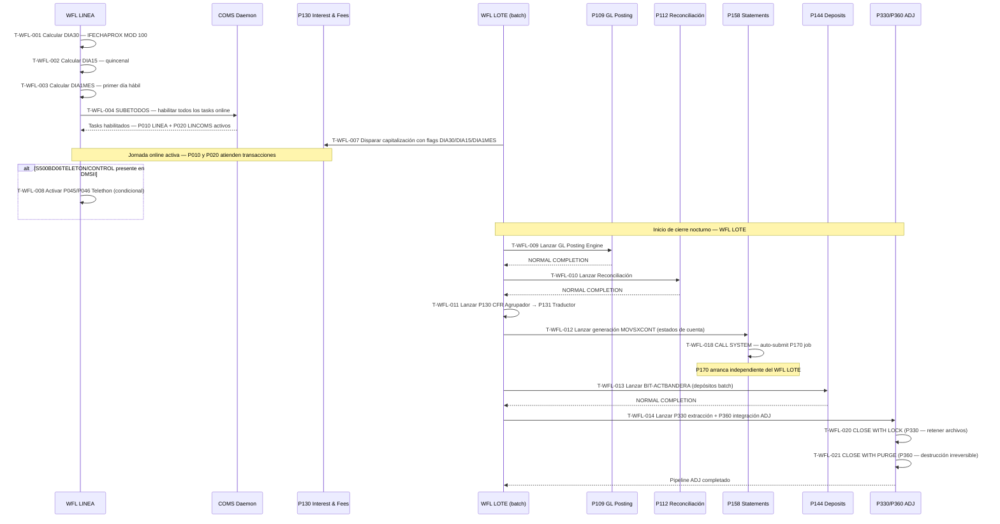

# BC-20 · Orquestador WFL Batch
> Dominio: T · Transversal · Subdominio: Batch Operations · Cobertura: S500+S151
> Programas principales: WFL LINEA · WFL LOTE · WFL23 · WFL ADJ · WFL-P158-NEXT
> Reglas vinculadas: RN-S500-104..108 · RN-S151-381..382
> Indexado: ✅ 2026-07-20 — Capa 3/4/5 — capacidad T.5.1 Batch Orchestration
> bian_ref: T.5.1 Batch Orchestration / WFL Orchestrator

---

## Contexto funcional

La capacidad **Batch Orchestration / WFL Orchestrator (T.5.1)** es el sistema nervioso del cierre diario y mensual de Banamex en Unisys ClearPath MCP. Los programas **WFL (Workflow Language)** no contienen lógica de negocio propia — su función es orquestar, sincronizar y habilitar el universo de programas COBOL que ejecutan las capacidades del sistema. WFL LINEA (`S500/WFL/LINEA/24MTP005`, 1,961 LOC, autor L. Marín, noviembre 1991) es el orchestrator principal del ciclo diario: calcula los flags de calendario del día (DIA30 — último día hábil del mes, DIA15 — quincenal, DIA1MES — primer día hábil), habilita todos los programas online en el Communication Management System (COMS) de Unisys mediante la instrucción `SUBETODOS`. [CORRECCIÓN 2026-07-21: P130 ausente en S500/WFL/LINEA/24MTP005 — cero coincidencias en grep; confirmado en S500/WFL/LOTE/26MTP002 línea 6491: RUN #P130 [T130]] WFL LOTE es el orchestrator del cierre nocturno: encadena secuencialmente P109 GL Posting Engine → P112 Reconciliación → P130 CFR Agrupador + P131 CFR Traductor → P158 Estado de cuenta → P144 BIT-ACTBANDERA → P330/P360 Pipeline ADJ. WFL23 es el orchestrator del evento de divestiture Citi→Banamex, activado cuando el programa P020 LINCOMS detecta `TASKVALUE=3016` en el task COMS configurado por Operaciones. El patrón de auto-submisión WFL — donde P158 genera dinámicamente un job para invocar P170 mediante `CALL SYSTEM` — es el riesgo de migración más complejo: no tiene equivalente en arquitecturas cloud, donde la orquestación es responsabilidad de un motor centralizado (Apache Airflow, AWS Step Functions) y no de los programas individuales.

Los WFLs son el punto de entrada al sistema: ningún programa COBOL arranca sin que un WFL lo habilite o encadene. Esta característica los convierte en el mapa de dependencias operacionales más completo del sistema — cualquier cambio en la secuencia de batch requiere modificar el WFL correspondiente, con el riesgo de romper la cadena de cierre completa. La ausencia de mecanismos de retry parcial o skip en los WFLs originales significa que un ABEND en cualquier programa detiene toda la cadena downstream.

---

## Dependencias con otras capacidades

| WFL | Acción | Capacidad relacionada | Cap MD |
|-----|--------|-----------------------|--------|
| WFL LOTE | Activa P130 capitalización diaria | Interest & Fees (6.1.5) | cap-int.md |
| WFL LINEA | COMS SUBETODOS → habilita P010 LINEA gateway | Teller (2.1.1) | cap-tel.md |
| WFL LINEA | COMS SUBETODOS → habilita P020 LINCOMS MQ | MQ/Async Gateway (T.2.3) | cap-mq.md |
| WFL LINEA | Activa P045/P046 si S500BD06TELETON/CONTROL presente | Telethon (sin cap propio) | — |
| WFL LOTE | Encadena P109 GL Posting Engine (1er job nocturno) | Finance GL (7.1.1) | cap-gl.md |
| WFL LOTE | Encadena P112 Reconciliación (después de P109) | Financial Reconciliation (6.7.1) | cap-rec.md |
| WFL LOTE | Encadena P130 CFR Agrupador → P131 CFR Traductor | CFR Regulatory Reporting (T.4.1) | cap-cfr.md |
| WFL LOTE | Encadena P158 generación MOVSXCONT | Statements (6.1.4) | cap-sta.md |
| WFL LOTE | Encadena P144 BIT-ACTBANDERA depósitos batch | Deposits (5.1.1) | cap-dep.md |
| WFL LOTE | Encadena P330 → P360 Pipeline ADJ GL | Operational Reconciliation (6.7.2) | cap-adj.md |
| WFL LOTE | Gestión de incidentes batch vía AVISOINC (consola operador) | Orchestration (6.7.2) | cap-orc.md |
| P158 auto-submit | CALL SYSTEM WFL → lanza P170 next | Statements (6.1.4) | cap-sta.md |
| WFL23 | Divestiture Citi→Banamex — TASKVALUE=3016 | Payments (6.1.3) | cap-pay.md |
| WFL ADJ | CLOSE WITH LOCK P330 → CLOSE WITH PURGE P360 | Operational Reconciliation (6.7.2) | cap-adj.md |

---

## Inventario de Tareas

| ID | Tarea | Programa | Componente fuente | Tipo |
|----|-------|----------|-------------------|------|
| T-WFL-001 | Calcular DIA30 — último día hábil del mes (IFECHAPROX MOD 100 = 1) | WFL LINEA | S500_WFL_LOTE.txt | control |
| T-WFL-002 | Calcular DIA15 — quincena (TRUE también cuando DIA30=TRUE) | WFL LINEA | S500_WFL_LOTE.txt | control |
| T-WFL-003 | Calcular DIA1MES — primer día hábil del mes | WFL LINEA | S500_WFL_LOTE.txt | control |
| T-WFL-004 | Habilitar todos los programas online en COMS (SUBETODOS) | WFL LINEA | S500_WFL_LOTE.txt | control |
| T-WFL-005 | Activar P010 LINEA gateway online — inicio de jornada bancaria | WFL LINEA | S500_WFL_LOTE.txt | control |
| T-WFL-006 | Activar P020 LINCOMS MQ gateway online — inicio de jornada bancaria | WFL LINEA | S500_WFL_LOTE.txt | control |
| T-WFL-007 | Disparar P130 capitalización batch con flags DIA30/DIA15/DIA1MES | WFL LOTE | S500_WFL_REORG_GARBAGE_S500BD04TARJETAS.txt | control |
| T-WFL-008 | Evaluar S500BD06TELETON/CONTROL en DMSII → activar P045/P046 condicional | WFL LINEA | S500_WFL_LOTE.txt | control |
| T-WFL-009 | Encadenar P109 GL Posting Engine — primer job del cierre nocturno | WFL LOTE | S500_WFL_REORG_GARBAGE_S500BD04TARJETAS.txt | control |
| T-WFL-010 | Encadenar P112 Reconciliación — depende de P109 completado exitosamente | WFL LOTE | S151/WFL_LOTE.txt | control |
| T-WFL-011 | Encadenar P130 CFR Agrupador → P131 CFR Traductor — pipeline regulatorio | WFL LOTE | S500_WFL_REORG_GARBAGE_S500BD04TARJETAS.txt | control |
| T-WFL-012 | Encadenar P158 generación MOVSXCONT — estado de cuenta batch | WFL LOTE | S500_WFL_REORG_GARBAGE_S500BD04TARJETAS.txt | control |
| T-WFL-013 | Encadenar P144 BIT-ACTBANDERA — procesamiento de depósitos batch | WFL LOTE | S500_WFL_REORG_GARBAGE_S500BD04TARJETAS.txt | control |
| T-WFL-014 | Encadenar P330 extracción → P360 integración pipeline ADJ | WFL LOTE / WFL ADJ | S151_SOURCE_P330.txt | control |
| T-WFL-015 | Notificar incidente de paso batch a consola de operaciones (AVISOINC — mapea IDFALLAPASO a mensaje de texto) | WFL LOTE | S500_WFL_REORG_GARBAGE_S500BD04TARJETAS.txt | control |
| T-WFL-016 | Detectar TASKVALUE=3016 en task COMS desde P020 → lanzar WFL23 | WFL23 | S500_SOURCE_P020.txt | control |
| T-WFL-017 | Orquestar secuencia de divestiture Citi→Banamex — reconfigurar SETID="BNMEX"×14 | WFL23 | S500_WFL_WFL23.txt | control |
| T-WFL-018 | Auto-submisión: P158 genera dinámicamente WFL job para P170 (CALL SYSTEM) | P158 → WFL-NEXT | S151_SOURCE_P158.txt | control |
| T-WFL-019 | Leer ATTRIBUTE VALUE OF MYSELF — retornar atributo del job WFL en ejecución | WFL LINEA / WFL LOTE | S500_WFL_LOTE.txt | consulta |
| T-WFL-020 | Cerrar archivos temporales P330 con CLOSE WITH LOCK — retener en disco MCP | WFL ADJ | S151_SOURCE_P330.txt | control |
| T-WFL-021 | Destruir archivos temporales P360 con CLOSE WITH PURGE — destrucción irreversible | WFL ADJ | S151_SOURCE_P360.txt | control |

---

## Casuísticas

### CS-WFL-01: Cierre diario exitoso — todos los programas habilitados

**Tipo:** happy-path
**Condición de entrada:** WFL LINEA arranca sin alertas. Fecha de proceso disponible en BD99 (THECALENDAR). DIA30=FALSE, DIA15=FALSE, DIA1MES=FALSE (día ordinario). COMS disponible y sin tasks en STASIS. Archivo S500BD06TELETON/CONTROL ausente en DMSII. P109, P112, P158, P144, P330/P360 disponibles y sin alertas previas.
**Resultado:** Flags calculados (DIA30=0, DIA15=0, DIA1MES=0). SUBETODOS ejecutado exitosamente — todos los programas COMS habilitados para atender transacciones online. P010 LINEA y P020 LINCOMS activos. P130 ejecutado en modo día ordinario (sin capitalización mensual). WFL LOTE encadena P109→P112→P130-CFR→P158→P144→P330/P360 en orden estricto, todos con NORMAL COMPLETION.
**Secuencia:** T-WFL-001 → T-WFL-002 → T-WFL-003 → T-WFL-004 → T-WFL-005 → T-WFL-006 → T-WFL-007 → T-WFL-009 → T-WFL-010 → T-WFL-011 → T-WFL-012 → T-WFL-013 → T-WFL-014

---

### CS-WFL-02: Cierre mensual — DIA30=TRUE activa capitalización completa

**Tipo:** happy-path
**Condición de entrada:** WFL LINEA detecta IFECHAPROX MOD 100 = 1 → DIA30=TRUE. Por regla RN-S500-105, DIA15=TRUE también (quincena siempre se activa cuando DIA30=TRUE). P130 recibe los flags. Todos los contratos activos en BD03 con saldo promedio positivo.
**Resultado:** DIA30=TRUE propagado a P130 como flag de capitalización mensual (WKS-ES-MENSUAL=1). P130 ejecuta COMIS-MENSUAL con hasta 15 tipos de comisiones por contrato. Asientos GL CVE 3000+4009+809 generados para todos los contratos activos. ISR EPP liberado a S151. I05-RENDIMIENTOS con registro de todos los contratos, incluyendo los de rendimiento cero.
**Secuencia:** T-WFL-001 (DIA30=TRUE) → T-WFL-002 (DIA15=TRUE) → T-WFL-003 → T-WFL-004 → T-WFL-007 → [P130 modo mensual → caps INT, TEL, MQ activos]

---

### CS-WFL-03: Fallo de P109 — cadena de batch cortada aguas abajo

**Tipo:** error
**Condición de entrada:** P109 GL Posting Engine termina con ABEND (error de escritura en DMSII B72, timeout, o librería S151 no disponible). WFL LOTE detecta el código de retorno distinto de NORMAL COMPLETION.
**Resultado:** WFL LOTE detiene la cadena en T-WFL-009. P112 NO arranca. P130 CFR NO arranca. P158 NO genera MOVSXCONT. P144 y P330/P360 bloqueados. Estado de cuenta del día no se produce. Riesgo CNBV: mora en entrega de estado de cuenta mensual si el fallo ocurre en día de corte (DIA30=TRUE). Riesgo contable: B72 POSCONTA puede quedar con asientos GL del día incompletos si el ABEND fue después del primer STORE. Acción: DBA + Operaciones ejecutan runbook de recovery P109 — identificar si el ABEND fue antes o después del primer commit DMSII, luego relanzar WFL LOTE desde P109 o desde P112 según corresponda.
**Secuencia:** T-WFL-009 → [ABEND P109] → WFL LOTE ABORT — T-WFL-010..015 bloqueados indefinidamente

---

### CS-WFL-04: Divestiture Citi→Banamex en caliente — WFL23

**Tipo:** edge-case
**Condición de entrada:** Durante la ventana operativa de separación, Operaciones configura `TASKVALUE=3016` en el task COMS asignado a P020 LINCOMS. Al arrancar la siguiente jornada, P020 detecta el valor y activa la rama de divestiture en lugar de continuar el flujo MQ normal.
**Resultado:** WFL23 orquesta la secuencia de separación en caliente: reconfiguración de parámetros COMS, actualización de SETID="BNMEX"×14 en los 14 puntos del sistema S151, habilitación de nuevos programas Banamex standalone. Esta es la única ruta que modifica el SETID en producción sin ventana de mantenimiento. Riesgo crítico: si WFL23 falla a mitad, el sistema queda en estado híbrido Citi+Banamex sin rollback automatizado.
**Secuencia:** T-WFL-016 → T-WFL-017 → [secuencia divestiture vía WFL23] → P020 continúa flujo normal con nueva identidad BNMEX

---

### CS-WFL-05: Auto-submisión P158 → P170 (patrón CALL SYSTEM WFL)

**Tipo:** edge-case
**Condición de entrada:** P158 termina el procesamiento del MOVSXCONT de la partición asignada (NODO-ORIGEN/NODO-DESTINO). La instrucción `CALL SYSTEM` en el código COBOL de P158 genera dinámicamente un job WFL string en memoria y lo somete al scheduler MCP, pasando los parámetros de contexto (sistema, fecha, nodo) como atributos del job.
**Resultado:** P170 arranca como job independiente en el scheduler MCP, sin intervención del WFL LOTE. El WFL LOTE no conoce la existencia de este job ni puede monitorear su estado — la trazabilidad de la cadena de cierre se rompe en este punto. En producción MCP esto es estable porque el scheduler Unisys serializa correctamente por fecha de proceso. En cloud, este patrón no tiene equivalente nativo y requiere reemplazo obligatorio por un trigger en el orquestador central (Airflow: `trigger_dag_run` / Step Functions: `send_task_success`).
**Secuencia:** [P158 proceso completo] → T-WFL-018 (CALL SYSTEM) → P170 job arranca independiente del WFL LOTE

---

## Diagrama

---

## Reglas vinculadas

| Tarea | Regla | Componente fuente | Descripción |
|-------|-------|-------------------|-------------|
| T-WFL-001 | RN-S500-104 | S500_WFL_LOTE.txt | DIA30: IFECHAPROX MOD 100 = 1 → último día hábil del mes |
| T-WFL-002 | RN-S500-105 | S500_WFL_LOTE.txt | DIA15: quincenal — TRUE también cuando DIA30=TRUE |
| T-WFL-003 | RN-S500-108 | S500_WFL_LOTE.txt | DIA1MES: primer día hábil — activa procesos de apertura de ciclo |
| T-WFL-004 | RN-S500-107 | S500_WFL_LOTE.txt | SUBETODOS: habilita todos los tasks COMS al inicio de jornada |
| T-WFL-008 | RN-S500-106 | S500_WFL_LOTE.txt | Telethon condicional: S500BD06TELETON/CONTROL debe existir en DMSII para activar P045/P046 |
| T-WFL-018 | RN-S151-382 | S151_SOURCE_P158.txt | Auto-submit P158→P170 via CALL SYSTEM — riesgo CRÍTICO de migración sin equivalente cloud |

---

## Vocabulario propio

| Término | PIC/Tipo | Descripción |
|---------|----------|-------------|
| SUBETODOS | Instrucción COMS | Comando Unisys COMS que habilita todos los tasks configurados en el daemon de una sola vez. Sin equivalente directo en cloud. |
| DIA30 | Boolean (flag WFL) | TRUE si el día actual es el último día hábil del mes (IFECHAPROX MOD 100 = 1). Activa capitalización mensual en P130 y modo mensual de COMIS-MENSUAL. |
| DIA15 | Boolean (flag WFL) | TRUE si es quincena o si DIA30=TRUE. Activa cálculos quincenales en captación. Siempre TRUE cuando DIA30=TRUE. |
| DIA1MES | Boolean (flag WFL) | TRUE si es el primer día hábil del mes. Activa procesos de apertura de ciclo en captación y liquidaciones. |
| ATTRIBUTE VALUE OF MYSELF | Instrucción MCP | Función propietaria Unisys MCP que retorna el valor del atributo configurado del WFL job en ejecución. Sin equivalente en Linux/cloud. Riesgo CRÍTICO de migración. |
| CALL SYSTEM | Instrucción COBOL/WFL | Instrucción que somete un nuevo job al scheduler MCP desde un programa COBOL en ejecución (auto-submit). Patrón sin equivalente arquitectural en cloud — requiere reemplazo por callback al orquestador central. |
| TASKVALUE | PIC 9(4) | Valor de atributo de un task COMS configurado por Operaciones. TASKVALUE=3016 es la señal de activación del evento de divestiture WFL23 en P020 LINCOMS. |
| WFL LINEA | Job orchestrator | Orchestrator principal del ciclo diario S500. Calcula flags de calendario (DIA30/DIA15/DIA1MES — S500/WFL/LINEA/24MTP005 líneas 284–308) y habilita programas online vía COMS (SUBETODOS — línea 598). No ejecuta P130. Archivo: S500/WFL/LINEA/24MTP005 (1,961 LOC, L. Marín, nov 1991). [NOTA-NAMING: el archivo extraído `S500_WFL_LOTE.txt` contiene `BEGIN JOB S500/WFL/LINEA/24MTP005` — nombre del archivo extraído no corresponde al nombre del job] |
| WFL LOTE | Job orchestrator | Orchestrator del cierre nocturno batch. Ejecuta S500/P130 capitalización (RUN #P130 [T130] línea 6491) y encadena S151: P109→P112→P130-CFR→P158→P144→P330/P360 en orden estricto. Orquesta bloque CPE mensual (P310/P330/P335) vía subroutine RMENSUALCPE. Un ABEND en cualquier programa detiene toda la cadena downstream. Archivo: S500/WFL/LOTE/26MTP002. [NOTA-NAMING: el archivo extraído `S500_WFL_REORG_GARBAGE_S500BD04TARJETAS.txt` contiene `BEGIN JOB S500/WFL/LOTE/26MTP002`] |
| WFL23 | Job orchestrator | Orchestrator del evento de divestiture Citi→Banamex. Activo solo durante la ventana de separación operativa. Activa la reconfiguración de SETID="BNMEX"×14. |
| job stream | Concepto MCP | Secuencia de instrucciones WFL que el scheduler MCP ejecuta como una unidad. Cada job stream puede lanzar sub-jobs (CALL SYSTEM) o esperar completion de otros (dependency chain). |
| CLOSE WITH LOCK | Instrucción MCP | Cierra y retiene un archivo DMSII en disco con lock exclusivo. El archivo persiste y puede reabrirse. Usado en P330 para retener los archivos de extracción hasta que P360 los consuma. |
| CLOSE WITH PURGE | Instrucción MCP | Cierra y destruye irreversiblemente un archivo DMSII. No hay recovery posible. Equivalente a DROP TABLE sin backup. Usado en P360 después de integrar los datos al sistema destino. |
| IFECHAPROX | PIC 9(6) | Fecha próxima de proceso en formato AAMMDD. La expresión IFECHAPROX MOD 100 = 1 detecta el último día hábil del mes calendario. |
| STASIS | Estado COMS | Estado en el que un task COMS está suspendido y no atiende mensajes. WFL LINEA verifica que ningún task esté en STASIS antes de ejecutar SUBETODOS. |

---

## Hallazgos de migración críticos

| Riesgo | Tarea | Severidad | Acción requerida |
|--------|-------|-----------|-----------------|
| `ATTRIBUTE VALUE OF MYSELF` — instrucción MCP propietaria sin equivalente en Linux/cloud. Retorna el nombre y atributos del job WFL en ejecución para identificación de instancia, trazabilidad y parámetros de arranque. Presente en WFL LINEA, WFL LOTE y variantes. | T-WFL-019 | 🔴 CRÍTICO | Reemplazar con variable de entorno (BATCH_JOB_ID, BATCH_JOB_NAME) inyectada por el orquestador central (Airflow/Step Functions) al momento de crear la DAG run. Catalogar todos los usos en WFL LINEA y WFL LOTE antes de migrar. |
| `CALL SYSTEM` auto-submit desde P158 — programa COBOL somete su propio job sucesor al scheduler MCP. Rompe la trazabilidad de la cadena de batch: WFL LOTE no conoce ni monitorea el job P170. En MCP es estable; en cloud este patrón no tiene equivalente nativo. | T-WFL-018 | 🔴 CRÍTICO | Reemplazar con callback al orquestador central: en Airflow `trigger_dag_run`, en Step Functions `send_task_success`. P158 nunca debe lanzar su sucesor — el orquestador central es el único responsable de encadenar jobs. Requiere refactorizar P158 para emitir un evento de completion en lugar de auto-submitir. |
| `SUBETODOS` — instrucción COMS que habilita todos los tasks del daemon de una sola vez. COMS (Communication Management System) es el daemon de mensajes propietario de Unisys MCP. Sin equivalente directo en arquitecturas de microservicios. | T-WFL-004 | 🔴 CRÍTICO | Implementar un Service Registry en el sistema moderno. Al inicio de jornada, el orquestador ejecuta un `start-all` que llama al endpoint de health/enable de cada microservicio en el orden correcto. Requiere inventario exhaustivo de todos los tasks COMS habilitados por SUBETODOS — algunos pueden ser servicios críticos que el inventario actual no documenta. |
| Cadena WFL LOTE sin retry parcial — si cualquier programa falla con ABEND, toda la cadena downstream queda bloqueada sin mecanismo de skip ni reanudación granular en el WFL original. | T-WFL-009..015 | 🟠 ALTO | Implementar en el orquestador cloud: retry por tarea con back-off exponencial, alert inmediato a Operaciones vía PagerDuty/SNS, punto de reanudación granular (re-run desde P112 sin re-ejecutar P109 si ya completó con NORMAL COMPLETION). Cada job debe ser idempotente en el sistema moderno. |
| WFL23 divestiture — modifica SETID="BNMEX"×14 en producción en caliente sin runbook actualizado ni mecanismo de rollback documentado. Un fallo a mitad deja el sistema en estado híbrido Citi+Banamex sin recuperación automatizada. | T-WFL-016..017 | 🟠 ALTO | Documentar runbook completo con: precondiciones verificables, ventana de mantenimiento recomendada, secuencia exacta de pasos WFL23, validación post-ejecución de los 14 campos SETID, y procedimiento de rollback. Ejecutar en ambiente de staging con datos reales antes del evento en producción. |
| `CLOSE WITH PURGE` en P360 — destruye irreversiblemente los archivos temporales del pipeline ADJ después de integrar. Si P360 falla después del PURGE, los datos de P330 están perdidos y no hay recovery sin re-ejecutar todo el pipeline desde el inicio. | T-WFL-021 | 🟠 ALTO | En cloud, reemplazar CLOSE WITH PURGE con archivado a S3/GCS con retención mínima de 7 días antes de la destrucción lógica. El sistema moderno debe mantener los archivos de extracción hasta confirmar el COMMIT de la integración P360. |

---

## Referencias cruzadas

- **cap-int.md** (6.1.5 Interest & Fees) — WFL LOTE orquesta P130 (S500/WFL/LOTE/26MTP002 línea 6491); DIA30/DIA15/DIA1MES son flags calculados por WFL LINEA al inicio de jornada
- **cap-tel.md** (2.1.1 Teller) — WFL LINEA habilita P010 LINEA gateway online via COMS SUBETODOS
- **cap-mq.md** (T.2.3 MQ/Async Gateway) — WFL LINEA habilita P020 LINCOMS via COMS SUBETODOS; WFL23 se dispara desde P020 TASKVALUE=3016
- **cap-gl.md** (7.1.1 Finance GL) — WFL LOTE encadena P109 como primer job del cierre nocturno; P109 falla → toda la cadena downstream se detiene
- **cap-rec.md** (6.7.1 Financial Reconciliation) — WFL LOTE encadena P112 después de P109; dependencia estricta
- **cap-cfr.md** (T.4.1 CFR Regulatory Reporting) — WFL LOTE encadena P130 CFR Agrupador → P131 Traductor pipeline regulatorio
- **cap-sta.md** (6.1.4 Statements) — WFL LOTE encadena P158; P158 auto-submite P170 via CALL SYSTEM WFL (riesgo CRÍTICO)
- **cap-dep.md** (5.1.1 Deposits) — WFL LOTE encadena P144 BIT-ACTBANDERA batch de procesamiento de depósitos
- **cap-adj.md** (6.7.2 Operational Reconciliation) — WFL ADJ orquesta P330→P360 con CLOSE WITH LOCK y CLOSE WITH PURGE
- **cap-pay.md** (6.1.3 Payments) — WFL23 divestiture activado desde P020 LINCOMS; WFL LINEA habilita el gateway online de pagos
- **cap-orc.md** — ORC opera vía COPY books COBOL (S500/INC/PRO, S500/INC/WOR) dentro de P010/P015/P020/P100/P102 — no es job WFL separado; WFL LOTE gestiona incidentes batch vía subrutina AVISOINC [CORRECCIÓN 2026-07-21: T-WFL-015 redefinida — sin evidencia de RUN activo para ORC/S500_INC en ningún WFL]
- **migration-risk-register.md** — 3 riesgos CRÍTICOS registrados: ATTRIBUTE VALUE OF MYSELF · CALL SYSTEM auto-submit · SUBETODOS sin equivalente cloud
- **capability-map.md** — capacidad T.5.1 registrada como nueva capacidad transversal del modelo
