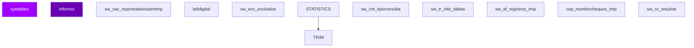

# D01 · Canal Digital Web — Modelo Entidad-Relación (Inferido)

> **Componente:** BCOPCore · SPE-AM-001 · Etapa 1
> **Base de datos:** `bdicnweb` · IBM Informix IDS 14.10 / POWER-AIX
> **Wave:** ÚLTIMO · Riesgo: **ALTO**
> **Última actualización:** 2026-07-03

---
**SME responsable:**
- Specialist — Informix SPL Analysis (análisis estático, code extraction)
- DBA — IBM Informix IDS (schema real vía syscolumns — Etapa 2) ← NUEVO
- Industry Banking + Domain Expert BanCoppel (validación funcional)
- Cybersecurity (riesgos PII, regulación CNBV/LFPDPPP)
- QA Lead — Equivalencia Funcional (estrategia de pruebas) ← NUEVO
- Cloud Architect AWS Banking (arquitectura target) ← NUEVO
> [SME-PENDING] = requiere sesión de validación antes de Etapa 2.
---

## Metodología

Tablas inferidas de análisis estático de **57 archivos SQL** (`FROM`, `INSERT INTO`, `UPDATE`, `DELETE FROM`).
Columnas inferidas de listas `INSERT INTO tbl (col1, col2, ...)`.
Relaciones inferidas del conocimiento de dominio — Informix no declara `FOREIGN KEY` formalmente.

## Diagrama ER — tablas core (Mermaid)



> Renderizable en GitHub o VSCode con extensión Mermaid Preview.

## Inventario de entidades propias de `bdicnweb` (muestra)

| Tabla | Tipo | PK inferida | Lectores | Escritores |
|-------|------|-------------|----------|------------|
| `systables` | Transaccional | `[SME-PENDING]` | 32 | 0 |
| `informix` | Transaccional | `[SME-PENDING]` | 7 | 14 |
| `TRIM` | Transaccional | `[SME-PENDING]` | 18 | 0 |
| `sw_sac_reporteabonoatmtmp` | Reportería / Temporal | `[SME-PENDING]` | 7 | 7 |
| `bdidigital` | Transaccional | `[SME-PENDING]` | 10 | 2 |
| `sw_evc_excluidos` | Transaccional | `[SME-PENDING]` | 6 | 5 |
| `STATISTICS` | Transaccional | `[SME-PENDING]` | 0 | 8 |
| `sw_cnt_tipoconsulta` | Transaccional | `[SME-PENDING]` | 7 | 0 |
| `sw_tr_info_tablas` | Transaccional | `[SME-PENDING]` | 6 | 0 |
| `sw_af_registros_tmp` | Reportería / Temporal | `[SME-PENDING]` | 3 | 3 |
| `cep_monitorcheques_tmp` | Reportería / Temporal | `[SME-PENDING]` | 3 | 3 |
| `sw_ro_resulcte` | Transaccional | `[SME-PENDING]` | 3 | 2 |
| `sc_cuentas_traspbenef` | Transaccional | `num_cta` | 5 | 0 |
| `sw_gs_area_usuario` | Transaccional | `[SME-PENDING]` | 5 | 0 |
| `sw_tr_cargamasiva_mantolineascredito_hist` | Histórico / Archivado | `secuencial` | 5 | 0 |
| `sw_gs_area` | Transaccional | `[SME-PENDING]` | 5 | 0 |
| `sw_tr_cargamasiva_mantolineascredito` | Transaccional | `[SME-PENDING]` | 5 | 0 |
| `sw_ro_cteexp` | Transaccional | `[SME-PENDING]` | 2 | 2 |
| `sw_ro_ctecta` | Transaccional | `[SME-PENDING]` | 2 | 2 |
| `tmpcapitalescta_` | Transaccional | `[SME-PENDING]` | 2 | 2 |
| `sw_ro_maeoficios` | Maestro | `[SME-PENDING]` | 1 | 2 |
| `tmp_infdas` | Transaccional | `[SME-PENDING]` | 3 | 0 |
| `tmp_ctas_concentra` | Transaccional | `[SME-PENDING]` | 3 | 0 |
| `tmp_ctas_concentra_fin` | Transaccional | `[SME-PENDING]` | 3 | 0 |
| `TABLE` | Transaccional | `[SME-PENDING]` | 3 | 0 |
| `tmpcatalog_` | Transaccional | `[SME-PENDING]` | 1 | 1 |
| `tmpinfouh_` | Transaccional | `[SME-PENDING]` | 1 | 1 |
| `sw_tc_consultabittascomimp_tmp` | Reportería / Temporal | `[SME-PENDING]` | 1 | 1 |
| `bdibi` | Transaccional | `[SME-PENDING]` | 1 | 1 |
| `statistics` | Transaccional | `[SME-PENDING]` | 0 | 2 |
| `cat_bancos_tmp` | Reportería / Temporal | `[SME-PENDING]` | 1 | 1 |
| `sc_colateral_tmp` | Reportería / Temporal | `[SME-PENDING]` | 1 | 1 |
| `sw_cli_calles_consecutivo` | Transaccional | `[SME-PENDING]` | 1 | 1 |
| `sw_tr_totales_masivo` | Transaccional | `[SME-PENDING]` | 1 | 0 |
| `sw_tr_cargamasiva_cargo` | Transaccional | `[SME-PENDING]` | 1 | 0 |

## Tablas externas accedidas (cross-DB)

| DB externa | Tabla | Lecturas | Escrituras | Notas |
|-----------|-------|----------|-----------|-------|
| `BDIDIGITAL` | `dg_params` | 1 SPs | 0 SPs | Cross-DB → API interna en target |
| `BdiSac` | `Sac_MovimientosHistorial` | 3 SPs | 0 SPs | Cross-DB → API interna en target |
| `BdiSac` | `Sac_BTS_Payi` | 3 SPs | 0 SPs | Cross-DB → API interna en target |
| `Bdinteg` | `si_fechas` | 3 SPs | 0 SPs | Cross-DB → API interna en target |
| `Intercard` | `` | 3 SPs | 0 SPs | Cross-DB → API interna en target |
| `bdiaclaracion` | `acl_producto` | 5 SPs | 0 SPs | Cross-DB → API interna en target |
| `bdiaclaracion` | `acl_aclaracion` | 5 SPs | 0 SPs | Cross-DB → API interna en target |
| `bdibei` | `bei_contratacion` | 1 SPs | 0 SPs | Cross-DB → API interna en target |
| `bdibei` | `bei_servicio` | 1 SPs | 0 SPs | Cross-DB → API interna en target |
| `bdiburo` | `` | 3 SPs | 0 SPs | Cross-DB → API interna en target |
| `bdicheq` | `` | 35 SPs | 16 SPs | Cross-DB → API interna en target |
| `bdicheq` | `sc_areabloqueo` | 1 SPs | 0 SPs | Cross-DB → API interna en target |
| `bdicheq` | `sc_opcionbloqueo` | 1 SPs | 0 SPs | Cross-DB → API interna en target |
| `bdicheq` | `sc_histbloq` | 2 SPs | 0 SPs | Cross-DB → API interna en target |
| `bdicheq` | `sc_maechq` | 26 SPs | 0 SPs | Cross-DB → API interna en target |
| `bdicntchq` | `` | 1 SPs | 0 SPs | Cross-DB → API interna en target |
| `bdicnweb` | `` | 45 SPs | 45 SPs | Cross-DB → API interna en target |
| `bdicnweb` | `sw_cg_billetesfalsos` | 7 SPs | 0 SPs | Cross-DB → API interna en target |
| `bdicnweb` | `sw_verificastatusarchivodeclaracionide` | 7 SPs | 0 SPs | Cross-DB → API interna en target |
| `bdicnweb` | `sw_tr_cargamasiva_deposito` | 1 SPs | 1 SPs | Cross-DB → API interna en target |
| `bdicnweb` | `sw_tr_cargamasiva_cargo` | 1 SPs | 1 SPs | Cross-DB → API interna en target |
| `bdicobranza` | `cb_param` | 2 SPs | 0 SPs | Cross-DB → API interna en target |
| `bdicobranza` | `cb_rep_cart_quebrantar` | 1 SPs | 0 SPs | Cross-DB → API interna en target |
| `bdicont` | `` | 6 SPs | 0 SPs | Cross-DB → API interna en target |
| `bdicred` | `` | 31 SPs | 12 SPs | Cross-DB → API interna en target |
| `bdicred` | `sd_maecred` | 20 SPs | 0 SPs | Cross-DB → API interna en target |
| `bdicred` | `sd_tipocartera` | 8 SPs | 0 SPs | Cross-DB → API interna en target |
| `bdicred` | `sd_definicion` | 8 SPs | 0 SPs | Cross-DB → API interna en target |
| `bdicred` | `sd_tarjeta` | 2 SPs | 0 SPs | Cross-DB → API interna en target |
| `bdidigital` | `` | 1 SPs | 1 SPs | Cross-DB → API interna en target |
| `bdilide` | `` | 9 SPs | 8 SPs | Cross-DB → API interna en target |
| `bdilide` | `sl_ftc_clas_cat` | 1 SPs | 0 SPs | Cross-DB → API interna en target |
| `bdilide` | `sl_ftc_cat` | 1 SPs | 0 SPs | Cross-DB → API interna en target |
| `bdilide` | `sl_ftc_prm` | 1 SPs | 1 SPs | Cross-DB → API interna en target |
| `bdilide` | `sl_ftc_log` | 0 SPs | 1 SPs | Cross-DB → API interna en target |
| `bdinteg` | `si_sistema` | 7 SPs | 0 SPs | Cross-DB → API interna en target |
| `bdinteg` | `si_catalog` | 7 SPs | 0 SPs | Cross-DB → API interna en target |
| `bdinteg` | `si_prodtran` | 7 SPs | 0 SPs | Cross-DB → API interna en target |
| `bdinteg` | `` | 42 SPs | 27 SPs | Cross-DB → API interna en target |
| `bdinteg` | `si_sucursales` | 22 SPs | 0 SPs | Cross-DB → API interna en target |
| `bdinvers` | `sv_instrum` | 1 SPs | 0 SPs | Cross-DB → API interna en target |
| `bdinvers` | `sv_maeinv` | 7 SPs | 0 SPs | Cross-DB → API interna en target |
| `bdinvers` | `` | 14 SPs | 10 SPs | Cross-DB → API interna en target |
| `bdinvers` | `sv_movdia` | 6 SPs | 0 SPs | Cross-DB → API interna en target |
| `bdinvers` | `sv_movhis` | 6 SPs | 0 SPs | Cross-DB → API interna en target |
| `bdiprog` | `pp_Encabezado` | 3 SPs | 0 SPs | Cross-DB → API interna en target |
| `bdirech` | `rec_confaltante` | 7 SPs | 0 SPs | Cross-DB → API interna en target |
| `bdirech` | `rec_faltantesarch` | 7 SPs | 0 SPs | Cross-DB → API interna en target |
| `bdirech` | `` | 7 SPs | 7 SPs | Cross-DB → API interna en target |
| `bdirech` | `rec_deschistorico` | 7 SPs | 0 SPs | Cross-DB → API interna en target |
| `bdirech` | `rec_movquebrantos` | 7 SPs | 0 SPs | Cross-DB → API interna en target |
| `bdirst` | `` | 7 SPs | 7 SPs | Cross-DB → API interna en target |
| `bdisac` | `sac_reportediario_seg` | 8 SPs | 0 SPs | Cross-DB → API interna en target |
| `bdisac` | `sac_convenios` | 8 SPs | 0 SPs | Cross-DB → API interna en target |
| `bdisac` | `sac_movimientoshistorial` | 11 SPs | 1 SPs | Cross-DB → API interna en target |
| `bdisac` | `` | 13 SPs | 3 SPs | Cross-DB → API interna en target |
| `bdisac` | `sac_wu_search` | 1 SPs | 0 SPs | Cross-DB → API interna en target |
| `bdisitesp` | `` | 8 SPs | 0 SPs | Cross-DB → API interna en target |
| `bdisolic` | `` | 17 SPs | 12 SPs | Cross-DB → API interna en target |
| `bdisolic` | `ss_autorizacion` | 1 SPs | 0 SPs | Cross-DB → API interna en target |
| `bdisolic` | `ss_cte_procesando` | 5 SPs | 5 SPs | Cross-DB → API interna en target |
| `bdisolic` | `ss_solicitudes_mc` | 0 SPs | 5 SPs | Cross-DB → API interna en target |
| `bdisolic` | `ss_emp_revingresos_mc` | 7 SPs | 7 SPs | Cross-DB → API interna en target |
| `bdispei` | `` | 1 SPs | 0 SPs | Cross-DB → API interna en target |
| `bdispei` | `tblhistpago` | 1 SPs | 0 SPs | Cross-DB → API interna en target |
| `bdisuc` | `` | 32 SPs | 12 SPs | Cross-DB → API interna en target |
| `bdisuc` | `ss_catalago_etv` | 1 SPs | 0 SPs | Cross-DB → API interna en target |
| `bdisuc` | `ss_pase_sucursal` | 5 SPs | 0 SPs | Cross-DB → API interna en target |
| `bdisuc` | `ss_cajageneral` | 6 SPs | 0 SPs | Cross-DB → API interna en target |
| `bdisuc` | `ss_saldossuc` | 5 SPs | 0 SPs | Cross-DB → API interna en target |
| `bditarjeta` | `` | 3 SPs | 0 SPs | Cross-DB → API interna en target |
| `bditef` | `tef_parametros` | 3 SPs | 0 SPs | Cross-DB → API interna en target |
| `bditef` | `` | 9 SPs | 6 SPs | Cross-DB → API interna en target |
| `bditef` | `cce_detalle` | 6 SPs | 0 SPs | Cross-DB → API interna en target |
| `bditef` | `cce_cheques_dev` | 6 SPs | 0 SPs | Cross-DB → API interna en target |
| `bditef` | `cce_mapeo_cecoban` | 3 SPs | 0 SPs | Cross-DB → API interna en target |
| `bditransfer` | `tf_maecte` | 6 SPs | 0 SPs | Cross-DB → API interna en target |
| `bditransfer` | `` | 6 SPs | 0 SPs | Cross-DB → API interna en target |
| `bditransfer` | `tf_account_balance_customer` | 5 SPs | 0 SPs | Cross-DB → API interna en target |
| `intercard` | `` | 11 SPs | 1 SPs | Cross-DB → API interna en target |
| `intercard` | `movimientohistorico` | 2 SPs | 0 SPs | Cross-DB → API interna en target |
| `intercard` | `tarjeta` | 1 SPs | 0 SPs | Cross-DB → API interna en target |
| `intercard` | `statustarjeta` | 1 SPs | 0 SPs | Cross-DB → API interna en target |
| `intercard` | `tarjetacuenta` | 1 SPs | 0 SPs | Cross-DB → API interna en target |
| `sysmaster` | `sysshmvals` | 8 SPs | 0 SPs | Cross-DB → API interna en target |

## Detalle de columnas — tablas con columnas inferidas

### `sw_af_registros_tmp` — Reportería / Temporal

| Columna | Tipo Informix | Tipo PostgreSQL target | PII |
|---------|--------------|----------------------|-----|
| `cApellidoMaternoBeneficiario_tmp` | [SME-PENDING] | [SME-PENDING] |  |
| `cApellidoPaternoBeneficiario_tmp` | [SME-PENDING] | [SME-PENDING] |  |
| `cCLABE_tmp` | [SME-PENDING] | [SME-PENDING] |  |
| `cCURP_tmp` | [SME-PENDING] | [SME-PENDING] | ⚠️ PII |
| `cConsecutivoRetiro_tmp` | [SME-PENDING] | [SME-PENDING] |  |
| `cEstatus_tmp` | CHAR(4) | CHAR(4) |  |
| `cFolio_suc_tmp` | [SME-PENDING] | [SME-PENDING] |  |
| `cFormasPago_tmp` | [SME-PENDING] | [SME-PENDING] |  |
| `cImporteDocumentoAntesImpuesto_tmp` | MONEY(16,2) | NUMERIC(16,2) |  |
| `cImporteDocumentoNetoPagar_tmp` | MONEY(16,2) | NUMERIC(16,2) |  |
| `cImpuestoRetenido_tmp` | [SME-PENDING] | [SME-PENDING] |  |
| `cMonto_tmp` | MONEY(16,2) | NUMERIC(16,2) |  |
| `cNSS_tmp` | [SME-PENDING] | [SME-PENDING] | ⚠️ PII |
| `cNombreBeneficiario_tmp` | VARCHAR(100) | VARCHAR(100) | ⚠️ PII |
| `cNumeroFolioServicio_tmp` | [SME-PENDING] | [SME-PENDING] |  |

### `sw_tc_consultabittascomimp_tmp` — Reportería / Temporal

| Columna | Tipo Informix | Tipo PostgreSQL target | PII |
|---------|--------------|----------------------|-----|
| `cCuenta_tmp` | [SME-PENDING] | [SME-PENDING] |  |
| `cNombreComision_tmp` | MONEY(16,2) | NUMERIC(16,2) | ⚠️ PII |
| `cNombreUsuario_tmp` | VARCHAR(100) | VARCHAR(100) | ⚠️ PII |
| `cValorAnterior_tmp` | [SME-PENDING] | [SME-PENDING] |  |
| `cValorFinal_tmp` | [SME-PENDING] | [SME-PENDING] |  |
| `dFecha_tmp` | DATE | DATE |  |
| `usuario_tmp` | [SME-PENDING] | [SME-PENDING] |  |

### `sw_verifica_detallemarcaje` — Transaccional

| Columna | Tipo Informix | Tipo PostgreSQL target | PII |
|---------|--------------|----------------------|-----|
| `codret` | [SME-PENDING] | [SME-PENDING] |  |
| `error_spl` | [SME-PENDING] | [SME-PENDING] |  |
| `num_registros` | INTEGER | INTEGER |  |
| `operacion` | [SME-PENDING] | [SME-PENDING] |  |
| `status` | [SME-PENDING] | [SME-PENDING] |  |
| `usuario_insert` | [SME-PENDING] | [SME-PENDING] |  |

### `cep_monitorcheques_tmp` — Reportería / Temporal

| Columna | Tipo Informix | Tipo PostgreSQL target | PII |
|---------|--------------|----------------------|-----|
| `diasRetorno` | [SME-PENDING] | [SME-PENDING] |  |
| `digitalizado` | [SME-PENDING] | [SME-PENDING] |  |
| `estatusColor` | CHAR(4) | CHAR(4) |  |
| `pre` | [SME-PENDING] | [SME-PENDING] |  |
| `presentado` | [SME-PENDING] | [SME-PENDING] |  |

## Tablas core del dominio (conocimiento de dominio)

| Tabla | Tipo esperado | Notas |
|-------|--------------|-------|
| `cnw_sesion` | Transaccional | Confirmar existencia y esquema con DBA |
| `cnw_bitacora_acceso` | Log / Bitácora | Confirmar existencia y esquema con DBA |
| `cnw_parametros` | Catálogo / Config | Confirmar existencia y esquema con DBA |
| `cnw_menu` | Transaccional | Confirmar existencia y esquema con DBA |
| `cnw_usuario` | Transaccional | Confirmar existencia y esquema con DBA |

## Pendientes Etapa 2

```sql
-- Ejecutar en instancia Informix `bdicnweb` para obtener schema real:
SELECT t.tabname, c.colname, c.coltype, c.collength, c.colno
FROM systables t JOIN syscolumns c ON t.tabid = c.tabid
WHERE t.owner = 'informix'
ORDER BY t.tabname, c.colno;
```

- [ ] Confirmar política de retención por tabla (especialmente tablas `_his`)
- [ ] Identificar todos los campos PII — datos sujetos a LFPDPPP
- [ ] Verificar si tablas `_tmp` / `_temp` se crean dinámicamente o son permanentes
- [ ] Confirmar cardinalidades reales en producción
- [ ] Validar relaciones implícitas (FK lógicas sin constraint formal)


---
*Generado por: Specialist — Informix SPL Analysis · 2026-07-03 · Evidencia: source/BCOPCore/informix/bdicnweb_*.sql (análisis estático de 57 archivos SQL) · análisis estático de archivos SQL*
