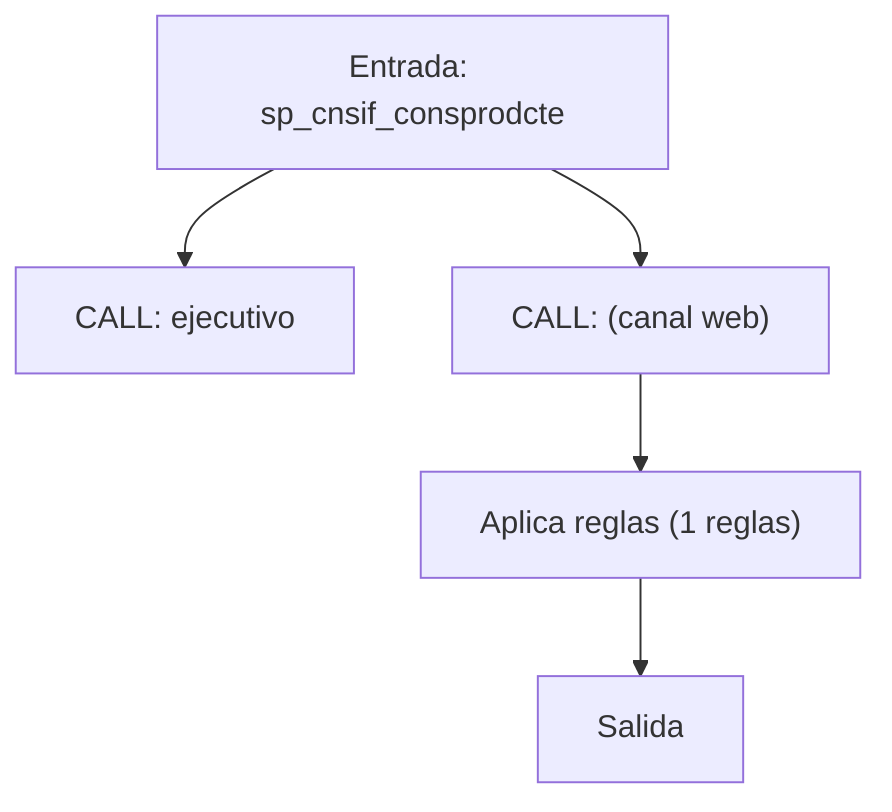
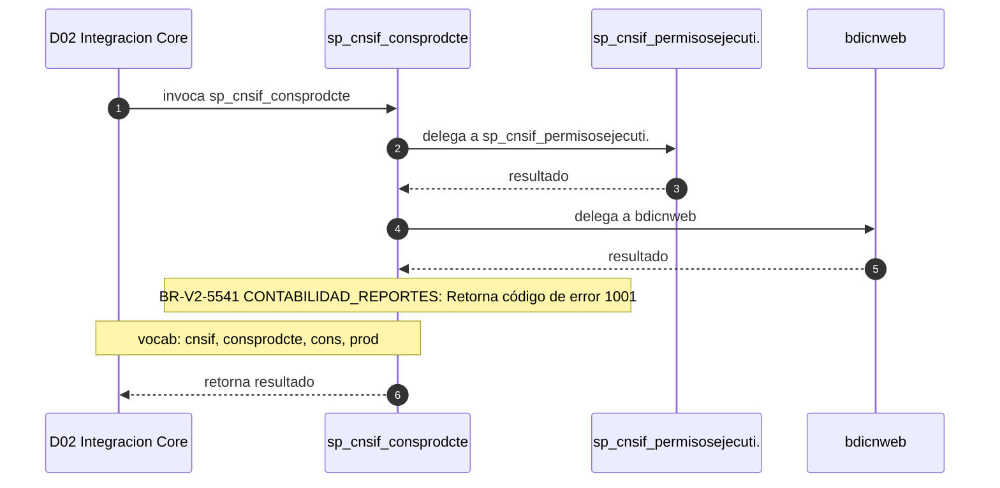

# SP Profile: `sp_cnsif_consprodcte`

> **Base de datos**: `bdinteg` · Dominio D02 — Integracion Core
> **Tipo de artefacto**: Perfil funcional · Gemelo Cognitivo — Capa 4: Intencion
> **Ultima actualizacion**: 2026-08-03
> **Estado**: ACTIVO · 205 callers en produccion

---

## Historia Funcional

El SP `sp_cnsif_consprodcte` implementa la logica de consulta producto de cliente en el dominio Integracion Core (base de datos `bdinteg`). Comprende 6,526 lineas de codigo, 16 tablas consultadas. Es invocado por 205 callers en el sistema, lo que lo convierte en un componente de alta dependencia. Delega logica a: `sp_cnsif_permisosejecutivo`, `bdicnweb`.

---

## Relaciones en la KB

| Tipo de relacion | Documento |
|-----------------|-----------|
| Cross-reference de reglas y vocabulario | [../cross-reference/sp-rules-vocab-map.md](../cross-reference/sp-rules-vocab-map.md) |
| Dependencias del dominio D02 | [../D02-bdinteg/07-dependencies.md](../D02-bdinteg/07-dependencies.md) |
| Reglas globales del sistema | [../rules/business-rules-bcop.md](../rules/business-rules-bcop.md) |
| Vocabulario del sistema | [../vocabulary/vocabulary-knowledge-base-bcop.md](../vocabulary/vocabulary-knowledge-base-bcop.md) |
| Vista HTML interactiva | [../../portal/sp-detail/sp-detail-sp_cnsif_consprodcte.html](../../portal/sp-detail/sp-detail-sp_cnsif_consprodcte.html) |

---

## Metricas del Gemelo Cognitivo

| Metrica | Valor |
|---------|-------|
| Fan-in (callers) | **205** |
| Fan-out (callees) | **15** |
| Callees principales | `sp_cnsif_permisosejecutivo`, `bdicnweb` |
| LOC | **6,526** |
| Tablas consultadas | 16 |
| Reglas de negocio activas | **1** |
| Autores historicos | 0 |

---

## Flujo de Decision

---

## Diagrama de Secuencia con Reglas y Vocabulario

---

## Reglas de Negocio Activas

| ID | Tipo | Categoria | Linea | Codigo | Referencia |
|----|------|-----------|-------|--------|------------|
| BR-V2-5541 | VALIDACIÓN | CONTABILIDAD_REPORTES | 280 | `LET cCodRet = '1001'` | — |

---

## Vocabulario Clave

| Termino | Categoria | Nivel | Significado |
|---------|-----------|-------|-------------|
| `cnsif` | ENTIDAD | ALTA | CNSIF — sistema de confirmación de ejecutivo (sp_cnsif_confirmaejecutivo fan_in=2400 — #1 SP ecosistema BCOPCore) |
| `consprodcte` | ACCION | ALTA | consulta producto de cliente |
| `cons` | ACCION | ALTA | consulta |
| `prod` | ENTIDAD | MEDIA | producto |

---

## Nota de Migracion

Sin restricciones regulatorias criticas identificadas en el codigo fuente. Verificar en parallel-run que el comportamiento sea equivalente al del sistema legado.

Ver registro completo de riesgos: [migration-risk-register.md](../migration-risk-register.md).
