# D05 · Saldos y Cuentas — Modelo Entidad-Relación (Inferido)

> **Componente:** BCOPCore · SPE-AM-001 · Etapa 1
> **Base de datos:** `bdisac` · IBM Informix IDS 14.10 / POWER-AIX
> **Wave:** Wave 3 · Riesgo: **ALTO**
> **Última actualización:** 2026-07-03

---
**SME responsable:**
- Specialist — Informix SPL Analysis (análisis estático, code extraction)
- DBA — IBM Informix IDS (schema real vía syscolumns — Etapa 2) ← NUEVO
- Industry Banking + Domain Expert BanCoppel (validación funcional)
- Cybersecurity (riesgos PII, regulación CNBV/LFPDPPP)
- QA Lead — Equivalencia Funcional (estrategia de pruebas) ← NUEVO
- Cloud Architect AWS Banking (arquitectura target) ← NUEVO
> [SME-PENDING] = requiere sesión de validación antes de Etapa 2.
---

## Metodología

Tablas inferidas de análisis estático de **58 archivos SQL** (`FROM`, `INSERT INTO`, `UPDATE`, `DELETE FROM`).
Columnas inferidas de listas `INSERT INTO tbl (col1, col2, ...)`.
Relaciones inferidas del conocimiento de dominio — Informix no declara `FOREIGN KEY` formalmente.

## Diagrama ER — tablas core (Mermaid)

```mermaid
graph TD
    sac_remesas_estadistica["sac_remesas_estadistica"]
    sac_app_getorder["sac_app_getorder"]
    sac_procesos_jobs["sac_procesos_jobs"]
    sac_convenios["sac_convenios"]
    sac_fechas["sac_fechas"]
    sac_param["sac_param"]
    STATISTICS["STATISTICS"]
    sac_mensajeerror["sac_mensajeerror"]
    TABLE["TABLE"]
    sac_movimientoshistorial["sac_movimientoshistorial"]
    sac_controlarchivoscobranza["sac_controlarchivoscobranza"]
    sac_paises_permitidos["sac_paises_permitidos"]
    sac_param --> sac_paises_permitidos
    STATISTICS --> TABLE
    TABLE --> STATISTICS
    sac_paises_permitidos --> sac_param
    style sac_remesas_estadistica fill:#A100FF,color:#fff
    style sac_app_getorder fill:#6A00B3,color:#fff
```



> Renderizable en GitHub o VSCode con extensión Mermaid Preview.

## Inventario de entidades propias de `bdisac` (muestra)

| Tabla | Tipo | PK inferida | Lectores | Escritores |
|-------|------|-------------|----------|------------|
| `sac_remesas_estadistica` | Transaccional | `[SME-PENDING]` | 10 | 3 |
| `sac_app_getorder` | Transaccional | `[SME-PENDING]` | 6 | 3 |
| `sac_procesos_jobs` | Log / Bitácora | `[SME-PENDING]` | 0 | 9 |
| `sac_convenios` | Transaccional | `[SME-PENDING]` | 2 | 6 |
| `sac_fechas` | Transaccional | `[SME-PENDING]` | 7 | 0 |
| `sac_param` | Catálogo / Config | `[SME-PENDING]` | 6 | 0 |
| `STATISTICS` | Transaccional | `[SME-PENDING]` | 0 | 6 |
| `sac_mensajeerror` | Transaccional | `[SME-PENDING]` | 0 | 6 |
| `TABLE` | Transaccional | `[SME-PENDING]` | 6 | 0 |
| `sac_movimientoshistorial` | Transaccional | `pky_movimiento` | 5 | 0 |
| `sac_controlarchivoscobranza` | Control batch | `[SME-PENDING]` | 0 | 5 |
| `sac_paises_permitidos` | Transaccional | `[SME-PENDING]` | 5 | 0 |
| `sac_cte_remesas` | Transaccional | `[SME-PENDING]` | 3 | 1 |
| `temp_reporteenrolamiento58` | Reportería / Temporal | `[SME-PENDING]` | 2 | 2 |
| `temp988_sac_wu_pay` | Transaccional | `[SME-PENDING]` | 2 | 2 |
| `tablaTemporal` | Transaccional | `[SME-PENDING]` | 2 | 2 |
| `sac_pagostae` | Transaccional | `clave_rastreo` | 3 | 0 |
| `sac_app_pemporal2` | Transaccional | `[SME-PENDING]` | 3 | 0 |
| `sac_remesaslimitepld_app` | Transaccional | `[SME-PENDING]` | 3 | 0 |
| `tmp_movtos_ws_ta` | Transaccional | `[SME-PENDING]` | 2 | 0 |
| `bdiunica` | Transaccional | `[SME-PENDING]` | 1 | 1 |
| `temp988_sac_movimientoshistorial` | Transaccional | `pky_movimiento` | 2 | 0 |
| `temp_bts_enrol` | Transaccional | `[SME-PENDING]` | 2 | 0 |
| `temp988_sac_serviciosrevwu_paso` | Transaccional | `[SME-PENDING]` | 2 | 0 |
| `tempsuc_pivMovHis1` | Transaccional | `[SME-PENDING]` | 2 | 0 |
| `temptotcteenr` | Transaccional | `[SME-PENDING]` | 2 | 0 |
| `tempsuc_piv` | Transaccional | `[SME-PENDING]` | 2 | 0 |
| `tempsuc_edo_t1t2` | Transaccional | `[SME-PENDING]` | 2 | 0 |
| `temptipocte11` | Transaccional | `[SME-PENDING]` | 2 | 0 |
| `tempsuc_periodo` | Transaccional | `[SME-PENDING]` | 2 | 0 |
| `sac_wu_pay` | Transaccional | `[SME-PENDING]` | 2 | 0 |
| `temp988_sc_movdia` | Transaccional | `[SME-PENDING]` | 2 | 0 |
| `temp_wu_noenrol` | Transaccional | `[SME-PENDING]` | 2 | 0 |
| `sac_app_payi` | Transaccional | `[SME-PENDING]` | 2 | 0 |
| `temp988_sc_movhisWHERE` | Transaccional | `[SME-PENDING]` | 2 | 0 |

## Tablas externas accedidas (cross-DB)

| DB externa | Tabla | Lecturas | Escrituras | Notas |
|-----------|-------|----------|-----------|-------|
| `BDISAC` | `sac_convenios` | 4 SPs | 0 SPs | Cross-DB → API interna en target |
| `BDISAC` | `` | 2 SPs | 0 SPs | Cross-DB → API interna en target |
| `BdiCheq` | `Sc_Bines` | 2 SPs | 0 SPs | Cross-DB → API interna en target |
| `BdiCheq` | `Sc_Fechas` | 2 SPs | 0 SPs | Cross-DB → API interna en target |
| `BdiCheq` | `Sc_MovHis` | 2 SPs | 0 SPs | Cross-DB → API interna en target |
| `BdiCheq` | `Sc_Movhis` | 2 SPs | 0 SPs | Cross-DB → API interna en target |
| `BdiCheq` | `Sc_MovDia` | 2 SPs | 0 SPs | Cross-DB → API interna en target |
| `BdiSac` | `Sac_EGlobal_Sumario` | 2 SPs | 2 SPs | Cross-DB → API interna en target |
| `BdiSac` | `Sac_EGlobal_NoConcil` | 2 SPs | 2 SPs | Cross-DB → API interna en target |
| `BdiSac` | `Sac_Param` | 2 SPs | 0 SPs | Cross-DB → API interna en target |
| `BdiSac` | `Sac_EGlobal_Detalle` | 2 SPs | 2 SPs | Cross-DB → API interna en target |
| `BdiSac` | `Sac_Procesos` | 2 SPs | 2 SPs | Cross-DB → API interna en target |
| `Bdisac` | `` | 2 SPs | 0 SPs | Cross-DB → API interna en target |
| `bdiauditor` | `` | 9 SPs | 0 SPs | Cross-DB → API interna en target |
| `bdicheq` | `sc_movhis` | 7 SPs | 0 SPs | Cross-DB → API interna en target |
| `bdicheq` | `sc_movdia` | 10 SPs | 0 SPs | Cross-DB → API interna en target |
| `bdicheq` | `` | 15 SPs | 0 SPs | Cross-DB → API interna en target |
| `bdicheq` | `sc_movhis_old` | 3 SPs | 0 SPs | Cross-DB → API interna en target |
| `bdicheq` | `sc_maenoc` | 1 SPs | 0 SPs | Cross-DB → API interna en target |
| `bdicont` | `co_sdodias` | 2 SPs | 0 SPs | Cross-DB → API interna en target |
| `bdicred` | `` | 3 SPs | 0 SPs | Cross-DB → API interna en target |
| `bdicred` | `sd_movdia` | 5 SPs | 0 SPs | Cross-DB → API interna en target |
| `bdicred` | `sd_movhis` | 3 SPs | 0 SPs | Cross-DB → API interna en target |
| `bdicred` | `sd_maecredcrd` | 1 SPs | 0 SPs | Cross-DB → API interna en target |
| `bdicred` | `sd_maecred` | 1 SPs | 0 SPs | Cross-DB → API interna en target |
| `bdinteg` | `si_ctepf` | 4 SPs | 0 SPs | Cross-DB → API interna en target |
| `bdinteg` | `` | 21 SPs | 3 SPs | Cross-DB → API interna en target |
| `bdinteg` | `tmp_correos_unica` | 1 SPs | 0 SPs | Cross-DB → API interna en target |
| `bdinteg` | `si_feriado` | 3 SPs | 0 SPs | Cross-DB → API interna en target |
| `bdinteg` | `si_ptf` | 2 SPs | 0 SPs | Cross-DB → API interna en target |
| `bdisac` | `` | 43 SPs | 38 SPs | Cross-DB → API interna en target |
| `bdisac` | `tmp_clientes_unica` | 1 SPs | 0 SPs | Cross-DB → API interna en target |
| `bdisac` | `tmp_creditos_unica` | 1 SPs | 0 SPs | Cross-DB → API interna en target |
| `bdisac` | `tmp_telefonos_unica` | 1 SPs | 0 SPs | Cross-DB → API interna en target |
| `bdisac` | `sac_ws_errores` | 1 SPs | 0 SPs | Cross-DB → API interna en target |
| `bdisitesp` | `` | 3 SPs | 0 SPs | Cross-DB → API interna en target |
| `bdisolic` | `ss_solicitudes` | 1 SPs | 0 SPs | Cross-DB → API interna en target |
| `sysmaster` | `` | 1 SPs | 0 SPs | Cross-DB → API interna en target |

## Detalle de columnas — tablas con columnas inferidas

### `sac_bts_qryi` — Transaccional

| Columna | Tipo Informix | Tipo PostgreSQL target | PII |
|---------|--------------|----------------------|-----|
| `agent_cd` | [SME-PENDING] | [SME-PENDING] |  |
| `agent_dt` | [SME-PENDING] | [SME-PENDING] |  |
| `agent_tm` | [SME-PENDING] | [SME-PENDING] |  |
| `agent_trans_type_code` | [SME-PENDING] | [SME-PENDING] |  |
| `branch_sd` | [SME-PENDING] | [SME-PENDING] |  |
| `confirmation_nm` | [SME-PENDING] | [SME-PENDING] |  |
| `country_cd` | [SME-PENDING] | [SME-PENDING] |  |
| `dest_country_cd` | [SME-PENDING] | [SME-PENDING] |  |
| `dest_currency_cd` | [SME-PENDING] | [SME-PENDING] |  |
| `destination_am` | [SME-PENDING] | [SME-PENDING] |  |
| `error_param_full_name` | [SME-PENDING] | [SME-PENDING] |  |
| `exch_Rate_fx` | [SME-PENDING] | [SME-PENDING] |  |
| `f_first_name` | [SME-PENDING] | [SME-PENDING] |  |
| `f_last_name` | [SME-PENDING] | [SME-PENDING] |  |
| `f_middle_name` | [SME-PENDING] | [SME-PENDING] |  |

### `sac_convenios` — Transaccional

| Columna | Tipo Informix | Tipo PostgreSQL target | PII |
|---------|--------------|----------------------|-----|
| `ciudad` | [SME-PENDING] | [SME-PENDING] |  |
| `codpostal` | [SME-PENDING] | [SME-PENDING] |  |
| `direccionempresa` | [SME-PENDING] | [SME-PENDING] | ⚠️ PII |
| `emailcontacto1` | VARCHAR(80) | VARCHAR(80) | ⚠️ PII |
| `emailcontacto2` | VARCHAR(80) | VARCHAR(80) | ⚠️ PII |
| `emailcontacto3` | VARCHAR(80) | VARCHAR(80) | ⚠️ PII |
| `estado` | [SME-PENDING] | [SME-PENDING] |  |
| `fecha_ultimo_pago` | DATE | DATE |  |
| `fechaactualizacion` | DATE | DATE |  |
| `fechaalta` | DATE | DATE |  |
| `fechaapertura` | DATE | DATE |  |
| `fechaclausura` | DATE | DATE |  |
| `flg_ref1` | [SME-PENDING] | [SME-PENDING] |  |
| `flg_ref2` | [SME-PENDING] | [SME-PENDING] |  |
| `flgarchnotificacion` | [SME-PENDING] | [SME-PENDING] |  |

### `tablaTemporal` — Transaccional

| Columna | Tipo Informix | Tipo PostgreSQL target | PII |
|---------|--------------|----------------------|-----|
| `tApellMat` | [SME-PENDING] | [SME-PENDING] |  |
| `tApellMatEmisor` | [SME-PENDING] | [SME-PENDING] |  |
| `tApellPatEmisor` | [SME-PENDING] | [SME-PENDING] |  |
| `tApelldoPat` | [SME-PENDING] | [SME-PENDING] |  |
| `tCP` | [SME-PENDING] | [SME-PENDING] |  |
| `tCanal` | [SME-PENDING] | [SME-PENDING] |  |
| `tCd` | [SME-PENDING] | [SME-PENDING] |  |
| `tCdEmisor` | [SME-PENDING] | [SME-PENDING] |  |
| `tCel` | [SME-PENDING] | [SME-PENDING] |  |
| `tCod` | [SME-PENDING] | [SME-PENDING] |  |
| `tCodB` | [SME-PENDING] | [SME-PENDING] |  |
| `tCodRet` | [SME-PENDING] | [SME-PENDING] |  |
| `tCodStatusRem` | [SME-PENDING] | [SME-PENDING] |  |
| `tCpEmisor` | [SME-PENDING] | [SME-PENDING] |  |
| `tDescCod` | VARCHAR(100) | VARCHAR(100) |  |

### `sac_movimientos_detalle_td` — Transaccional

| Columna | Tipo Informix | Tipo PostgreSQL target | PII |
|---------|--------------|----------------------|-----|
| `cartera` | [SME-PENDING] | [SME-PENDING] |  |
| `cliente` | [SME-PENDING] | [SME-PENDING] |  |
| `factura` | [SME-PENDING] | [SME-PENDING] |  |
| `fecha_abono` | DATE | DATE |  |
| `fecha_insert` | DATE | DATE |  |
| `folio_abono` | MONEY(16,2) | NUMERIC(16,2) |  |
| `importe` | MONEY(16,2) | NUMERIC(16,2) |  |
| `secuencia` | [SME-PENDING] | [SME-PENDING] |  |
| `status_coppel` | [SME-PENDING] | [SME-PENDING] |  |
| `subfolio` | [SME-PENDING] | [SME-PENDING] |  |
| `sucursal` | [SME-PENDING] | [SME-PENDING] |  |
| `tienda` | [SME-PENDING] | [SME-PENDING] |  |
| `tipo_cuenta` | CHAR(4) | CHAR(4) |  |

## Tablas core del dominio (conocimiento de dominio)

| Tabla | Tipo esperado | Notas |
|-------|--------------|-------|
| `sac_cuenta` | Transaccional | Confirmar existencia y esquema con DBA |
| `sac_movimiento` | Transaccional | Confirmar existencia y esquema con DBA |
| `sac_saldo` | Transaccional | Confirmar existencia y esquema con DBA |
| `sac_producto` | Transaccional | Confirmar existencia y esquema con DBA |
| `sac_parametros` | Catálogo / Config | Confirmar existencia y esquema con DBA |

## Pendientes Etapa 2

```sql
-- Ejecutar en instancia Informix `bdisac` para obtener schema real:
SELECT t.tabname, c.colname, c.coltype, c.collength, c.colno
FROM systables t JOIN syscolumns c ON t.tabid = c.tabid
WHERE t.owner = 'informix'
ORDER BY t.tabname, c.colno;
```

- [ ] Confirmar política de retención por tabla (especialmente tablas `_his`)
- [ ] Identificar todos los campos PII — datos sujetos a LFPDPPP
- [ ] Verificar si tablas `_tmp` / `_temp` se crean dinámicamente o son permanentes
- [ ] Confirmar cardinalidades reales en producción
- [ ] Validar relaciones implícitas (FK lógicas sin constraint formal)


---
*Generado por: Specialist — Informix SPL Analysis · 2026-07-03 · Evidencia: source/BCOPCore/informix/bdisac_*.sql (análisis estático de 58 archivos SQL) · análisis estático de archivos SQL*
