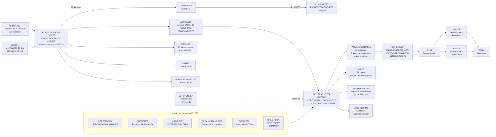

# cap-cfr.md — CFR Regulatory Reporting Pipeline — T.4.1 CNBV Accounting Series B

> Sistema: S151 | Programas: P130 (AGRUPADOR/17MTP001 · ~13,360 LOC), P131 (TRADUCTOR/15MTP007 · ~11,833 LOC) | Fase: DISCOVER Etapa 0
> Dominio: T.4 — Transversal Regulatory (no hay BIAN exacto para reportería CNBV; T.4.1 CFR Regulatory Reporting Pipeline)
> Reglas vinculadas: RN-S151-061..080 (P130, 20 reglas) + RN-S151-091..112 (P131, 22 reglas) | GAP RN-S151-081..090 vacío

Pipeline regulatorio de dos etapas que transforma los movimientos contables del día (LOG151) en reportes Serie B para la CNBV. P130 agrupa por dimensiones contables (sistema, libro, moneda, CVETRAN); P131 traduce a la nomenclatura CFR via jerarquía de catálogos CNBV (COPC/COPCN → PNPA/PNPB → CXEV/COCO → CCFI/CCFIN → DREG-FOBA). Un error en este pipeline produce reportes CNBV incorrectos con potencial sanción regulatoria y observación de auditoría CNBV.

**Dependencia crítica**: SETID="BNMEX" hardcodeado en P131 (RN-S151-110) — punto de quiebre para la separación Citi/Banamex.

---

## 1. Contexto funcional

El pipeline CFR-CNBV es el último eslabón del cierre contable diario de Banamex en Unisys MCP. P130 (AGRUPADOR, task AGRUPADOR/17MTP001) lee el archivo LOG151 generado por el GL Posting Engine (P109) y agrupa cada movimiento por sus dimensiones contables: sistema origen, libro contable, moneda operativa y clave de transacción (CVETRAN), emitiendo hasta 5 pares CVE-TRANS/IMPORTE por registro en el archivo AGRUPADO. Aplica además un conjunto de validaciones de integridad (fecha, sucursal, libro, tipo de crédito) que desvían movimientos irregulares al archivo DESVIOS —con alertas operativas vía ESENDAUTO— y emite el archivo PUNTEO para cuadre diario.

P131 (TRADUCTOR, task TRADUCTOR/15MTP007) recibe el AGRUPADO y ejecuta una cadena de traducción de 7 pasos ordenados de forma estricta: validación de registro, conversión de fecha, asignación de unidad de negocio (UNINEG) desde el catálogo COPC o COPCN (sistema 403), traducción de moneda al formato Anexo 33 CNBV, clasificación de producto (PNPA/PNPB), determinación del par contable cargo/abono vía GUIA-CONTABLE o el loop CONSEC CXEV→SIUN→COCO, y sustitución de cuenta final mediante CCFI o CCFIN. El resultado es el PAQUETECONTABLE (90 bytes/registro, 2 registros por movimiento: cargo y abono) que alimenta al sistema S254, del cual se derivan los reportes Serie B requeridos por la CNBV (B-0111A balances, B-0111B movimientos). Para movimientos en libros marcados con IND-2FOBA, P131 ejecuta adicionalmente el loop DREG-FOBA para producir el doble registro regulatorio de FOBAPROA. Una ruta paralela FFS (Fast Financial Services) procesa los mismos movimientos con campos adicionales de contrato/cliente en PAQUETECONTABLEFS (126 bytes). Todo el proceso corre en cierre diario batch; un fallo en P130 o P131 bloquea la entrega de la Serie B a la CNBV en la fecha requerida.

**Catalogos clave de traducción:** COPC/COPCN (libro+moneda → UNINEG+DEPTO), PNPA/PNPB (producto negocio → producto alfa CNBV), ARCH-CAT+CXEV (evento → par contable), COCO (concepto+SETID → número de cuenta), CCFI/CCFIN (cuenta origen → cuenta final Catálogo Mínimo CNBV), DREG-FOBA (cuenta origen+ocurrencia → cuenta FOBAPROA).

---

## 2. Inventario de Tareas

### P130 — AGRUPADOR CONTABLE

| ID | Nombre | Programa | Tipo | Complejidad | Riesgo migración |
|----|--------|----------|------|-------------|------------------|
| T-CFR-001 | Carga paramétrica CPPS L710: valores de desvío por sistema (SUCINI, CVETRA, TC, LIBRO, TM-ESQ) | P130 | INIT | ALTA | CRÍTICA |
| T-CFR-002 | Clasificación de registros LOG151 por FUNCION (1/2/99) e iteración de hasta 5 slots CVEIMP | P130 | BATCH | ALTA | ALTA |
| T-CFR-003 | Validación CVETRAN contra catálogo WKS-PT-EXISTE (Desvío D) y tipo de movimiento TM-ESQ (Desvío G) | P130 | BATCH | ALTA | ALTA |
| T-CFR-004 | Validación fecha contable vs fecha de proceso y generación de Desvío A | P130 | BATCH | MEDIA | ALTA |
| T-CFR-005 | Validación sucursal iniciativa (rango 1-10000, catálogo C209 para sistema 402) y centralización de sucursal promotora vía CENT-LM (Desvíos B-C) | P130 | BATCH | ALTA | ALTA |
| T-CFR-006 | Validación libro contable (WKS-LIBRO-LM, Desvío F) y tipo de crédito (WKS-NUM-TC, Desvío E) | P130 | BATCH | ALTA | ALTA |
| T-CFR-007 | Determinación naturaleza NATS028 cargo (1) / abono (2) por tabla CVETRAN×TM (modo FORM4 vs no-FORM4) | P130 | BATCH | ALTA | CRÍTICA |
| T-CFR-008 | Asignación de fideicomiso (3 comportamientos: sistema 402, 707/203, resto) y propagación de intercompany (solo sistemas 84/87/403/500) | P130 | BATCH | MEDIA | MEDIA |
| T-CFR-009 | Routing y notificación de desvíos A-H: escritura a DESVIOS + alertas ESENDAUTO (primera ocurrencia por tipo) | P130 | BATCH | MEDIA | ALTA |
| T-CFR-010 | Asignación de nodo de impresión por sucursal (tabla WKS-SUC-NODO-IMP, 10,000 entradas) | P130 | BATCH | MEDIA | MEDIA |
| T-CFR-011 | Escritura a MOVSCIG/MOVSCIG1 (formato diferente para sistema 203) y distribución ETL LOG151-ETL/LOG151-GEN vía INTELARSND | P130 | BATCH | MEDIA | MEDIA |
| T-CFR-012 | Reporte ATLAS sistema 403 (CVETRAN 11/5 en divisa extranjera) y registro CVETRANE extendido (campos CAEB/AREA/INTERCOMPANY) | P130 | BATCH | MEDIA | MEDIA |
| T-CFR-013 | Ruta paralela FFS en P130: escritura de CVETRANFS con campos contrato/folio/sucursal/cliente (sistemas 404/804 consultan S016) | P130 | BATCH | ALTA | ALTA |
| T-CFR-014 | Escritura del archivo PUNTEO (cuadre diario): detalle por movimiento + trailer con total de registros | P130 | BATCH | MEDIA | ALTA |

### P131 — TRADUCTOR CONTABLE CFR

| ID | Nombre | Programa | Tipo | Complejidad | Riesgo migración |
|----|--------|----------|------|-------------|------------------|
| T-CFR-015 | Validación CVE-REGISTRO del AGRUPADO (5=normal, 80-89=especiales, 9=trailer; otro → ERROR-FATAL) | P131 | BATCH | MEDIA | CRÍTICA |
| T-CFR-016 | Orquestación del flujo de traducción 7 pasos (orden estricto: valida → fecha → UNINEG → moneda → producto → desvío-suc → par contable) | P131 | BATCH | ALTA | CRÍTICA |
| T-CFR-017 | Determinación UNINEG desde catálogo COPC (libro+moneda, sistemas no-403) y COPCN (libro+área+moneda, sistema 403) con fallback "BNMEX"/DEPTO=907 | P131 | BATCH | ALTA | CRÍTICA |
| T-CFR-018 | Traducción moneda numérica → código alfa 3 chars (catálogo 385) para Anexo 33 CNBV; "CONTABLE  " hardcodeado como libro | P131 | BATCH | MEDIA | ALTA |
| T-CFR-019 | Clasificación PRODUCTO-ALFA: PNPA con clave 4 campos (no-403) / PNPB con jerarquía 4 fallbacks y 6 campos de clave (sistema 403) | P131 | BATCH | ALTA | CRÍTICA |
| T-CFR-020 | Determinación del par contable: GUIA-CONTABLE vía ARCH-CAT (no-FORM4) o loop CONSEC CXEV→SIUN→COCO hasta fin de pares (FORM4) | P131 | BATCH | MUY ALTA | CRÍTICA |
| T-CFR-021 | Sustitución de cuenta final: CCFI (no-403, clave LIBRO+CTA+MONEDA) y CCFIN (sistema 403, jerarquía 4 intentos con AREA/INTERCOMP/TIPCRED) | P131 | BATCH | MUY ALTA | CRÍTICA |
| T-CFR-022 | Post-lookup CCFIN cuenta final sistema 403 (paso adicional sobre resultado de CXEV→COCO, post-proceso independiente de T-CFR-021) | P131 | BATCH | ALTA | ALTA |
| T-CFR-023 | Doble registro FOBAPROA (DREG-FOBA loop por CTA-ORIG+OCURRENCIA cuando COPC-IND-2FOBA=2): genera asientos adicionales en CUADREESPECIAL | P131 | BATCH | ALTA | CRÍTICA |
| T-CFR-024 | Traducción INTERCOMPANY numérico → alfa (catálogo ARCH-INTE, solo sistemas 84/87/403/500), complemento de cuenta (3 fuentes: COCO/PNPB/tipo-crédito) y asignación DEPTO (centralizadora → COPC → sucursal) | P131 | BATCH | ALTA | ALTA |
| T-CFR-025 | Identidad del asiento: IDASIEN=SIST+CSI+1+SPACES, SETID="BNMEX" y TIPTRA=10 hardcodeados en todo P131 | P131 | BATCH | MEDIA | CRÍTICA |
| T-CFR-026 | Redefinición semántica FIDEICOMISO ← AREA: campo nominado fideicomiso contiene el área del movimiento (original comentado en código) | P131 | BATCH | BAJA | CRÍTICA |
| T-CFR-027 | Generación del PAQUETECONTABLE (90 bytes, 2 registros cargo/abono por movimiento, CVE-REG "05"→"01") y sort por 8 claves para interfaz S254 | P131 | BATCH | ALTA | CRÍTICA |
| T-CFR-028 | Ruta paralela FFS en P131: PAQUETECONTABLEFS (126 bytes) con campos SUC-PROM/NUM-CTO/NUM-CTE/NUM-FOL; sort extendido con 4 campos adicionales | P131 | BATCH | ALTA | ALTA |
| T-CFR-029 | Compensación directa FSWBMX: movimientos sin cuadre → MOV-TRABAJO → sort SMOV-TRABAJO → reporte "CONTROL CONTABLE Y COMPENSACION AUTOMATICA" | P131 | BATCH | ALTA | ALTA |
| T-CFR-030 | Validación de totales del trailer AGRUPADO: TOTREG y TOTIMP producidos por P130 deben coincidir con conteo P131 — ERROR-FATAL si difieren | P131 | BATCH | MEDIA | ALTA |

---

## 3. Casuísticas representativas

### CS-CFR-01: Flujo normal día hábil — movimiento único sin desvíos
**Tipo:** happy-path
**Condición de entrada:** Registro LOG151 con FUNCION=1, STATUS=1, 1 slot CVEIMP válido, CVETRAN en catálogo WKS-PT-EXISTE, fecha contable = fecha proceso, sucursal y libro válidos, catálogos P131 completos (COPC, ARCH-CAT, COCO, CCFI encontrados en primer intento)
**Resultado:** 1 registro en AGRUPADO (P130) → 2 registros en PAQUETECONTABLE (cargo REG1 + abono REG2, 90 bytes c/u); 1 registro en PARES; PUNTEO actualizado; Serie B alimentada sin excepciones
**Secuencia:**
```
[P130] T-CFR-001 (carga CPPS L710)
→ T-CFR-002 (FUNCION=1, 1 slot CVEIMP)
→ T-CFR-003 (CVETRAN válida en WKS-PT-EXISTE)
→ T-CFR-004 (fecha contable = fecha proceso → sin Desvío A)
→ T-CFR-005 (SUC-INIC en rango → sin Desvío B; no aplica CENT-LM)
→ T-CFR-006 (libro y TC válidos → sin Desvíos E-F)
→ T-CFR-007 (NATS28 determinado: cargo o abono)
→ T-CFR-014 (PUNTEO escrito)
→ AGRUPADO generado

[P131] T-CFR-015 (CVE-REG=5 → procesable)
→ T-CFR-016 (7 pasos orquestados)
→ T-CFR-017 (COPC encontrado → UNINEG+DEPTO asignados)
→ T-CFR-018 (MONEDA-ALFA=catálogo 385)
→ T-CFR-019 (PNPA encontrado en primer intento → PRODALFA)
→ T-CFR-020 (ARCH-CAT → GUIA-CONTABLE → par cargo/abono resuelto)
→ T-CFR-021 (CCFI encontrado → CTA-CONTABLE final)
→ T-CFR-024 (DEPTO=sucursal, sin intercompany, complemento de COCO)
→ T-CFR-025 (SETID="BNMEX", TIPTRA=10, IDASIEN construido)
→ T-CFR-027 (2 registros 90 bytes escritos a PAQUETECONTABLE)
→ T-CFR-030 (TOTREG y TOTIMP coinciden → sin ERROR-FATAL)
```

---

### CS-CFR-02: Error de traducción CFR — CVETRAN sin entrada en catálogo
**Tipo:** error operativo
**Condición de entrada:** Movimiento LOG151 FUNCION=1, STATUS=1, CVETRAN válida en WKS-PT-EXISTE (P130 pasa sin desvío) pero sin entrada en ARCH-CAT de P131 (la CVETRAN no tiene GUIA-CONTABLE asignada)
**Resultado:** P131 usa WKS-GUIA-DESVIO como fallback → par contable de desvío en PAQUETECONTABLE → cuenta genérica en Serie B, sin nombre descriptivo CNBV — registro va a revisión manual; ERR1279 activo si es sistema 403
**Secuencia:**
```
[P130] → flujo normal sin desvíos → AGRUPADO generado

[P131] T-CFR-015 → T-CFR-016 → T-CFR-017 (UNINEG OK)
→ T-CFR-018 (moneda OK) → T-CFR-019 (PRODALFA OK)
→ T-CFR-020: READ ARCH-CAT → INVALID KEY
  → W77-INDPAR = WKS-GUIA-DESVIO (par de desvío)
  → pares cargo/abono con cuentas genéricas
→ T-CFR-021 (CCFI sobre cuenta desvío → posible no encontrado → mantiene cuenta COCO)
→ T-CFR-027 (PAQUETECONTABLE escrito con cuenta desvío → aparece en Serie B sin nombre)
[Para sistema 403]: WRITE ERR1279 → revisión diaria obligatoria
```

---

### CS-CFR-03: Cierre CNBV con doble registro FOBAPROA activo
**Tipo:** edge-case regulatorio
**Condición de entrada:** Movimiento en libro con COPC-IND-2FOBA=2 (cartera bursatilizada/FOBAPROA); ARCH-DREG-FOBA tiene entradas para la cuenta cargo y la cuenta abono
**Resultado:** Además de los 2 registros normales del PAQUETECONTABLE, P131 genera registros adicionales con cuentas FOBAPROA destino vía DREG-FOBA loop → CUADREESPECIAL; si ARCH-DREG-FOBA no tiene la cuenta, escribe ERRORDRFOB — observación auditora CNBV
**Secuencia:**
```
[P131] T-CFR-017: READ ARCH-CONV-OPE-CON → COPC-IND-2FOBA=2 → W77-BAND-DREG=2
→ T-CFR-018..T-CFR-021 (traducción normal)
→ T-CFR-023 (DREG-FOBA activado):
  OCURRENCIA=1
  LOOP:
    READ ARCH-DREG-FOBA KEY=CTA-ORIG+OCURRENCIA
    IF FOUND: DREG-TP-AFECTA=1 → CTACARGO sustituida
              DREG-TP-AFECTA=2 → CTAABONO sustituida
    ADD 1 TO OCURRENCIA → UNTIL NO-MAS
    IF NOT FOUND ANY: WRITE ERRORDRFOB → WRITE CUADREESPECIAL
→ T-CFR-027 (PAQUETECONTABLE: 2 registros normales + registros FOBAPROA extra)
```

---

## 4. Diagrama (Mermaid)



---

## 5. Reglas de negocio vinculadas

### P130 — AGRUPADOR CONTABLE

| ID regla | Enunciado breve | Programa | Criticidad |
|----------|----------------|----------|-----------|
| RN-S151-061 | Filtro maestro: solo FUNCION=1 (alta) y FUNCION=2 (reversión) son procesados; FUNCION=99 es EOF; cualquier otro valor se ignora silenciosamente | P130 | ALTA |
| RN-S151-062 | Estructura CVEIMP: hasta 5 slots por registro (CVE-TRANS+INDLEY+ESQCON+IMPORTE+CVE-DESVIO+GUIA-DESVIO); loop W77-INDCVE 1→5 con parada en CVETRAN=0 AND IMPORTE=0 | P130 | ALTA |
| RN-S151-063 | Validación CVETRAN contra tabla WKS-PT-EXISTE(CVETRAN, TM-ESQ): Desvío D si no existe o es clave de desvío; Desvío G si TM-ESQ ≠ 1 y ≠ 2; FORM4 siempre usa índice TM=1 | P130 | ALTA |
| RN-S151-064 | Validación fecha contable: si A00-R01-FECCONT ≠ WKS-FECHA-PROCESO → RMC-FECHA = WKS-FECHA-PROCESO (fecha canónica sobrescribe) + Desvío A activo | P130 | ALTA |
| RN-S151-065 | Validación sucursal iniciativa: bypass si sistema=252; rango 1-10000; lookup catálogo C209 para sistema 402; Desvío B si inválida | P130 | ALTA |
| RN-S151-066 | Centralización sucursal promotora: si WKS-IND-CENT-LM(INDLIB,INDMON)=2 → usar WKS-CENT-CONT-LM como RMC-SUC; si sin centralizadora → Desvío C; tablas bidimensionales LIBRO×MONEDA desde CPPS L710 | P130 | ALTA |
| RN-S151-067 | Validación libro contable: solo para sistemas CRED/CENTRAL; IND-CONTA+1 como índice; si no en WKS-LIBRO-LM(INDLIB,INDMON) → Desvío F con libro de desvío parametrizado | P130 | CRÍTICA |
| RN-S151-068 | Validación tipo de crédito: solo sistemas CRED excepto 404/414; rango 1-99; lookup WKS-NUM-TC (omitido para 403); Desvío E si fuera de rango o en catálogo de desvío TC | P130 | ALTA |
| RN-S151-069 | Routing de desvíos A-H: escritura a archivo DESVIOS con código concatenado; alerta ESENDAUTO OUTBOARD en primera ocurrencia de cada tipo (flag BAN impide repetición); contadores WKS-CONT-DESVIO por tipo | P130 | ALTA |
| RN-S151-070 | Asignación fideicomiso por sistema: sistema 402 → campo FIDEICO402; sistemas 707 y 203 → ZERO; resto → campo FIDEICO general | P130 | MEDIA |
| RN-S151-071 | Propagación intercompany: solo sistemas 84, 87, 403 y 500 copian A00-R01-INTERCOMPANY al output; resto → ZERO forzado | P130 | ALTA |
| RN-S151-072 | Determinación naturaleza NATS028: si no-FORM4 → WKS-PT-NATS028(CVETRAN, TM-ESQ); si FORM4 → WKS-PT-NATS028(CVETRAN, 1); resultado en RM-NATS28 (1=cargo, 2=abono) | P130 | CRÍTICA |
| RN-S151-073 | Formato MOVSCIG: sistema 203 usa MOVSCIG1 con header formato NF (WKS-HDNF-CIG); resto usa MOVSCIG estándar; envío vía INTELARSND (ADMONXFERS) al cierre | P130 | MEDIA |
| RN-S151-074 | Distribución ETL: si W88-SISTEMA-ESQ-ETL → genera LOG151-ETL con header/detalle/trailer; sistema 404 también genera LOG151-GEN (distribución LATAM); envío vía INTELARSND | P130 | MEDIA |
| RN-S151-075 | Ruta paralela FFS: si W88-SISTEMA-INT-FFS → genera CVETRANFS con campos NUM-CTO, NUM-FOL, SUCPROM, NUM-CLIENTE; sistemas 404 y 804 consultan S016 para NUM-CLIENTE | P130 | ALTA |
| RN-S151-076 | Reporte ATLAS sistema 403: solo CVETRAN=11 (Compra) o CVETRAN=5 (Venta), STATUS=1, moneda ≠ 0/1/3 (solo divisas extranjeras); acumula TOTIMP y NUREG para trailer | P130 | MEDIA |
| RN-S151-077 | Registro CVETRANE extendido sistema 403: contiene NUM-AUX (cliente 403), CVE-CAEB, CVE-AREA, INTERCOMPANY mapeado a campo RMC-FEC-PART (semántica no estándar — redefinición de campo) | P130 | MEDIA |
| RN-S151-078 | Asignación nodo de impresión: si SUC-INIC en 1-10000 y WKS-SUC-NODO-IMP>0 → nodo de tabla; si SUC-INIC=0 → no escribir; else → CSI×100 como nodo de fallback | P130 | MEDIA |
| RN-S151-079 | Carga paramétrica CPPS L710 en inicialización: WKS-SUCINI-DESVIO, WKS-CVETRA-DESVIO, WKS-TC-DESVIO, WKS-LIBRO-DESVIO (FORM4: 4 params; no-FORM4: +WKS-TM-DESVIO) — críticos, distintos por sistema | P130 | CRÍTICA |
| RN-S151-080 | Escritura PUNTEO: TIPO-REG=2, campos LIBRO+CONTRATO+MONEDA+CVETRA+TM+IMPORTE por movimiento; trailer con W77-TOTREG-PUNTEO; mecanismo de cuadre P130↔downstream | P130 | ALTA |

### P131 — TRADUCTOR CONTABLE CFR

| ID regla | Enunciado breve | Programa | Criticidad |
|----------|----------------|----------|-----------|
| RN-S151-091 | Flujo de traducción 7 pasos ordenados (crítico): validar CVE-REG → fecha → UNINEG → moneda → producto → sucursal/desvío → pares contables (→ DREG-FOBA si IND-2FOBA=2) → escribir PAQUETECONTABLE | P131 | CRÍTICA |
| RN-S151-092 | Validación CVE-REGISTRO: valores válidos 5 (normal) y 80-89 (ajustes especiales); 9=trailer (skip); cualquier otro → ERROR-FATAL que aborta el proceso completo del día | P131 | CRÍTICA |
| RN-S151-093 | UNINEG desde COPC (no-403): clave LIBRO+MONEDA-OPERATIVA → UNINEG+DEPTO+IND-CENT+IND-2FOBA; fallback con WKS-LIBRO-DESVIO+1; fallback final "BNMEX"/DEPTO=907 hardcodeados | P131 | CRÍTICA |
| RN-S151-094 | UNINEG desde COPCN (sistema 403): clave LIBRO+AREA+MONEDA (3 campos vs 2 de COPC); 2 intentos con AREA luego AREA=0; fallback a flujo COPC estándar → "BNMEX"/907 | P131 | ALTA |
| RN-S151-095 | Traducción moneda numérica → alfa 3 chars (catálogo 385 Anexo 33 CNBV); libro contable A01-TRAD-LIBCON="CONTABLE  " hardcodeado (10 chars); moneda desvío="***" | P131 | CRÍTICA |
| RN-S151-096 | PRODUCTO-ALFA desde PNPA (no-403): clave 4 campos PRD-NEG+PORTAFO+FIDEICO+ID-CORP; fallback para sistema 404: tabla WKS-PROD-ALFA(PRD-NEG); fallback final: concatenación PROD-TC+INST (IND-PROD=1) | P131 | CRÍTICA |
| RN-S151-097 | PRODUCTO-ALFA desde PNPB (sistema 403): jerarquía 4 intentos reduciendo campos de clave (CAEB→0, AREA→0, ambos→0); fallo total → ERR1279 + concatenación directa; PNPB-TCALF → WKS-AUX-TCALF (complemento de cuenta) | P131 | ALTA |
| RN-S151-098 | Concepto por evento (no-FORM4): READ ARCH-CAT KEY=CVETRA+TM → CAT-GUIAC → tabla WKS-CVEPAR (hasta 5 pares); si IND-MARCA=2 → sustitución CCFI/CCFIN; fallback a WKS-GUIA-DESVIO | P131 | CRÍTICA |
| RN-S151-099 | Concepto por evento (FORM4): loop CONSEC desde 1 → READ CXEV KEY=EVENTO+TM+CONSEC → READ SIUN(UNINEG)→SET-ID → READ COCO(CONCEP+SETID)→CTA-PAR; genera N pares contables por movimiento | P131 | CRÍTICA |
| RN-S151-100 | Sustitución cuenta final CCFI (no-403): KEY=LIBRO+CTA-ORIGEN+MONEDA; CCFIN (sistema 403): 4 intentos jerárquicos con AREA/INTERCOMP/TIPCRED reduciéndose; fallo → mantener cuenta COCO; CCFIN-CAE forzado=0 | P131 | CRÍTICA |
| RN-S151-101 | Doble registro FOBAPROA (si W77-BAND-DREG=2 desde COPC-IND-2FOBA): loop ARCH-DREG-FOBA KEY=CTA-ORIG+OCURRENCIA; TP-AFECTA=1→ruta cargo, TP-AFECTA=2→ruta abono; fallo → ERRORDRFOB + CUADREESPECIAL | P131 | CRÍTICA |
| RN-S151-102 | Estructura PAQUETECONTABLE 90 bytes: REG1 RP-NATURALEZA=1 (cargo), REG2 RP-NATURALEZA=2 (abono); campos CTAALFA+UNINEG+MONALFA+DEPTO+PRODALFA+IDASIEN; CVE-REG "05"→"01" hardcodeado; también genera PARES (74 bytes) y CUADREESPECIAL | P131 | CRÍTICA |
| RN-S151-103 | Sort PAQUETECONTABLE antes de envío a S254: clave ascendente 8 campos (UNINEG+LIBCON+MONALFA+DEPTO+FECCONT+PRODALFA+INTERCOMPANY+CTAALFA); FFS agrega 4 campos más | P131 | ALTA |
| RN-S151-104 | Ruta paralela FFS en P131: AGRUPADOFS → AGRUPCONTFS + PAQUETECONTABLEFS (126 bytes, campos extra SUC-PROM+NUM-CTO+NUM-CTE+NUM-FOL); sort extendido; misma cadena de catálogos que ruta normal | P131 | ALTA |
| RN-S151-105 | Traducción INTERCOMPANY: solo sistemas 84/87/403/500 → READ ARCH-INTE(INTERCOMPANY)→UNIDADN alfa 5 chars; resto → SPACES+0 | P131 | ALTA |
| RN-S151-106 | Complemento de cuenta contable: 3 fuentes por sistema — sistemas 252/600 siempre usan COCO-COM-CTA; sistema 403 usa WKS-AUX-TCALF (PNPB) cuando COCO-COM-CTA=0; resto usa A01-TRAD-PRODTC | P131 | ALTA |
| RN-S151-107 | Asignación DEPTO en PAQUETECONTABLE: prioridad 1 AGRU-CENTRA-D (centralizadora explícita en AGRUPADO); prioridad 2 W77-DEPTO de COPC/COPCN (si IND-CENT=2); prioridad 3 AGRU-SUC (sucursal promotora) | P131 | ALTA |
| RN-S151-108 | Post-lookup CCFIN cuenta final sistema 403 (paso adicional post-CXEV/COCO): busca en CCFIN con WKS-AUX-CTA-ORI; si encontrado → reemplaza cuenta COCO; si no → mantiene COCO; solo sistema 403 | P131 | ALTA |
| RN-S151-109 | Validación totales trailer: W77-TOTREG-TR ≠ W77-TOTREG → ERROR-FATAL; W77-TOTIMP-TR ≠ W77-TOTIMP → ERROR-FATAL con diferencia calculada; aplica también a ruta FS | P131 | ALTA |
| RN-S151-110 | Identidad del asiento: IDASIEN=SIST(2)+CSI(2)+1(1)+SPACES(5); SETID="BNMEX" hardcodeado (identidad de entidad en S254/PeopleSoft); TIPTRA=10 hardcodeado; IDASIEN-VERS=1 hardcodeado | P131 | CRÍTICA |
| RN-S151-111 | Compensación directa FSWBMX: movimientos sin cuadre → MOV-TRABAJO → sort SMOV-TRABAJO → compensación automática → reporte "CONTROL CONTABLE Y COMPENSACION AUTOMATICA"; catálogos OCC involucrados; confianza media (bloque P131:174-4364) | P131 | ALTA |
| RN-S151-112 | Redefinición semántica FIDEICOMISO ← AREA: el campo A01-TRAD-FIDEICOMISO del PAQUETECONTABLE contiene A00-R01-AGRU-AREA (no el fideicomiso); la asignación original de fideicomiso está comentada en código activo | P131 | CRÍTICA |

---

## 6. Hallazgos de migración

| # | Hallazgo | Tipo | Impacto | Recomendación |
|---|---------|------|---------|---------------|
| CFR-H01 | SETID="BNMEX" hardcodeado en P131 (RN-S151-110): todo asiento en S254/PeopleSoft se identifica con la entidad "BNMEX" directamente en código | Configuración crítica — separación Citi/Banamex | CRITICAL | Externalizar SETID como parámetro de entorno desde día 1 de migración; probar contra S254 con ambos valores antes del go-live |
| CFR-H02 | Jerarquía de traducción CFR embebida en 9 catálogos hard-linked al código (COPC, CCFI, PNPA, CXEV, COCO, DREG-FOBA, ARCH-CAT, SIUN, ARCH-INTE) — no hay API de traducción ni tabla administrable externamente | Acoplamiento regulatorio | HIGH | Extraer todos los catálogos a BD relacional versionada; exponer API de traducción CNBV con versionado de reglas; establecer proceso de actualización regulatoria sin recompilación |
| CFR-H03 | FIDEICOMISO ← AREA: el campo A01-TRAD-FIDEICOMISO del PAQUETECONTABLE contiene el AREA del movimiento — la asignación de fideicomiso original está comentada en código (RN-S151-112) | Semántica de campo no estándar | CRITICAL | Validar con Banamex Finance qué espera S254 en este campo antes de migrar; documentar si el cambio es intencional o deuda técnica; cualquier sistema destino que mapee por nombre de campo producirá error |
| CFR-H04 | Filtro FUNCION silencioso (RN-S151-061): valores distintos de 1, 2 y 99 no generan error ni desvío — movimientos con FUNCION nuevo (ej. correcciones futuras) se pierden sin traza | Pérdida silenciosa de datos | MEDIUM | Agregar validación explícita + log/alerta para FUNCION no reconocido; revisar si hay valores en producción distintos de 1, 2 y 99 en el histórico de LOG151 |
| CFR-H05 | Parámetros de desvío en CPPS L710 (RN-S151-079): SUCINI-DESVIO, CVETRA-DESVIO, TC-DESVIO, LIBRO-DESVIO son distintos por sistema — si se hardcodean en el sistema destino produce desvíos masivos o pérdida silenciosa de movimientos válidos | Parametrización crítica | HIGH | Migrar CPPS L710 a configuration store por sistema (Secrets Manager / Parameter Store); nunca hardcodear valores de desvío; mantener proceso de carga en inicialización del job |
| CFR-H06 | Loop CONSEC CXEV→SIUN→COCO (RN-S151-099): un movimiento de entrada puede generar N pares contables en PAQUETECONTABLE (multiplicación 1→N) — el sistema destino debe soportar esta expansión y garantizar que el sort y totales del trailer sean coherentes | Expansión de volumen | HIGH | Dimensionar el pipeline de traducción para cardinalidad N por movimiento; validar que los totales del trailer (TOTREG/TOTIMP) cubran todos los registros expandidos |
| CFR-H07 | DREG-FOBA activo para cartera bursatilizada FOBAPROA (RN-S151-101): el doble registro es un requerimiento regulatorio histórico vigente — si ARCH-DREG-FOBA no se migra completo o el loop no se replica, los registros FOBAPROA faltan y generan observación de auditoría CNBV | Regulatorio histórico | HIGH | Migrar ARCH-DREG-FOBA como tabla de referencia regulatoria; replicar el loop exacto (CTA-ORIG+OCURRENCIA como clave compuesta); revisar diariamente ERRORDRFOB durante período paralelo |
| CFR-H08 | ESENDAUTO OUTBOARD Unisys (RN-S151-069) e INTELARSND (RN-S151-073/074): dos servicios MCP propietarios para alertas operativas y distribución ETL respectivamente — no tienen equivalente directo en arquitectura cloud | Dependencia MCP propietaria | MEDIUM | Reemplazar ESENDAUTO con plataforma de alertas (SNS/PagerDuty/EventBridge); reemplazar INTELARSND con mecanismo de distribución cloud (S3/MQ/Kafka); el comportamiento de "primera ocurrencia por tipo" de ESENDAUTO debe replicarse en la nueva solución |
| CFR-H09 | LIBCON="CONTABLE  " hardcodeado (RN-S151-095): el campo libro contable alfa (10 chars) se fuerza siempre a este valor en todo P131 — cualquier cambio requiere coordinación con S254 que espera exactamente este valor en el PAQUETECONTABLE | Contrato de interfaz | MEDIUM | Documentar como constante de interfaz S254; no modificar sin prueba end-to-end con S254; externalizar si S254 acepta configuración del valor en destino |
| CFR-H10 | TIPTRA=10 hardcodeado (RN-S151-110): el tipo de transacción contable es fijo en P131 — evaluar si S254 requiere un valor diferente post-separación Citi/Banamex o si el valor 10 tiene semántica específica de entidad | Identidad post-demerger | MEDIUM | Incluir en la prueba de separación con S254; validar el catálogo de tipos de transacción en PeopleSoft para confirmar si TIPTRA=10 es específico de Citi o de Banamex |
| CFR-H11 | Compensación directa FSWBMX (RN-S151-111): bloque de modificación que abarca P131:174-4364 con múltiples secciones de compensación automática de cuadre intradiario — confianza media, alcance no delimitado completamente | Arquitectura — deuda técnica | MEDIUM | Leer el bloque FSWBMX completo con análisis estático para delimitar su alcance exacto antes de decidir si se replica o se rediseña; evaluar si el cuadre intradiario puede manejarse con mecanismos nativos del sistema destino |

---

## 7. Inventario de catálogos críticos

| Catálogo | Archivo físico | Clave de búsqueda | Salida crítica | Regla(s) |
|----------|---------------|-------------------|----------------|----------|
| COPC | ARCH-CONV-OPE-CON | LIBRO + MONEDA | UNINEG, DEPTO, IND-CENT, IND-2FOBA | RN-S151-093 |
| COPCN | ARCH-CONV-OPEN-CON | LIBRO + AREA + MONEDA | UNINEG, DEPTO (sistema 403) | RN-S151-094 |
| CCFI | ARCH-CTA-FINAL | LIBRO + CTA-ORIGEN + MONEDA | CTA-CONTABLE (no-403) | RN-S151-100 |
| CCFIN | ARCH-CTA-FIN-NVO | LIBRO + AREA + INTERCOMP + TIPCRED + 0 + CTA-ORIG | CTA-CONTABLE (sistema 403) | RN-S151-100, RN-S151-108 |
| PNPA | ARCH-NEGO-VS-ALFA | PRD-NEG + PORTAFO + FIDEICO + ID-CORP | PRODALFA (no-403) | RN-S151-096 |
| PNPB | ARCH-NEGNVO-VS-ALF | LIB + MDA + TC + FON + CAEB + AREA | PRODALFA, TCALF (sistema 403) | RN-S151-097 |
| ARCH-CAT | ARCH-CAT | CVETRA + TM | GUIA-CONTABLE | RN-S151-098 |
| CXEV | ARCH-CONCEP-X-EVENT | EVENTO + TM + CONSEC | CONCEP-CARGO, CONCEP-ABONO | RN-S151-099 |
| SIUN | ARCH-SET-ID-UNEGOCI | UNINEG | SET-ID (para búsqueda COCO) | RN-S151-099 |
| COCO | ARCH-CONCEP-COLOCAC | CONCEPT + SETID | CTA-PAR, COM-CTA | RN-S151-099, RN-S151-106 |
| DREG-FOBA | ARCH-DREG-FOBA | CTA-ORIG + OCURRENCIA | CTA-DEST, UNINEG-DEST, TP-AFECTA | RN-S151-101 |
| ARCH-INTE | ARCH-INTE | INTERCOMPANY-NUM | UNIDAD-NEGOCIO-ALFA (5 chars) | RN-S151-105 |
| WKS-PT-EXISTE | Tabla en memoria (CPPS) | CVETRAN + TM | Existencia del par en catálogo CFR | RN-S151-063 |
| WKS-PT-NATS028 | Tabla en memoria (CPPS) | CVETRAN + TM | NATS28 (cargo=1/abono=2) | RN-S151-072 |
| WKS-MONEDA-ALFA | Tabla catálogo 385 | MONEDA-NUM | MONALFA 3 chars (Anexo 33 CNBV) | RN-S151-095 |
| WKS-LIBRO-LM | Tabla matricial LIBRO×MONEDA | INDLIB + INDMON | Libro válido, IND-CENT, CENT-CONT | RN-S151-066, RN-S151-067 |
| WKS-SUC-NODO-IMP | Tabla 10,000 entradas en memoria | SUC-INIC | NODO-IMPRESION | RN-S151-078 |
| CPPS L710 | Parámetros runtime por sistema | Sistema + clave posicional | Valores de desvío (SUCINI/CVETRA/TC/LIBRO) | RN-S151-079 |
| C209 | Catálogo sucursales sistema 402 | SUC-INIC | Existencia de sucursal válida | RN-S151-065 |

---

*Generado: 2026-07-16 · Gemelo Cognitivo Banamex S151 · Fase 1 DISCOVER Etapa 0*
*Reglas fuente: `rules-catalog/rules-s151-p130-p131.md` (RN-S151-061..080 + RN-S151-091..112 · 42 reglas)*
*Pendiente: validación HITL con equipo técnico Banamex · casos de prueba por tarea · confirmación semántica FIDEICOMISO/AREA con Finance*
