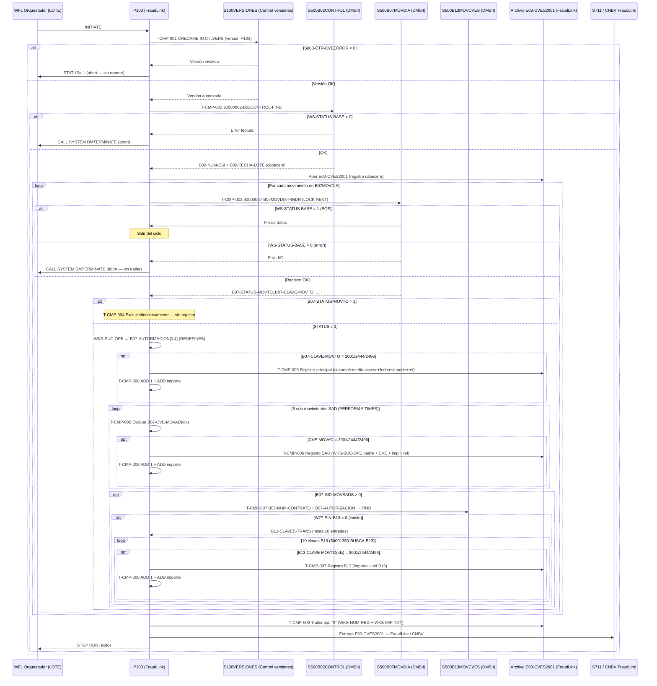

# Capacidad: Compliance & Regulation — Reporte Diario FraudLink CNBV [S500]
> Dominio: 6 · Common Services · Subdominio: Compliance & Regulation
> Capacidad: **6.5.2 Compliance & Regulation**
> Cobertura: S500 · Programa principal: P103 (FraudLink)
> Reglas vinculadas: RN-S500-001..008 (8 reglas)
> Contexto: P103 genera diariamente el reporte de movimientos sospechosos de fraude hacia FraudLink/CNBV (Sistema S711). Monitorea tres códigos de transacción (2001, 2444 y 2496) en tres niveles jerárquicos de cada movimiento: movimiento principal, hasta 5 sub-movimientos SAD, y hasta 10 claves adicionales B13. El trailer de cierre tipo "9" permite a CNBV validar la integridad del archivo recibido. La ausencia de este reporte en cualquier día hábil es un incumplimiento regulatorio (Circular Única de Bancos — prevención de fraude).

---

## Inventario de Tareas

| ID | Tarea | Programa | Componente fuente | Tipo |
|----|-------|----------|-------------------|------|
| T-CMP-001 | Validar versión del programa contra catálogo S100VERSIONES (CHECAME IN CTLVERS); abort con STATUS=-1 si S000-CTR-CVEERROR < 0 — sin abrir archivo de salida | P103 | COBOL_P103.txt | validación |
| T-CMP-002 | Leer registro de control S500B02CONTROL (B02-NUM-CSI + B02-FECHA-LOTE para cabecera); abort vía CALL SYSTEM DMTERMINATE si WS-STATUS-BASE > 0 | P103 | COBOL_P103.txt | consulta |
| T-CMP-003 | Leer secuencialmente movimientos del día desde S500B07MOVDIA (90000007-B07MOVDIA-FINDN): WS-STATUS-BASE=1=EOF normal; otro valor > 0 → DMTERMINATE sin trailer | P103 | COBOL_P103.txt | consulta |
| T-CMP-004 | Filtrar movimientos con B07-STATUS-MOVTO = 1: excluir del análisis sin traza ni contador | P103 | COBOL_P103.txt | validación |
| T-CMP-005 | Evaluar código de transacción principal: si B07-CLAVE-MOVTO = 2001/2444/2496 → generar registro FraudLink con sucursal (WKS-SUC-OPE de REDEFINES B07-AUTORIZACION), B07-MED-ACCESO, B02-FECHA-LOTE, importe y referencia | P103 | COBOL_P103.txt | reporte |
| T-CMP-006 | Evaluar hasta 5 sub-movimientos SAD (B07-OTROS-MOVSAD × PERFORM 5 TIMES): por cada B07-CVE-MOVAD = 2001/2444/2496 → registro FraudLink con WKS-SUC-OPE heredada del movimiento padre | P103 | COBOL_P103.txt | reporte |
| T-CMP-007 | Evaluar hasta 10 claves adicionales B13 (si B07-IND-MOVSADS > 0): buscar S500B13MOVCVES por B07-NUM-CONTRATO + B07-AUTORIZACION; recorrer B13-CLAVES-TRANS × 10; por cada B13-CLAVE-MOVTO = 2001/2444/2496 → registro FraudLink con B13-IMPORTE + B13-REF-MOVAD | P103 | COBOL_P103.txt | reporte |
| T-CMP-008 | Acumular por cada registro escrito: ADD 1 TO WKS-NUM-REG (PIC 9(08)) + ADD WKS-REG-E03-IMPORTE TO WKS-IMP-TOT (PIC 9(12)V99) | P103 | COBOL_P103.txt | control |
| T-CMP-009 | Escribir trailer de cierre tipo "9" (WKS-E03-TRAILER) con WKS-NUM-REG y WKS-IMP-TOT para validación de integridad por FraudLink/CNBV | P103 | COBOL_P103.txt | reporte |

---

## Casuísticas

### CS-CMP-01: Movimiento con código de fraude — sin sub-movimientos ni B13 (happy path)
**Tipo:** happy-path
**Condición de entrada:** Movimiento en S500B07MOVDIA con B07-STATUS-MOVTO ≠ 1, B07-CLAVE-MOVTO = 2001 (o 2444/2496), B07-IND-MOVSADS = 0, sub-movimientos SAD vacíos
**Resultado:** 1 registro FraudLink generado con sucursal (primeros 4 dígitos de B07-AUTORIZACION), B07-MED-ACCESO, B02-FECHA-LOTE, importe y referencia; WKS-NUM-REG acumulado en 1; ciclo continúa con siguiente movimiento
**Secuencia:**
```
T-CMP-001 (versión OK) → T-CMP-002 (S500B02CONTROL leído)
  → [ciclo] T-CMP-003 (lectura B07) → T-CMP-004 (STATUS ≠ 1 → no filtrar)
    → T-CMP-005 (CLAVE = 2001 → registro FraudLink) → T-CMP-008 (ADD 1 + importe)
    → T-CMP-006 (5 SAD × vacíos → sin registros)
    → T-CMP-007 (B07-IND-MOVSADS = 0 → sin B13)
  → [siguiente] T-CMP-003 ...
  → [EOF] T-CMP-009 (trailer tipo "9")
```

### CS-CMP-02: Movimiento principal + 5 sub-movimientos SAD con código monitoreado (volumen máximo SAD)
**Tipo:** happy-path (volumétrico)
**Condición de entrada:** B07-CLAVE-MOVTO = 2001; los 5 entradas de B07-OTROS-MOVSAD tienen B07-CVE-MOVAD = 2001/2444/2496; B07-IND-MOVSADS = 0
**Resultado:** 6 registros FraudLink (1 principal + 5 SAD); todos comparten WKS-SUC-OPE del padre; WKS-NUM-REG acumula 6; WKS-IMP-TOT suma 6 importes
**Secuencia:**
```
T-CMP-005 (movimiento principal → registro 1) → T-CMP-008 (+1)
  → T-CMP-006 (PERFORM 5 TIMES)
    → sub-mov 1 (CVE = 2001 → registro 2) → T-CMP-008 (+1)
    → sub-mov 2 (CVE = 2444 → registro 3) → T-CMP-008 (+1)
    → sub-mov 3 (CVE = 2496 → registro 4) → T-CMP-008 (+1)
    → sub-mov 4 (CVE = 2001 → registro 5) → T-CMP-008 (+1)
    → sub-mov 5 (CVE = 2001 → registro 6) → T-CMP-008 (+1)
  → T-CMP-007 (IND-MOVSADS = 0 → sin B13)
```

### CS-CMP-03: Tres niveles completos — principal + SAD + B13 (máxima cardinalidad)
**Tipo:** happy-path (máxima cardinalidad regulatoria)
**Condición de entrada:** B07-CLAVE-MOVTO = 2001; 5 SAD con código monitoreado; B07-IND-MOVSADS > 0 con B13 existente para el par contrato/autorización; las 10 entradas B13-CLAVES-TRANS tienen código = 2001/2444/2496
**Resultado:** Hasta 16 registros FraudLink por movimiento (1 principal + 5 SAD + 10 B13); WKS-NUM-REG acumula 16; CNBV recibe representación completa del evento de fraude en sus tres niveles
**Secuencia:**
```
T-CMP-005 (principal → registro 1) → T-CMP-008 (+1)
  → T-CMP-006 (5 SAD → registros 2..6) → T-CMP-008 (×5)
  → T-CMP-007 (IND-MOVSADS > 0)
    → 90000007-B13-FIND (B07-NUM-CONTRATO + B07-AUTORIZACION → W77-SIN-B13 = 0)
    → 50001350-BUSCA-B13 (× 10 entradas)
      → B13-CLAVE-MOVTO = 2001/2444/2496 × 10 → registros 7..16 → T-CMP-008 (×10)
```

### CS-CMP-04: Movimiento excluido por estatus 1 — sin registro FraudLink
**Tipo:** edge-case (exclusión silenciosa)
**Condición de entrada:** B07-STATUS-MOVTO = 1 (hipótesis regulatoria: movimiento cancelado/anulado)
**Resultado:** El movimiento no entra al análisis de código; no se genera ningún registro FraudLink ni se acumulan totales; ciclo continúa sin traza de la exclusión — CNBV no puede saber cuántos movimientos fueron filtrados por este criterio
**Secuencia:**
```
T-CMP-003 (lectura B07) → T-CMP-004 (B07-STATUS-MOVTO = 1 → SIGUIENTE sin registro)
  → T-CMP-003 (siguiente movimiento)
```

### CS-CMP-05: Error de lectura en S500B07MOVDIA — abort sin trailer
**Tipo:** error-sistema (impacto regulatorio)
**Condición de entrada:** WS-STATUS-BASE > 0 y ≠ 1 durante la lectura secuencial de S500B07MOVDIA (p.ej. error de I/O de DMSII)
**Resultado:** Proceso abortado vía CALL SYSTEM DMTERMINATE; archivo E03-CVES2001 queda incompleto sin trailer tipo "9"; FraudLink/CNBV recibe un archivo parcial sin total de control — incumplimiento regulatorio hasta que se reprocese el día correctamente
**Secuencia:**
```
T-CMP-003 (WS-STATUS-BASE = X, X ≠ 0 y X ≠ 1)
  → CALL SYSTEM DMTERMINATE (abort — sin T-CMP-009)
  [archivo FraudLink incompleto — sin trailer]
```

### CS-CMP-06: Error de versión — abort antes de abrir el archivo de salida
**Tipo:** error-sistema
**Condición de entrada:** S000-CTR-CVEERROR < 0 tras CHECAME IN CTLVERS al inicio del programa
**Resultado:** Mensaje "ERROR DE VERSION" emitido; STATUS=-1 marcado (CHANGE ATTRIBUTE, no STOP RUN); el flujo del mecanismo interno cancela antes de abrir E03-CVES2001 — ningún registro se genera ese día; FraudLink/CNBV no recibe reporte
**Secuencia:**
```
T-CMP-001 (S000-CTR-CVEERROR < 0)
  → CHANGE ATTRIBUTE STATUS OF MYSELF TO -1
  → abort — T-CMP-002..009 nunca ejecutan
  [archivo FraudLink ausente — incumplimiento regulatorio]
```

---

## Diagrama



---

## Reglas vinculadas a tareas

| Tarea | Regla | Componente fuente | Descripción | Base regulatoria |
|-------|-------|-------------------|-------------|------------------|
| T-CMP-001 | RN-S500-001 | COBOL_P103.txt | Validación de versión ante CTLVERS — abort si S000-CTR-CVEERROR < 0 | Control interno |
| T-CMP-002 | RN-S500-002 | COBOL_P103.txt | Lectura S500B02CONTROL — abort DMTERMINATE si WS-STATUS-BASE > 0; B02-FECHA-LOTE como fecha de proceso | CNBV |
| T-CMP-003 | RN-S500-003 | COBOL_P103.txt | Control EOF: STATUS=1=normal; otro valor>0=DMTERMINATE sin trailer | Control interno |
| T-CMP-004 | RN-S500-004 | COBOL_P103.txt | Exclusión silenciosa B07-STATUS-MOVTO=1 (hipótesis: cancelado) — sin traza | CNBV |
| T-CMP-005 | RN-S500-005 | COBOL_P103.txt | Reporte principal: códigos 2001/2444/2496 hardcoded; WKS-REG-E03-CHQRA=B07-MED-ACCESO | CNBV |
| T-CMP-006 | RN-S500-006 | COBOL_P103.txt | Hasta 5 SAD (PERFORM 5 TIMES hardcoded); WKS-SUC-OPE heredado del padre | CNBV |
| T-CMP-007 | RN-S500-007 | COBOL_P103.txt | Hasta 10 claves B13 (estructura×10 hardcoded); FK B07-NUM-CONTRATO+B07-AUTORIZACION | CNBV |
| T-CMP-008 | RN-S500-008 | COBOL_P103.txt | Acumulación ADD: WKS-NUM-REG PIC 9(08) + WKS-IMP-TOT PIC 9(12)V99; importe truncado a 11 dígitos | CNBV |
| T-CMP-009 | RN-S500-008 | COBOL_P103.txt | Trailer tipo "9" con totales para validación CNBV de integridad del archivo | CNBV |

---

## Estructura del archivo E03-CVES2001 (contrato de interfaz CNBV)

| Tipo de registro | Contenido | Campos clave |
|-----------------|-----------|--------------|
| Cabecera | Identificación del nodo y fecha de proceso | B02-NUM-CSI · B02-FECHA-LOTE |
| Detalle movimiento principal | Código de fraude + datos del movimiento | WKS-SUC-OPE · B07-MED-ACCESO (en campo CHQRA) · B07-CLAVE-MOVTO · B07-IMPORTE · B07-REFER-NUME |
| Detalle SAD | Sub-movimiento del mismo movimiento principal | WKS-SUC-OPE (padre) · B07-CVE-MOVAD · B07-IMP-MOVAD · B07-REF-MOVAD |
| Detalle B13 | Clave adicional de contrato/autorización | B13-CLAVE-MOVTO · B13-IMPORTE · B13-REF-MOVAD |
| Trailer tipo "9" | Totales de control | WKS-NUM-REG (PIC 9(08)) · WKS-IMP-TOT (PIC 9(12)V99) |

> **Cardinalidad máxima por movimiento principal:** 1 (principal) + 5 (SAD) + 10 (B13) = **16 registros**.
> **Fecha de proceso:** B02-FECHA-LOTE (fecha del batch), **no la fecha del sistema** — crítico para días de reproceso.

---

## Hallazgos de migración críticos

| Riesgo | Tarea | Severidad | Acción requerida |
|--------|-------|-----------|-----------------|
| Códigos 2001/2444/2496 hardcoded — extensión del catálogo de fraude requiere recompilación | T-CMP-005..007 | 🟠 CRÍTICO | Externalizar a tabla de configuración parametrizable; agregar un código nuevo no debe requerir cambio de código fuente |
| Límite 5 SAD hardcoded (PERFORM 5 TIMES) — si hay más de 5 sub-movimientos se trunca el reporte CNBV | T-CMP-006 | 🟠 CRÍTICO | Verificar con SME si el límite es estructural del DASDL (B07-OTROS-MOVSAD×5) o solo del programa; en target usar lista dinámica |
| Límite 10 B13 hardcoded (B13-CLAVES-TRANS×10) — puede truncar claves adicionales y subdeclarar ante CNBV | T-CMP-007 | 🟠 CRÍTICO | Verificar en DASDL si el tipo B13 permite más de 10 entradas; si sí, migrar a colección dinámica |
| Abort sin trailer (DMTERMINATE ante error I/O) — archivo FraudLink incompleto entregado a CNBV | T-CMP-003 | 🟠 CRÍTICO | Implementar manejo de excepciones con escritura del trailer incluso en caso de error, o mecanismo de reinicio desde el último registro procesado exitosamente |
| B02-FECHA-LOTE ≠ fecha del sistema — en reprocesos la fecha del reporte difiere de la fecha de ejecución | T-CMP-002 | 🟡 ALTO | Documentar explícitamente en el API target que la fecha de proceso del reporte viene del parámetro de control, no del sistema |
| WKS-REG-E03-IMPORTE PIC 9(11)V99 vs origen NUMBER 14,2 — truncamiento silencioso para importes > $99 mil millones | T-CMP-008 | 🟡 ALTO | Ampliar el PIC a 14 dígitos en el registro de detalle o validar que el rango histórico de importes FraudLink no excede 11 dígitos |
| WKS-REG-E03-CHQRA contiene B07-MED-ACCESO (no chequera) — homonimia engañosa para desarrolladores | T-CMP-005 | 🟡 ALTO | Renombrar el campo en el target a un nombre semánticamente correcto (ej. MED_ACCESO o CANAL_ACCESO); actualizar documentación del contrato CNBV |
| B07-STATUS-MOVTO=1 excluye sin traza — sin posibilidad de auditar cuántos movimientos no se reportaron | T-CMP-004 | 🟡 MEDIO | Agregar contador de exclusiones + log estructurado; verificar con SME el significado exacto del valor 1 antes de migrar |
| CALL SYSTEM DMTERMINATE / CHANGE ATTRIBUTE STATUS — primitivas propietarias Unisys MCP | T-CMP-001..003 | 🟡 MEDIO | Reemplazar por exception handling del lenguaje target con exit codes no-cero para el orquestador |
| FK compuesta B07-NUM-CONTRATO + B07-AUTORIZACION → B13 — dependencia referencial implícita no enforceada | T-CMP-007 | 🟡 MEDIO | Documentar la FK como restricción referencial explícita en el modelo de datos target; implementar integridad referencial o validación previa |

---

## Contexto regulatorio

| Elemento | Detalle |
|----------|---------|
| Regulador | CNBV — Comisión Nacional Bancaria y de Valores |
| Normativa | Circular Única de Bancos — Disposiciones de prevención de fraude |
| Sistema receptor | S711 vía FraudLink |
| Frecuencia | Diaria — batch de cierre |
| Impacto de ausencia | Incumplimiento regulatorio; posible sanción CNBV; observación en auditoría interna |
| Mecanismo de validación | Trailer tipo "9" con conteo de registros e importe total; FraudLink valida integridad |
| Fecha de referencia | B02-FECHA-LOTE (fecha del batch), no del sistema — crítico para reprocesos y auditoría |

---

## Trazabilidad completa (ejemplo RN-S500-007)

```
Regla: RN-S500-007 — Reporte de hasta 10 claves adicionales B13 con código de fraude
  → Tarea: T-CMP-007 — Evaluar hasta 10 claves B13 (S500B13MOVCVES por contrato+autorización)
    → Programa: P103 (FraudLink)
      → Componente fuente: COBOL_P103.txt
        → Párrafos: 50001300-MOVS-B13 → 50001350-BUSCA-B13
          → Casuística: CS-CMP-03 (tres niveles completos — máxima cardinalidad)
            → Diagrama: rama "B07-IND-MOVSADS > 0 → B13 × 10"
              → Riesgo: 🟠 CRÍTICO — "Límite 10 B13 hardcoded — puede truncar ante CNBV"
```

---

*cap-cmp.md · v1.0 · 2026-07-16 · Capa 4 (Inventario de Tareas) + Capa 5 (Casuísticas + Diagrama Mermaid)*
*Capacidad: 6.5.2 Compliance & Regulation · Sistema: S500 · Programa: P103 (FraudLink)*
*Cross-referencia: RN-S500-001..008 · rules-catalog/rules-s500.md · capability-map.md · kb-capa3-capacidades.md*