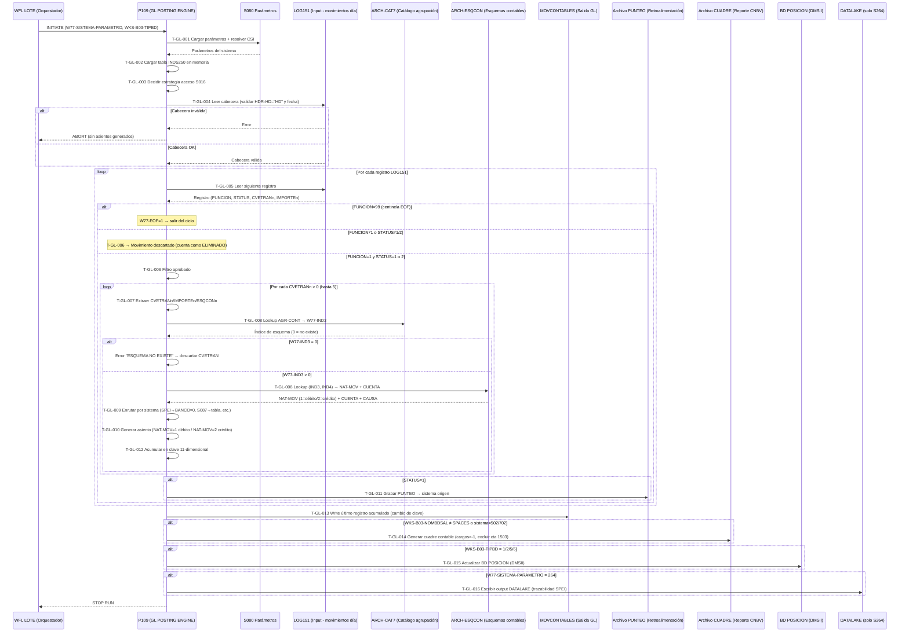

# Capacidad: Finance (GL) — Motor de Asientos Contables [S151]
> Dominio: 7 · Enterprise Support Functions
> Capacidad: **7.1.1 Finance (GL)** · Libro Mayor General
> Cobertura: S151 · Programa principal: P109 (GL POSTING ENGINE)
> Reglas vinculadas: RN-S151-021..060 (40 reglas)
> LOC analizadas: ~19,381 · Fan-out S151: 52 llamadores

---

## Contexto funcional

P109 es el **motor de contabilización de Banamex en Unisys MCP**. Recibe movimientos del día desde el archivo LOG151, resuelve la cuenta GL para cada movimiento via la cadena CVETRAN→ESQCON, genera asientos de partida doble, acumula por 11 dimensiones y produce el cuadre contable diario para CNBV. Es multi-sistema: soporta 15+ sistemas origen (S500 caja, S264 SPEI, S084 tarjetas, S087 cheques, S018, S502 nómina, S702 CBII, S703 SWIFT, S711 MICR, y otros) con el mismo binario parametrizado.

---

## Inventario de Tareas

| ID | Tarea | Programa | Componente fuente | Tipo |
|----|-------|----------|-------------------|------|
| T-GL-001 | Inicializar sistema: leer W77-SISTEMA-PARAMETRO, resolver CSI (mapeo 12→10), cargar parámetros S080 | P109 | COBOL_P109.txt | control |
| T-GL-002 | Cargar tabla INDS250 en memoria (índice CVETRAN → agrupación contable) | P109 | COBOL_P109.txt | consulta |
| T-GL-003 | Determinar estrategia de acceso tabla S016 (memoria si <4500 registros, disco si ≥4500) | P109 | COBOL_P109.txt | control |
| T-GL-004 | Validar cabecera LOG151 (HDR-HD="HD" y WKS-FECHA-PROCESO = HDR-FCH) | P109 | COBOL_P109.txt | validación |
| T-GL-005 | Leer registro LOG151 y detectar centinela EOF (FUNCION=99 → W77-EOF=1) | P109 | COBOL_P109.txt | consulta |
| T-GL-006 | Filtrar movimiento por FUNCION=1 (contabilizable) y STATUS=1 o 2 (autorizado/en proceso) | P109 | COBOL_P109.txt | validación |
| T-GL-007 | Expandir hasta 5 CVETRANs por movimiento (CVETRAN1..5, IMPORTE1..5, ESQCON1..5) | P109 | COBOL_P109.txt | validación |
| T-GL-008 | Resolver cuenta GL: cadena CVETRAN → INDS250 → CAT7 → ESQCON → (NAT-MOV, CUENTA, CAUSA) | P109 | COBOL_P109.txt | contable |
| T-GL-009 | Aplicar enrutamiento por sistema origen (banco, sector, datos SPEI, tabla cheques S087, etc.) | P109 | COBOL_P109.txt | control |
| T-GL-010 | Generar asiento partida doble: NAT-MOV=1 (débito) o NAT-MOV=2 (crédito) en MOVCONTABLES | P109 | COBOL_P109.txt | contable |
| T-GL-011 | Grabar retroalimentación PUNTEO al sistema origen (solo STATUS=1) | P109 | COBOL_P109.txt | escritura |
| T-GL-012 | Acumular importes por clave compuesta 11-dimensional en SMOVCONTASORT (ADD RMS-IMPORTE) | P109 | COBOL_P109.txt | contable |
| T-GL-013 | Escribir registro acumulado MOVCONTABLES al detectar cambio de clave 11-dimensional | P109 | COBOL_P109.txt | escritura |
| T-GL-014 | Generar cuadre contable (sección 40000): negación de cargos (×−1), exclusión cuenta 1503 | P109 | COBOL_P109.txt | contable |
| T-GL-015 | Actualizar base de datos POSICION si WKS-B03-TIPBD = 1/2/5/6 (sección 50000) | P109 | COBOL_P109.txt | escritura |
| T-GL-016 | Generar output DATALAKE exclusivo para S264/SPEI (trazabilidad de pagos) | P109 | COBOL_P109.txt | escritura |

---

## Casuísticas

### CS-GL-01: Movimiento contabilizable standard — 1 CVETRAN (happy path)
**Tipo:** happy-path
**Condición de entrada:** Registro LOG151 con FUNCION=1, STATUS=1, exactamente 1 CVETRAN válido (>0), cuenta GL resuelta exitosamente por ESQCON
**Resultado:** 1 asiento en MOVCONTABLES (débito o crédito según NAT-MOV); PUNTEO enviado al sistema origen; acumulación en clave 11-dimensional
**Secuencia:**
```
T-GL-001 → T-GL-002 → T-GL-003 → T-GL-004
  → [ciclo] T-GL-005 (FUNCION≠99) → T-GL-006 (FUNCION=1, STATUS=1)
    → T-GL-007 (1 CVETRAN) → T-GL-008 (resuelve cuenta OK)
    → T-GL-009 (enruta por sistema) → T-GL-010 (asiento débito/crédito)
    → T-GL-011 (PUNTEO → origen) → T-GL-012 (acumula)
  → [siguiente] T-GL-005 ...
  → [fin] T-GL-013 (write último acumulado) → T-GL-014 (cuadre) → T-GL-015 (POSICION)
```

### CS-GL-02: Movimiento con múltiples CVETRANs (hasta 5 sub-asientos)
**Tipo:** happy-path (variante)
**Condición de entrada:** Registro LOG151 con FUNCION=1, STATUS=1, N CVETRANs válidos (2≤N≤5), ejemplo: pago con comisión e impuesto
**Resultado:** N asientos GL independientes en MOVCONTABLES — uno por cada CVETRANn>0; PUNTEO enviado una sola vez al sistema origen
**Secuencia:**
```
T-GL-006 (STATUS=1) → T-GL-007 (detecta 5 CVETRANs)
  → [por cada CVETRANn > 0]:
    T-GL-008 (resuelve cuenta para CVETRANn) → T-GL-009 → T-GL-010 → T-GL-012
  → T-GL-011 (PUNTEO, 1 sola vez)
```

### CS-GL-03: Movimiento STATUS=2 (en proceso — sin punteo)
**Tipo:** happy-path (variante regulatoria)
**Condición de entrada:** Registro LOG151 con FUNCION=1, STATUS=2 (en proceso)
**Resultado:** Asiento GL generado idéntico a STATUS=1; PUNTEO al sistema origen NO se genera (el movimiento aún está en tránsito)
**Secuencia:**
```
T-GL-006 (FUNCION=1, STATUS=2) → T-GL-007 → T-GL-008 → T-GL-009 → T-GL-010 → T-GL-012
(T-GL-011 omitido — sin PUNTEO para STATUS=2)
```

### CS-GL-04: Movimiento sin esquema contable (ESQUEMA NO EXISTE)
**Tipo:** error
**Condición de entrada:** CVETRAN válido pero sin entrada en CAT7 (W77-IND3=0 tras lookup)
**Resultado:** Error "ESQUEMA NO EXISTE" registrado en log; movimiento NO contabilizado — gap en GL; proceso continúa con siguiente movimiento
**Secuencia:**
```
T-GL-007 → T-GL-008 (CAT7 lookup → W77-IND3=0)
  → Error "ESQUEMA NO EXISTE" → movimiento descartado → T-GL-005 (siguiente)
```

### CS-GL-05: Movimiento SPEI (S264) en pesos — banco sin dimensión + DATALAKE
**Tipo:** edge-case regulatorio
**Condición de entrada:** W77-SISTEMA-PARAMETRO=264 (SPEI), MONEDA=1 (MXN)
**Resultado:** Asiento GL con RMS-BANCO=0 (sin dimensión banco para consolidar posición); output adicional escrito en archivo DATALAKE
**Secuencia:**
```
T-GL-001 (sistema=264) → ... → T-GL-009 (SPEI + MONEDA=1 → BANCO=0)
  → T-GL-010 → T-GL-012 → T-GL-013
  → T-GL-016 (escribe DATALAKE — exclusivo S264)
```

### CS-GL-06: Error en cabecera LOG151 (abort batch)
**Tipo:** error
**Condición de entrada:** HDR-HD ≠ "HD" o WKS-FECHA-PROCESO ≠ HDR-FCH al abrir LOG151
**Resultado:** Abort inmediato del proceso — ningún movimiento se contabiliza ese día; P109 no genera cuadre ni actualiza POSICION
**Secuencia:**
```
T-GL-004 (validación falla) → ABORT (sin ningún T-GL-005..016)
```

---

## Diagrama



---

## Reglas vinculadas a tareas

| Tarea | Regla | Componente fuente | Descripción |
|-------|-------|-------------------|-------------|
| T-GL-001 | RN-S151-029 | COBOL_P109.txt | Mapeo hardcoded CSI=12 → CSI=10 |
| T-GL-001 | RN-S151-032 | COBOL_P109.txt | Enrutamiento por sistema (W77-SISTEMA-PARAMETRO, 15+ sistemas) |
| T-GL-003 | RN-S151-030 | COBOL_P109.txt | Umbral memoria/disco para tabla S016 (<4500 → memoria) |
| T-GL-004 | RN-S151-021 | COBOL_P109.txt | Validación de cabecera LOG151 (HDR-HD + fecha) |
| T-GL-005 | RN-S151-022 | COBOL_P109.txt | Centinela de fin de archivo FUNCION=99 |
| T-GL-006 | RN-S151-023 | COBOL_P109.txt | Filtro de selección: FUNCION=1 y STATUS=1/2 |
| T-GL-007 | RN-S151-024 | COBOL_P109.txt | Hasta 5 CVETRANs por movimiento (expansión 1:N) |
| T-GL-008 | RN-S151-025 | COBOL_P109.txt | Cadena de resolución ESQCON (corazón del motor GL) |
| T-GL-009 | RN-S151-033 | COBOL_P109.txt | Mapeo instrumento→S016-INST para S087 (tabla hardcoded) |
| T-GL-009 | RN-S151-034 | COBOL_P109.txt | S264 MONEDA=1 → BANCO=0 (SPEI pesos sin dimensión banco) |
| T-GL-009 | RN-S151-035 | COBOL_P109.txt | Gate de actualización POSICION por tipo BD |
| T-GL-009 | RN-S151-036 | COBOL_P109.txt | Generación cuadre S502/S702 + condición NOMBDSAL |
| T-GL-010 | RN-S151-026 | COBOL_P109.txt | Partida doble: NAT-MOV=1 (débito) / NAT-MOV=2 (crédito) |
| T-GL-010 | RN-S151-027 | COBOL_P109.txt | Cuenta contable por defecto cuando CTA1-CONT=0 (fallback prefijo 5) |
| T-GL-012 | RN-S151-031 | COBOL_P109.txt | Clave de acumulación MOVCONTASORT (11 dimensiones) |
| T-GL-014 | RN-S151-028 | COBOL_P109.txt | Exclusión de cuenta 1503 del cuadre (hardcode) |
| T-GL-014 | RN-S151-038 | COBOL_P109.txt | Negación de cargos en cuadre (CARGOS = TCP-CARGOS × −1) |
| T-GL-016 | RN-S151-037 | COBOL_P109.txt | Salida DATALAKE exclusiva para S264 (SPEI) |

> **Reglas RN-S151-039..060** (22 reglas no mapeadas aún): cubren lógica adicional de P109 — validación de importe en MOVCONTASORT, manejo de banco/sector por sistema, actualización de saldos BD11SDOS151, y cierre del proceso. Se vincularán en la siguiente iteración.

---

## Hallazgos de migración críticos

| Riesgo | Tarea | Severidad | Acción requerida |
|--------|-------|-----------|-----------------|
| P109 multi-sistema en 1 binario (15+ sistemas) | T-GL-001 | 🟠 CRÍTICO | Descomponer en microservicio por sistema origen o parametrizar vía configuración; equivalencia debe probarse por sistema |
| Cadena ESQCON en 3 catálogos (INDS250+CAT7+ESQCON) | T-GL-008 | 🟠 CRÍTICO | Migrar como servicio de resolución de cuentas; "ESQUEMA NO EXISTE" = gap silencioso en GL |
| Clave 11-dimensional — granularidad mínima del GL | T-GL-012 | 🟡 ALTO | Target GL debe soportar exactamente FILIAL·ORIGEN·MONEDA·BANCO·SUC-PROM·FECVEN·PRODUCTO·INSTRUMENTO·SECTOR·CVETRAN·ESQCON |
| Partida doble solo garantizada si ESQCON es correcto | T-GL-010 | 🟠 CRÍTICO | NAT-MOV ≠ 1/2 → asiento descartado silenciosamente; requiere validación calidad del catálogo ESQCON antes de migrar |
| CTA1-CONT=0 → fallback prefijo 5 hardcoded | T-GL-010 | 🟡 ALTO | El prefijo 5 puede no ser válido en catálogo CNBV nuevo; auditar ESQCON para eliminar entradas CTA=0 |
| Cuenta 1503 excluida hardcode del cuadre | T-GL-014 | 🟡 MEDIO | Validar con equipo contable si la exclusión sigue siendo válida en el nuevo plan de cuentas |
| DATALAKE SPEI generado en proceso batch (solo S264) | T-GL-016 | 🟡 MEDIO | Redireccionar al data lake destino; si se migra a streaming SPEI, este path batch queda obsoleto |
| CSI=12→CSI=10 hardcoded (mapeo histórico) | T-GL-001 | 🟢 BAJO | Verificar si CSI 12 sigue activo; si no, eliminar; si sí, externalizar a configuración |

---

## Trazabilidad completa (ejemplo RN-S151-025)

```
Regla: RN-S151-025 — Cadena de resolución ESQCON (CVETRAN → cuenta GL)
  → Tarea: T-GL-008 — Resolver cuenta GL
    → Programa: P109
      → Componente fuente: COBOL_P109.txt
        → Párrafos: 21120-GRABA-MOV-CONTABLE / 21122-MUEVE-ESQUEMA (~líneas 10807-10870)
          → Casuísticas: CS-GL-01 (happy path) / CS-GL-04 (ESQUEMA NO EXISTE)
            → Diagrama: paso "T-GL-008 Lookup AGR-CONT → W77-IND3"
```

---

*cap-gl.md · v1.0 · 2026-07-16 · Capa 4 (Inventario de Tareas) + Capa 5 (Casuísticas + Diagrama Mermaid)*
*Capacidad: 7.1.1 Finance (GL) · Sistema: S151 · Programa: P109 (GL POSTING ENGINE)*
*Cross-referencia: RN-S151-021..060 · rules-catalog/rules-s151.md · capability-map.md · kb-capa3-capacidades.md*