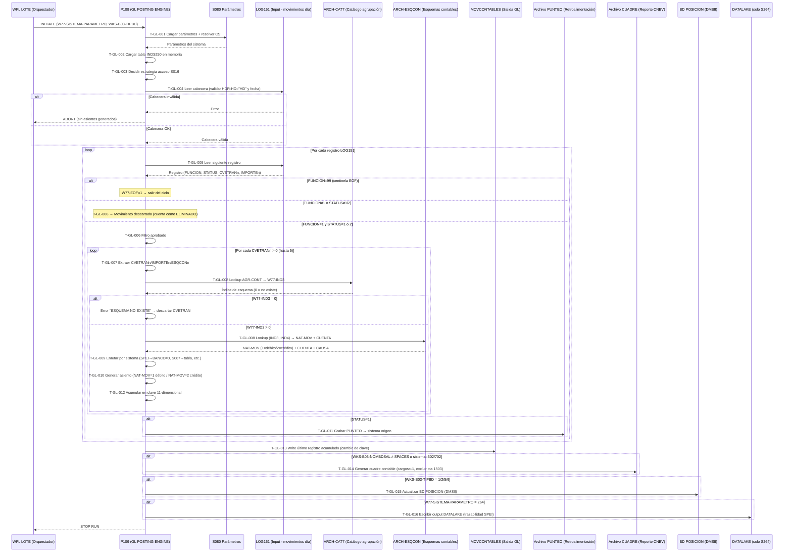

# Capacidad: Finance (GL) — Motor de Asientos Contables [S151]
> Dominio: 7 · Enterprise Support Functions
> Capacidad: **7.1.1 Finance (GL)** · Libro Mayor General
> Cobertura: S151 · Programa principal: P109 (GL POSTING ENGINE)
> Reglas vinculadas: RN-S151-021..060 (40 reglas)
> LOC analizadas: ~19,381 · Fan-out S151: 52 llamadores

---

## Contexto funcional

P109 es el **motor de contabilización de Banamex en Unisys MCP**. Recibe movimientos del día desde el archivo LOG151, resuelve la cuenta GL para cada movimiento via la cadena CVETRAN→ESQCON, genera asientos de partida doble, acumula por 11 dimensiones y produce el cuadre contable diario para CNBV. Es multi-sistema: soporta 15+ sistemas origen (S500 caja, S264 SPEI, S084 tarjetas, S087 cheques, S018, S502 nómina, S702 CBII, S703 SWIFT, S711 MICR, y otros) con el mismo binario parametrizado.

---

## Inventario de Tareas

| ID | Tarea | Programa | Componente fuente | Tipo |
|----|-------|----------|-------------------|------|
| T-GL-001 | Inicializar sistema: leer W77-SISTEMA-PARAMETRO, resolver CSI (mapeo 12→10), cargar parámetros S080 | P109 | COBOL_P109.txt | control |
| T-GL-002 | Cargar tabla INDS250 en memoria (índice CVETRAN → agrupación contable) | P109 | COBOL_P109.txt | consulta |
| T-GL-003 | Determinar estrategia de acceso tabla S016 (memoria si <4500 registros, disco si ≥4500) | P109 | COBOL_P109.txt | control |
| T-GL-004 | Validar cabecera LOG151 (HDR-HD="HD" y WKS-FECHA-PROCESO = HDR-FCH) | P109 | COBOL_P109.txt | validación |
| T-GL-005 | Leer registro LOG151 y detectar centinela EOF (FUNCION=99 → W77-EOF=1) | P109 | COBOL_P109.txt | consulta |
| T-GL-006 | Filtrar movimiento por FUNCION=1 (contabilizable) y STATUS=1 o 2 (autorizado/en proceso) | P109 | COBOL_P109.txt | validación |
| T-GL-007 | Expandir hasta 5 CVETRANs por movimiento (CVETRAN1..5, IMPORTE1..5, ESQCON1..5) | P109 | COBOL_P109.txt | validación |
| T-GL-008 | Resolver cuenta GL: cadena CVETRAN → INDS250 → CAT7 → ESQCON → (NAT-MOV, CUENTA, CAUSA) | P109 | COBOL_P109.txt | contable |
| T-GL-009 | Aplicar enrutamiento por sistema origen (banco, sector, datos SPEI, tabla cheques S087, etc.) | P109 | COBOL_P109.txt | control |
| T-GL-010 | Generar asiento partida doble: NAT-MOV=1 (débito) o NAT-MOV=2 (crédito) en MOVCONTABLES | P109 | COBOL_P109.txt | contable |
| T-GL-011 | Grabar retroalimentación PUNTEO al sistema origen (solo STATUS=1) | P109 | COBOL_P109.txt | escritura |
| T-GL-012 | Acumular importes por clave compuesta 11-dimensional en SMOVCONTASORT (ADD RMS-IMPORTE) | P109 | COBOL_P109.txt | contable |
| T-GL-013 | Escribir registro acumulado MOVCONTABLES al detectar cambio de clave 11-dimensional | P109 | COBOL_P109.txt | escritura |
| T-GL-014 | Generar cuadre contable (sección 40000): negación de cargos (×−1), exclusión cuenta 1503 | P109 | COBOL_P109.txt | contable |
| T-GL-015 | Actualizar base de datos POSICION si WKS-B03-TIPBD = 1/2/5/6 (sección 50000) | P109 | COBOL_P109.txt | escritura |
| T-GL-016 | Generar output DATALAKE exclusivo para S264/SPEI (trazabilidad de pagos) | P109 | COBOL_P109.txt | escritura |

---

## Casuísticas

### CS-GL-01: Movimiento contabilizable standard — 1 CVETRAN (happy path)
**Tipo:** happy-path
**Condición de entrada:** Registro LOG151 con FUNCION=1, STATUS=1, exactamente 1 CVETRAN válido (>0), cuenta GL resuelta exitosamente por ESQCON
**Resultado:** 1 asiento en MOVCONTABLES (débito o crédito según NAT-MOV); PUNTEO enviado al sistema origen; acumulación en clave 11-dimensional
**Secuencia:**
```
T-GL-001 → T-GL-002 → T-GL-003 → T-GL-004
  → [ciclo] T-GL-005 (FUNCION≠99) → T-GL-006 (FUNCION=1, STATUS=1)
    → T-GL-007 (1 CVETRAN) → T-GL-008 (resuelve cuenta OK)
    → T-GL-009 (enruta por sistema) → T-GL-010 (asiento débito/crédito)
    → T-GL-011 (PUNTEO → origen) → T-GL-012 (acumula)
  → [siguiente] T-GL-005 ...
  → [fin] T-GL-013 (write último acumulado) → T-GL-014 (cuadre) → T-GL-015 (POSICION)
```

### CS-GL-02: Movimiento con múltiples CVETRANs (hasta 5 sub-asientos)
**Tipo:** happy-path (variante)
**Condición de entrada:** Registro LOG151 con FUNCION=1, STATUS=1, N CVETRANs válidos (2≤N≤5), ejemplo: pago con comisión e impuesto
**Resultado:** N asientos GL independientes en MOVCONTABLES — uno por cada CVETRANn>0; PUNTEO enviado una sola vez al sistema origen
**Secuencia:**
```
T-GL-006 (STATUS=1) → T-GL-007 (detecta 5 CVETRANs)
  → [por cada CVETRANn > 0]:
    T-GL-008 (resuelve cuenta para CVETRANn) → T-GL-009 → T-GL-010 → T-GL-012
  → T-GL-011 (PUNTEO, 1 sola vez)
```

### CS-GL-03: Movimiento STATUS=2 (en proceso — sin punteo)
**Tipo:** happy-path (variante regulatoria)
**Condición de entrada:** Registro LOG151 con FUNCION=1, STATUS=2 (en proceso)
**Resultado:** Asiento GL generado idéntico a STATUS=1; PUNTEO al sistema origen NO se genera (el movimiento aún está en tránsito)
**Secuencia:**
```
T-GL-006 (FUNCION=1, STATUS=2) → T-GL-007 → T-GL-008 → T-GL-009 → T-GL-010 → T-GL-012
(T-GL-011 omitido — sin PUNTEO para STATUS=2)
```

### CS-GL-04: Movimiento sin esquema contable (ESQUEMA NO EXISTE)
**Tipo:** error
**Condición de entrada:** CVETRAN válido pero sin entrada en CAT7 (W77-IND3=0 tras lookup)
**Resultado:** Error "ESQUEMA NO EXISTE" registrado en log; movimiento NO contabilizado — gap en GL; proceso continúa con siguiente movimiento
**Secuencia:**
```
T-GL-007 → T-GL-008 (CAT7 lookup → W77-IND3=0)
  → Error "ESQUEMA NO EXISTE" → movimiento descartado → T-GL-005 (siguiente)
```

### CS-GL-05: Movimiento SPEI (S264) en pesos — banco sin dimensión + DATALAKE
**Tipo:** edge-case regulatorio
**Condición de entrada:** W77-SISTEMA-PARAMETRO=264 (SPEI), MONEDA=1 (MXN)
**Resultado:** Asiento GL con RMS-BANCO=0 (sin dimensión banco para consolidar posición); output adicional escrito en archivo DATALAKE
**Secuencia:**
```
T-GL-001 (sistema=264) → ... → T-GL-009 (SPEI + MONEDA=1 → BANCO=0)
  → T-GL-010 → T-GL-012 → T-GL-013
  → T-GL-016 (escribe DATALAKE — exclusivo S264)
```

### CS-GL-06: Error en cabecera LOG151 (abort batch)
**Tipo:** error
**Condición de entrada:** HDR-HD ≠ "HD" o WKS-FECHA-PROCESO ≠ HDR-FCH al abrir LOG151
**Resultado:** Abort inmediato del proceso — ningún movimiento se contabiliza ese día; P109 no genera cuadre ni actualiza POSICION
**Secuencia:**
```
T-GL-004 (validación falla) → ABORT (sin ningún T-GL-005..016)
```

---

## Diagrama



---

## Reglas vinculadas a tareas

| Tarea | Regla | Componente fuente | Descripción |
|-------|-------|-------------------|-------------|
| T-GL-001 | RN-S151-029 | COBOL_P109.txt | Mapeo hardcoded CSI=12 → CSI=10 |
| T-GL-001 | RN-S151-032 | COBOL_P109.txt | Enrutamiento por sistema (W77-SISTEMA-PARAMETRO, 15+ sistemas) |
| T-GL-003 | RN-S151-030 | COBOL_P109.txt | Umbral memoria/disco para tabla S016 (<4500 → memoria) |
| T-GL-004 | RN-S151-021 | COBOL_P109.txt | Validación de cabecera LOG151 (HDR-HD + fecha) |
| T-GL-005 | RN-S151-022 | COBOL_P109.txt | Centinela de fin de archivo FUNCION=99 |
| T-GL-006 | RN-S151-023 | COBOL_P109.txt | Filtro de selección: FUNCION=1 y STATUS=1/2 |
| T-GL-007 | RN-S151-024 | COBOL_P109.txt | Hasta 5 CVETRANs por movimiento (expansión 1:N) |
| T-GL-008 | RN-S151-025 | COBOL_P109.txt | Cadena de resolución ESQCON (corazón del motor GL) |
| T-GL-009 | RN-S151-033 | COBOL_P109.txt | Mapeo instrumento→S016-INST para S087 (tabla hardcoded) |
| T-GL-009 | RN-S151-034 | COBOL_P109.txt | S264 MONEDA=1 → BANCO=0 (SPEI pesos sin dimensión banco) |
| T-GL-009 | RN-S151-035 | COBOL_P109.txt | Gate de actualización POSICION por tipo BD |
| T-GL-009 | RN-S151-036 | COBOL_P109.txt | Generación cuadre S502/S702 + condición NOMBDSAL |
| T-GL-010 | RN-S151-026 | COBOL_P109.txt | Partida doble: NAT-MOV=1 (débito) / NAT-MOV=2 (crédito) |
| T-GL-010 | RN-S151-027 | COBOL_P109.txt | Cuenta contable por defecto cuando CTA1-CONT=0 (fallback prefijo 5) |
| T-GL-012 | RN-S151-031 | COBOL_P109.txt | Clave de acumulación MOVCONTASORT (11 dimensiones) |
| T-GL-014 | RN-S151-028 | COBOL_P109.txt | Exclusión de cuenta 1503 del cuadre (hardcode) |
| T-GL-014 | RN-S151-038 | COBOL_P109.txt | Negación de cargos en cuadre (CARGOS = TCP-CARGOS × −1) |
| T-GL-016 | RN-S151-037 | COBOL_P109.txt | Salida DATALAKE exclusiva para S264 (SPEI) |

> **Reglas RN-S151-039..060** (22 reglas no mapeadas aún): cubren lógica adicional de P109 — validación de importe en MOVCONTASORT, manejo de banco/sector por sistema, actualización de saldos BD11SDOS151, y cierre del proceso. Se vincularán en la siguiente iteración.

---

## Hallazgos de migración críticos

| Riesgo | Tarea | Severidad | Acción requerida |
|--------|-------|-----------|-----------------|
| P109 multi-sistema en 1 binario (15+ sistemas) | T-GL-001 | 🟠 CRÍTICO | Descomponer en microservicio por sistema origen o parametrizar vía configuración; equivalencia debe probarse por sistema |
| Cadena ESQCON en 3 catálogos (INDS250+CAT7+ESQCON) | T-GL-008 | 🟠 CRÍTICO | Migrar como servicio de resolución de cuentas; "ESQUEMA NO EXISTE" = gap silencioso en GL |
| Clave 11-dimensional — granularidad mínima del GL | T-GL-012 | 🟡 ALTO | Target GL debe soportar exactamente FILIAL·ORIGEN·MONEDA·BANCO·SUC-PROM·FECVEN·PRODUCTO·INSTRUMENTO·SECTOR·CVETRAN·ESQCON |
| Partida doble solo garantizada si ESQCON es correcto | T-GL-010 | 🟠 CRÍTICO | NAT-MOV ≠ 1/2 → asiento descartado silenciosamente; requiere validación calidad del catálogo ESQCON antes de migrar |
| CTA1-CONT=0 → fallback prefijo 5 hardcoded | T-GL-010 | 🟡 ALTO | El prefijo 5 puede no ser válido en catálogo CNBV nuevo; auditar ESQCON para eliminar entradas CTA=0 |
| Cuenta 1503 excluida hardcode del cuadre | T-GL-014 | 🟡 MEDIO | Validar con equipo contable si la exclusión sigue siendo válida en el nuevo plan de cuentas |
| DATALAKE SPEI generado en proceso batch (solo S264) | T-GL-016 | 🟡 MEDIO | Redireccionar al data lake destino; si se migra a streaming SPEI, este path batch queda obsoleto |
| CSI=12→CSI=10 hardcoded (mapeo histórico) | T-GL-001 | 🟢 BAJO | Verificar si CSI 12 sigue activo; si no, eliminar; si sí, externalizar a configuración |

---

## Trazabilidad completa (ejemplo RN-S151-025)

```
Regla: RN-S151-025 — Cadena de resolución ESQCON (CVETRAN → cuenta GL)
  → Tarea: T-GL-008 — Resolver cuenta GL
    → Programa: P109
      → Componente fuente: COBOL_P109.txt
        → Párrafos: 21120-GRABA-MOV-CONTABLE / 21122-MUEVE-ESQUEMA (~líneas 10807-10870)
          → Casuísticas: CS-GL-01 (happy path) / CS-GL-04 (ESQUEMA NO EXISTE)
            → Diagrama: paso "T-GL-008 Lookup AGR-CONT → W77-IND3"
```

---

*cap-gl.md · v1.0 · 2026-07-16 · Capa 4 (Inventario de Tareas) + Capa 5 (Casuísticas + Diagrama Mermaid)*
*Capacidad: 7.1.1 Finance (GL) · Sistema: S151 · Programa: P109 (GL POSTING ENGINE)*
*Cross-referencia: RN-S151-021..060 · rules-catalog/rules-s151.md · capability-map.md · kb-capa3-capacidades.md*

---

## Ampliación — P109 GL Posting Engine (RN-S151-039..060)

> 22 reglas adicionales del programa P109, complementando las T-GL-001..016 ya documentadas.

### Inventario de Tareas adicionales

| ID | Nombre | Programa | Tipo | Complejidad | Riesgo migración |
|----|--------|----------|------|-------------|------------------|
| T-GL-021 | Generar cuadre por 4 dimensiones (instrumento / producto / banco / sistema) con campos RCC-CARTRA/ABOTRA/CARAUT/ABOAUT | P109 | BATCH | MEDIA | MEDIO |
| T-GL-022 | Ciclo idempotente posición DMSII: DELETE día actual (51000) → CREATE semilla día anterior (53000) → LOCK+STORE/CREATE upsert (54000) | P109 | BATCH | ALTA | CRÍTICO |
| T-GL-023 | Asignar sector CNBV para S408 por instrumento (tabla hardcoded: instrumento 10→sector 31, instrumento 20→sector 32, otro→0) | P109 | BATCH | MEDIA | ALTO |
| T-GL-024 | Procesar caja S500 por ruta alternativa PERFORM 20001 (flujo optimizado; único sistema fuera de la ruta 20000 estándar) | P109 | BATCH | MEDIA | MEDIO |
| T-GL-025 | Generar reporte Hacienda para S701 con tablas de cuentas propias WKS-EQ-CUENTA1/2/3-S701 (independientes de ESQCON estándar) | P109 | BATCH | MEDIA | ALTO |
| T-GL-026 | Gestionar archivo POSGLOBAL (CLOSE SAVE para 10 sistemas GL principales; CLOSE WITH PURGE para el resto) | P109 | BATCH | BAJA | MEDIO |
| T-GL-027 | Generar 6 vistas de posición (50010 cuenta / 50020 subcuenta+POSGLOBAL / 50030 banco / 50040 sector / 50050 instrumento / 50060 producto) | P109 | BATCH | MEDIA | ALTO |
| T-GL-028 | Derivar RMS-BANCO por sistema origen (S018/S017→A00-R01-BCO-S018; S703/S264-divisa→A00-R01-BCOS; S264-MXN→ZEROS) | P109 | BATCH | MEDIA | ALTO |
| T-GL-029 | Generar reporte RECHAZOS condicional (suprimido para S702 y S502 que usan canal alternativo de errores) | P109 | BATCH | BAJA | MEDIO |
| T-GL-030 | Validar NAT-MOV de entrada ESQCON (solo 1 o 2 genera asiento; cualquier otro valor → descarte silencioso sin error explícito) | P109 | BATCH | MEDIA | ALTO |
| T-GL-031 | Normalizar PRODUCTO=087 para todos los asientos GL de cheques S087 (override independiente del producto del movimiento original) | P109 | BATCH | BAJA | BAJO |
| T-GL-032 | Calcular días hábiles bancarios via CALL THECALENDAR IN LOCSUP (WKS-FUNCION=15, WKS-FORMATO=13 Cronos 2000) | P109 | BATCH | ALTA | CRÍTICO |
| T-GL-033 | Renombrar base de datos de saldos en runtime via CHANGE ATTRIBUTE TITLE OF SALDOSDB (mecanismo Unisys MCP sin equivalente en Java/SQL) | P109 | BATCH | MEDIA | ALTO |
| T-GL-034 | Resolver cuenta GL via ruta tipo-2 (WKS-TIPO-CAT=2 → CAT7 directo sin consultar tabla INDS250 en memoria) | P109 | BATCH | MEDIA | MEDIO |
| T-GL-035 | Ordenar MOVCONTABLES por SRMC-TIPO-MOV / SRMC-NAT-MOV antes del cuadre (sección 40000) | P109 | BATCH | BAJA | BAJO |
| T-GL-036 | Generar output SCIG para integración CIG (Central Integrated General Ledger de Citi) — canal intercompany crítico de separación | P109 | BATCH | ALTA | CRÍTICO |

### Reglas de negocio vinculadas

| ID regla | Enunciado breve | Programa | Criticidad |
|----------|----------------|----------|-----------|
| RN-S151-039 | Cuadre en 4 dimensiones (instrumento/producto/banco/sistema) con acumuladores RCC-CARTRA, RCC-ABOTRA, RCC-CARAUT, RCC-ABOAUT | P109 | MEDIUM |
| RN-S151-040 | Ciclo idempotente DELETE→CREATE→STORE en S151B72POSCONTA (secciones 51000, 53000, 54000) garantiza re-ejecutabilidad | P109 | HIGH |
| RN-S151-041 | S408 sector CNBV hardcoded por instrumento: instrumento=10→sector=31, instrumento=20→sector=32 (Anexo 33 CNBV hipotecario) | P109 | HIGH |
| RN-S151-042 | Sistema S500 (caja/efectivo) es el único que ejecuta PERFORM 20001 en lugar del flujo estándar PERFORM 20000 | P109 | MEDIUM |
| RN-S151-043 | Reporte Hacienda (SAT/SHCP) generado exclusivamente para W77-SISTEMA-PARAMETRO=701 con tablas de cuentas independientes WKS-EQ-CUENTA1/2/3-S701 | P109 | HIGH |
| RN-S151-044 | Semilla de posición: B72-SDO-SDOACT del día anterior se convierte en B72-SDO-SDOANT del nuevo día (invariante: SDOACT[t] = SDOANT[t+1]) | P109 | MEDIUM |
| RN-S151-045 | POSGLOBAL cerrado con SAVE para los 10 sistemas GL principales (084/087/408/701/264/17/18/333/702/502); CLOSE WITH PURGE para el resto | P109 | MEDIUM |
| RN-S151-046 | B72-SDO-KEYFID siempre=0 en todas las operaciones LOCK de S151B72POSCONTA — fideicomiso existe en DASDL pero no en llave efectiva | P109 | LOW |
| RN-S151-047 | Seis vistas de posición generadas en 50010..50060; vistas 50030-50060 excluidas cuando W88-SIST-CEN-CONTABLE está activo | P109 | MEDIUM |
| RN-S151-048 | STATUS=1 dispara PERFORM GRABA-PUNTEO (confirmación al sistema origen); STATUS=2 genera asiento GL pero NO envía confirmación | P109 | HIGH |
| RN-S151-049 | RMS-BANCO derivado distinto por sistema: S018/S017→A00-R01-BCO-S018; S703→A00-R01-BCOS; S264+MXN→ZEROS; S264+divisa→A00-R01-BCOS | P109 | MEDIUM |
| RN-S151-050 | Reporte RECHAZOS suprimido para W77-SISTEMA-PARAMETRO=702 (CBII) o 502 (nómina externa) que usan canal alternativo de notificación de errores | P109 | LOW |
| RN-S151-051 | WKS-EQ-NAT-MOV≠1 y ≠2 produce descarte silencioso del asiento sin WRITE, sin error explícito — gap invisible en GL hasta el cuadre | P109 | HIGH |
| RN-S151-052 | S087 (cheques) fuerza MOVE 087 TO RMC-PRODUCTO en MOVCONTABLES, independientemente del producto del movimiento original | P109 | LOW |
| RN-S151-053 | SORT SMOVCONTASORT en 11 dimensiones (FILIAL·ORIGEN·MONEDA·BANCO·SUC-PROM·FECVEN·PRODUCTO·INSTRUMENTO·SECTOR·CVETRAN·ESQCON) — granularidad mínima canónica del GL | P109 | HIGH |
| RN-S151-054 | Cálculo de día hábil siguiente/anterior via CALL THECALENDAR IN LOCSUP (WKS-FUNCION=15, semilla "00000001", formato 13 = Cronos 2000) | P109 | HIGH |
| RN-S151-055 | Renombrado dinámico de SALDOSDB via CHANGE ATTRIBUTE TITLE OF SALDOSDB TO WKS-NOMBRE-BASE-SALDOS en runtime | P109 | MEDIUM |
| RN-S151-056 | WKS-TIPO-CAT=2 activa ruta directa a CAT7 sin consultar tabla WKS-PT-INDS250 en memoria (bifurcación en sección 21120) | P109 | MEDIUM |
| RN-S151-057 | MOVCONTABLES es el output canónico del motor GL: FILIAL + CTA-CONT(12) + IMPORTE(14V99) + TIPO-MOV + NAT-MOV + FOLIO + CVETRAN + BANCO + CAUSA | P109 | CRITICAL |
| RN-S151-058 | POSICION upsert: LOCK B72SXPOSCONTA falla por EXCEPTION (llave nueva) → CREATE S151B72POSCONTA con SDOANT=0 en lugar de error | P109 | MEDIUM |
| RN-S151-059 | MOVCONTABLES ordenado por SRMC-TIPO-MOV + SRMC-NAT-MOV antes de sección 40000 para agrupar débitos y créditos en el cuadre | P109 | LOW |
| RN-S151-060 | P109 genera archivo SCIG (transmisión hacia CIG — Central Integrated GL de Citi) — canal intercompany crítico en contexto de separación Citi-Banamex | P109 | CRITICAL |

### Hallazgos de migración adicionales P109

| # | Hallazgo | Tipo | Impacto | Recomendación |
|---|---------|------|---------|---------------|
| GL-P109-H01 | THECALENDAR (librería Unisys MCP) sin equivalente directo en Java/cloud — todos los cálculos de días hábiles Banxico dependen de ella | Dependencia Unisys | CRITICAL | Implementar servicio de calendario bancario MX con mismos festivos Banxico antes del cutover; certificar contra THECALENDAR para cada año del rango 2020-2035 |
| GL-P109-H02 | MOVCONTABLES es el contrato de equivalencia central: diferencia en cualquier campo (CTA-CONT, NAT-MOV, IMPORTE) constituye defecto de migración | RIESGO-EQUIVALENCIA | CRITICAL | Ejecutar comparación registro-a-registro en ambiente de calidad; no aceptar discrepancias; usar como gate de go/no-go del cutover |
| GL-P109-H03 | SCIG/CIG: separación Citi-Banamex puede eliminar el canal — todos los asientos que hoy van a SCIG necesitan destino alternativo post-separación | RIESGO-EQUIVALENCIA | CRITICAL | Definir con Legal + Architecture si SCIG se mantiene o se reemplaza por contabilidad corporativa propia de Banamex; bloquear migración hasta decisión |
| GL-P109-H04 | Sector CNBV S408 hardcoded (instrumento→sector) — cambio en clasificación CNBV requiere recompilación del binario | REGLA-CNBV | HIGH | Externalizar a catálogo de sectores CNBV gestionado por área regulatoria con ciclo de actualización; no hardcodear en el sistema destino |
| GL-P109-H05 | NAT-MOV≠1/2 descarta asiento silenciosamente — el gap no es visible hasta el cuadre del día y puede pasar sin detección | HARDCODE | HIGH | Implementar alerta explícita para entradas ESQCON con NAT-MOV inválido; auditar calidad del catálogo ESQCON antes de la migración |
| GL-P109-H06 | Ciclo DELETE masivo + rebuild de posición DMSII — costoso en volumen; bloqueos durante el borrado pueden afectar ventana batch | ARQUITECTURA | HIGH | Reemplazar por upsert transaccional (INSERT ... ON CONFLICT DO UPDATE) con garantía de idempotencia; medir rendimiento en carga máxima estimada |
| GL-P109-H07 | Canal PUNTEO para STATUS=1 — si no se replica en el sistema destino, los sistemas origen quedan con movimientos en estado "pendiente" indefinidamente | RIESGO-EQUIVALENCIA | HIGH | Implementar canal de confirmación por cada sistema origen en la arquitectura destino; probar ciclo completo end-to-end por cada uno de los 15+ sistemas |

---

## Ampliación — P108 GL Bitácora / Escritor Contable Dual (RN-S151-121..150)

> P108 es el escritor contable principal del batch S151: lee MOVIMIENTOS, aplica tablas CNBV, genera MOVCONTABLES + MOVCONTABLESFS + MOVCONTASORT + CUADRECONT + PAQCONTAB + S115 + BITACORA / MOVSXSUCCAJ.
> Autor: Javier Arciniega · LOC: ~14,572 · Posición en WFL: P107 → **P108** → P109.
> ALERTA: A2K-BASE-YEAR=50 activo (año ≥ 50 → 19xx; año < 50 → 20xx; bug latente expira 2049).

### Inventario de Tareas

| ID | Nombre | Programa | Tipo | Complejidad | Riesgo migración |
|----|--------|----------|------|-------------|------------------|
| T-GL-P108-001 | Orquestar secuencia de 8 fases batch (INICIA → PARAMETROS → LEE-MOVIMIENTOS → ARCHIVOS-CONTABLES → S028 → CUADRE → POSICION → BITACORA → RECHAZOS) | P108 | BATCH | ALTA | CRÍTICO |
| T-GL-P108-002 | Implementar puente CRONOS 2000 / Y2K (A2K-BASE-YEAR=50) para todos los campos de fecha del proceso | P108 | BATCH | MEDIA | CRÍTICO |
| T-GL-P108-003 | Escribir cada movimiento en modo dual simultáneo: MOVCONTABLES (ALFA/legado) + MOVCONTABLESFS (Full Suite/moderno) en párrafos gemelos | P108 | BATCH | ALTA | CRÍTICO |
| T-GL-P108-004 | Normalizar código SECTOR CNBV via tabla hardcoded (Anexo 33 CUB); registrar bug sector-15→11 para validación con negocio antes de migrar | P108 | BATCH | ALTA | CRÍTICO |
| T-GL-P108-005 | Iterar loop de hasta 5 CVETRANs por movimiento (PERFORM VARYING W77-INDCVE FROM 1 BY 1 UNTIL >5 OR CVETRAN=0) | P108 | BATCH | MEDIA | ALTO |
| T-GL-P108-006 | Filtrar inclusión en MOVCONTASORT/FS via WKS-PT-INDS250(CVETRAN)=2; valor incorrecto excluye silenciosamente sin error | P108 | BATCH | MEDIA | ALTO |
| T-GL-P108-007 | Escribir 5 registros individuales de bitácora de auditoría en MOVIMIENTOS cuando INDBITA=1 o 2 (requerimiento regulatorio CNBV/Banxico) | P108 | BATCH | MEDIA | CRÍTICO |
| T-GL-P108-008 | Lookup cuenta contable via READ secuencial sobre ARCH-ESQCON indexado; aplicar lógica especial CTA-DVR=5 | P108 | BATCH | ALTA | ALTO |
| T-GL-P108-009 | Aplicar override geográfico para CVETRAN=1009: CSI=04 o 35 → CTA=150301100400; resto → CTA=150301041000 (ignora ARCH-ESQCON) | P108 | BATCH | ALTA | ALTO |
| T-GL-P108-010 | Aplicar override de correlativo regional para CVETRAN=3011 basado en PRD/INS/MON (confianza MEDIA — requiere análisis adicional de 21102) | P108 | BATCH | MEDIA | MEDIO |
| T-GL-P108-011 | Acumular CVETRAN=4014 en tabla 3D WS-15034014-CAR(moneda, producto, instrumento) sin escribir a MOVCONTABLES; sumar al cuadre post-loop | P108 | BATCH | ALTA | ALTO |
| T-GL-P108-012 | Validar combinación PRD/INS/MON→ESQ→SEC via 3 búsquedas encadenadas (máx 15/20/20 iteraciones); descartar silenciosamente si límites se superan | P108 | BATCH | ALTA | ALTO |
| T-GL-P108-013 | Derivar RMC-NAT-MOV (1=cargo/débito, 2=abono/crédito) desde ESQCON; aplicar lógica especial divisora cuando CTA-DVR=5 | P108 | BATCH | ALTA | CRÍTICO |
| T-GL-P108-014 | Derivar RM-NODO-IMP (unidad organizacional) via CALL LIBEST IN ESTRUCTURA (librería MCP) para identificación en bitácora regulatoria | P108 | BATCH | MEDIA | ALTO |
| T-GL-P108-015 | Generar bitácora S028 (30000-GENERA-BITACORA): segunda pasada de MOVIMIENTOS ordenada por NODO-IMP/SUC-INIC/CAJA-INIC/AUT-S151 | P108 | BATCH | ALTA | CRÍTICO |
| T-GL-P108-016 | Calcular cuadre contable diario (40000): WS-DIFERENCIA = WS-TOT-CARGOS − WS-TOT-ABONOS debe ser ZEROS; escribir CUADRECONT | P108 | BATCH | MEDIA | CRÍTICO |
| T-GL-P108-017 | Acumular WS-TOT-CARGOS / WS-TOT-ABONOS por cada WRITE exitoso a MOVCONTABLES; agregar WS-15034014-CAR post-loop | P108 | BATCH | MEDIA | ALTO |
| T-GL-P108-018 | Generar paquete contable PAQCONTAB (header H / detalle D por cada REG-MOVCONTABLES / trailer T con conteo y hash) | P108 | BATCH | MEDIA | ALTO |
| T-GL-P108-019 | Generar archivo regulatorio S115 (CNBV CUB Serie B) con movimientos materiales mapeados al catálogo de cuentas CNBV | P108 | BATCH | ALTA | CRÍTICO |
| T-GL-P108-020 | Generar reporte contable impreso REPCONTABLE con cortes por CTA-CONT y moneda (documento de auditoría interna) | P108 | BATCH | BAJA | BAJO |
| T-GL-P108-021 | Generar MOVSXSUCCAJ (movimientos por sucursal/caja para S028) con filtro INDBITA=1/2 en segunda pasada de MOVIMIENTOS | P108 | BATCH | MEDIA | ALTO |
| T-GL-P108-022 | Acumular totales MOVSXSUCCAJ por nodo/moneda en tablas 2D WKS-S028-IMPCAR/IMPABO; corte al cambio de SUC o CAJA | P108 | BATCH | MEDIA | MEDIO |
| T-GL-P108-023 | Generar reporte DIFALFAVSFFS comparando MOVCONTABLES vs MOVCONTABLESFS registro-a-registro; cero registros = condición de éxito | P108 | BATCH | MEDIA | ALTO |
| T-GL-P108-024 | Calcular posición contable de cierre (50000-POSICION): WS-SALDO-FIN = WS-SALDO-INI + TOT-CARGOS − TOT-ABONOS por cuenta/moneda | P108 | BATCH | MEDIA | ALTO |
| T-GL-P108-025 | Recopilar rechazos del día (60000-GENERA-RECHAZOS) y escribir archivo RECHAZOS con código y mensaje; WS-CNT-RECHAZOS>0 no aborta el batch | P108 | BATCH | BAJA | MEDIO |
| T-GL-P108-026 | Inicializar variables, acumuladores a ZEROS y abrir todos los archivos de salida (10000-INICIA); establecer fecha de proceso desde SYSIN | P108 | BATCH | BAJA | MEDIO |
| T-GL-P108-027 | Cargar tablas WKS-PT-INDS250 / WKS-PT-INDBITA / WKS-PT-NATS028 desde ARCH-PARAMETROS (11000-LEE-PARAMETROS); si vacío → todo CVETRAN excluido silenciosamente | P108 | BATCH | MEDIA | ALTO |
| T-GL-P108-028 | Primera lectura secuencial de MOVIMIENTOS (12000-LEE-MOVIMIENTOS); detectar EOF y preparar registro RM para 20000-GRABA-ARCHIVOS-CONTABLES | P108 | BATCH | BAJA | MEDIO |
| T-GL-P108-029 | Generar paquete contable gemelo PAQCONTAB-FS (Full Suite); hash FS calculado independientemente; publicación atómica obligatoria con PAQCONTAB | P108 | BATCH | MEDIA | ALTO |
| T-GL-P108-030 | Cierre coordinado de todos los archivos de salida en orden obligatorio post-60000; emitir RETURN-CODE=0 para trigger de cadena WFL downstream | P108 | BATCH | BAJA | MEDIO |

### Reglas de negocio vinculadas

| ID regla | Enunciado breve | Programa | Criticidad |
|----------|----------------|----------|-----------|
| RN-S151-121 | P108 ejecuta 6+ fases via PERFORM secuencial obligatorio; MOVIMIENTOS es leído 3 veces y debe ser inmutable entre pasadas | P108 | HIGH |
| RN-S151-122 | CRONOS 2000: A2K-BASE-YEAR PIC 9(02) VALUE 50 — año ≥ 50 → 19xx; año < 50 → 20xx; rango válido 1950-2049; expira 2049 | P108 | CRITICAL |
| RN-S151-123 | Cada CVETRAN válido genera WRITE simultáneo a MOVCONTABLES (ALFA) y MOVCONTABLESFS (FS) en párrafos gemelos 21102; DIFALFAVSFFS valida consistencia | P108 | CRITICAL |
| RN-S151-124 | Normalización SECTOR CNBV hardcoded: (10/15/16)→11; (20/15/24)→23-BUG; (30/33/34)→31; (35)→32; (51/53/54)→41; sector 15 siempre llega a 11 | P108 | CRITICAL |
| RN-S151-125 | Loop PERFORM VARYING W77-INDCVE FROM 1 BY 1 procesa hasta 5 CVETRANs por movimiento (cardinalidad 1:N obligatoria en sistema destino) | P108 | HIGH |
| RN-S151-126 | WKS-PT-INDS250(CVETRAN)=2 activa WRITE REG-MOVCONTASORT/FS; cualquier otro valor excluye silenciosamente sin error ni aviso al log | P108 | HIGH |
| RN-S151-127 | WKS-PT-INDBITA(CVETRAN)=1 o 2 dispara PERFORM 5 veces → WRITE 5 registros individuales a MOVIMIENTOS (bitácora regulatoria CNBV/Banxico) | P108 | CRITICAL |
| RN-S151-128 | READ secuencial ARCH-ESQCON indexado para obtener RMC-CTA-CONT; NAT-MOV=1/2 asigna cargo/abono; CTA-DVR=5 tiene lógica especial no documentada externamente | P108 | HIGH |
| RN-S151-129 | CVETRAN=1009 ignora ARCH-ESQCON y asigna CTA hardcoded: W77-CSI-PROCESO=04 o 35 → 150301100400; resto → 150301041000 (párrafo 21123) | P108 | HIGH |
| RN-S151-130 | CVETRAN=3011 aplica override de cuenta de correlativo regional basado en W77-PRD-SORT/INS-SORT/MON-SORT (confianza MEDIA — requiere lectura adicional 21102) | P108 | MEDIUM |
| RN-S151-131 | CVETRAN=4014 no escribe a MOVCONTABLES sino que acumula en tabla 3D WS-15034014-CAR(M,P,I); se suma al cuadre en el cierre del loop principal | P108 | HIGH |
| RN-S151-132 | Validación encadenada PRD/INS/MON → ESQ → SEC via 3 búsquedas (máx 15/20/20 iteraciones); límites fijos pueden descartar registros silenciosamente si el catálogo crece | P108 | HIGH |
| RN-S151-133 | RMC-NAT-MOV derivado de ESQCON: 1=cargo/débito, 2=abono/crédito; CTA-DVR=5 puede alterar la naturaleza (lógica especial divisora) | P108 | CRITICAL |
| RN-S151-134 | RM-NODO-IMP derivado via CALL LIBEST IN ESTRUCTURA (librería MCP externa) con WKS-EST-CLAVE=3 (nombre largo) para identificar sucursal en bitácora | P108 | HIGH |
| RN-S151-135 | 30000-GENERA-BITACORA re-abre MOVIMIENTOS (segunda pasada); ordena por NODO-IMP/SUC-INIC/CAJA-INIC/AUT-S151; genera S028 y BITACORA agrupado por sucursal-caja | P108 | CRITICAL |
| RN-S151-136 | COMPUTE WS-DIFERENCIA = WS-TOT-CARGOS − WS-TOT-ABONOS; diferencia ≠ ZEROS es descuadre contable y hallazgo regulatorio CNBV directo | P108 | CRITICAL |
| RN-S151-137 | NAT-MOV=1 → ADD IMPORTE TO WS-TOT-CARGOS; NAT-MOV=2 → ADD IMPORTE TO WS-TOT-ABONOS; WS-15034014-CAR(todos) sumado al total de cargos post-loop | P108 | HIGH |
| RN-S151-138 | PAQCONTAB estructura H/D/T con hash en trailer (suma de importes); gemelo PAQCONTAB-FS con hash independiente; publicación atómica de ambos | P108 | HIGH |
| RN-S151-139 | S115 generado con cuentas mapeadas al catálogo CNBV CUB Serie B; omisión silenciosa si cuenta no está en catálogo — riesgo regulatorio crítico | P108 | CRITICAL |
| RN-S151-140 | REPCONTABLE generado post-cuadre con cortes por CTA-CONT y moneda; requiere MOVCONTABLES previamente ordenado por cuenta | P108 | MEDIUM |
| RN-S151-141 | MOVSXSUCCAJ agrupa por SUC-INIC/CAJA-INIC con filtro INDBITA=1/2; consumido por S028 en segunda pasada de MOVIMIENTOS | P108 | HIGH |
| RN-S151-142 | Acumulación en WKS-S028-IMPCAR/IMPABO (tabla 2D indexada por moneda/categoría); corte de grupo al cambio de SUC o CAJA; tablas de dimensiones fijas | P108 | MEDIUM |
| RN-S151-143 | DIFALFAVSFFS compara MOVCONTABLES vs MOVCONTABLESFS registro-a-registro secuencialmente; cero registros = condición de éxito; un registro = bloqueo hasta resolución | P108 | HIGH |
| RN-S151-144 | 50000-POSICION: WS-SALDO-FIN = WS-SALDO-INI + WS-TOT-CARGOS − WS-TOT-ABONOS por cuenta/moneda; depende de cuadre limpio (RN-S151-136) | P108 | HIGH |
| RN-S151-145 | 60000-GENERA-RECHAZOS siempre se ejecuta (incluso sin rechazos); WS-CNT-RECHAZOS > 0 no aborta el batch — cuadre puede cerrar con omisiones silenciosas | P108 | MEDIUM |
| RN-S151-146 | 10000-INICIA: INITIALIZE todos los acumuladores a ZEROS; MOVE ZEROS TO W77-EOF; ACCEPT WS-FECHA-PROCESO FROM SYSIN; OPEN OUTPUT todos los archivos de salida | P108 | MEDIUM |
| RN-S151-147 | 11000-LEE-PARAMETROS carga WKS-PT-INDS250/INDBITA/NATS028 desde ARCH-PARAMETROS; si ARCH-PARAMETROS vacío → todo CVETRAN excluido silenciosamente de MOVCONTASORT y bitácora | P108 | HIGH |
| RN-S151-148 | 12000-LEE-MOVIMIENTOS: primera lectura secuencial; MOVIMIENTOS vacío produce todas las salidas vacías sin aviso explícito al operador; es leído 3 veces en total | P108 | MEDIUM |
| RN-S151-149 | PAQCONTAB-FS gemelo Full Suite de PAQCONTAB; hash FS calculado independientemente (no copiado de ALFA); publicación atómica obligatoria con su gemelo ALFA | P108 | HIGH |
| RN-S151-150 | Cierre de archivos en orden específico post-60000 (MOVCONTABLES→FS→SORT→CUADRECONT→PAQCONTAB→FS→S115→REPCONTABLE→MOVSXSUCCAJ→RECHAZOS); RETURN-CODE=0 dispara cadena WFL | P108 | MEDIUM |

### Hallazgos de migración P108

| # | Hallazgo | Tipo | Impacto | Recomendación |
|---|---------|------|---------|---------------|
| GL-P108-H01 | A2K-BASE-YEAR=50 activo — pivote Y2K expira 2049; fechas históricas en MOVIMIENTOS con año de 2 dígitos requieren conversión con pivote=50 | Bug latente | CRITICAL | Migrar a java.time.LocalDate / ISO 8601 con 4 dígitos en todos los campos de fecha; aplicar regla pivote=50 en migración de datos históricos; verificar que el rango 1950-2049 cubre todos los datos activos |
| GL-P108-H02 | BUG CNBV: sector 15 siempre mapea a 11 (la rama →23 nunca se alcanza por orden de evaluación IF/ELSE) — comportamiento silencioso en producción actual | Bug crítico | CRITICAL | Validar con equipo contable y regulatorio CNBV si la asignación sector-15→11 es intencional o es un bug antes de replicarlo; si es bug → corregir en catálogo configurable del nuevo sistema; si es intencional → documentarlo como regla explícita |
| GL-P108-H03 | Escritura dual ALFA/FS obligatoria — eliminar MOVCONTABLES ALFA prematuramente rompe la interfaz S500 legada; ambos archivos deben coexistir | Dependencia ALFA | CRITICAL | Mantener ambas escrituras hasta que S500 migre completamente a Full Suite; usar reporte DIFALFAVSFFS como prueba de reconciliación automatizada en CI/CD |
| GL-P108-H04 | Bitácora CNBV (INDBITA=1/2): 5 registros individuales por movimiento original — ausencia o incompletitud es hallazgo regulatorio CNBV/Banxico directo | Regulatorio CNBV/Banxico | CRITICAL | La bitácora no puede consolidarse en el sistema destino; implementar como 5 eventos de auditoría separados; certificar cobertura con CNBV antes del cutover |
| GL-P108-H05 | S115 CNBV: cuenta no mapeada al catálogo produce omisión silenciosa en el reporte regulatorio sin error ni aviso | Regulatorio CNBV | CRITICAL | Externalizar catálogo de cuentas CNBV como configuración versionada con ciclo de actualización regulatoria; implementar alerta explícita para cuentas sin mapeo S115 |
| GL-P108-H06 | MOVIMIENTOS leído 3 veces (12000, 30000-S028, 30000-BITACORA) — debe ser absolutamente inmutable entre pasadas durante todo el proceso | Arquitectura batch | HIGH | Persistir MOVIMIENTOS como snapshot inmutable al inicio del job en cloud (objeto S3/GCS con WORM o equivalente); rechazar cualquier intento de escritura durante el proceso |
| GL-P108-H07 | WKS-PT-INDS250 filtro silencioso — valor incorrecto en ARCH-PARAMETROS excluye CVETRANs de MOVCONTASORT/S500 sin ningún error ni aviso al log | Falla silenciosa | HIGH | Implementar métrica de CVETRANs excluidos por INDS250; alertar si la proporción de exclusiones supera el umbral del día anterior; validar integridad de ARCH-PARAMETROS en cada ejecución |
| GL-P108-H08 | CALL LIBEST IN ESTRUCTURA (librería Unisys MCP) sin equivalente en cloud — requerida para derivar NODO-IMP y nombre de sucursal en bitácora regulatoria | Dependencia Unisys | HIGH | Implementar servicio de lookup de estructura organizacional con el mismo directorio de nodos/sucursales de Banamex; certificar cobertura 100% del catálogo antes del cutover |
| GL-P108-H09 | RMC-NAT-MOV (cargo/abono) derivado de ESQCON — error en su derivación provoca desequilibrio contable inmediato y hallazgo CNBV; CTA-DVR=5 es lógica no documentada externamente | Regulatorio CNBV | CRITICAL | Modelar NAT-MOV como enumeración controlada {CARGO=1, ABONO=2} en el sistema destino; implementar validación de cuadre atómica antes de publicar MOVCONTABLES a cualquier sistema downstream; analizar CTA-DVR=5 con equipo contable antes de migrar |

---

*cap-gl.md · v2.0 · 2026-07-16 · Ampliado con P109 (RN-S151-039..060) y P108 (RN-S151-121..150)*
*Total reglas vinculadas: RN-S151-021..060 (P109, 40 reglas) + RN-S151-121..150 (P108, 30 reglas) = 70 reglas*
*Capacidad: 7.1.1 Finance (GL) · Sistema: S151 · Programas: P109 (GL POSTING ENGINE) + P108 (GL BITÁCORA / ESCRITOR CONTABLE DUAL)*