# cap-hld.md — Holdings
> BIAN: 4.1.2 · Holdings · Dominio: 4 · Common Customer View
> Sistema: S151 · Programas: P050 · P052
> Reglas vinculadas: 40 · Tareas: 22
> Generado: 2026-07-16

---

## Contexto funcional

La capacidad Holdings (BIAN 4.1.2) representa la posición consolidada de saldos que el banco mantiene de cada cliente en S151 GL. P050 (PROGRAM-ID: P050ADSALDOS, ~15,722 LOC) es el **servidor de saldos concentrados** — la única fuente de verdad de saldos en BD02ADSALDO (base DMSII con ~500K registros de tesorería en B03SDOCTE). Opera como task COMS permanente con 93 funciones atendidas por el dispatcher central `240-MANEJA-MSG`, procesando consultas y actualizaciones de saldo de los nodos regionales MEX (CSI=10/VDM), MON (CSI=4), GDL (CSI=6), ALF (CSI=33) y GAM (CSI=35). Calcula variaciones de saldo actual vs anterior por sistema financiero (array de hasta 20 sistemas: CHEQUES, CTA MAESTRA, INVERSIONES, LINEAS, TRANSF FONDOS, CARTERA, AHORROS, HIPOTECARIOS) y genera periódicamente cápsulas SECORE con los abonos del día dentro de la ventana operacional 08:00-14:05. El acceso a saldos de cliente se realiza vía la librería L422 del sistema S016 (gestión de clientes), introduciendo una dependencia cross-sistema crítica para la migración.

P052 (PROGRAM-ID: ACCIVAL, ~13,708 LOC) complementa a P050 como **distribuidor de movimientos pre-calculados**. Recibe la cartera de movimientos de S500 y los enruta en un solo pase batch hacia múltiples sistemas downstream: Tesorería (S408/S403), SECORE, CONLI (portabilidad nómina CNBV R10), BALCON, Factoraje (S440), Pagos Interbancarios (PG) y el módulo de Fraudes (introducido en MARL-FRAUDES 2020). P052 aplica la lógica de tipo de cambio USD/MXN (obtenido de S080 via L700_RAF_TAR), reglas de dormancia (días sin movimiento via THECALENDAR FUN=2), umbrales de importe configurables (archivo IMPORTEP052) y CVETRANs privilegiados hardcodeados (618, 619, 708, 720) para determinar el destino de cada movimiento. P050 y P052 **NO calculan intereses ni comisiones** — reciben datos pre-calculados de S087/S403/S404.

Ambos programas concentran riesgos críticos para la migración. P050 tiene más de 15 valores hardcodeados (CSI, sistemas financieros, 32 sucursales excluidas MEX, ventana horaria) y depende completamente de LIB-L006, librería Unisys propietaria sin equivalente directo en sistemas modernos — toda su lógica de acceso DMSII debe reimplementarse. P052 porta el fallback `TC=10` en la obtención del tipo de cambio, que produce un tipo de cambio efectivo de 1.0 ante fallo de S080, generando errores contables graves en todas las transacciones USD del día (riesgo CRÍTICO, requiere eliminación completa). Adicionalmente, múltiples umbrales regulatorios están hardcodeados: el umbral de dormancia de 180 días (Ley IC Art. 61), el máximo de $9,999.99 como probable umbral AML implícito (Circular CNBV/UIF), y el código TIPC=40 (CLABE) requerido para interoperabilidad interbancaria. La arquitectura COMS de P050 con 93 funciones en evaluación secuencial debe transformarse a un router REST/gRPC con contrato OpenAPI documentado y un mínimo de 93 casos de prueba de equivalencia funcional.

---

## Inventario de Tareas

| ID | Tarea | Programa / Componente | Tipo |
|----|-------|-----------------------|------|
| T-HLD-001 | Inicializar P050: LIB-L006 FUN=10 (contexto saldos), CTLVERS (títulos dinámicos de archivos), mapeo de 8 sistemas financieros hardcoded, mapeo CSI→nodo (incluyendo override CSI=32→nodo=12) | P050 / LIB-L006 · CTLVERS | control |
| T-HLD-002 | Verificar día hábil bancario (THECALENDAR FUN=18; 0=hábil — convención invertida); avanzar al siguiente hábil si inhábil (FUN=13, delta "00000001"); corregir FECCON < FECHA-MAQUINA solo para CSI=4/10 | P050 / LOCSUP · THECALENDAR | validación |
| T-HLD-003 | Dispatcher COMS: recibir mensajes, evaluar WKS-HI secuencialmente sobre 93 ramas EVALUATE; enrutar a la función correspondiente de concentración/consulta/mantenimiento | P050 / COMS · 240-MANEJA-MSG | control |
| T-HLD-004 | Consultar saldos globales: parsear mensaje COMS (UNSTRING por FS y "@"), buscar por índice B01SXCSI en BD02ADSALDO, aplicar escala ÷1000 si MONEDA=1 (MXN) sobre B01-GLO-ACTUAL, B01-GLO-ANTES y variación | P050 / BD02ADSALDO · 300-GLOBALES · 310-BUSCA-GLOB | consulta |
| T-HLD-005 | Acumular saldos por sistema financiero: copiar B01-GLO-ACTUAL(I) y B01-GLO-ANTES(I) al mensaje cuando sistema u actual o antes ≠ 0; array limitado a 20 posiciones (sección 2225-MOVE-X-SISTEMA) | P050 / BD02ADSALDO · sección 2225 | contable |
| T-HLD-006 | Consultar saldo de cliente: invocar L422 Entry 84 con índice B01SXCTE; 4 opciones de búsqueda (por CTE-NUM, por clave, por contrato, combinada); error en R422-84-CTR-ERROR es fatal | P050 / L422 (S016) · BD02ADSALDO | consulta |
| T-HLD-007 | Enriquecer con nombre de cliente: L422 OPCION=2; si R422-XX-CTR-ERROR ≠ 0 → SPACES al nombre y proceso continúa (falla no-fatal — anti-patrón de falla silenciosa) | P050 / L422 (S016) | consulta |
| T-HLD-008 | Controlar ventana de transmisión SECORE (08:00:00:00-14:05:00:00 HHMMSSCC hardcoded); obtener umbral de dormancia del catálogo S080 ID=802 LLAVE2=98; si falla → fallback 180 días regulatorio (Ley IC Art. 61) | P050 / S080 · BD99CONTROL | control |
| T-HLD-009 | Aplicar filtros SECORE: solo NATURALEZA=2 (abonos, MRA 032 08-MAY-2002) AND ORIGEN=1 (sucursal) OR ORIGEN=2 (sistema), exclusión acumulativa (MRA 031 02-MAY-2002); determinar NATURALEZA desde catálogo 523 via L710_CONSUL_DETALLE si no viene explícita | P050 / catálogo 523 · L710_CONSUL_DETALLE | validación |
| T-HLD-010 | Excluir 32 sucursales de concentración MEX: búsqueda lineal en array hardcoded WKS-SUCS-EXCLUIDAS (140, 275, 297, 330, 342, 411, 454, 501, 511… hasta 32 entradas, incluido comodín 999) | P050 / WORKING-STORAGE · WKS-SUCS-EXCLUIDAS | control |
| T-HLD-011 | Eliminar saldo de BD02ADSALDO: si WKS-HI=500, invocar LIB-L006 FUNCION=06; operación irreversible sin registro de auditoría previo en código AS-IS | P050 / LIB-L006 · BD02ADSALDO | escritura |
| T-HLD-012 | Obtener TC USD/MXN: consultar L700_RAF_TAR catálogo S080; si falla o retorna 0 → TC=10 PELIGROSO (produce tipo de cambio efectivo 1.0); convertir MONEDA=5 multiplicando por TC sin cláusula ROUNDED (truncamiento, no redondeo) | P052 / L700_RAF_TAR · S080 | contable |
| T-HLD-013 | Enrutar a centralización: microtransacciones USD con importe < $5.01 hardcoded; importe fuera del rango normal 1.01×TC a 9,999.99×TC; CVETRANs privilegiados hardcoded 618/619/708/720 — todos bypasan dormancia, rango y cajero virtual | P052 / WORKING-STORAGE | control |
| T-HLD-014 | Calcular días sin movimiento: THECALENDAR FUN=2 (días calendario, no hábiles); si FEC-ULT-MOV=0 → usar W77-NUMDIAS directamente (cuenta sin historial califica automáticamente a dormancia); aplicar regla: IND-DORMIDA=1 → ruta alternativa, salvo cajero virtual especial | P052 / LOCSUP · THECALENDAR · S500 | validación |
| T-HLD-015 | Controlar umbral efectivo ATM: leer W77-IMPORTE-EFECTIVO de archivo IMPORTEP052 (A08-IMPORTES) al inicio del proceso; si CVETRAN=1001 y importe > umbral → centralización; umbral no persiste entre ejecuciones | P052 / A08-IMPORTES (IMPORTEP052) | control |
| T-HLD-016 | Filtrar y escribir SECORE desde P052: excluir CVETRAN=3002 y CVETRAN=4001 (ajustes contables); aplicar mapeo de referencia alternativo para CVETRANs 2226/2227/2228/1133-1138 (nómina/transferencias especiales) | P052 / output SECORE | validación |
| T-HLD-017 | Generar CONLI portabilidad nómina (obligatorio CNBV R10): condición AND de 5 criterios — FUNCION=1, STATUS=1, PRODUCTO=1, INSTRUMENTO=30, ORIGEN=1 OR 3; excluir cajeros virtuales por prefijo de sucursal; layout fijo 160+12+8+4 chars en A07-CONLI-INT | P052 / A07-CONLI-INT | escritura |
| T-HLD-018 | Generar archivos Tesorería: S408 con PRODUCTO="1303" (MXN/USD) o "1203" (UDI), tipos 02/03/04 (abono/cargo/traspaso) en E01-408-TESO-2; S403 solo CVETRAN=2005/2011 originados en SUC=519/870 con CAJA=62 y PRODUCTO=5/INSTRUMENTO=10 | P052 / E01-408-TESO-2 · A05-MOVS403 | escritura |
| T-HLD-019 | Generar archivo Factoraje S440: si origen S403 → preservar A00-440-TASAREF; si origen S500 → TASAREF=ZERO; identificar sucursales de tesorería: SUC=519/CAJA=62, SUC=870/CAJA=62, SUC=869/cualquier caja | P052 / E04-FACTORAJE | escritura |
| T-HLD-020 | Generar archivo Pagos Interbancarios PG: CVETRAN=2227 OR 1134 OR 1137 AND MONEDA=5 (USD) obligatorio; mismos CVETRANs en MXN NO generan PG; CVETRAN=2227 tiene doble tratamiento (también referencia alternativa SECORE vía T-HLD-016) | P052 / A02-PG-ARCHIVO | escritura |
| T-HLD-021 | Generar portabilidad S274 / BALCON: determinar ventana de corte desde catálogo B05 (hasta 4 cortes/día via HI-15/16/17/19); clasificar TIPC: TIP-CTA-TRASP=1→TIPC=40 (CLABE), =3→TIPC=3 (tarjeta), longitud>16 dígitos→TIPC=40; BALCON: lookup WKS-TAB-CLAVE-VALBCL flag=10 AND ORIGEN=1/3 | P052 / A06-S274-INT · A06-S274-BAL | escritura |
| T-HLD-022 | Detectar fraude: verificar WKS-TABLA-FRAUD(CVETRAN)=1 en array de 5,000 entradas COMP cargado en memoria al inicio; si positivo → escribir A10-FRAUD-ARCHIVO (MAXRECSIZE=211 chars); módulo introducido MARL-FRAUDES 2020 | P052 / A10-FRAUD-ARCHIVO | escritura |

---

## Casuísticas principales

### Caso 1: Consulta de saldo de cliente completa (happy path P050)

Un operador de sucursal solicita la posición del cliente a través del canal COMS. P050 atiende la solicitud vía el dispatcher central.

**Condición de entrada:** Mensaje COMS con WKS-HI de consulta cliente, CTE-NUM válido, día hábil bancario, S016 disponible.

**Secuencia:**
```
T-HLD-001 (inicialización LIB-L006) → T-HLD-002 (verificar día hábil FUN=18 → 0=hábil)
  → T-HLD-003 (dispatcher: WKS-HI → función consulta cliente)
  → T-HLD-006 (L422 Entry 84 OPCION=1, índice B01SXCTE, 4 opciones de búsqueda)
  → T-HLD-004 (si MONEDA=1 → saldo ÷ 1000 para presentación)
  → T-HLD-007 (L422 OPCION=2 → nombre del cliente)
  → Respuesta COMS con saldo actual, anterior, variación y nombre
```

**Resultado:** Saldo completo del cliente con nombre enriquecido devuelto al solicitante COMS.

**Variante error S016:** Si L422 OPCION=2 falla (T-HLD-007), el saldo se devuelve con SPACES en el nombre — proceso no se interrumpe pero la respuesta no distingue si S016 no disponible o cliente sin nombre registrado.

---

### Caso 2: Concentración de saldos globales por nodo CSI (variación global/sucursal)

El sistema ejecuta el proceso de concentración de saldos globales al inicio del día hábil para los nodos VDM y MON.

**Condición de entrada:** CSI=10 (VDM) o CSI=4 (MON), fecha de proceso = día hábil bancario, BD02ADSALDO accesible.

**Secuencia:**
```
T-HLD-002 (THECALENDAR FUN=18 → WKS-DIA-HABIL=0 confirma día hábil)
  → T-HLD-003 (dispatcher 240-MANEJA-MSG → función 300-GLOBALES)
  → T-HLD-004 (UNSTRING mensaje por FS/"@" para extraer sistema y moneda; FIND NEXT B01SXCSI)
  → T-HLD-010 (verificar sucursal no en lista WKS-SUCS-EXCLUIDAS de 32 entradas)
  → T-HLD-005 (acumular B01-GLO-ACTUAL(I) y B01-GLO-ANTES(I) por cada sistema ≠ 0, max 20)
  → T-HLD-004 (si MONEDA=1: variación = (ACTUAL-ANTES)/1000; si MONEDA≠1: valor directo)
  → Respuesta COMS con variación de saldo global por sistema
```

**Resultado:** Variación de saldo actual vs anterior por cada sistema financiero activo, escalada correctamente para presentación.

**Variante día inhábil:** Si FUN=18 retorna WKS-DIA-HABIL≠0, T-HLD-002 invoca FUN=13 con delta "00000001" para calcular el siguiente día hábil antes de proceder.

---

### Caso 3: Generación de cápsulas SECORE con filtros MRA (P050)

P050 emite cápsulas SECORE para los movimientos de abono del día dentro de la ventana operacional.

**Condición de entrada:** Hora de sistema en ventana 08:00:00-14:05:00, movimiento con NATURALEZA=2 y ORIGEN=1 o 2.

**Secuencia:**
```
T-HLD-008 (verificar WS-HORA-MAQUINA >= 08000000 AND <= 14050000)
  → T-HLD-009 (si NATURALEZA no explícita → catálogo 523 via L710_CONSUL_DETALLE → NATURALEZA)
  → T-HLD-009 (filtro acumulativo MRA 032: A00-ACCI-NATURALEZA = 2 abono)
  → T-HLD-009 (filtro acumulativo MRA 031: A00-ACCI-ORIGEN = 1 OR 2)
  → [ambas condiciones cumplidas] → Escribir registro en cápsula SECORE
  → [cualquier condición fallida] → Excluir movimiento de SECORE
```

**Resultado:** Cápsula SECORE con únicamente los abonos de sucursal/sistema, excluyendo cargos, ajustes manuales (ORIGEN=3) y reversas (ORIGEN=4).

**Variante fuera de ventana:** Si hora < 08000000 o hora > 14050000, la transmisión se rechaza o difiere — no existe excepción de emergencia para procesar fuera de ventana.

---

### Caso 4: Distribución de movimiento normal P052 a múltiples destinos

P052 procesa en lote un movimiento de S500 con importe en rango normal y cuenta activa.

**Condición de entrada:** Movimiento S500 con MONEDA=5 (USD), importe USD 50.00, cuenta activa (IND-DORMIDA=0, DIAS-SIN-MOV < NUMDIAS), CVETRAN fuera de lista privilegiada.

**Secuencia:**
```
T-HLD-012 (obtener TC de S080; si S080 falla → TC=10 PELIGROSO; convertir importe×TC)
  → T-HLD-013 (evaluar CVETRANs privilegiados 618/619/708/720 → NO aplica)
  → T-HLD-013 (evaluar importe < $5.01 USD → NO aplica; importe en rango 1.01×TC a 9,999.99×TC → ruta normal)
  → T-HLD-014 (THECALENDAR FUN=2 → calcular días sin movimiento; IND-DORMIDA=0 → cuenta activa)
  → [distribución paralela a múltiples destinos:]
     T-HLD-016 (evaluar exclusión SECORE: CVETRAN 3002/4001 → si aplica excluir)
     T-HLD-017 (CONLI: FUNCION+STATUS+PRODUCTO+INSTRUMENTO+ORIGEN AND → si es nómina portada)
     T-HLD-018 (S408/S403: si es tesorería)
     T-HLD-020 (PG: si CVETRAN=2227/1134/1137 AND MONEDA=5)
     T-HLD-021 (S274/BALCON: si es portabilidad)
     T-HLD-022 (Fraude: si WKS-TABLA-FRAUD(CVETRAN)=1)
```

**Resultado:** Un movimiento puede escribirse simultáneamente en varios archivos de salida en el mismo pase batch.

---

### Caso 5: Portabilidad de nómina CONLI — obligación regulatoria CNBV R10

Un empleado con cuenta de nómina portada recibe su abono de nómina. P052 debe registrar el movimiento en CONLI.

**Condición de entrada:** Movimiento con FUNCION=1, STATUS=1, PRODUCTO=1 (nómina), INSTRUMENTO=30 (nómina electrónica), ORIGEN=1 (sucursal), sin cajero virtual excluido.

**Secuencia:**
```
T-HLD-017 (verificar 5 condiciones AND: FUNCION=1 AND STATUS=1 AND PRODUCTO=1
           AND INSTRUMENTO=30 AND ORIGEN=1 OR 3 → TODAS cumplen)
  → T-HLD-017 (verificar exclusión de cajero virtual por prefijo de sucursal → NO es cajero virtual)
  → T-HLD-017 (WRITE A07-CONLI-INT: layout 160+12+8+4 chars con contrato+autorización+clave)
  → [simultáneamente si hora en ventana corte B05]
     T-HLD-021 (WRITE A06-S274-INT portabilidad INTELAR; si flag=10 también A06-S274-BAL BALCON)
```

**Resultado:** Registro CONLI generado; incumplimiento si alguna de las 5 condiciones se altera en migración sin validación legal.

---

## Diagrama de flujo

```mermaid
flowchart TD
    subgraph P050["P050 — CONCENTRACIÓN DE SALDOS (COMS Online)"]
        INIT["T-HLD-001\nInicializar LIB-L006 FUN=10\nCTLVERS · mapeo sistemas · CSI"]
        INIT --> CAL["T-HLD-002\nTHECALENDAR FUN=18\n0=hábil / ≠0=inhábil"]
        CAL -->|inhábil| NEXT["FUN=13\nSiguiente hábil"]
        NEXT --> DISP
        CAL -->|hábil| DISP["T-HLD-003\n240-MANEJA-MSG\n93 funciones WKS-HI"]

        DISP -->|func global| GLOB["T-HLD-004\n300-GLOBALES\nFIND B01SXCSI"]
        DISP -->|func cliente| CTE["T-HLD-006\nL422 Entry 84\nB01SXCTE 4 opciones"]
        DISP -->|HI=500| DEL["T-HLD-011\nLIB-L006 FUN=06\nDELETE BD02ADSALDO"]

        GLOB -->|MONEDA=1| SCALE["÷1000 escala MXN"]
        GLOB -->|MONEDA≠1| SCALE
        SCALE --> ACCUM["T-HLD-005\nAcumular B01-GLO-ACTUAL\nB01-GLO-ANTES · array 20"]
        ACCUM --> EXSUC["T-HLD-010\nExcluir 32 sucursales MEX\nWKS-SUCS-EXCLUIDAS"]

        CTE --> NOMBRE["T-HLD-007\nL422 OPCION=2\nnombre cliente"]
        NOMBRE -->|error S016| SPACES["SPACES\nno-fatal"]

        EXSUC --> WINDOW["T-HLD-008\n08:00-14:05\nUmbral dormancia S080\nfallback 180 días"]
        WINDOW --> SECORE_F["T-HLD-009\nNATURALEZA=2 MRA032\nORIGEN=1/2 MRA031\nCatálogo 523 L710"]
        SECORE_F -->|pasa filtros| SECORE_OUT[("SECORE\nCápsulas")]
    end

    subgraph P052["P052 — DISTRIBUCIÓN DE MOVIMIENTOS (Batch)"]
        S500_IN([Movimientos S500]) --> TC["T-HLD-012\nTC USD/MXN\nL700_RAF_TAR S080\nfallback TC=10 PELIGROSO"]
        TC --> CONV["MONEDA=5 × TC\nsin ROUNDED → truncamiento"]
        CONV --> PRIV["T-HLD-013/015\nCVETRANs privilegiados\nMicrotransacciones <$5.01\nRango 1.01-9999.99×TC\nATM umbral IMPORTEP052"]
        PRIV -->|bypass| CENTRAL[("Centralización")]
        PRIV -->|ruta normal| DORM["T-HLD-014\nTHECALENDAR FUN=2\nDías sin movimiento\nRegla dormancia"]
        DORM -->|dormante| ALT[("Ruta alternativa")]
        DORM -->|activa| MULTI["Distribución multi-destino"]

        MULTI --> CONLI_OUT[("T-HLD-017\nCONLI\nCNBV R10\nA07-CONLI-INT")]
        MULTI --> SECORE_P052[("T-HLD-016\nSECORE P052\nexcl. 3002/4001\nrefs. alt. 2226/2228")]
        MULTI --> TESO[("T-HLD-018\nTesorería\nS408 + S403")]
        MULTI --> FACTOR[("T-HLD-019\nFactoraje S440\nTASAREF 519/870/869")]
        MULTI --> PG_OUT[("T-HLD-020\nPG Pagos\nUSD 2227/1134/1137")]
        MULTI --> PORT[("T-HLD-021\nS274/BALCON\nTIPC CLABE=40\n4 cortes B05")]
        MULTI --> FRAUD_OUT[("T-HLD-022\nFraude\n5000 CVETRANs\nA10-FRAUD 211c")]
    end

    BD02[("BD02ADSALDO\nDMSII\nFuente de verdad")] <--> P050
    S016[("S016 L422\nClientes")] --> P050
    S080[("S080\nParámetros")] --> P050
    S080 --> P052
```



---

## Reglas vinculadas

| Tarea | Regla | Componente fuente | Descripción |
|-------|-------|-------------------|-------------|
| T-HLD-001 | RN-S151-298 | COBOL_P050.txt | Inicialización LIB-L006 con FUNCION=10; fallo → ABORT P050 |
| T-HLD-001 | RN-S151-300 | COBOL_P050.txt | Control de versiones CTLVERS para títulos dinámicos; fallback hardcoded a producción |
| T-HLD-001 | RN-S151-284 | COBOL_P050.txt | Mapeo hardcoded 8 sistemas financieros (CHEQUES=1, CTA MAESTRA=66, …, HIPOTECARIOS=600) |
| T-HLD-001 | RN-S151-285 | COBOL_P050.txt | Mapeo CSI→nodo hardcoded; override especial CSI=32→nodo=12 sin documentación |
| T-HLD-002 | RN-S151-281 | COBOL_P050.txt | THECALENDAR FUN=18: verificación día hábil (0=hábil — convención invertida); solo CSI=4/10 |
| T-HLD-002 | RN-S151-282 | COBOL_P050.txt | THECALENDAR FUN=13: avance al siguiente día hábil (delta "00000001") si inhábil |
| T-HLD-002 | RN-S151-297 | COBOL_P050.txt | Corrección FECCON < FECHA-MAQUINA solo CSI=4/10; otros CSI procesan sin validación temporal |
| T-HLD-003 | RN-S151-294 | COBOL_P050.txt | Dispatcher COMS 93 funciones en 240-MANEJA-MSG; evaluación secuencial (no tabla de salto) |
| T-HLD-004 | RN-S151-295 | COBOL_P050.txt | 300-GLOBALES: UNSTRING por FS/"@"; FIND NEXT B01SXCSI; itera sistemas saldo ≠ 0 |
| T-HLD-004 | RN-S151-283 | COBOL_P050.txt | Escala ÷1000 para MXN (MONEDA=1) sobre ACTUAL, ANTES y variación; otras monedas directo |
| T-HLD-005 | RN-S151-293 | COBOL_P050.txt | Acumulación B01-GLO-ACTUAL/B01-GLO-ANTES array[20] por sistema; sección 2225-MOVE-X-SISTEMA |
| T-HLD-006 | RN-S151-296 | COBOL_P050.txt | L422 Entry 84, índice B01SXCTE; 4 opciones consulta (CTE-NUM/clave/contrato/combinada); fallo fatal |
| T-HLD-007 | RN-S151-299 | COBOL_P050.txt | L422 OPCION=2 consulta nombre; R422-CTR-ERROR≠0 → SPACES no-fatal; anti-patrón falla silenciosa |
| T-HLD-008 | RN-S151-286 | COBOL_P050.txt | Ventana transmisión SECORE hardcoded 08000000-14050000 HHMMSSCC; sin excepción de emergencia |
| T-HLD-008 | RN-S151-288 | COBOL_P050.txt | Umbral dormancia catálogo S080/802/LLAVE2=98; fallback 180 días (Ley IC Art. 61); regulatorio |
| T-HLD-009 | RN-S151-289 | COBOL_P050.txt | SECORE solo NATURALEZA=2 (abonos); MRA 032 08-MAY-2002; acumulativo con RN-290 |
| T-HLD-009 | RN-S151-290 | COBOL_P050.txt | SECORE solo ORIGEN=1/2 (sucursal/sistema); MRA 031 02-MAY-2002; acumulativo con RN-289 |
| T-HLD-009 | RN-S151-291 | COBOL_P050.txt | Catálogo 523 (10,000 entradas): CVETRAN → NATURALEZA via L710_CONSUL_DETALLE |
| T-HLD-010 | RN-S151-292 | COBOL_P050.txt | 32 sucursales excluidas MEX hardcoded (140, 275, 297, 330…999 comodín); sin catálogo externo |
| T-HLD-011 | RN-S151-287 | COBOL_P050.txt | Eliminación saldo: HI=500 → LIB-L006 FUN=06 → DELETE BD02ADSALDO irreversible sin auditoría |
| T-HLD-012 | RN-S151-311 | COBOL_P052.txt | TC USD/MXN de L700_RAF_TAR S080; fallback TC=10 → tipo de cambio efectivo 1.0 PELIGROSO |
| T-HLD-012 | RN-S151-312 | COBOL_P052.txt | Conversión MONEDA=5 × TC sin ROUNDED → truncamiento decimal acumulable en alto volumen |
| T-HLD-013 | RN-S151-313 | COBOL_P052.txt | Microtransacciones USD < $5.01 hardcoded → centralización directa; bypasa todos los filtros |
| T-HLD-013 | RN-S151-315 | COBOL_P052.txt | CVETRANs privilegiados 618/619/708/720 hardcoded → centralización directa; sin documentación operacional |
| T-HLD-013 | RN-S151-318 | COBOL_P052.txt | Rango normal 1.01×TC a 9,999.99×TC; fuera → centralización; $9,999.99 probable umbral AML |
| T-HLD-014 | RN-S151-316 | COBOL_P052.txt | THECALENDAR FUN=2 días calendario; FEC-ULT-MOV=0 → usar W77-NUMDIAS (sin historial = dormante) |
| T-HLD-014 | RN-S151-317 | COBOL_P052.txt | Dormancia: IND-DORMIDA=1 → ruta alternativa; cajero virtual especial: siempre centraliza |
| T-HLD-015 | RN-S151-314 | COBOL_P052.txt | CVETRAN=1001: umbral R08-IMP-CVE1001 de IMPORTEP052; no persiste entre ejecuciones |
| T-HLD-016 | RN-S151-320 | COBOL_P052.txt | SECORE excluye CVETRAN=3002 y 4001 (ajustes contables); lista hardcoded sin catálogo |
| T-HLD-016 | RN-S151-321 | COBOL_P052.txt | Refs. alternativas SECORE para CVETRANs 2226/2227/2228/1133-1138; CVETRAN=2227 doble tratamiento |
| T-HLD-017 | RN-S151-319 | COBOL_P052.txt | CONLI CNBV R10: 5 condiciones AND; layout 160+12+8+4 chars; incumplimiento si se altera |
| T-HLD-018 | RN-S151-322 | COBOL_P052.txt | S408: PRODUCTO="1303"(MXN/USD) / "1203"(UDI); tipos 02/03/04; UDI requiere valor unitario |
| T-HLD-018 | RN-S151-323 | COBOL_P052.txt | S403: solo CVETRAN=2005/2011, SUC=519/870, CAJA=62, PRODUCTO=5, INSTRUMENTO=10 |
| T-HLD-019 | RN-S151-324 | COBOL_P052.txt | S440 TASAREF: preserva de S403; ZERO para S500; PIC 9(06)V99 puede ser insuficiente |
| T-HLD-019 | RN-S151-329 | COBOL_P052.txt | Factoraje S440: sucursales 519/CAJA=62, 870/CAJA=62, 869/cualquier caja; hardcoded |
| T-HLD-020 | RN-S151-325 | COBOL_P052.txt | PG: CVETRAN=2227/1134/1137 AND MONEDA=5; mismos CVETRANs en MXN no generan PG |
| T-HLD-021 | RN-S151-326 | COBOL_P052.txt | S274: ventana corte catálogo B05; hasta 4 cortes/día HI-15/16/17/19; BLOCK 42 records |
| T-HLD-021 | RN-S151-327 | COBOL_P052.txt | BALCON: WKS-TAB-CLAVE-VALBCL flag=10 AND ORIGEN=1/3; IORP="BALCON"; no mutuamente exclusivo con S274 |
| T-HLD-021 | RN-S151-328 | COBOL_P052.txt | TIPC: TIP-CTA-TRASP=1→40(CLABE), =3→3(tarjeta), longitud>16→40; sin validación dígito módulo 10 |
| T-HLD-022 | RN-S151-330 | COBOL_P052.txt | Fraude: OCCURS 5000 PIC 9(01) COMP; tabla estática; A10-FRAUD 211 chars; MARL-FRAUDES 2020 |

---

## Hallazgos de migración

| # | Hallazgo | Impacto | Recomendación |
|---|----------|---------|---------------|
| 1 | **Fallback TC=10 en P052** produce tipo de cambio efectivo 1.0 ante fallo de S080 (L700_RAF_TAR); todas las transacciones USD del día se convierten a MXN incorrectamente | CRÍTICO — error contable masivo en producción | Eliminar completamente el fallback; si S080 no disponible → abortar proceso con alarma P1 inmediata; implementar circuit breaker contra API FIX de Banxico |
| 2 | **LIB-L006 es librería Unisys propietaria** — manejo de BD02ADSALDO (inicialización FUN=10, lectura, escritura, eliminación FUN=06) debe reimplementarse completamente sin documentación pública | CRÍTICO — bloquea toda la funcionalidad de saldos de P050 | Encapsular en capa de abstracción de persistencia (repositorio) durante fase de reverse engineering; asegurar cobertura de todas las funciones (01-LEER, 06-ELIMINAR, 10-INICIALIZAR) |
| 3 | **Convención invertida THECALENDAR FUN=18** (retorno 0=hábil, ≠0=inhábil) es contraintuitiva y fuente probable de bug al reimplementar; restricción CSI=4/10 hardcodeada | ALTO — bug probable en reimplementación | Documentar explícitamente la semántica invertida; externalizar la lista de CSI que aplica el calendario a configuración; reemplazar THECALENDAR con servicio de calendario configurable Banxico |
| 4 | **93 funciones COMS en evaluación secuencial** implican mínimo 93 casos de prueba de equivalencia funcional; sin tabla de salto, latencia crece con la posición de la función en la cadena EVALUATE | ALTO — esfuerzo de pruebas proporcional; 93 rutas independientes | Reemplazar dispatcher con router REST/gRPC con contrato OpenAPI; documentar las 93 funciones como endpoints; ordenar por frecuencia para optimizar rendimiento en el AS-IS durante transición |
| 5 | **Umbral de dormancia 180 días hardcodeado** (fallback regulatorio Ley IC Art. 61); si CNBV modifica el plazo, el fallback queda desactualizado sin recompilación obvia | ALTO — riesgo regulatorio CNBV/CONDUSEF | Migrar umbral exclusivamente a catálogo configurable; eliminar el fallback hardcodeado; disparar alerta si catálogo S080 no responde en lugar de usar valor default |
| 6 | **CONLI CNBV R10** — cualquier variación en las 5 condiciones AND (FUNCION, STATUS, PRODUCTO, INSTRUMENTO, ORIGEN) o en el layout 160+12+8+4 chars es incumplimiento regulatorio automático | ALTO — sanción regulatoria inmediata | Implementar como regla de negocio explícita con prueba de regresión regulatoria; validar layout con el banco receptor interbancario (Intelar/BBVA/Santander) antes de go-live |
| 7 | **Múltiples valores hardcodeados** sin catálogo: 8 sistemas financieros, 5 nodos CSI, 32 sucursales excluidas MEX, ventana 08:00-14:05, CVETRANs privilegiados 618/619/708/720, CVETRANs SECORE 3002/4001, sucursales factoraje 519/870/869 | MEDIO — cada cambio operacional requiere recompilación | Migrar todos a tablas de parámetros configurables antes del cutover; priorizar sucursales (pueden cambiar por reorganización post-separación Citi) y ventana horaria (SPEI cambia horarios periodicamente) |
| 8 | **Array de 20 sistemas financieros en P050** — si Banamex opera más de 20 sistemas simultáneamente, el excedente se trunca silenciosamente sin error | MEDIO — pérdida silenciosa de datos de saldo | Verificar número actual de sistemas activos en producción; si >20, ampliar el array antes de la migración; en el nuevo sistema usar colección dinámica sin límite fijo |
| 9 | **L422 dependencia cross-sistema S016** — tanto la consulta de saldo cliente (Entry 84, fatal) como el enriquecimiento de nombre (OPCION=2, no-fatal) dependen de S016; indisponibilidad de S016 degrada o bloquea la funcionalidad Holdings | MEDIO — dependencia operacional crítica | Encapsular L422 como API REST interna de S016; implementar caché de nombres de cliente con TTL para que la degradación de S016 no afecte la disponibilidad de saldos |
| 10 | **Tabla de fraude WKS-TABLA-FRAUD estática** (5,000 CVETRANs en memoria, OCCURS COMP); actualizar CVETRANs sospechosos requiere recompilación y reinicio del proceso batch | BAJO — riesgo operacional en gestión de fraude | Migrar a tabla dinámica en base de datos con recarga en caliente; establecer quién es el propietario de los CVETRANs marcados (equipo de Fraudes) para documentar el proceso de actualización |

---

*cap-hld.md · v1.0 · 2026-07-16*
*BIAN 4.1.2 · Holdings · Common Customer View*
*Reglas: 40 (RN-S151-281..300 · RN-S151-311..330) · Tareas: 22*
*Cross-referencia: rules-catalog/rules-s151-p050-p052.md · capability-map.md · kb-capa3-capacidades.md*

---

## Ampliación — P138 Posición Global (RN-S151-411..420)

> P138 (PROGRAM-ID: REPORTECSIS) acumula saldos de CSI04 (Monterrey) + CSI10 (VDM) por subcuenta→cuenta→moneda; restricción S701 solo CSI10; verifica ejecución de sistemas fuente vía archivo de control CORP.; genera reporte de posición global ordenado y paginado por moneda.

### Inventario de Tareas adicionales

| ID | Nombre | Programa | Tipo | Complejidad | Riesgo migración |
|----|--------|----------|------|-------------|------------------|
| T-HLD-023 | Determinar centros de cómputo a procesar: S701→solo CSI10 hardcoded; demás sistemas→CSI04 + CSI10; ATTRIBUTE RESIDENT verifica existencia de archivo antes de abrir; operador elige C/R si archivo ausente | P138 | BATCH | MEDIA | 🟡 MEDIO |
| T-HLD-024 | Resolver nombre de moneda para reporte (005500-NOMBRE-MONEDA): IF-ELSE hardcoded — código 1=PESOS, 3=UDIS, 5=DOLARES, cualquier otro=DESCONOCIDA; X(10) con relleno de espacios para longitud fija | P138 | BATCH | BAJA | 🟡 MEDIO |
| T-HLD-025 | Acumular 4 saldos (SDOANT/CARGO/ABONO/SDOACT) en 3 niveles jerárquicos (005100-ACUMULA): subcuenta 12d → cuenta 4d → moneda; ruptura de control con impresión de subtotales al cambiar cada nivel; acumuladores S9(16)V99 | P138 | BATCH | ALTA | 🟠 ALTO |
| T-HLD-026 | Verificar ejecución de sistemas fuente vía archivo de control CORP. (000010-LEE-CONTROL): leer tabla WKS-TABLA-CONTROL (máx 10 sistemas); sentinel WKS-DET-SIST=999; validar fecha de proceso ≤ WKS-HD-FECPRO antes de procesar | P138 | BATCH | MEDIA | 🟡 MEDIO |
| T-HLD-027 | Proyectar próxima fecha hábil (009000-PROYECTA-FECHA): CALL THECALENDAR IN LOCSUP FUN=13 FORMAT=12; incremento "00000001" (1 día hábil); iterar hasta WKS-HD-FECPRO; WKS-FECHA8D=0 activa W77-FECHA-FIN=1 sin procesar | P138 | BATCH | MEDIA | 🟠 ALTO |
| T-HLD-028 | Doble pasada CSI04+CSI10 con acumulación en A01-ARCH-POS (002000-PROCESO + 002100-MUEVE-ARCHIVO1): calcular espacio dinámico; SORT ASCENDING KEY MON, CUENTA-12; base del reporte de posición global | P138 | BATCH | MEDIA | 🟡 MEDIO |
| T-HLD-029 | Modo de operación dual vía W77-SISTEMA-PARAMETRO: 999=PERFORM 000010-TODOS hasta sentinel (itera WKS-TABLA-CONTROL); valor específico (84/87/408/500/701)=000150-FECHA-UNO; abort si sistema no encontrado | P138 | BATCH | BAJA | 🟢 BAJO |
| T-HLD-030 | Consultar nombre de subcuenta en S080 (005200-IMPRIME-SCTA): catálogo 182 para cuentas generales (clave directa WKS-CUENTA-ANT); catálogo 183 para cuenta 5000 (offset COMPUTE = WKS-CUENTA-ANT − 500000000000) vía L700_CONSUL_DESC | P138 | BATCH | MEDIA | 🟡 MEDIO |
| T-HLD-031 | Actualizar archivo de control post-proceso (008100-ACT-FECHAP): REWRITE A01-REG-CONTROL con WKS-FECHA8D→WKS-DET-FECPRO; INVALID KEY → CHANGE ATTRIBUTE STATUS OF MYSELF TO -1 (abort); handshake de completitud para WFL LOTE | P138 | BATCH | MEDIA | 🟡 MEDIO |
| T-HLD-032 | Paginar reporte a 56 líneas/página (002200-CHECA-SALTO-HOJA): encabezado de 5 líneas; cambio de moneda fuerza MOVE 57 TO WKS-NUM-LINEAS garantizando nueva página; REG-REPORTE de 132 caracteres | P138 | BATCH | BAJA | 🟢 BAJO |

### Reglas de negocio vinculadas

| ID regla | Enunciado breve | Programa | Criticidad |
|----------|----------------|----------|-----------|
| RN-S151-411 | Posición global = CSI04+CSI10; S701 solo CSI10 hardcoded; ATTRIBUTE RESIDENT verifica archivo antes de abrir; operador C/R si ausente | P138 | 🟡 MEDIO |
| RN-S151-412 | 3 monedas hardcoded (1/3/5=PESOS/UDIS/DOLARES); cualquier otra=DESCONOCIDA; codificación interna Banamex ≠ ISO 4217 | P138 | 🟡 MEDIO |
| RN-S151-413 | Ruptura de control 3 niveles: subcuenta→cuenta→moneda; acumuladores S9(16)V99 COMP; nueva página al cambiar moneda (MOVE 57); orden SORT es prerrequisito | P138 | 🟠 ALTO |
| RN-S151-414 | Archivo control CORP.: tabla WKS-TABLA-CONTROL máx 10 sistemas; sentinel 999; fecha sistema ≤ FECPRO header; >10 registros → SUBSCRIPT-RANGE | P138 | 🟡 MEDIO |
| RN-S151-415 | THECALENDAR FUN=13 FORMAT=12: próximo día hábil bancario México; propietario Unisys; WKS-FECHA8D=0 → W77-FECHA-FIN=1 sin procesar registros | P138 | 🟠 ALTO |
| RN-S151-416 | Doble pasada MUEVE-ARCHIVO1: CSI04 primero → CSI10 siempre; acumular en A01-ARCH-POS; SORT por (MON, CUENTA-12); espacio dinámico 70000-CALCULA-ESPACIO | P138 | 🟡 MEDIO |
| RN-S151-417 | Parámetro 999=todos (PERFORM UNTIL WKS-T-SIS=999); valor específico=un sistema; sentinel ausente → bucle infinito + SUBSCRIPT-RANGE | P138 | 🟢 BAJO |
| RN-S151-418 | Catálogos 182/183 hardcoded en S080; cuenta 5000 → catálogo 183 con offset 500,000,000,000; error catálogo → WLI-NOMBRE en blanco sin alerta | P138 | 🟡 MEDIO |
| RN-S151-419 | REWRITE archivo control con fecha procesada; sin transacción que envuelva reporte+REWRITE; fallo → abort CHANGE STATUS=-1; sentinel 999 antes del sistema → "NO SE ENCONTRO REGISTRO" | P138 | 🟡 MEDIO |
| RN-S151-420 | Paginación 56 líneas: WKS-NUM-LINEAS > 56 → nueva página; MOVE 57 garantiza ruptura al cambiar moneda; encabezado 5 líneas; REG-REPORTE 132 caracteres (impresora de línea) | P138 | 🟢 BAJO |

### Hallazgos de migración P138

| Riesgo | Tarea | Severidad | Acción requerida |
|--------|-------|-----------|-----------------|
| Acumuladores S9(16)V99 COMP (16+2 dígitos): `long` de Java desborda para montos bancarios de Banamex; resultado incorrecto silencioso en subtotales | T-HLD-025 | 🟠 ALTO | Usar BigDecimal en todos los acumuladores de los 3 niveles; implementar break-control como state machine explícita; validar con golden-master del mes de mayor volumen |
| THECALENDAR FUN=13 — función propietaria Unisys MCP: no existe en cloud/Java; su ausencia hace que P138 no pueda proyectar fechas hábiles en modo iterativo | T-HLD-027 | 🟠 ALTO | Implementar servicio de calendario con festivos Banxico/CNBV (actualizables vía configuración); usar java.time.LocalDate + tabla de festivos; bloquea modo multi-fecha hasta implementar |

---

*cap-hld.md · v1.1 · 2026-07-16 · Ampliación P138 (RN-S151-411..420)*
*BIAN 4.1.2 · Holdings · Common Customer View*
*Reglas: 50 (RN-S151-281..300 · RN-S151-311..330 · RN-S151-411..420) · Tareas: 32*
*Cross-referencia: rules-catalog/rules-s151-p050-p052.md · rules-catalog/rules-s151-p178-p138.md · capability-map.md · kb-capa3-capacidades.md*
