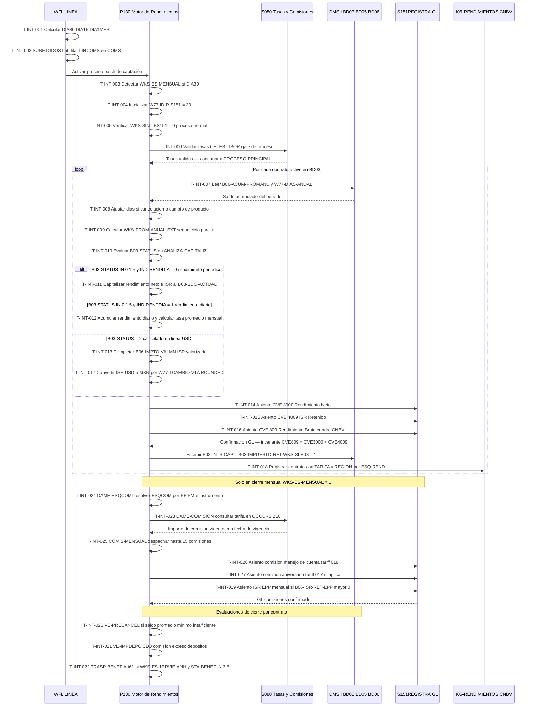

# Capacidad: Interest & Fees (6.1.5) [S500]
> Dominio: 6 · Common Services · Subdominio: Financial Services · Cobertura: S500
> Programas principales: S500/P130 · WFL LINEA · Reglas vinculadas: RN-S500-079..107

---

## Contexto funcional

La capacidad **Interest & Fees (6.1.5)** es el núcleo del cierre de captación del sistema S500 en Unisys ClearPath MCP. Agrupa todas las operaciones que determinan, calculan, retienen y contabilizan los rendimientos e ISR de las cuentas de cheque activas de Banamex, así como el cobro de comisiones ordinarias y de vigencia (manejo de cuenta, aniversario, exceso de depósitos). El proceso es disparado diariamente por el orquestador online **WFL LINEA** (`S500/WFL/LINEA/24MTP005`, 1,961 LOC, autor L. Marín, noviembre 1991), que calcula los flags de calendario del día (DIA30 — último día hábil del mes, DIA15 — quincenal, DIA1MES — primer día hábil) y habilita en el Communication Management System (COMS) de Unisys todos los programas de línea de captación. El motor de cálculo es el programa **P130** (31,762 LOC, autor J. L. Ibarra Lara, JUNIO/1995), que recorre el universo de contratos activos en DMSII BD03 y, para cada uno: (a) calcula el saldo promedio anual real (`WKS-PROM-ANUAL`) usando el acumulado `B06-ACUM-PROMANU` dividido entre los días del año (`W77-DIAS-ANUAL`); (b) determina si aplica rendimiento al vencimiento del ciclo (IND-RENDDIA=0) o diario (IND-RENDDIA=1) consultando la tabla de instrumentos BD05; (c) calcula el rendimiento neto y el ISR retenido mediante la librería CAPITALIZA; (d) genera tres asientos contables hacia S151 vía S151REGISTRA — CVE 3000 (rendimiento neto), CVE 4009 (ISR retenido) y CVE 809 (rendimiento bruto como partida de cuadre para reportes CNBV Serie R-04); y (e) en el cierre mensual (WKS-ES-MENSUAL=1, activado cuando DIA30=TRUE) despacha hasta 15 tipos de comisiones por contrato mediante el módulo COMIS-MENSUAL. El proceso también ejecuta lógica de cancelación automática por saldo promedio mínimo insuficiente (Art. 96 CONDUSEF, regla RN-S500-096) y traspaso forzado a cuenta de beneficencia por inactividad prolongada (Art. 61 CUB, regla RN-S500-098). Los reportes regulatorios Serie R CNBV se alimentan del archivo de salida I05-RENDIMIENTOS, clasificado por esquema de rendimiento (ESQ-REND: 0=estándar, 1=bracketing, 2=curvas, 3=grupos). Toda la lógica de comisiones recupera tarifas en tiempo real del catálogo centralizado S080 vía la interfaz DAME-COMISION (OCCURS 210 esquemas, indexados por tipo de persona PF/PM e instrumento).

---

## Inventario de Tareas

| ID | Tarea | Programa | Componente fuente | Tipo |
|----|-------|----------|-------------------|------|
| T-INT-001 | Calcular flags de calendario del día (DIA30 / DIA15 / DIA1MES) | WFL LINEA | S500_WFL_LOTE.txt | control |
| T-INT-002 | Habilitar LINCOMS y programas online en COMS (SUBETODOS) | WFL LINEA | S500_WFL_LOTE.txt | control |
| T-INT-003 | Detectar modo de proceso mensual (WKS-ES-MENSUAL = 0/1) | P130 | S500_SOURCE_P130.txt | control |
| T-INT-004 | Inicializar identificador de asiento GL hacia S151 (W77-ID-P-S151 = 30/31/32) | P130 | S500_SOURCE_P130.txt | control |
| T-INT-005 | Controlar bypass de emergencia de librería S151 (WKS-SIN-LBS151) | P130 | S500_SOURCE_P130.txt | control |
| T-INT-006 | Validar tasas CETES/LIBOR como gate de proceso (VAL-CETES-LIBOR) | P130 | S500_SOURCE_P130.txt | validación |
| T-INT-007 | Calcular saldo promedio anual por contrato (WKS-PROM-ANUAL) | P130 | S500_SOURCE_P130.txt | consulta |
| T-INT-008 | Ajustar días del período por cancelación o cambio de producto (-1 día) | P130 | S500_SOURCE_P130.txt | validación |
| T-INT-009 | Calcular saldo promedio extendido para ciclos parciales (WKS-PROM-ANUAL-EXT) | P130 | S500_SOURCE_P130.txt | consulta |
| T-INT-010 | Evaluar capitalización por estado del contrato (50116000-ANALIZA-CAPITALIZ) | P130 | S500_SOURCE_P130.txt | control |
| T-INT-011 | Capitalizar rendimiento periódico al vencimiento del ciclo (IND-RENDDIA = 0) | P130 | S500_SOURCE_P130.txt | escritura |
| T-INT-012 | Acumular rendimiento diario y calcular tasa promedio en cierre mensual (IND-RENDDIA = 1) | P130 | S500_SOURCE_P130.txt | escritura |
| T-INT-013 | Completar ISR valorizado de cancelación en línea USD (B06-IMPTO-VALMN · P010→P130) | P130 | S500_SOURCE_P130.txt | escritura |
| T-INT-014 | Generar asiento GL rendimiento neto hacia S151 (CVE-COMUN 3000) | P130 | S500_SOURCE_P130.txt | contable |
| T-INT-015 | Generar asiento GL ISR retenido hacia S151 (CVE-COMUN 4009) | P130 | S500_SOURCE_P130.txt | contable |
| T-INT-016 | Generar asiento GL rendimiento bruto hacia S151 (CVE-COMUN 809) | P130 | S500_SOURCE_P130.txt | contable |
| T-INT-017 | Convertir rendimientos e ISR USD a MXN para asientos GL (W77-TCAMBIO-VTA · ROUNDED) | P130 | S500_SOURCE_P130.txt | contable |
| T-INT-018 | Clasificar contrato en archivo de rendimientos I05 por esquema ESQ-REND (TARIFA + REGION) | P130 | S500_SOURCE_P130.txt | escritura |
| T-INT-019 | Registrar ISR de plan de ahorro EPP en cierre mensual (50120000-SALIDA-IMPUESTO) | P130 | S500_SOURCE_P130.txt | contable |
| T-INT-020 | Evaluar pre-cancelación por saldo promedio mínimo insuficiente (50116650-VE-PRECANCEL) | P130 | S500_SOURCE_P130.txt | control |
| T-INT-021 | Cobrar comisión por exceso de depósitos en el ciclo (50116660-VE-IMPDEPCICLO) | P130 | S500_SOURCE_P130.txt | contable |
| T-INT-022 | Ejecutar traspaso automático a cuenta de beneficencia Art. 61 CUB (50113600-TRASP-BENEF) | P130 | S500_SOURCE_P130.txt | control |
| T-INT-023 | Consultar comisión aplicable en catálogo S080 (DAME-COMISION) | P130 | S500_SOURCE_P130.txt | consulta |
| T-INT-024 | Resolver esquema de comisión por tipo de persona PF/PM (20530130-DAME-ESQCOMI) | P130 | S500_SOURCE_P130.txt | consulta |
| T-INT-025 | Despachar hasta 15 comisiones mensuales por contrato (20530000-COMIS-MENSUAL) | P130 | S500_SOURCE_P130.txt | control |
| T-INT-026 | Cobrar comisión de manejo de cuenta con exención por SBC o nómina (tariff #018) | P130 | S500_SOURCE_P130.txt | contable |
| T-INT-027 | Cobrar comisión de aniversario en fecha de vencimiento anual (tariff #017 · slot 4) | P130 | S500_SOURCE_P130.txt | contable |
| T-INT-028 | Activar condicionalmente programas Telethon P045/P046 por archivo de control DMSII | WFL LINEA | S500_WFL_LOTE.txt | control |

---

## Casuísticas

### CS-INT-01: Cálculo exitoso de rendimiento periódico con ISR y asientos GL

**Tipo:** happy-path
**Condición de entrada:** Contrato activo (B03-STATUS=0) en MXN (B03-MONEDA=1), instrumento de rendimiento periódico (TB-B05-IND-RENDDIA=0) con pago en capitalización (TB-B05-PGOREND=1), día de vencimiento del ciclo (W77-HOY-CORTA>0), saldo promedio anual positivo (B06-ACUM-PROMANU>0), tasas CETES/LIBOR cargadas correctamente en S080. Proceso normal sin bypass (WKS-SIN-LBS151=0).
**Resultado:** `B03-INTS-CAPIT` y `B03-IMPUESTO-RET` actualizados en BD03 (WKS-SI-B03=1); tres asientos en S151 vía S151REGISTRA (CVE 3000 rendimiento neto + CVE 4009 ISR retenido + CVE 809 rendimiento bruto como cuadre CNBV); contrato registrado en I05-RENDIMIENTOS con TARIFA y REGION según ESQ-REND; `W77-HAY-PAGO-REND=1`. Invariante: CVE 809 = CVE 3000 + CVE 4009.
**Secuencia:** T-INT-001 → T-INT-002 → T-INT-003 → T-INT-004 → T-INT-006 → T-INT-007 → T-INT-008 → T-INT-009 → T-INT-010 → T-INT-011 → T-INT-014 → T-INT-015 → T-INT-016 → T-INT-018

---

### CS-INT-02: Contrato sin saldo promedio — sin rendimiento ni asientos GL

**Tipo:** error
**Condición de entrada:** Contrato activo (B03-STATUS=0) cuyo saldo diario acumulado es cero para todo el período (`B06-ACUM-PROMANU=0` o `W77-DIAS-ANUAL=0`), o bien marcado como contrato sin rendimiento (`WS-CAP-SINRENDI=1`). No hay base de cálculo para rendimiento.
**Resultado:** `WKS-PROM-ANUAL=0` por la protección `IF W77-DIAS-ANUAL > 0`; `WS-CAP-RENDNETO=0`; no se generan asientos GL (CVE 3000/4009/809); I05-RENDIMIENTOS registra el contrato con RENDNETO=0 y TARIFA según ESQ-REND (registro obligatorio CNBV aun sin rendimiento). `B03-INTS-CAPIT` permanece sin cambios. El contrato continúa activo sin penalización.
**Secuencia:** T-INT-001 → T-INT-003 → T-INT-004 → T-INT-006 → T-INT-007 → T-INT-008 → T-INT-009 → T-INT-010 → (sin T-INT-011 — SINRENDI=1 o RENDNETO=0) → T-INT-018

---

### CS-INT-03: Retención ISR — esquema diferenciado Persona Física vs Persona Moral

**Tipo:** edge-case
**Condición de entrada:** Dos contratos idénticos en saldo promedio e instrumento: uno PF (`WS-IND-PERS=1`) y uno PM (`WS-IND-PERS=2`). Cierre mensual (WKS-ES-MENSUAL=1). Ambos tienen comisiones configuradas en slots 1..15 de BD05.
**Resultado:** Para cada contrato, `DAME-ESQCOMI` retorna un ESQCOM diferente según tipo de persona; `DAME-COMISION` consulta S080 en el slot OCCURS 210 correspondiente y retorna importe de comisión distinto para PF y PM. El ISR retenido (Art. 54 SAT) se calcula por la librería CAPITALIZA sobre la tasa bruta — la diferencia de importe de comisión entre PF y PM genera asientos GL distintos (CVE 4009) aunque el rendimiento base sea idéntico. Error en clasificación `WS-IND-PERS` → comisión incorrecta → exposición CONDUSEF directa (infracción BEF).
**Secuencia:** T-INT-003 → T-INT-006 → T-INT-007 → T-INT-009 → T-INT-010 → T-INT-011 → T-INT-014 → T-INT-015 → T-INT-016 → T-INT-024 → T-INT-023 → T-INT-025 → T-INT-026

---

### CS-INT-04: Cancelación en línea de cuenta USD — compensación ISR valorizado (P010 → P130)

**Tipo:** edge-case
**Condición de entrada:** Contrato USD (B03-MONEDA=5) cancelado hoy en tiempo real por el gateway P010 (B03-STATUS=2, `B06-FEC-CANCEL=WKS-FEC-BASE`). P010 deja B03-STATUS=2 pero no acumula `B06-IMPTO-VALMN` para cuentas USD. P130 detecta la omisión y la completa.
**Resultado:** P130 calcula `W77-VAL-PUENTE ROUNDED = B03-IMPUESTO-RET × W77-TCAMBIO-VTA` y acumula en `B06-IMPTO-VALMN`; el campo queda cuadrado para reportes CNBV Serie B y DIOT SAT (Art. 54). Sin esta compensación, la contabilidad MXN del ISR USD quedaría truncada. La cláusula `ROUNDED` en COBOL aplica half-up — desviación del redondeo en el target genera diferencias centavo a centavo en el reporte regulatorio.
**Secuencia:** T-INT-001 → T-INT-003 → T-INT-004 → T-INT-006 → T-INT-010 → T-INT-013 → T-INT-017 → T-INT-015

---

### CS-INT-05: Cierre mensual con rendimiento diario, EPP y comisiones (IND-RENDDIA = 1)

**Tipo:** edge-case
**Condición de entrada:** Último día hábil del mes (DIA30=TRUE, WKS-ES-MENSUAL=1), contrato activo con instrumento de rendimiento diario (TB-B05-IND-RENDDIA=1), plan EPP con ISR acumulado (`B06-ISR-RET-EPP>0`), comisiones mensuales en slots 1..15 de BD05 incluyendo comisión de manejo (tariff #018) y posiblemente aniversario (tariff #017 si corresponde la fecha).
**Resultado:** (1) Acumulación diaria de rendimiento ya efectuada en días previos; en este día se calcula la tasa promedio mensual: `B03-TASA-ANTERIOR = B03-INTS-CAPIT / W77-SDOPROM-RENDIA × 36000 / B06-DIAPAG-RENDIA`; (2) ISR EPP liberado a S151 (50120000-SALIDA-IMPUESTO); (3) hasta 15 comisiones despachadas vía COMIS-MENSUAL con asientos GL separados por comisión; (4) si SBC >= WS-SDO-MANEJO o es cuenta nómina, comisión de manejo = 0; (5) campos IPAB (`B03-ISRDIA-IPAB`, `B06-SDOPROM-IPAB`) actualizados para reporte al Instituto de Protección al Ahorro Bancario. Factor 36000 hardcoded en COMPUTE es el principal riesgo de migración de este escenario.
**Secuencia:** T-INT-001 → T-INT-003 → T-INT-004 → T-INT-006 → T-INT-007 → T-INT-009 → T-INT-010 → T-INT-012 → T-INT-014 → T-INT-015 → T-INT-016 → T-INT-019 → T-INT-024 → T-INT-023 → T-INT-025 → T-INT-026

---

## Diagrama

---

## Reglas vinculadas

| Tarea | Regla | Componente fuente | Descripción |
|-------|-------|-------------------|-------------|
| T-INT-001 | RN-S500-104 | S500_WFL_LOTE.txt | Detección del último día hábil del mes (DIA30) comparando IFECHAPROX MOD 100 = 1 |
| T-INT-001 | RN-S500-105 | S500_WFL_LOTE.txt | Detección del quincenal (DIA15) — activa también cuando DIA30 es TRUE |
| T-INT-002 | RN-S500-107 | S500_WFL_LOTE.txt | Secuencia de habilitación de LINCOMS al inicio del día (SUBETODOS) |
| T-INT-003 | RN-S500-079 | S500_SOURCE_P130.txt | Detección del modo de proceso mensual: WKS-ES-MENSUAL = 1 si DIA30 |
| T-INT-004 | RN-S500-080 | S500_SOURCE_P130.txt | Inicialización de W77-ID-P-S151 = 30/31/32 para identificar el tipo de asiento en S151 |
| T-INT-005 | RN-S500-081 | S500_SOURCE_P130.txt | Bypass de emergencia de librería S151 (WKS-SIN-LBS151); omite todos los asientos GL |
| T-INT-006 | RN-S500-082 | S500_SOURCE_P130.txt | Validación de tasas CETES/LIBOR como gate de proceso; ABORT si fuera de rango |
| T-INT-007 | RN-S500-083 | S500_SOURCE_P130.txt | Cálculo del saldo promedio anual: WKS-PROM-ANUAL = B06-ACUM-PROMANU / W77-DIAS-ANUAL |
| T-INT-008 | RN-S500-084 | S500_SOURCE_P130.txt | Ajuste de W77-DIAS-ANUAL en -1 si contrato cancelado (B03-STATUS=2) o con cambio de producto |
| T-INT-009 | RN-S500-085 | S500_SOURCE_P130.txt | Saldo promedio extendido WKS-PROM-ANUAL-EXT para contratos con ciclo parcial |
| T-INT-010 | RN-S500-086 | S500_SOURCE_P130.txt | Switch de capitalización 50116000-ANALIZA-CAPITALIZ por B03-STATUS (0/1/5=vigente, 2=cancelado) |
| T-INT-011 | RN-S500-087 | S500_SOURCE_P130.txt | Capitalización periódica: B03-SDO-ACTUAL += WS-CAP-RENDNETO al vencimiento del ciclo |
| T-INT-012 | RN-S500-088 | S500_SOURCE_P130.txt | Acumulación diaria de rendimiento e ISR; tasa promedio = B03-INTS-CAPIT / W77-SDOPROM-RENDIA × 36000 / B06-DIAPAG-RENDIA |
| T-INT-013 | RN-S500-089 | S500_SOURCE_P130.txt | ISR valorizado no acumulado en cancelación en línea USD: compensación P010→P130 en B06-IMPTO-VALMN |
| T-INT-014 | RN-S500-091 | S500_SOURCE_P130.txt | Asiento GL CVE 3000 (rendimiento neto) hacia S151REGISTRA; acumula en WKS-VAL-CGOMN/CGODLS |
| T-INT-015 | RN-S500-092 | S500_SOURCE_P130.txt | Asiento GL CVE 4009 (ISR retenido) hacia S151REGISTRA; 4 líneas GL para cuentas USD (partida doble MXN+USD) |
| T-INT-016 | RN-S500-093 | S500_SOURCE_P130.txt | Asiento GL CVE 809 (rendimiento bruto = neto + ISR) hacia S151REGISTRA; base de reportes Serie R-04 CNBV |
| T-INT-017 | RN-S500-094 | S500_SOURCE_P130.txt | Conversión cambiaria USD→MXN con W77-TCAMBIO-VTA y cláusula ROUNDED (half-up) para asientos GL |
| T-INT-018 | RN-S500-095 | S500_SOURCE_P130.txt | Clasificación de contratos en I05-RENDIMIENTOS (TARIFA 1-7 / REGION) según B03-ESQ-REND |
| T-INT-019 | RN-S500-090 | S500_SOURCE_P130.txt | ISR del plan EPP acumulado en B06-ISR-RET-EPP; liberado a S151 solo en cierre mensual |
| T-INT-020 | RN-S500-096 | S500_SOURCE_P130.txt | Pre-cancelación por saldo promedio mínimo: 50116650-VE-PRECANCEL en día de corte (W77-HOY-CORTA>0) |
| T-INT-021 | RN-S500-097 | S500_SOURCE_P130.txt | Comisión por depósitos excedentes en el ciclo: 50116660-VE-IMPDEPCICLO en día de corte |
| T-INT-022 | RN-S500-098 | S500_SOURCE_P130.txt | Traspaso automático Art. 61 CUB: 50113600-TRASP-BENEF — primer viernes aniversario, MXN, STA-BENEF IN 3 8 |
| T-INT-023 | RN-S500-099 | S500_SOURCE_P130.txt | Consulta central de comisión vía DAME-COMISION en S080 (OCCURS 210 esquemas) |
| T-INT-024 | RN-S500-103 | S500_SOURCE_P130.txt | Resolución de esquema de comisión PF (WS-IND-PERS=1) vs PM (WS-IND-PERS=2) — DAME-ESQCOMI |
| T-INT-025 | RN-S500-100 | S500_SOURCE_P130.txt | Despachador de hasta 15 comisiones mensuales por contrato (COMIS-MENSUAL); mayor riesgo CONDUSEF de P130 |
| T-INT-026 | RN-S500-101 | S500_SOURCE_P130.txt | Comisión de manejo de cuenta con exención por SBC o por cuenta nómina (Circular Banxico) |
| T-INT-027 | RN-S500-102 | S500_SOURCE_P130.txt | Comisión de aniversario (tariff #017, slot 4 de BD05); requiere notificación CONDUSEF 30 días antes |
| T-INT-028 | RN-S500-106 | S500_WFL_LOTE.txt | Activación condicional de P045/P046 Telethon por presencia del archivo S500BD06TELETON/CONTROL en DMSII |

---

## Hallazgos de migración críticos

| Riesgo | Tarea | Severidad | Acción requerida |
|--------|-------|-----------|-----------------|
| Factor 36000 hardcoded como base de anualización (360 días × 100%). Si regulación Banxico/CNBV cambia a base 365 días, se requiere modificación en múltiples COMPUTEs de P130, P142 y P144. | T-INT-012 | 🟠 CRÍTICO | Parametrizar la base de días (360/365/366) en archivo de configuración externo. Implementar prueba de regresión que valide la tasa promedio mensual resultante contra el legado para el mismo período. |
| Cláusula `ROUNDED` en conversiones FX (USD→MXN). COBOL aplica half-up; Java usa `HALF_EVEN` por defecto. Desviación genera diferencias centavo a centavo en reportes CNBV y DIOT SAT acumuladas sobre miles de contratos. | T-INT-017 | 🟠 CRÍTICO | Documentar y validar `RoundingMode.HALF_UP` en cada lenguaje target. Implementar prueba de equivalencia numérica con datos reales de P130 antes del cutover. |
| LIBOR como tasa de referencia en contratos vigentes — riesgo regulatorio post-2021. El archivo I07-TASASTARIF83 contiene tasas históricas que mezclan rangos legítimos con valores LIBOR en contratos legacy USD. | T-INT-006 | 🟠 CRÍTICO | Inventariar contratos USD vigentes con cláusula LIBOR. Coordinar con Legal/Riesgos la sustitución por SOFR u tasa sustituta antes de la migración. Actualizar la rutina VAL-CETES-LIBOR para validar contra la nueva tasa de referencia. |
| `WKS-SIN-LBS151 = 1` (bypass GL de emergencia) omite todos los asientos en S151 sin mecanismo de replay. El GL queda sin movimientos de rendimientos; la reconciliación es 100% manual. | T-INT-005 | 🟠 CRÍTICO | Implementar circuit-breaker con cola de eventos (Kafka / SQS) y replay automático de asientos GL. El target no debe permitir pérdida de asientos bajo ninguna condición operativa. |
| OCCURS 210 en S080 (indexado por ESQCOM). Hardcode estructural: ampliar más de 210 esquemas de comisión requiere recompilación de P130 y modificación del catálogo S080. | T-INT-023, T-INT-024 | 🟡 ALTO | Migrar el catálogo S080 a base de datos relacional o API con paginación. Eliminar el límite de 210 esquemas como restricción del runtime en el sistema target. |
| Archivo DMSII `S500BD06TELETON/CONTROL` como feature flag de campaña. Sin mecanismo moderno equivalente; riesgo de P045/P046 activos fuera del período de campaña si el archivo no se elimina. | T-INT-028 | 🟡 ALTO | Sustituir por feature flag gestionado (LaunchDarkly, AWS AppConfig, GCP Feature Flags) con TTL automático. Documentar el ciclo de vida de activación/desactivación en el runbook operativo. |
| Slot `(inst, 4)` en BD05 como convención implícita para comisión de aniversario. No está documentado en el catálogo de instrumentos; cualquier migración del catálogo BD05 puede romper la asignación. | T-INT-027 | 🟡 ALTO | Documentar el mapeo de todos los slots 1-15 de TB-B05-CVECOMI en el catálogo de instrumentos del target. Validar con SME que slot 4 es exclusivo para aniversario en todos los instrumentos activos. |
| Contador `B03-MES-PROM-MIN` y `B03-MES-ABO-EXCE` acumulados en BD03 como estado persistente. Una migración sin traspaso de estos contadores reinicia el conteo — contratos cercanos al límite de cancelación pueden no ser cancelados en tiempo. | T-INT-020, T-INT-021 | 🟡 ALTO | Migrar el estado de los contadores al sistema target en el cutover. Definir política de reconciliación post-migración y periodo de observación supervisado. |
| S151REGISTRA1 está comentada con `*$SET S151REGISTRA S151REGISTRA1`. Existe una tercera variante de librería GL que no está activa pero cuyo mecanismo de `$SET` puede reactivarse accidentalmente en compilación. | T-INT-004 | 🟢 BAJO | Documentar las tres variantes (S151REGISTRA, S151REGISTRA2, S151REGISTRA1-inactiva) en el ADR de integración GL. Eliminar la variante comentada en el sistema target o convertirla en configuración explícita. |

---

---

## Capacidad adicional: 6.6.1 Financial Servicing (merge)

> BIAN: 6.6.1 · Financial Servicing · incorporado en cap-int.md por volumen reducido de reglas
> Sistemas: S500 · Programas: P142

### Contexto funcional

La capacidad **Financial Servicing (6.6.1)** cubre los servicios financieros directos prestados al cliente en el contexto de contratos de captación a plazo (inversiones, pagarés) e instrumentos derivados. En S500, esta capacidad se materializa en el programa **P142** (extracción BD07→Teradata) mediante dos responsabilidades: (a) la comunicación de fechas de vencimiento y plazos de instrumentos al libro mayor S151 vía la estructura `WS-S151-0101`, garantizando que el GL refleje correctamente el calendario de vencimientos de captación; y (b) la interfaz compilada condicionalmente con la librería **S272LIBORDES**, diseñada para gestionar instrumentos derivados referenciados a LIBOR. Esta segunda responsabilidad está técnicamente inactiva desde la descontinuación del benchmark LIBOR en 2023 (sustituido por SOFR en USD y TIIE en MXN), aunque el código permanece en el fuente sin eliminación formal, lo que constituye deuda técnica con impacto regulatorio potencial.

### Reglas vinculadas — 6.6.1 Financial Servicing

| Tarea | Regla | Componente fuente | Descripción |
|-------|-------|-------------------|-------------|
| Comunicar fecha de vencimiento y plazo de inversión/pagaré al GL S151 | RN-S500-135 | P142 | Estructura S151-0101 con `WS-S151-0101-FECVENCIMIENTO` (PIC 9(08) COMP) y `WS-S151-0101-PLAZO` (PIC 9(04) COMP); FECVENCIMIENTO va exclusivamente a S151, no a Teradata |
| Invocar S272LIBORDES para instrumentos derivados basados en LIBOR | RN-S500-133 | P142 | Interfaz compilada condicionalmente (`$SET OMIT = NOT S272LIBORDES`); NIVEL=02, NIPENT=04, PRODUCTO=00000001, TIPELE=06; archivo de control S067REMESAS; inactiva post-2023 pero sin eliminación formal |

### Hallazgos de migración

| Riesgo | Regla | Severidad | Acción requerida |
|--------|-------|-----------|-----------------|
| **LIBOR descontinuado — código activo en compilación condicional.** S272LIBORDES puede reactivarse si el flag `S272LIBORDES` se incluye en la compilación. Si el banco mantiene contratos legacy USD referenciados a LIBOR, la librería puede estar activa en producción sin evidencia explícita en el código mainline. | RN-S500-133 | 🟠 CRÍTICO | Verificar con el equipo de Mercados Financieros y Legal si existen contratos vigentes con cláusula LIBOR. Inventariar todos los registros en S067REMESAS. Coordinar la sustitución de LIBOR→SOFR/TIIE antes del cutover. En el sistema target, prohibir referencias a LIBOR y forzar el uso de tasa sustituta configurada externamente. |
| **FECVENCIMIENTO se pasa a S151 pero NO a Teradata (CTOREP).** La separación de destinos es intencional en el legado; el sistema target debe preservar esta separación. Una migración que consolide ambos flujos puede introducir datos de vencimiento no autorizados en el data warehouse, con impacto en reportes CNBV. | RN-S500-135 | 🟡 ALTO | Documentar explícitamente en el ADR de integración que `FECVENCIMIENTO` y `PLAZO` son campos de GL exclusivo. Validar en pruebas de equivalencia que el campo no aparece en el registro CTOREP exportado a Teradata. |

---

*cap-int.md · v1.0 · 2026-07-16 · Capa 4 (Inventario de Tareas) + Capa 5 (Casuísticas + Diagrama Mermaid)*
*Capacidad: 6.1.5 Interest & Fees · Sistema: S500 · Programas: S500/P130 · WFL LINEA*
*Cross-referencia: RN-S500-079..107 · rules-catalog/rules-s500-p130.md · capability-map.md*

---

## Ampliación — P150 Interfaz CITI ALR/AHR/OCM S151 (RN-S151-151..180)

> P150 genera los archivos de integración Citibank (ALR/AHR/OCM) desde el pipeline S151.
> BRANCH=484 hardcodeado en ≥5 campos — punto crítico para separación Banamex/Citi.
> Autor: Ing. Javier Mercado Flores · Frecuencia: cierre-diario · Upstream: MOVCONTABLES (output P108) · Downstream: ALR · AHR · OCM → CITI intercompany · CNBV B-0111B

### Inventario de Tareas

| ID | Nombre | Programa | Tipo | Complejidad | Riesgo migración |
|----|--------|----------|------|-------------|------------------|
| T-INT-P150-001 | Inicializar acumuladores, BRANCH=484 y fecha (10000-INICIA-P150) | P150 | control | MEDIA | CRÍTICA |
| T-INT-P150-002 | Cargar parámetros (umbrales ALR, rangos OCM, WKS-CVE-AHR) y abrir archivos (11000-LEE-PARAMETROS-P150) | P150 | control | MEDIA | ALTA |
| T-INT-P150-003 | Verificar dependencia P108→MOVCONTABLES (fecha proceso = fecha MOVCONTABLES) | P150 | validación | BAJA | ALTA |
| T-INT-P150-004 | Generar header H del ALR con BRANCH=484 y SECUENCIA (20000-GENERA-ALR) | P150 | escritura | BAJA | CRÍTICA |
| T-INT-P150-005 | Generar registros D de detalle ALR por cuenta desde ARCH-SALDOS (21000-GENERA-DETALLE-ALR) | P150 | escritura | ALTA | ALTA |
| T-INT-P150-006 | Acumular y escribir subtotales S por BRANCH/MONEDA (22000-CORTE-ALR) | P150 | calculo | MEDIA | MEDIA |
| T-INT-P150-007 | Cerrar ALR con trailer T (CNT-DET + HASH saldos) y evidencia en BITACORA-P150 (29000-CIERRA-ALR) | P150 | control | BAJA | ALTA |
| T-INT-P150-008 | Generar header H del AHR con BRANCH=484 (30000-GENERA-AHR) | P150 | escritura | BAJA | CRÍTICA |
| T-INT-P150-009 | Filtrar movimientos por WKS-CVE-AHR y escribir detalle D en AHR (31000-GENERA-DETALLE-AHR) | P150 | escritura | ALTA | ALTA |
| T-INT-P150-010 | Acumular totales AHR cargo/abono y cerrar con trailer T (39000-CIERRA-AHR) | P150 | calculo | BAJA | MEDIA |
| T-INT-P150-011 | Generar header H del OCM (BRANCH=484, TIPO-CART) (40000-GENERA-OCM) | P150 | escritura | BAJA | CRÍTICA |
| T-INT-P150-012 | Clasificar saldo vencido por antigüedad en buckets B1/B2/B3/B4 con CRONOS 2000 (41000-GENERA-DETALLE-OCM) | P150 | calculo | ALTA | ALTA |
| T-INT-P150-013 | Escribir subtotales S por bucket de antigüedad (42000-SUBTOTAL-OCM) | P150 | calculo | MEDIA | MEDIA |
| T-INT-P150-014 | Cerrar OCM con reconciliación de suma-buckets vs trailer (49000-CIERRA-OCM) | P150 | control | BAJA | MEDIA |
| T-INT-P150-015 | Ejecutar cuadre de interface: ALR-HASH vs (SALDO-INI + AHR-ABO - AHR-CAR) (50000-CIERRA-P150) | P150 | validación | ALTA | CRÍTICA |
| T-INT-P150-016 | Generar BATCH-HEADER como señal de completitud del lote CITI (conteos ALR+AHR+OCM) | P150 | escritura | BAJA | ALTA |
| T-INT-P150-017 | Derivar movimientos AHR a archivo regulatorio B0111B CNBV (paralelo a 31000) | P150 | escritura | MEDIA | ALTA |
| T-INT-P150-018 | Registrar rechazos de validación (RECHAZOS-P150) y bitácora por fase (BITACORA-P150) | P150 | auditoria | BAJA | MEDIA |

### Reglas de negocio vinculadas

| ID regla | Enunciado breve | Programa | Criticidad |
|----------|----------------|----------|------------|
| RN-S151-151 | Orquestación en 5 fases secuenciales (INICIA → PARAMETROS → ALR → AHR → OCM → CIERRA) | P150 | ALTA |
| RN-S151-152 | BRANCH=484 hardcodeado en Working-Storage — propagado a todos los registros ALR/AHR/OCM | P150 | CRÍTICA |
| RN-S151-153 | CRONOS 2000 (A2K-BASE-YEAR=50) en todos los campos de fecha ALR/AHR/OCM | P150 | ALTA |
| RN-S151-154 | Carga de umbrales ALR, WKS-CVE-AHR y rangos OCM desde ARCH-PARAMETROS-P150 | P150 | ALTA |
| RN-S151-155 | ALR — estructura H/D/T con hash de control (suma saldos de cierre) | P150 | ALTA |
| RN-S151-156 | ALR — detalle D por cuenta: saldo-ini + abonos - cargos = saldo-fin; filtro por umbral | P150 | ALTA |
| RN-S151-157 | ALR — subtotal S por BRANCH/MONEDA; con BRANCH=484 único grupo por moneda | P150 | MEDIA |
| RN-S151-158 | AHR — estructura H/D/T con totales cargo/abono y conteo independiente de ALR | P150 | ALTA |
| RN-S151-159 | AHR — filtro WKS-CVE-AHR(CVETRAN)=1 antes de escribir cada registro D | P150 | ALTA |
| RN-S151-160 | AHR — acumulación cargo/abono por moneda; totales en trailer T | P150 | ALTA |
| RN-S151-161 | OCM — estructura H/D/S/T; TIPO-CART distingue producto (CK=cheques) | P150 | ALTA |
| RN-S151-162 | OCM — bucket B1(≤30d)/B2(≤60d)/B3(≤90d)/B4(>90d) calculado con CRONOS 2000 | P150 | ALTA |
| RN-S151-163 | OCM — subtotales S por bucket; trailer T = suma B1+B2+B3+B4 | P150 | ALTA |
| RN-S151-164 | BATCH-HEADER — envoltorio de lote con conteos ALR+AHR+OCM y NUM-LOTE | P150 | ALTA |
| RN-S151-165 | Validación de campos obligatorios: CTA≠ZEROS (ALR), IMPORTE≠ZEROS (AHR), SALDO-VCT>0 (OCM) | P150 | ALTA |
| RN-S151-166 | Control de secuencia WS-*-SEQ por registro D — gaps detectados por CITI | P150 | ALTA |
| RN-S151-167 | Derivación a B0111B CNBV — movimientos AHR donde WKS-CVE-CNBV(CVETRAN)=1; conversión a MXN | P150 | MEDIA |
| RN-S151-168 | RECHAZOS-P150 — registro de registros descartados (E1/E2/E3); WS-CNT-RJ-P150 > 0 no aborta | P150 | ALTA |
| RN-S151-169 | BITACORA-P150 — log operativo por fase (timestamp + resultado OK/ERROR) | P150 | MEDIA |
| RN-S151-170 | Cuadre de interface: ALR-HASH vs (SALDO-INI-TOT + AHR-ABO - AHR-CAR); no aborta en descuadre | P150 | CRÍTICA |
| RN-S151-171 | Integridad MOVCONTABLES: LEIDOS = AHR-escritos + rechazados + excluidos | P150 | ALTA |
| RN-S151-172 | Cierre coordinado: ALR→AHR→OCM→B0111B→RECHAZOS→BATCH-HEADER→BITACORA | P150 | ALTA |
| RN-S151-173 | 10000-INICIA-P150: init a ZEROS + BRANCH=484 hardcoded + fecha de SYSIN | P150 | CRÍTICA |
| RN-S151-174 | Dependencia P108→P150: P150 solo corre tras RETURN-CODE=0 de P108 | P150 | ALTA |
| RN-S151-175 | Protocolo de re-ejecución manual: borrado de archivos parciales antes de reiniciar | P150 | MEDIA |
| RN-S151-176 | Conversión USD→MXN con TC Banxico FIX del día (ARCH-TC); fallback a TC anterior | P150 | MEDIA |
| RN-S151-177 | Ventana de transmisión CITI (antes 09:00 hrs día hábil siguiente) — controlada por WFL | P150 | MEDIA |
| RN-S151-178 | OCM — 49000-CIERRA-OCM: reconciliación suma-buckets vs gran total; WARN en diferencia | P150 | ALTA |
| RN-S151-179 | ALR — 29000-CIERRA-ALR: trailer T + verificación RALR-STATUS + entrada en BITACORA-P150 | P150 | ALTA |
| RN-S151-180 | Transmisión a CITI vía SFT/SFTP post-RETURN-CODE=0; acuse de recibo confirma recepción, no validez | P150 | MEDIA |

### Hallazgos de migración P150

| # | Hallazgo | Tipo | Impacto | Recomendación |
|---|---------|------|---------|---------------|
| INT-P150-H01 | BRANCH=484 hardcodeado en Working-Storage y ≥5 MOVEs — quiebre inmediato post-separación Banamex/Citi | Configuración | CRITICAL | Parametrizar desde SYSIN o tabla de configuración con efectividad de fecha; buscar "484" case-sensitive en todo el fuente antes del cutover |
| INT-P150-H02 | Cuadre de interface no aborta en descuadre — archivos se transmiten a CITI con inconsistencia | Observabilidad | HIGH | Implementar bloqueo de transmisión si WS-DIFF-IFACE supera umbral configurable; convertir aviso de bitácora en alerta automática |
| INT-P150-H03 | Protocolo de re-ejecución 100% manual — sin checkpoint/restart; riesgo de CURRENT-NO duplicado en CITI | Operaciones | HIGH | Implementar idempotencia por fase (ALR/AHR/OCM independientes y re-ejecutables); delegar numeración secuencial al sistema de transmisión |
| INT-P150-H04 | RECHAZOS-P150 > 0 no aborta ni alerta automáticamente — transmisión con omisiones silenciosas | Observabilidad | HIGH | Bloquear transmisión si WS-CNT-RJ-P150 supera umbral; generar alerta automática observable |
| INT-P150-H05 | CRONOS 2000 en fechas de vencimiento OCM — error desplaza cartera entre buckets de antigüedad | Datos | HIGH | Expandir todas las fechas de 2 dígitos a 4 con pivote=50 en migración de datos; validar buckets OCM contra expectativa de cartera |
| INT-P150-H06 | TC Banxico usa ARCH-TC con fallback al día anterior — comportamiento no validado con CNBV ni CITI | Regulatorio | MEDIUM | Definir con CITI y CNBV el comportamiento aceptable cuando ARCH-TC no está disponible; reemplazar por servicio TC con retención del FIX |
| INT-P150-H07 | SFT/SFTP como protocolo de transmisión sin autenticación mutual visible en código | Seguridad | MEDIUM | Reemplazar por API REST CITI con mTLS y webhook de confirmación de recepción |

---

## Ampliación — P151 Transformador IBM-Citibank ALR/AHR/OCM (RN-S151-331..360)

> P151 convierte movimientos S151 del día en ALR/AHR/OCM para IBM-Citibank via FTP (WFL P940).
> W77-SISTEMA-PARAMETRO distingue captación (500) de pagos (701).
> Autor: ING. JAVIER MERCADO FLORES · Mismo autor que P150 · Frecuencia: cierre-diario

### Inventario de Tareas

| ID | Nombre | Programa | Tipo | Complejidad | Riesgo migración |
|----|--------|----------|------|-------------|------------------|
| T-INT-P151-001 | Determinar sistema a procesar por W77-SISTEMA-PARAMETRO (500=captación, 701=pagos) | P151 | control | BAJA | ALTA |
| T-INT-P151-002 | Cargar catálogos BD99 para sistema 500 y sistema 408 (12000-CARGA-CATALOGOS x2) | P151 | consulta | MEDIA | ALTA |
| T-INT-P151-003 | Buscar clave SBC — Sucursal de Bancos Centrales (15000-BUSCA-CVE-SBC) | P151 | consulta | BAJA | MEDIA |
| T-INT-P151-004 | Leer BD10 y llenar sort input MOVIMIENTOSCTD (20000-PROCESA-MOVIMIENTOS) | P151 | consulta | ALTA | ALTA |
| T-INT-P151-005 | Selección de movimientos Citi por IND-SIS y filtros de ruta (30000-SELECCION-MOVIMIENTOS) | P151 | filtro | ALTA | ALTA |
| T-INT-P151-006 | Sort secundario por hora de operación (35000-SORTEA-MOVTOS-HORA) | P151 | ordenamiento | MEDIA | MEDIA |
| T-INT-P151-007 | Enrutar movimientos a ALR/AHR/OCM según IND-SIS, INDCITI y CTACON (41000-GRABA-ARCHIVOS-CITI) | P151 | escritura | ALTA | CRÍTICA |
| T-INT-P151-008 | Mapear referencias a TEXT-LINEs del ALR según SIST-ORIG + CVETRAN (41100-VALIDA-REFERENCIAS-ALR) | P151 | transformación | ALTA | ALTA |
| T-INT-P151-009 | Validar y escribir AHR con campos SAT Anexo 20 (SELLO-DIGIT, RFC, NOM, CVE-RASTREO) | P151 | escritura | ALTA | ALTA |
| T-INT-P151-010 | Clasificar reversiones SPEI en AHR (REVRS-IND, FEC-DEV, CAUSA-DEV) | P151 | escritura | MEDIA | ALTA |
| T-INT-P151-011 | Distribuir ALR/AHR/OCM por región VDM/MTY/UNI (y variantes BNE si W88-HOSTNAME) | P151 | routing | ALTA | ALTA |
| T-INT-P151-012 | Construir OCMIN-TRANS-ID (CODE-SYSTEM-BM + fecha juliana + contador) | P151 | calculo | MEDIA | MEDIA |
| T-INT-P151-013 | Invocar WFL P940 para FTP de ALR/AHR/OCM a IBM (CALL SYSTEM WFL) | P151 | interfaz | BAJA | ALTA |
| T-INT-P151-014 | Gestionar punteo intradiario de saldos en ARCH-SAL indexed por contrato | P151 | calculo | ALTA | ALTA |

### Reglas de negocio vinculadas

| ID regla | Enunciado breve | Programa | Criticidad |
|----------|----------------|----------|------------|
| RN-S151-331 | W77-SISTEMA-PARAMETRO: 500=captación, 701=pagos — controla flujo completo | P151 | ALTA |
| RN-S151-332 | IND-SIS=1→ALR; IND-SIS=1 o 2→AHR; IND-SIS=1+INDCITI=2+CTACON IN(11,61)→OCM | P151 | CRÍTICA |
| RN-S151-333 | Distribución por región VDM/MTY/UNI en archivos separados por SUBNODO | P151 | ALTA |
| RN-S151-334 | Variantes BNE activadas por W88-HOSTNAME (modificación ISILOA) | P151 | ALTA |
| RN-S151-335 | Layout ALRINT-REC: RECORD-TYPE+KEY-GRP(83)+TXN-CODE+DR-CR-IND+TXN-AMT+5×TEXT-LINE(35) | P151 | ALTA |
| RN-S151-336 | ALRINT-CURRENT-NO = W77-CONTADOR-ALR (secuencial P151), NO el AUT-S151 original | P151 | ALTA |
| RN-S151-337 | Formato de signo inconsistente: ALR usa D/C; OCM usa +/-; AHR usa campo separado | P151 | ALTA |
| RN-S151-338 | AHR incluye campos SAT Anexo 20 (SELLO-DIGIT X(400), RFC X(20), NOM X(120), CVE-RASTREO X(30)) | P151 | ALTA |
| RN-S151-339 | Validación SAT: 100-27937-VALIDA-SAT + 100-27938-VAL-DFTPY antes de escribir AHR | P151 | ALTA |
| RN-S151-340 | Reversión SPEI: REVRS-IND≠SPACE activa FEC-DEV/HORA-DEV/CAUSA-DEV en AHR | P151 | ALTA |
| RN-S151-341 | OCM: TRANS-ID = "BM" + fecha_juliana + W77-CONTADOR-OCM; COUNTRY-CODE=485; MESSAGE-TYPE="B" | P151 | ALTA |
| RN-S151-342 | OCM: solo cheque 1 poblado (RMC-IMPORTE); cheques 2-10 en ceros; PAY-AGENT-CODE=485 | P151 | MEDIA |
| RN-S151-343 | Sort SMOVTOS-CITICTD: estructura 60→106 bytes con IND-CD e IND-BN (ISILOA) | P151 | ALTA |
| RN-S151-344 | Flujo sistema 500: CARGA-CATALOGOS(500)+CARGA-CATALOGOS(408)→BUSCA-CVE-SBC→20000→30000→35000→40000 | P151 | ALTA |
| RN-S151-345 | ARCH-SAL indexed RANDOM por KEY-CTO — punteo intradiario de saldos virtuales | P151 | ALTA |
| RN-S151-346 | LOG151-COMP: log complementario RANDOM 540 bytes por W77-LOG-KEY | P151 | MEDIA |
| RN-S151-347 | RFC asimétrico: RM-RFC-ORD(13)→+7 bytes padding; RM-RFC-BENEF(18)→+2 bytes en AHRST X(20) | P151 | ALTA |
| RN-S151-348 | NOM-BENEF ampliado a X(120) por SAT — riesgo de truncamiento si destino < 120 chars | P151 | ALTA |
| RN-S151-349 | NIO X(16) alfanumérico — clave de rastreo SPEI; SPACES indica operación no-SPEI | P151 | ALTA |
| RN-S151-350 | Mapeo de referencias por SIST-ORIG+CVETRAN a TEXT-LINEs ALR (caso 15, 264, 1117, 1133...) | P151 | ALTA |
| RN-S151-351 | RM-TAB-CVES-IMPS OCCURS 5: slot 1=importe principal; slots 2-5=comisiones/IVA adicionales | P151 | ALTA |
| RN-S151-352 | RM-LEYENDAS OCCURS 5×X(40) vs TEXT-LINEs X(35): truncamiento de 5 chars por leyenda | P151 | MEDIA |
| RN-S151-353 | RM-REFERENCIAS OCCURS 5×X(35): mapeo directo sin truncamiento a TEXT-LINEs | P151 | MEDIA |
| RN-S151-354 | RM-FORMATO X(02) selector de versión de layout — pre-SAT vs post-SAT | P151 | MEDIA |
| RN-S151-355 | RM-SALDO S15V99 → AHRST-LDGR-AMT; validado por 41210-VALIDA-SALDO-AHR | P151 | ALTA |
| RN-S151-356 | Densidad de bloque: ALR=100 reg, OCM=50 reg, AHR=45 reg; AREASIZE=3000 en los tres | P151 | MEDIA |
| RN-S151-357 | Naming archivos: "SNNN{ALR/AHR/OCM}/CO/AAMMDD"; FTP via WFL P940 en S006 | P151 | ALTA |
| RN-S151-358 | MOVTOS-VIVOSCTD: movimientos pendientes de envío (HR-REAL + IND-SIS) vs ya transmitidos | P151 | ALTA |
| RN-S151-359 | CVETRANs 730-746 requieren limpieza de importe (MOVE ZEROS TO RMC-IMPORTE) antes de procesar | P151 | MEDIA |
| RN-S151-360 | RM-IND-CONTA X(02): valor ≠ 0 genera asiento en BD11; movimientos IND-CONTA=0 aún van a ALR/AHR | P151 | ALTA |

### Hallazgos de migración P151

| # | Hallazgo | Tipo | Impacto | Recomendación |
|---|---------|------|---------|---------------|
| INT-P151-H01 | BRCH-NBR=485 hardcodeado en registros ALR — quiebre en separación Banamex/Citi (diferente de BRANCH=484 de P150) | Configuración | CRITICAL | Verificar si 485 y 484 son valores distintos por diseño o bug — confirmar con equipo CITI antes del cutover |
| INT-P151-H02 | P940 invocado via CALL SYSTEM WFL — sin detección de error de FTP; archivos pueden quedar en /CO/ sin transmitir | Observabilidad | HIGH | Reemplazar FTP por API REST IBM con confirmación de recepción; instrumentar el job P940 con alerta automática |
| INT-P151-H03 | W77-CONTADOR-ALR como CURRENT-NO roto la trazabilidad: IBM no puede correlacionar con AUT-S151 de BD10 | Trazabilidad | HIGH | Documentar con IBM que CURRENT-NO es relativo al día — no es el identificador universal S151; en modernización usar AUT-S151 como clave de reconciliación |
| INT-P151-H04 | Tres formatos de signo inconsistentes (D/C en ALR, +/- en OCM, campo separado en AHR) — reconciliación entre archivos es ambigua | Datos | HIGH | Normalizar a un único formato de signo en modernización; documentar con IBM la asimetría actual |
| INT-P151-H05 | FILLERXAPL (polimórfico, 165 words, máxima complejidad) y offsets incompatibles R4 vs R5 — layout no es uniforme | Equivalencia | HIGH | Modelar FILLERXAPL como JSON/JSONB con discriminador por sistema; documentar todos los REDEFINES del record layout en vocabulario |
| INT-P151-H06 | NOM-BENEF X(120) — sistemas ASCII estrictos truncan caracteres con acento o ñ | Datos | MEDIUM | Definir encoding explícito UTF-8/ISO-8859-1 en modernización; validar nombre con caracteres especiales en pruebas de equivalencia |

---

## Ampliación — L002R3+R4+R5 ACL GL Interface Multi-canal (RN-S151-633..689) — ALGOL

> ALGOL ClearPath MCP — NO transpilable. Requiere reescritura completa como servicio de plataforma.
> BC-04 Anti-Corruption Layer GL multi-canal, consumida por P015 (intraday) / P016 (nightly) / P025 (recovery).
> Tamaño: L002R3=9,355 LOC · L002R4=7,280 LOC · L002R5=7,414 LOC · Total 10 canales paralelos LOGS[0:9]

### Inventario de Tareas

| ID | Nombre | Programa | Tipo | Complejidad | Riesgo migración |
|----|--------|----------|------|-------------|------------------|
| T-INT-L002-001 | Inicializar 10 canales paralelos LOGS[0:9]/DESS[0:9]/CBII[0:9]/CDIR[0:9] con NIVLOG_A, FEC_DIA y REG_X_BLOCK | L002Rx | arquitectura | ALTA | CRÍTICA |
| T-INT-L002-002 | Validar encabezado al abrir archivo: HFUNCION≠99 Y HFECLOG=FECDIA (doble condición) | L002Rx | validación | ALTA | ALTA |
| T-INT-L002-003 | Búsqueda binaria del centinela FUNCION=99 para localizar write pointer NIVLOG_A[canal] (ARMALOG/ARMADES) | L002Rx | algoritmo | ALTA | CRÍTICA |
| T-INT-L002-004 | GRABALOG (12 parámetros): escribir registro en MOV/DES/CBII/CDIR del canal activo solo si FUNCION=1 | L002Rx | escritura | ALTA | CRÍTICA |
| T-INT-L002-005 | SEPARA_S500: transformar registros TESOFE — CASE de 20 tipos de campo, EBCDICTOHEX, offsets 1951-2212 | L002Rx | transformación | ALTA | CRÍTICA |
| T-INT-L002-006 | ELIMINA: borrado lógico via DFELIMINA (registros marcados, no eliminados físicamente) | L002Rx | escritura | MEDIA | ALTA |
| T-INT-L002-007 | PROC_CONTROL: flush automático al timeout de 30 segundos (canales con REG_X_BLOCK>0 y fecha válida) | L002Rx | control | ALTA | ALTA |
| T-INT-L002-008 | BLOCK_LLENO: flush acumulativo al 20° evento (condición de fecha FECPROC > L002R3 vs FECPROC = L002R4) | L002Rx | control | ALTA | ALTA |
| T-INT-L002-009 | AMBIENTA — fin de día en 7 pasos: halt P015/P016, WAIT(2), CIERRALOG 0..9, validar S151LOTE en CTLVERS | L002Rx | sincronización | ALTA | CRÍTICA |
| T-INT-L002-010 | INICIA_DIA: esperar señal FIN_DIA antes de abrir archivos del nuevo día | L002Rx | sincronización | MEDIA | ALTA |
| T-INT-L002-011 | Enrutar registro al canal correcto por IDFFECCONT (fecha contable) con espera activa CAMBIA_FECHA | L002Rx | routing | ALTA | CRÍTICA |
| T-INT-L002-012 | REBLOCKADE FUNCION=31 — cambio a blocksize 10800 (modo batch sin sync a disco) | L002R4/R5 | rendimiento | MEDIA | ALTA |
| T-INT-L002-013 | REBLOCKADE FUNCION=32 — retorno a blocksize 150, SYNCHRONIZE=OUT (modo transaccional) | L002R4/R5 | rendimiento | MEDIA | ALTA |
| T-INT-L002-014 | PREFINAL (FUNCION=97) — pre-cierre del canal sin sincronización L001 | L002R4/R5 | control | ALTA | ALTA |
| T-INT-L002-015 | FINAL (FUNCION=98) — cierre con CONSISDIA FUNCION=5 (commit final L001), hasta 3 reintentos | L002R4/R5 | control | ALTA | CRÍTICA |
| T-INT-L002-016 | BAJA — apagado ordenado en 7 pasos: CIERRALOG 0..9, DCKEYIN HI-4 a P015/P016/P025, B05PROCESOS FUNCION=22 | L002Rx | control | ALTA | CRÍTICA |
| T-INT-L002-017 | L002R5: lanzar P015/P016 directamente desde CARGAMOV (síncrono con escritura, con rebloqueo previo) | L002R5 | coordinación | ALTA | CRÍTICA |
| T-INT-L002-018 | L002R5: activar P025 cuando TIPPROC>15 Y STATUS_BDSDO<99 Y FECS151 concuerda | L002R5 | coordinación | ALTA | ALTA |

### Reglas de negocio vinculadas

#### L002R3 — Base multi-canal (RN-S151-633..659)

| ID regla | Enunciado breve | Programa | Criticidad |
|----------|----------------|----------|------------|
| RN-S151-633 | 10 canales paralelos: LOGS[0:9], DESS[0:9], CBII[0:9], CDIR[0:9]; NUMDIAC1 = canal activo | L002R3 | CRÍTICA |
| RN-S151-634 | Naming archivo MOV = ARC_MOV + FECDIA(6) + " ON " + PK_MOV — fecha embebida en nombre | L002R3 | ALTA |
| RN-S151-635 | Doble validación al abrir: HFUNCION≠99 (no centinela) Y HFECLOG=FECDIA (fecha correcta) | L002R3 | ALTA |
| RN-S151-636 | Búsqueda binaria del centinela FUNCION=99 para write pointer NIVLOG_A[canal] | L002R3 | CRÍTICA |
| RN-S151-637 | Archivo faltante → mensaje "FALTA ARCHIVO" a consola + ACCEPT (bloqueo hasta intervención operador) | L002R3 | ALTA |
| RN-S151-638 | Timeout 30 segundos: cierra canales con REG_X_BLOCK>0 Y NIVLOG_A>0 Y FEC_DIA>=FEC_PRO_BASE | L002R3 | ALTA |
| RN-S151-639 | BLOCK_LLENO: cierre acumulativo al 20° evento; condición fecha FEC_DIA > FECPROC (mayor-que estricto) | L002R3 | ALTA |
| RN-S151-640 | P016 solo se lanza si HORA < 200000 — ventana operativa restringida antes de 20:00:00 | L002R3 | ALTA |
| RN-S151-641 | AMBIENTA (Evento 7): halt P015+P016, WAIT(2), CIERRALOG 0..9, CLOSE ERRORES1, validar S151LOTE | L002R3 | CRÍTICA |
| RN-S151-642 | INICIA_DIA (Evento 5): WAITANDRESET(FIN_DIA) — sincronización de cambio de día | L002R3 | ALTA |
| RN-S151-643 | P169 requiere 4 flags simultáneos: FIN_S408 AND FIN_S500 AND FUNCION_82 AND FUNCION_83 (solo SIST_LIB=500) | L002R3 | ALTA |
| RN-S151-644 | Loop principal: WHILE MYSELF.LIBRARYUSERS > 0 — activo mientras haya consumidores enlazados | L002R3 | ALTA |
| RN-S151-645 | EXCEPTIONEVENT (Evento 2): despacho de comandos operator via HI {num} → CONTROLES(DAT_CONTROL) | L002R3 | MEDIA |
| RN-S151-646 | GRABALOG: 12 parámetros, 4 tipos de archivo por canal (LOG/DES/CDIR/CBII), contiene SEPARA_S500 | L002R3 | CRÍTICA |
| RN-S151-647 | SEPARA_S500: CASE ID_CAMPO(1..20) — mapeo TESOFE de EBCDIC a offsets 1951-2212 en PAR_LOG | L002R3 | CRÍTICA |
| RN-S151-648 | CARGAMEMORY: expansión automática si registros restantes < 300 (DFAMPLIAFILE) | L002R3 | MEDIA |
| RN-S151-649 | Solo FUNCION=1 (inserción) genera escritura física al archivo MOV — otros valores ignorados | L002R3 | CRÍTICA |
| RN-S151-650 | ELIMINA: borrado lógico via DFELIMINA; registros marcados persisten hasta purga | L002R3 | ALTA |
| RN-S151-651 | FEC_X_PROC[canal, TIPPROC] (100 entradas/canal): tracking de autorizaciones por tipo de proceso | L002R3 | ALTA |
| RN-S151-652 | BAJA: CIERRALOG 0..9 → DCKEYIN HI-4 P015+P016+P025 → espera detención → B05PROCESOS FUNCION=22 | L002R3 | CRÍTICA |
| RN-S151-653 | IDFSTADES=1 → DES requerido; IDFSTADES≠1 → DES opcional; canal continúa sin descriptores | L002R3 | MEDIA |
| RN-S151-654 | ARMADES inicializa DESS y SDOS (saldos) — misma doble validación y búsqueda binaria | L002R3 | ALTA |
| RN-S151-655 | INICIA y TERMINA son thin wrappers de CARGAMEMORY; ACTNIVEL comentada en producción | L002R3 | BAJA |
| RN-S151-656 | ACTNIVEL llama CONSISDIA FUNCION=8 para sincronizar nivel con L001 — comentada en producción | L002R3 | MEDIA |
| RN-S151-657 | RESET_EVE (Evento 6): cuerpo vacío — reinicia contador de 30 segundos sin acción adicional | L002R3 | BAJA |
| RN-S151-658 | SIST_LIB=500: canales adicionales CBII[0:9] y CDIR[0:9] (210 words/reg, expansión 2000 regs) | L002R3 | ALTA |
| RN-S151-659 | AMBIENTA valida WFL S151LOTE en CTLVERS — error fatal si no existe el identificador | L002R3 | ALTA |

#### L002R4 — Dispatch explícito (RN-S151-660..674)

| ID regla | Enunciado breve | Programa | Criticidad |
|----------|----------------|----------|------------|
| RN-S151-660 | CASE IDFFUNCION: 10 funciones válidas (1/2/11/12/21/22/31/32/97/98); inválida → RESULT=2 | L002R4 | CRÍTICA |
| RN-S151-661 | REBLOCKADE FUNCION=31: flush → CLOSE → BLOCKSIZE=10800 → SYNCHRONIZE=NO (alta capacidad) | L002R4 | ALTA |
| RN-S151-662 | REBLOCKADE FUNCION=32: flush → CLOSE → BLOCKSIZE=150 → SYNCHRONIZE=OUT (modo normal) | L002R4 | ALTA |
| RN-S151-663 | PREFINAL FUNCION=97: flush + CLOSE + re-leer headers; NO llama CONSISDIA | L002R4 | ALTA |
| RN-S151-664 | FINAL FUNCION=98: flush + CLOSE LOGS+DESS+SDOS + CONSISDIA FUNCION=5, hasta 3 reintentos | L002R4 | CRÍTICA |
| RN-S151-665 | CIERRALOG: cierra solo LOGS y DESS; SDOS solo se cierra en FINAL FUNCION=98 | L002R4 | ALTA |
| RN-S151-666 | CAMBIA_FECHA lock: WHILE LOCKSTATUS>0 DO WAIT(0.3) — espera activa antes de escritura | L002R4 | CRÍTICA |
| RN-S151-667 | IDFSISTFAN(ALOG1) ≠ SIST_LIB → RESULT=1, GRABAMOV=FALSE, error "SISTEMA NO HABILITADO" | L002R4 | ALTA |
| RN-S151-668 | Canal por IDFFECCONT: matching en FEC_DIA[0:9]; fecha pasada o no encontrada → RESULT=4 | L002R4 | CRÍTICA |
| RN-S151-669 | SIST_LIB ≠ 500/403/404: sobrescribe offsets 342+345 con valor 2 (3 dígitos) | L002R4 | ALTA |
| RN-S151-670 | L002COMMPOST: envío de eventos a CPOST; actualmente comentado en producción | L002R4 | MEDIA |
| RN-S151-671 | Registro en B05PROCESOS FUNCION=19 durante LEVANTA; error fatal → MYSELF.STATUS=-1 | L002R4 | ALTA |
| RN-S151-672 | Detección instancia duplicada: DCKEYIN HI-4 + WAIT(5), 3 intentos; si falla → ACCEPT operador | L002R4 | MEDIA |
| RN-S151-673 | BAJA: CLOSE(ERRORES1) primero, luego CIERRALOG(I) 0..9; usa ERRORMSG en lugar de DCKEYIN | L002R4 | ALTA |
| RN-S151-674 | ARC_SDO y PK_SDO obtenidos de CONSISDIA (L001) — L002 no determina nombres autónomamente | L002R4 | ALTA |

#### L002R5 — Versión enriquecida con lanzamiento directo (RN-S151-675..689)

| ID regla | Enunciado breve | Programa | Criticidad |
|----------|----------------|----------|------------|
| RN-S151-675 | Misma tabla CASE de 10 FUNCIONes que L002R4 — API pública compatible | L002R5 | ALTA |
| RN-S151-676 | Lanzamiento directo P015/P016 desde CARGAMOV (síncrono con cada inserción FUNCION=1) | L002R5 | CRÍTICA |
| RN-S151-677 | Rebloqueo obligatorio (CLOSE + BLOCKSIZE=150 + SYNCHRONIZE=OUT) antes de lanzar P015/P016 | L002R5 | ALTA |
| RN-S151-678 | VERSION_P015/P016 + WAIT(3) antes de EXTERNO — verificación de compatibilidad de versión | L002R5 | ALTA |
| RN-S151-679 | P025 desde CARGAMOV: STATUS_MIX_P025<1 Y FECS151 Y FUNCION=1 Y TIPPROC>15 Y STATUS_BDSDO<99 | L002R5 | CRÍTICA |
| RN-S151-680 | STATUS_BDSDO=99 indica DMSII/SDO cerrado — bloquea P025 aunque otras condiciones cumplan | L002R5 | ALTA |
| RN-S151-681 | MAPEO: 50+ campos con offsets exactos (MONEDA+280, AUTO_S151+284, TIP_PROC+308, LYENDA1..5) | L002R5 | CRÍTICA |
| RN-S151-682 | FILLERXAPL: 165 words polimórfico con 15+ REDEFINES por sistema origen — máxima complejidad equivalencia | L002R5 | CRÍTICA |
| RN-S151-683 | LYENDA1-5: cinco campos de 80 bytes en offsets 630/710/790/870/950 — solo en L002R5 | L002R5 | ALTA |
| RN-S151-684 | FIRMA(+430,1) + REFCLIENTE(32) + REF1-4_CTE(4×70 = 280 bytes) en layout | L002R5 | ALTA |
| RN-S151-685 | Sistemas no-500/403/404: offsets 262+267 con 5 dígitos — INCOMPATIBLE con R4 (342+345, 3 dígitos) | L002R5 | CRÍTICA |
| RN-S151-686 | IDFTIPPROC: 0-15 = intraday (P015/P016); 16+ = consolidación (P025) — segmentación clave | L002R5 | CRÍTICA |
| RN-S151-687 | LNG_MSG=800 (vs R4: 1901) — tamaños de mensaje de monitoreo distintos | L002R5 | BAJA |
| RN-S151-688 | LEVANTA_P015=TRUE requerido para lanzar P015/P016 — flag de suspensión en ventanas críticas | L002R5 | ALTA |
| RN-S151-689 | IDFSISTEMA (no IDFSISTFAN) para validar sistema habilitado — campo distinto al de L002R4 | L002R5 | ALTA |

### Hallazgos de migración L002

| # | Hallazgo | Tipo | Impacto | Recomendación |
|---|---------|------|---------|---------------|
| INT-L002-H01 | ALGOL ClearPath MCP — no transpilable; ninguna herramienta de mercado soporta conversión automática | Deuda técnica | CRITICAL | Reimplementar como servicio Java/Go con misma API semántica (10 funciones) y mismo contrato de 10 canales; no mezclar con transpilación COBOL |
| INT-L002-H02 | Centinela FUNCION=99 como write pointer — patrón sin equivalente en arquitecturas modernas | Arquitectura | CRITICAL | Reemplazar por cursor de escritura persistente en base de datos con commit atómico por canal |
| INT-L002-H03 | DCKEYIN es API exclusiva de ClearPath MCP — halt de P015/P016/P025 no tiene equivalente en cloud | Arquitectura | CRITICAL | Reemplazar por mensajes de cancelación (SIGTERM / gRPC cancellation / Kafka consumer group rebalance) |
| INT-L002-H04 | Recuperación de archivo faltante via ACCEPT (bloqueo esperando operador) — incompatible con cloud | Operaciones | CRITICAL | Reemplazar por alertas automáticas + re-encolamiento con SLA; sin intervención manual en path crítico |
| INT-L002-H05 | Offsets L002R4 (342+345, 3 dig) vs L002R5 (262+267, 5 dig): record layouts INCOMPATIBLES entre versiones | Equivalencia | CRITICAL | Determinar qué versión está activa en producción; documentar el schema exacto antes de migrar |
| INT-L002-H06 | FILLERXAPL: 165 words polimórfico con 15+ REDEFINES — clasificado como máxima complejidad de equivalencia | Equivalencia | CRITICAL | Modelar como JSON/JSONB con campo discriminador por sistema; inventariar todos los REDEFINES activos |
| INT-L002-H07 | SEPARA_S500 TESOFE: 20 tipos de campo con conversión EBCDIC — datos regulatorios SAT/TESOFE | Regulatorio | HIGH | Documentar los 20 tipos en vocabulario; implementar conversión EBCDICTOHEX equivalente con test de bitfield exacto |
| INT-L002-H08 | Timeout de 30 segundos y BLOCK_LLENO (20 eventos) son mecanismos de flush de buffers físicos de disco MCP | Rendimiento | HIGH | Reimplementar como flush periódico configurable (tiempo + tamaño de lote) con mismos SLOs de latencia |
| INT-L002-H09 | ACTNIVEL (sincronización de nivel con L001) está comentada en producción — deuda técnica potencialmente latente | Deuda técnica | MEDIUM | Confirmar con SME si la desactivación fue definitiva o es bug latente; no migrar código comentado sin validación |

---

## Ampliación — P671 INTELAR Integration (dentro de RN-S151-591..632)

> P671 genera archivos CSV para el sistema INTELAR desde S151BD13BIFIN (B07PROTCOB y B10DOMI).
> Programa más reciente de la serie P6xx — creado diciembre 2024.
> Tipos: PROTECCOB (ID=1) · ALERTANOT (ID=2) · DOMICILIA (ID=3) · Retry 6 intentos · CNBV-regulado

### Reglas de negocio vinculadas

| ID regla | Enunciado breve | Programa | Criticidad |
|----------|----------------|----------|------------|
| RN-S151-609 | WKS-PARAM-ID=1→PROTECCOB (protección al cobro); 2→ALERTANOT (alertas); 3→DOMICILIA (SPEI) | P671 | CRÍTICA |
| RN-S151-610 | Ruta INTELAR hardcodeada: "(S151)S151/FILE/INTS/15110S01/{CSI}/{NOM}/{FECHA}/{HHMMSS}/CSV ON CMEMP" | P671 | ALTA |
| RN-S151-611 | CASO=1: búsqueda por fecha sola (B07SXFECHA); CASO=2: fecha+contrato (índice combinado) | P671 | ALTA |
| RN-S151-612 | Retry hasta 6 intentos con WAIT(10) por intento; agotamiento → CHANGE ATTRIBUTE STATUS TO -1 | P671 | ALTA |
| RN-S151-613 | B07PROTCOB CSV 22 campos: ID+Cte+Contrato+Cve-Acceso+Suc-Mda+Cuenta+Aut-Apli+Fec-Carg+Hr-Carg+Aut-pc+Importe+Aut-S151+Aut-Ant-S151+Cve+Ocurr+Num-Pro+Estatus+Num-Env+Tipo-Mov+Num-Error+Dat-Gen+Hr-Envio | P671 | ALTA |
| RN-S151-614 | B10DOMI incluye Cta-Clabe (18 dígitos CLABE normalizada Banxico) + Fec-Juliana + Aut-702 + Suc-Promotora | P671 | CRÍTICA |
| RN-S151-615 | P671 creado diciembre 2024 — menor deuda técnica acumulada pero mayor riesgo de cambios recientes no documentados | P671 | MEDIA |
| RN-S151-616 | CASO=1 usa B07SXFECHA (ID+FEC-CARGO) para B07; B10SXFECAUT151 para domiciliación B10 | P671 | ALTA |

### Hallazgos de migración P671

| # | Hallazgo | Tipo | Impacto | Recomendación |
|---|---------|------|---------|---------------|
| INT-P671-H01 | Canal INTELAR hardcodeado "15110S01" — cambio requiere actualización coordinada código + receptor INTELAR | Configuración | HIGH | Externalizar el código de canal a tabla de configuración; verificar con equipo INTELAR antes de cualquier cambio |
| INT-P671-H02 | CLABE de 18 dígitos (B10DOMI) es requisito normativo Banxico SPEI — error invalida domiciliación | Regulatorio | HIGH | Implementar validación de CLABE con algoritmo verificador antes de generar CSV; no migrar sin test de integridad de CLABE |
| INT-P671-H03 | WKS-PARAM-ID ≠ 1/2/3 genera CSV vacío sin error — falla silenciosa del proceso | Observabilidad | MEDIUM | Agregar validación explícita del parámetro ID con error observable; documentar los 3 valores válidos en catálogo de operaciones |
| INT-P671-H04 | Contrato CSV con INTELAR es fijo (22 columnas en orden específico) — cualquier cambio rompe el receptor | Interfaz | MEDIUM | Versionar el contrato de CSV con INTELAR; implementar prueba de contrato automatizada en CI/CD |
| INT-P671-H05 | Programa más nuevo de la serie (dic 2024) — puede tener cambios no presentes en análisis del legado anterior | Equivalencia | MEDIUM | Incluir P671 en la revisión de cambios recientes antes del cutover; confirmar si hubo parches post-diciembre 2024 |

---

## Ampliación — P142 BD07→Teradata Extraction S500 (RN-S500-133..137)

> P142 extrae contratos de S500BD07ATRIBUCTA.B01CONTRATOS hacia Teradata (CREDITOS CAN).
> Incluye interface LIBOR S272LIBORDES — DEPRECADO post-Banxico/ISDA 2023 — RIESGO si se reactiva.
> Archivo PROBLEMAS como único mecanismo de reporte de excepciones.

### Reglas de negocio vinculadas

| ID regla | Enunciado breve | Programa | Criticidad |
|----------|----------------|----------|------------|
| RN-S500-133 | S272LIBORDES: compilación condicional ($SET OMIT=NOT S272LIBORDES); NIVEL=02, PROD=00000001, TIPELE=06; archivo control S067REMESAS — inactiva post-2023 pero NO eliminada | P142 | CRÍTICA |
| RN-S500-134 | S408LINCRED (30+ funciones): DISPOSICION-NORMAL=23, PAGO-ABONO=35; error 64=tasas S080; error 99=DMSII o >1M transacciones/día | P142 | ALTA |
| RN-S500-135 | WS-S151-0101-FECVENCIMIENTO(9(08) COMP) y WS-S151-0101-PLAZO(9(04) COMP) van a S151 exclusivamente — NO a Teradata CTOREP | P142 | ALTA |
| RN-S500-136 | Pares host cross-CSI (mismos 8 pares que P020 y P144) hardcodeados sin COPY book centralizado | P142 | MEDIA |
| RN-S500-137 | F02-PROBLEMAS: único mecanismo de excepciones — OPEN EXTEND acumulativo; errores fatales (BD no abre) solo van a DMTERMINATE sin escribir al PROBLEMAS | P142 | ALTA |

### Hallazgos de migración P142

| # | Hallazgo | Tipo | Impacto | Recomendación |
|---|---------|------|---------|---------------|
| INT-P142-H01 | S272LIBORDES — código LIBOR inactivo post-2023 pero NO eliminado; compilación condicional puede reactivarlo en entornos donde el flag S272LIBORDES se incluya accidentalmente | Riesgo latente | HIGH | Verificar con Mercados Financieros y Legal si existen contratos vigentes con cláusula LIBOR; inventariar registros en S067REMESAS; eliminar bloque LIBOR explícitamente en modernización — no migrar código muerto |
| INT-P142-H02 | FECVENCIMIENTO/PLAZO van SOLO a S151 — no a Teradata; una migración que consolide ambos flujos puede introducir datos de vencimiento no autorizados en el data warehouse | Arquitectura | HIGH | Documentar en ADR de integración que FECVENCIMIENTO y PLAZO son campos de GL exclusivo; validar en pruebas de equivalencia que no aparecen en CTOREP exportado a Teradata |
| INT-P142-H03 | F02-PROBLEMAS como único mecanismo de excepciones — no es observable; rechazos silenciosos no alertan a operaciones ni bloquean el proceso | Observabilidad | HIGH | Reemplazar con excepciones estructuradas (eventos JSON) + alerting automático; implementar contador de rechazos observable en métricas del pipeline |
| INT-P142-H04 | Pares cross-CSI (8 hostnames) duplicados sin COPY book en P020, P142 y P144 — cambio de topología requiere actualizar los tres programas por separado | Mantenimiento | MEDIUM | Centralizar la tabla de pares en un COPY book compartido o servicio de configuración; en modernización usar service discovery dinámico |
| INT-P142-H05 | Error S408=99 indica >1M transacciones/día o error DMSII — límite de autorización sin manejo explícito de overflow | Capacidad | MEDIUM | Implementar health check del contador de autorizaciones; alertar antes de acercarse al límite de 1M; documentar el límite en el runbook operativo |

---

*cap-int.md · v1.1 · 2026-07-16 · Ampliación: P150 (RN-S151-151..180) + P151 (RN-S151-331..360) + L002R3/R4/R5 (RN-S151-633..689) + P671 INTELAR + P142 S500 (RN-S500-133..137)*
*Capacidades vinculadas: T.3.4 Analytics/Reporting (Intercompany CITI) · BC-04 ACL GL Interface (ALGOL) · 6.5.2 Compliance INTELAR · 6.6.1 Financial Servicing (LIBOR/Teradata)*
*Cross-referencia: rules-catalog/rules-s151-p108-p150.md · rules-s151-p151.md · rules-s151-l002r3-r4-r5.md · rules-s151-p655-p670-p671-p680-p690.md · rules-s500-p020-p142-p144.md*
