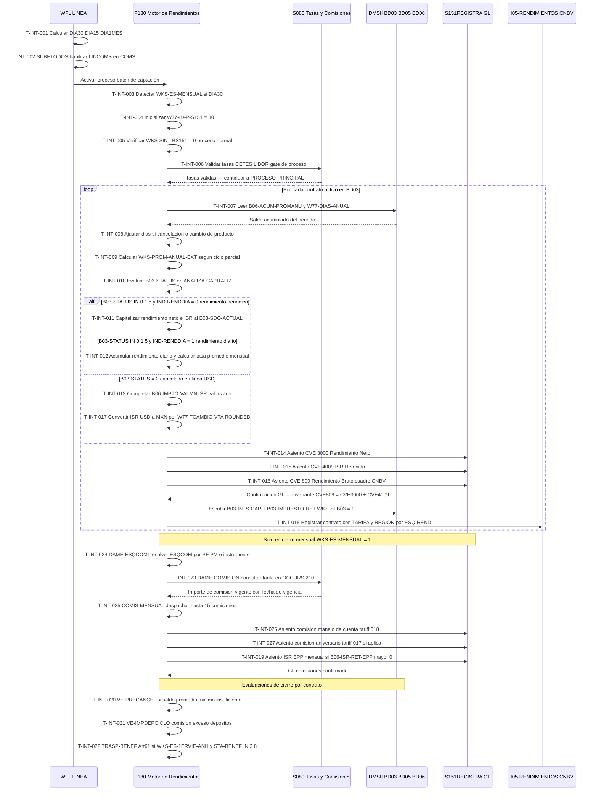

# Capacidad: Interest & Fees (6.1.5) [S500]
> Dominio: 6 · Common Services · Subdominio: Financial Services · Cobertura: S500
> Programas principales: S500/P130 · WFL LINEA · Reglas vinculadas: RN-S500-079..107

---

## Contexto funcional

La capacidad **Interest & Fees (6.1.5)** es el núcleo del cierre de captación del sistema S500 en Unisys ClearPath MCP. Agrupa todas las operaciones que determinan, calculan, retienen y contabilizan los rendimientos e ISR de las cuentas de cheque activas de Banamex, así como el cobro de comisiones ordinarias y de vigencia (manejo de cuenta, aniversario, exceso de depósitos). El proceso es disparado diariamente por el orquestador online **WFL LINEA** (`S500/WFL/LINEA/24MTP005`, 1,961 LOC, autor L. Marín, noviembre 1991), que calcula los flags de calendario del día (DIA30 — último día hábil del mes, DIA15 — quincenal, DIA1MES — primer día hábil) y habilita en el Communication Management System (COMS) de Unisys todos los programas de línea de captación. El motor de cálculo es el programa **P130** (31,762 LOC, autor J. L. Ibarra Lara, JUNIO/1995), que recorre el universo de contratos activos en DMSII BD03 y, para cada uno: (a) calcula el saldo promedio anual real (`WKS-PROM-ANUAL`) usando el acumulado `B06-ACUM-PROMANU` dividido entre los días del año (`W77-DIAS-ANUAL`); (b) determina si aplica rendimiento al vencimiento del ciclo (IND-RENDDIA=0) o diario (IND-RENDDIA=1) consultando la tabla de instrumentos BD05; (c) calcula el rendimiento neto y el ISR retenido mediante la librería CAPITALIZA; (d) genera tres asientos contables hacia S151 vía S151REGISTRA — CVE 3000 (rendimiento neto), CVE 4009 (ISR retenido) y CVE 809 (rendimiento bruto como partida de cuadre para reportes CNBV Serie R-04); y (e) en el cierre mensual (WKS-ES-MENSUAL=1, activado cuando DIA30=TRUE) despacha hasta 15 tipos de comisiones por contrato mediante el módulo COMIS-MENSUAL. El proceso también ejecuta lógica de cancelación automática por saldo promedio mínimo insuficiente (Art. 96 CONDUSEF, regla RN-S500-096) y traspaso forzado a cuenta de beneficencia por inactividad prolongada (Art. 61 CUB, regla RN-S500-098). Los reportes regulatorios Serie R CNBV se alimentan del archivo de salida I05-RENDIMIENTOS, clasificado por esquema de rendimiento (ESQ-REND: 0=estándar, 1=bracketing, 2=curvas, 3=grupos). Toda la lógica de comisiones recupera tarifas en tiempo real del catálogo centralizado S080 vía la interfaz DAME-COMISION (OCCURS 210 esquemas, indexados por tipo de persona PF/PM e instrumento).

---

## Inventario de Tareas

| ID | Tarea | Programa | Componente fuente | Tipo |
|----|-------|----------|-------------------|------|
| T-INT-001 | Calcular flags de calendario del día (DIA30 / DIA15 / DIA1MES) | WFL LINEA | S500_WFL_LOTE.txt | control |
| T-INT-002 | Habilitar LINCOMS y programas online en COMS (SUBETODOS) | WFL LINEA | S500_WFL_LOTE.txt | control |
| T-INT-003 | Detectar modo de proceso mensual (WKS-ES-MENSUAL = 0/1) | P130 | S500_SOURCE_P130.txt | control |
| T-INT-004 | Inicializar identificador de asiento GL hacia S151 (W77-ID-P-S151 = 30/31/32) | P130 | S500_SOURCE_P130.txt | control |
| T-INT-005 | Controlar bypass de emergencia de librería S151 (WKS-SIN-LBS151) | P130 | S500_SOURCE_P130.txt | control |
| T-INT-006 | Validar tasas CETES/LIBOR como gate de proceso (VAL-CETES-LIBOR) | P130 | S500_SOURCE_P130.txt | validación |
| T-INT-007 | Calcular saldo promedio anual por contrato (WKS-PROM-ANUAL) | P130 | S500_SOURCE_P130.txt | consulta |
| T-INT-008 | Ajustar días del período por cancelación o cambio de producto (-1 día) | P130 | S500_SOURCE_P130.txt | validación |
| T-INT-009 | Calcular saldo promedio extendido para ciclos parciales (WKS-PROM-ANUAL-EXT) | P130 | S500_SOURCE_P130.txt | consulta |
| T-INT-010 | Evaluar capitalización por estado del contrato (50116000-ANALIZA-CAPITALIZ) | P130 | S500_SOURCE_P130.txt | control |
| T-INT-011 | Capitalizar rendimiento periódico al vencimiento del ciclo (IND-RENDDIA = 0) | P130 | S500_SOURCE_P130.txt | escritura |
| T-INT-012 | Acumular rendimiento diario y calcular tasa promedio en cierre mensual (IND-RENDDIA = 1) | P130 | S500_SOURCE_P130.txt | escritura |
| T-INT-013 | Completar ISR valorizado de cancelación en línea USD (B06-IMPTO-VALMN · P010→P130) | P130 | S500_SOURCE_P130.txt | escritura |
| T-INT-014 | Generar asiento GL rendimiento neto hacia S151 (CVE-COMUN 3000) | P130 | S500_SOURCE_P130.txt | contable |
| T-INT-015 | Generar asiento GL ISR retenido hacia S151 (CVE-COMUN 4009) | P130 | S500_SOURCE_P130.txt | contable |
| T-INT-016 | Generar asiento GL rendimiento bruto hacia S151 (CVE-COMUN 809) | P130 | S500_SOURCE_P130.txt | contable |
| T-INT-017 | Convertir rendimientos e ISR USD a MXN para asientos GL (W77-TCAMBIO-VTA · ROUNDED) | P130 | S500_SOURCE_P130.txt | contable |
| T-INT-018 | Clasificar contrato en archivo de rendimientos I05 por esquema ESQ-REND (TARIFA + REGION) | P130 | S500_SOURCE_P130.txt | escritura |
| T-INT-019 | Registrar ISR de plan de ahorro EPP en cierre mensual (50120000-SALIDA-IMPUESTO) | P130 | S500_SOURCE_P130.txt | contable |
| T-INT-020 | Evaluar pre-cancelación por saldo promedio mínimo insuficiente (50116650-VE-PRECANCEL) | P130 | S500_SOURCE_P130.txt | control |
| T-INT-021 | Cobrar comisión por exceso de depósitos en el ciclo (50116660-VE-IMPDEPCICLO) | P130 | S500_SOURCE_P130.txt | contable |
| T-INT-022 | Ejecutar traspaso automático a cuenta de beneficencia Art. 61 CUB (50113600-TRASP-BENEF) | P130 | S500_SOURCE_P130.txt | control |
| T-INT-023 | Consultar comisión aplicable en catálogo S080 (DAME-COMISION) | P130 | S500_SOURCE_P130.txt | consulta |
| T-INT-024 | Resolver esquema de comisión por tipo de persona PF/PM (20530130-DAME-ESQCOMI) | P130 | S500_SOURCE_P130.txt | consulta |
| T-INT-025 | Despachar hasta 15 comisiones mensuales por contrato (20530000-COMIS-MENSUAL) | P130 | S500_SOURCE_P130.txt | control |
| T-INT-026 | Cobrar comisión de manejo de cuenta con exención por SBC o nómina (tariff #018) | P130 | S500_SOURCE_P130.txt | contable |
| T-INT-027 | Cobrar comisión de aniversario en fecha de vencimiento anual (tariff #017 · slot 4) | P130 | S500_SOURCE_P130.txt | contable |
| T-INT-028 | Activar condicionalmente programas Telethon P045/P046 por archivo de control DMSII | WFL LINEA | S500_WFL_LOTE.txt | control |

---

## Casuísticas

### CS-INT-01: Cálculo exitoso de rendimiento periódico con ISR y asientos GL

**Tipo:** happy-path
**Condición de entrada:** Contrato activo (B03-STATUS=0) en MXN (B03-MONEDA=1), instrumento de rendimiento periódico (TB-B05-IND-RENDDIA=0) con pago en capitalización (TB-B05-PGOREND=1), día de vencimiento del ciclo (W77-HOY-CORTA>0), saldo promedio anual positivo (B06-ACUM-PROMANU>0), tasas CETES/LIBOR cargadas correctamente en S080. Proceso normal sin bypass (WKS-SIN-LBS151=0).
**Resultado:** `B03-INTS-CAPIT` y `B03-IMPUESTO-RET` actualizados en BD03 (WKS-SI-B03=1); tres asientos en S151 vía S151REGISTRA (CVE 3000 rendimiento neto + CVE 4009 ISR retenido + CVE 809 rendimiento bruto como cuadre CNBV); contrato registrado en I05-RENDIMIENTOS con TARIFA y REGION según ESQ-REND; `W77-HAY-PAGO-REND=1`. Invariante: CVE 809 = CVE 3000 + CVE 4009.
**Secuencia:** T-INT-001 → T-INT-002 → T-INT-003 → T-INT-004 → T-INT-006 → T-INT-007 → T-INT-008 → T-INT-009 → T-INT-010 → T-INT-011 → T-INT-014 → T-INT-015 → T-INT-016 → T-INT-018

---

### CS-INT-02: Contrato sin saldo promedio — sin rendimiento ni asientos GL

**Tipo:** error
**Condición de entrada:** Contrato activo (B03-STATUS=0) cuyo saldo diario acumulado es cero para todo el período (`B06-ACUM-PROMANU=0` o `W77-DIAS-ANUAL=0`), o bien marcado como contrato sin rendimiento (`WS-CAP-SINRENDI=1`). No hay base de cálculo para rendimiento.
**Resultado:** `WKS-PROM-ANUAL=0` por la protección `IF W77-DIAS-ANUAL > 0`; `WS-CAP-RENDNETO=0`; no se generan asientos GL (CVE 3000/4009/809); I05-RENDIMIENTOS registra el contrato con RENDNETO=0 y TARIFA según ESQ-REND (registro obligatorio CNBV aun sin rendimiento). `B03-INTS-CAPIT` permanece sin cambios. El contrato continúa activo sin penalización.
**Secuencia:** T-INT-001 → T-INT-003 → T-INT-004 → T-INT-006 → T-INT-007 → T-INT-008 → T-INT-009 → T-INT-010 → (sin T-INT-011 — SINRENDI=1 o RENDNETO=0) → T-INT-018

---

### CS-INT-03: Retención ISR — esquema diferenciado Persona Física vs Persona Moral

**Tipo:** edge-case
**Condición de entrada:** Dos contratos idénticos en saldo promedio e instrumento: uno PF (`WS-IND-PERS=1`) y uno PM (`WS-IND-PERS=2`). Cierre mensual (WKS-ES-MENSUAL=1). Ambos tienen comisiones configuradas en slots 1..15 de BD05.
**Resultado:** Para cada contrato, `DAME-ESQCOMI` retorna un ESQCOM diferente según tipo de persona; `DAME-COMISION` consulta S080 en el slot OCCURS 210 correspondiente y retorna importe de comisión distinto para PF y PM. El ISR retenido (Art. 54 SAT) se calcula por la librería CAPITALIZA sobre la tasa bruta — la diferencia de importe de comisión entre PF y PM genera asientos GL distintos (CVE 4009) aunque el rendimiento base sea idéntico. Error en clasificación `WS-IND-PERS` → comisión incorrecta → exposición CONDUSEF directa (infracción BEF).
**Secuencia:** T-INT-003 → T-INT-006 → T-INT-007 → T-INT-009 → T-INT-010 → T-INT-011 → T-INT-014 → T-INT-015 → T-INT-016 → T-INT-024 → T-INT-023 → T-INT-025 → T-INT-026

---

### CS-INT-04: Cancelación en línea de cuenta USD — compensación ISR valorizado (P010 → P130)

**Tipo:** edge-case
**Condición de entrada:** Contrato USD (B03-MONEDA=5) cancelado hoy en tiempo real por el gateway P010 (B03-STATUS=2, `B06-FEC-CANCEL=WKS-FEC-BASE`). P010 deja B03-STATUS=2 pero no acumula `B06-IMPTO-VALMN` para cuentas USD. P130 detecta la omisión y la completa.
**Resultado:** P130 calcula `W77-VAL-PUENTE ROUNDED = B03-IMPUESTO-RET × W77-TCAMBIO-VTA` y acumula en `B06-IMPTO-VALMN`; el campo queda cuadrado para reportes CNBV Serie B y DIOT SAT (Art. 54). Sin esta compensación, la contabilidad MXN del ISR USD quedaría truncada. La cláusula `ROUNDED` en COBOL aplica half-up — desviación del redondeo en el target genera diferencias centavo a centavo en el reporte regulatorio.
**Secuencia:** T-INT-001 → T-INT-003 → T-INT-004 → T-INT-006 → T-INT-010 → T-INT-013 → T-INT-017 → T-INT-015

---

### CS-INT-05: Cierre mensual con rendimiento diario, EPP y comisiones (IND-RENDDIA = 1)

**Tipo:** edge-case
**Condición de entrada:** Último día hábil del mes (DIA30=TRUE, WKS-ES-MENSUAL=1), contrato activo con instrumento de rendimiento diario (TB-B05-IND-RENDDIA=1), plan EPP con ISR acumulado (`B06-ISR-RET-EPP>0`), comisiones mensuales en slots 1..15 de BD05 incluyendo comisión de manejo (tariff #018) y posiblemente aniversario (tariff #017 si corresponde la fecha).
**Resultado:** (1) Acumulación diaria de rendimiento ya efectuada en días previos; en este día se calcula la tasa promedio mensual: `B03-TASA-ANTERIOR = B03-INTS-CAPIT / W77-SDOPROM-RENDIA × 36000 / B06-DIAPAG-RENDIA`; (2) ISR EPP liberado a S151 (50120000-SALIDA-IMPUESTO); (3) hasta 15 comisiones despachadas vía COMIS-MENSUAL con asientos GL separados por comisión; (4) si SBC >= WS-SDO-MANEJO o es cuenta nómina, comisión de manejo = 0; (5) campos IPAB (`B03-ISRDIA-IPAB`, `B06-SDOPROM-IPAB`) actualizados para reporte al Instituto de Protección al Ahorro Bancario. Factor 36000 hardcoded en COMPUTE es el principal riesgo de migración de este escenario.
**Secuencia:** T-INT-001 → T-INT-003 → T-INT-004 → T-INT-006 → T-INT-007 → T-INT-009 → T-INT-010 → T-INT-012 → T-INT-014 → T-INT-015 → T-INT-016 → T-INT-019 → T-INT-024 → T-INT-023 → T-INT-025 → T-INT-026

---

## Diagrama

---

## Reglas vinculadas

| Tarea | Regla | Componente fuente | Descripción |
|-------|-------|-------------------|-------------|
| T-INT-001 | RN-S500-104 | S500_WFL_LOTE.txt | Detección del último día hábil del mes (DIA30) comparando IFECHAPROX MOD 100 = 1 |
| T-INT-001 | RN-S500-105 | S500_WFL_LOTE.txt | Detección del quincenal (DIA15) — activa también cuando DIA30 es TRUE |
| T-INT-002 | RN-S500-107 | S500_WFL_LOTE.txt | Secuencia de habilitación de LINCOMS al inicio del día (SUBETODOS) |
| T-INT-003 | RN-S500-079 | S500_SOURCE_P130.txt | Detección del modo de proceso mensual: WKS-ES-MENSUAL = 1 si DIA30 |
| T-INT-004 | RN-S500-080 | S500_SOURCE_P130.txt | Inicialización de W77-ID-P-S151 = 30/31/32 para identificar el tipo de asiento en S151 |
| T-INT-005 | RN-S500-081 | S500_SOURCE_P130.txt | Bypass de emergencia de librería S151 (WKS-SIN-LBS151); omite todos los asientos GL |
| T-INT-006 | RN-S500-082 | S500_SOURCE_P130.txt | Validación de tasas CETES/LIBOR como gate de proceso; ABORT si fuera de rango |
| T-INT-007 | RN-S500-083 | S500_SOURCE_P130.txt | Cálculo del saldo promedio anual: WKS-PROM-ANUAL = B06-ACUM-PROMANU / W77-DIAS-ANUAL |
| T-INT-008 | RN-S500-084 | S500_SOURCE_P130.txt | Ajuste de W77-DIAS-ANUAL en -1 si contrato cancelado (B03-STATUS=2) o con cambio de producto |
| T-INT-009 | RN-S500-085 | S500_SOURCE_P130.txt | Saldo promedio extendido WKS-PROM-ANUAL-EXT para contratos con ciclo parcial |
| T-INT-010 | RN-S500-086 | S500_SOURCE_P130.txt | Switch de capitalización 50116000-ANALIZA-CAPITALIZ por B03-STATUS (0/1/5=vigente, 2=cancelado) |
| T-INT-011 | RN-S500-087 | S500_SOURCE_P130.txt | Capitalización periódica: B03-SDO-ACTUAL += WS-CAP-RENDNETO al vencimiento del ciclo |
| T-INT-012 | RN-S500-088 | S500_SOURCE_P130.txt | Acumulación diaria de rendimiento e ISR; tasa promedio = B03-INTS-CAPIT / W77-SDOPROM-RENDIA × 36000 / B06-DIAPAG-RENDIA |
| T-INT-013 | RN-S500-089 | S500_SOURCE_P130.txt | ISR valorizado no acumulado en cancelación en línea USD: compensación P010→P130 en B06-IMPTO-VALMN |
| T-INT-014 | RN-S500-091 | S500_SOURCE_P130.txt | Asiento GL CVE 3000 (rendimiento neto) hacia S151REGISTRA; acumula en WKS-VAL-CGOMN/CGODLS |
| T-INT-015 | RN-S500-092 | S500_SOURCE_P130.txt | Asiento GL CVE 4009 (ISR retenido) hacia S151REGISTRA; 4 líneas GL para cuentas USD (partida doble MXN+USD) |
| T-INT-016 | RN-S500-093 | S500_SOURCE_P130.txt | Asiento GL CVE 809 (rendimiento bruto = neto + ISR) hacia S151REGISTRA; base de reportes Serie R-04 CNBV |
| T-INT-017 | RN-S500-094 | S500_SOURCE_P130.txt | Conversión cambiaria USD→MXN con W77-TCAMBIO-VTA y cláusula ROUNDED (half-up) para asientos GL |
| T-INT-018 | RN-S500-095 | S500_SOURCE_P130.txt | Clasificación de contratos en I05-RENDIMIENTOS (TARIFA 1-7 / REGION) según B03-ESQ-REND |
| T-INT-019 | RN-S500-090 | S500_SOURCE_P130.txt | ISR del plan EPP acumulado en B06-ISR-RET-EPP; liberado a S151 solo en cierre mensual |
| T-INT-020 | RN-S500-096 | S500_SOURCE_P130.txt | Pre-cancelación por saldo promedio mínimo: 50116650-VE-PRECANCEL en día de corte (W77-HOY-CORTA>0) |
| T-INT-021 | RN-S500-097 | S500_SOURCE_P130.txt | Comisión por depósitos excedentes en el ciclo: 50116660-VE-IMPDEPCICLO en día de corte |
| T-INT-022 | RN-S500-098 | S500_SOURCE_P130.txt | Traspaso automático Art. 61 CUB: 50113600-TRASP-BENEF — primer viernes aniversario, MXN, STA-BENEF IN 3 8 |
| T-INT-023 | RN-S500-099 | S500_SOURCE_P130.txt | Consulta central de comisión vía DAME-COMISION en S080 (OCCURS 210 esquemas) |
| T-INT-024 | RN-S500-103 | S500_SOURCE_P130.txt | Resolución de esquema de comisión PF (WS-IND-PERS=1) vs PM (WS-IND-PERS=2) — DAME-ESQCOMI |
| T-INT-025 | RN-S500-100 | S500_SOURCE_P130.txt | Despachador de hasta 15 comisiones mensuales por contrato (COMIS-MENSUAL); mayor riesgo CONDUSEF de P130 |
| T-INT-026 | RN-S500-101 | S500_SOURCE_P130.txt | Comisión de manejo de cuenta con exención por SBC o por cuenta nómina (Circular Banxico) |
| T-INT-027 | RN-S500-102 | S500_SOURCE_P130.txt | Comisión de aniversario (tariff #017, slot 4 de BD05); requiere notificación CONDUSEF 30 días antes |
| T-INT-028 | RN-S500-106 | S500_WFL_LOTE.txt | Activación condicional de P045/P046 Telethon por presencia del archivo S500BD06TELETON/CONTROL en DMSII |

---

## Hallazgos de migración críticos

| Riesgo | Tarea | Severidad | Acción requerida |
|--------|-------|-----------|-----------------|
| Factor 36000 hardcoded como base de anualización (360 días × 100%). Si regulación Banxico/CNBV cambia a base 365 días, se requiere modificación en múltiples COMPUTEs de P130, P142 y P144. | T-INT-012 | 🟠 CRÍTICO | Parametrizar la base de días (360/365/366) en archivo de configuración externo. Implementar prueba de regresión que valide la tasa promedio mensual resultante contra el legado para el mismo período. |
| Cláusula `ROUNDED` en conversiones FX (USD→MXN). COBOL aplica half-up; Java usa `HALF_EVEN` por defecto. Desviación genera diferencias centavo a centavo en reportes CNBV y DIOT SAT acumuladas sobre miles de contratos. | T-INT-017 | 🟠 CRÍTICO | Documentar y validar `RoundingMode.HALF_UP` en cada lenguaje target. Implementar prueba de equivalencia numérica con datos reales de P130 antes del cutover. |
| LIBOR como tasa de referencia en contratos vigentes — riesgo regulatorio post-2021. El archivo I07-TASASTARIF83 contiene tasas históricas que mezclan rangos legítimos con valores LIBOR en contratos legacy USD. | T-INT-006 | 🟠 CRÍTICO | Inventariar contratos USD vigentes con cláusula LIBOR. Coordinar con Legal/Riesgos la sustitución por SOFR u tasa sustituta antes de la migración. Actualizar la rutina VAL-CETES-LIBOR para validar contra la nueva tasa de referencia. |
| `WKS-SIN-LBS151 = 1` (bypass GL de emergencia) omite todos los asientos en S151 sin mecanismo de replay. El GL queda sin movimientos de rendimientos; la reconciliación es 100% manual. | T-INT-005 | 🟠 CRÍTICO | Implementar circuit-breaker con cola de eventos (Kafka / SQS) y replay automático de asientos GL. El target no debe permitir pérdida de asientos bajo ninguna condición operativa. |
| OCCURS 210 en S080 (indexado por ESQCOM). Hardcode estructural: ampliar más de 210 esquemas de comisión requiere recompilación de P130 y modificación del catálogo S080. | T-INT-023, T-INT-024 | 🟡 ALTO | Migrar el catálogo S080 a base de datos relacional o API con paginación. Eliminar el límite de 210 esquemas como restricción del runtime en el sistema target. |
| Archivo DMSII `S500BD06TELETON/CONTROL` como feature flag de campaña. Sin mecanismo moderno equivalente; riesgo de P045/P046 activos fuera del período de campaña si el archivo no se elimina. | T-INT-028 | 🟡 ALTO | Sustituir por feature flag gestionado (LaunchDarkly, AWS AppConfig, GCP Feature Flags) con TTL automático. Documentar el ciclo de vida de activación/desactivación en el runbook operativo. |
| Slot `(inst, 4)` en BD05 como convención implícita para comisión de aniversario. No está documentado en el catálogo de instrumentos; cualquier migración del catálogo BD05 puede romper la asignación. | T-INT-027 | 🟡 ALTO | Documentar el mapeo de todos los slots 1-15 de TB-B05-CVECOMI en el catálogo de instrumentos del target. Validar con SME que slot 4 es exclusivo para aniversario en todos los instrumentos activos. |
| Contador `B03-MES-PROM-MIN` y `B03-MES-ABO-EXCE` acumulados en BD03 como estado persistente. Una migración sin traspaso de estos contadores reinicia el conteo — contratos cercanos al límite de cancelación pueden no ser cancelados en tiempo. | T-INT-020, T-INT-021 | 🟡 ALTO | Migrar el estado de los contadores al sistema target en el cutover. Definir política de reconciliación post-migración y periodo de observación supervisado. |
| S151REGISTRA1 está comentada con `*$SET S151REGISTRA S151REGISTRA1`. Existe una tercera variante de librería GL que no está activa pero cuyo mecanismo de `$SET` puede reactivarse accidentalmente en compilación. | T-INT-004 | 🟢 BAJO | Documentar las tres variantes (S151REGISTRA, S151REGISTRA2, S151REGISTRA1-inactiva) en el ADR de integración GL. Eliminar la variante comentada en el sistema target o convertirla en configuración explícita. |

---

*cap-int.md · v1.0 · 2026-07-16 · Capa 4 (Inventario de Tareas) + Capa 5 (Casuísticas + Diagrama Mermaid)*
*Capacidad: 6.1.5 Interest & Fees · Sistema: S500 · Programas: S500/P130 · WFL LINEA*
*Cross-referencia: RN-S500-079..107 · rules-catalog/rules-s500-p130.md · capability-map.md*
