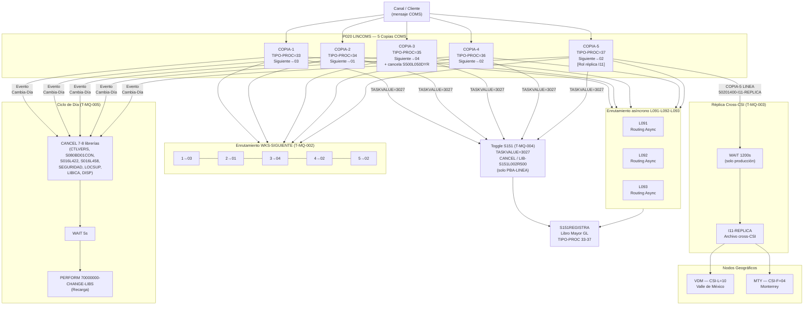

# cap-mq.md — MQ / Async Gateway
> BIAN: T.2.3 · MQ / Async (L091-L093) · Dominio: T · Transversal
> Sistema: S500 · Programa: P020 (LINCOMS — 5 copias COMS)
> Reglas vinculadas: 7 · Tareas: 7
> Generado: 2026-07-16

---

## Contexto funcional

El programa **P020 (LINCOMS)** opera como **gateway COMS secundario** del sistema S500 (Captación) sobre la plataforma **Unisys ClearPath MCP**. Su contraparte primaria es P010 (LINCOS). El servidor se levanta con **5 copias concurrentes** de la misma imagen ejecutable, cada una con identidad propia, comportamiento diferenciado y rol específico en la topología de disponibilidad.

### Arquitectura de copias COMS

Las 5 copias no son instancias simétricas. Cada copia recibe un identificador `WKS-88-COPIA-n` (n = 1..5) que determina:

- **TIPO-PROC S151**: El valor enviado al libro mayor (`WS-S151-TIPO-PROC`) varía de 33 (COPIA-1) a 37 (COPIA-5). Esto permite que S151 diferencie el origen del movimiento. P010 usa los rangos 28-32 para el mismo propósito.
- **Enrutamiento de failover (WKS-SIGUIENTE)**: Tabla fija hardcodeada que define qué copia atiende si la actual no está disponible: 1→03, 2→01, 3→04, 4→02, 5→02. Las copias 4 y 5 convergen al mismo punto de failover (copia 02), concentrando el riesgo.
- **Rol de réplica (COPIA-5)**: Única copia que genera el archivo `I11-REPLICA` para sincronización cross-CSI. En producción ejecuta un `WAIT 1200` (20 minutos) para garantizar que P010 haya completado su ciclo antes de replicar.

### Librerías de enrutamiento asíncrono L091-L093

Las librerías **L091**, **L092** y **L093** participan en el enrutamiento asíncrono MQ del sistema S500, según el mapa de conocimiento del Gemelo Cognitivo. Estas librerías no están aún catalogadas individualmente en reglas RN-S500 pero son parte integral del comportamiento de arranque y transición de estado de P020. Su gestión sigue el mismo patrón de ciclo de vida que el resto de las librerías dinámicas: `CANCEL` + `WAIT` + recarga vía `70000000-CHANGE-LIBS`.

### Topología geográfica cross-CSI

El sistema opera en dos nodos:
- **Valle de México (VDM)** — CSI-L = 10
- **Monterrey (MTY / ACYP)** — CSI-F = 04

La replicación entre nodos usa 8 pares de host hardcodeados (VDMBETA↔ACYPBETA, ACYPGAMA↔MONALFA, ACYPOMEGA↔VDMKAPPA, VDMALFA↔MONBETA) más 6 pares "clonados" (prefijo C) para entornos espejo. Esta misma tabla aparece duplicada sin COPY book compartido en P020, P142 y P144.

### Ciclo de vida de librerías al cierre de día

Al cambiar el día contable (`50201300-CAMBIA-DIA-CONTABLE`), P020 cancela explícitamente 7-8 librerías dinámicas (`CTLVERS`, `S080BD01CON`, `S016L422`, `S016L458`, `SEGURIDAD`, `LOCSUP`, `LIBICA`, `DISP`), espera 5 segundos (`WAIT 5`) y las recarga. COPIA-3 cancela adicionalmente `S500L050DYR`. Si S151 está activo, también cancela `REGISTRAS500` al cierre.

**Plataforma:** Unisys ClearPath MCP · COBOL · DMSII · COMS (servidor de mensajes)
**Geografía:** Valle de México (VDM, CSI-L=10) · Monterrey (MTY, CSI-F=04)
**Regulación aplicable:** Banxico (SPEI HA — replicación cross-CSI) · Interno (failover, ciclo de día)

---

## Inventario de Tareas

| ID | Tarea | Programa / Componente | Tipo |
|----|-------|-----------------------|------|
| T-MQ-001 | Asignación de TIPO-PROC por copia COMS (rangos 33-37) | P020 — `WS-S151-TIPO-PROC` | control |
| T-MQ-002 | Enrutamiento de failover entre copias vía tabla WKS-SIGUIENTE | P020 — `WKS-SIGUIENTE`, `WKS-CONTINUIDAD` | control |
| T-MQ-003 | Generación de réplica cross-CSI I11 en COPIA-5 con WAIT 1200s | P020 — `50201400-I11-REPLICA`, `I11-REPLICA` | replicación |
| T-MQ-004 | Toggle en caliente de integración S151 vía TASKVALUE=3027 | P020 — `WS-UTILIZA-S151-VA`, `REGISTRAS500` | control |
| T-MQ-005 | Ciclo de cierre de día: cancelación ordenada y recarga de librerías | P020 — `CAMBIA-DIA-CONTABLE`, `70000000-CHANGE-LIBS` | control |
| T-MQ-006 | Identificación de topología cross-CSI para CTOREP Teradata | P142 — `WKS-HOST-ORIG/DEST-XFER-XX`, `WKS-CSIL` | configuración |
| T-MQ-007 | Propagación de topología cross-CSI para activaciones BIT-ACTBANDERA | P144 — `WKS-HOST-ORIG/DEST-XFER-XX`, `000-CLONA-XFER` | configuración |

---

## Casuísticas principales

### CS-MQ-01 — Enrutamiento normal: transacción procesada por COPIA-2

**Precondiciones:** Las 5 copias de P020 están activas. El canal envía una transacción a COPIA-2.

1. COPIA-2 recibe el mensaje vía COMS con `WKS-88-COPIA-2` activo.
2. **T-MQ-001**: Se asigna `WS-S151-TIPO-PROC = 34` para identificar esta copia ante S151.
3. La transacción se procesa normalmente (clasificación CVETRAN, validación cat-174, posting S02, asiento S151).
4. `WKS-SIGUIENTE` de COPIA-2 apunta a COPIA-1, valor almacenado en `WKS-CONTINUIDAD` para eventual failover.

**Resultado:** Transacción procesada. S151 registra el movimiento con TIPO-PROC=34, diferenciando el origen del asiento.

---

### CS-MQ-02 — Failover de copia: COPIA-4 no disponible

**Precondiciones:** COPIA-4 deja de responder. El sistema de control (`S500L010CTRL`) detecta la condición.

1. **T-MQ-002**: La tabla `WKS-SIGUIENTE` para COPIA-4 apunta al valor `02` (COPIA-2).
2. El enrutamiento se redirige a COPIA-2. Nótese que COPIA-5 también apunta a COPIA-2 como siguiente, por lo que una falla simultánea de COPIA-4 y COPIA-5 concentra toda la carga en COPIA-2.
3. COPIA-2 asume el tráfico con su propio TIPO-PROC=34, manteniendo la diferenciación ante S151.
4. Operaciones en curso en COPIA-4 se pierden o deben reintentarse por el canal (COMS no garantiza at-least-once en este escenario).

**Resultado:** Tráfico redirigido a COPIA-2. La tabla de failover es estática — no hay redistribución dinámica de carga.

---

### CS-MQ-03 — Timeout MQ: WAIT 1200 en réplica I11 de producción

**Precondiciones:** COPIA-5 está en modo LINEA. Es el momento de inicio del día o cambio de tipo de proceso.

1. **T-MQ-003**: `WKS-88-COPIA-5` activo y `WS-88-TP-LINEA` activo → se invoca `50201400-I11-REPLICA`.
2. Si el entorno es producción (hostname no es PBA): P020 ejecuta `WAIT(1200)` — 20 minutos — antes de generar `I11-REPLICA`.
3. El propósito del WAIT es garantizar que P010 (gateway primario) haya completado su ciclo antes de que COPIA-5 escriba el estado replicado al CSI opuesto.
4. Si ocurre un cambio de tipo de proceso durante el día, `50201400-CAMBIA-TIPO-PROCESO` también invoca `50201400-I11-REPLICA`, con el mismo WAIT en producción.
5. En entorno PBA: el WAIT no se ejecuta; la réplica es inmediata.

**Resultado:** Archivo `I11-REPLICA` generado con estado actualizado del nodo. En producción, el ciclo completo consume mínimo 20 minutos. Divergencia de comportamiento entre entornos (PBA vs producción).

---

### CS-MQ-04 — Cierre de día contable: cancelación y recarga de librerías

**Precondiciones:** Llega el evento de cambio de día contable al servidor COMS.

1. **T-MQ-005**: P020 ejecuta `50201300-CAMBIA-DIA-CONTABLE`.
2. Se cancelan 7 librerías dinámicas: `CTLVERS`, `S080BD01CON`, `S016L422`, `S016L458`, `SEGURIDAD`, `LOCSUP`, `LIBICA`, `DISP`.
3. Si la copia activa es COPIA-3: adicionalmente cancela `S500L050DYR`.
4. Si `WS-88-SIUSA-S151=ON`: también cancela `REGISTRAS500`.
5. `WAIT(5)` — 5 segundos de estabilización.
6. Se recargan todas las librerías vía `70000000-CHANGE-LIBS`. Las tablas de tarifas (S080), calendario (LOCSUP) y seguridad quedan actualizadas para el nuevo día.

**Resultado:** Librerías dinámicas refrescadas. Sin reinicio del servidor COMS. El WAIT 5 es hardcodeado sin parámetro configurable.

---

## Diagrama de flujo

---

## Reglas vinculadas

| Tarea | Regla | Componente fuente | Descripción |
|-------|-------|-------------------|-------------|
| T-MQ-001 | RN-S500-108 | P020 — `WS-S151-TIPO-PROC` | Cada copia asigna un TIPO-PROC distinto (33-37) al llamar a S151REGISTRA. Permite que el GL diferencie el origen del movimiento por copia. Si S151 está desactivado (`WS-88-SIUSA-S151=OFF`), el TIPO-PROC se asigna pero no se usa. |
| T-MQ-002 | RN-S500-109 | P020 — `WKS-SIGUIENTE`, `WKS-CONTINUIDAD` | Tabla fija de failover: 1→03, 2→01, 3→04, 4→02, 5→02. Las copias 4 y 5 comparten el mismo siguiente (02), concentrando el riesgo de failover en COPIA-2. Hardcodeado sin parámetro configurable. |
| T-MQ-003 | RN-S500-112 | P020 — `50201400-I11-REPLICA`, `I11-REPLICA` | Solo COPIA-5 en modo LINEA genera I11-REPLICA. Producción: `WAIT(1200)` antes de ejecutar. PBA: inmediato. El WAIT garantiza que P010 complete su ciclo antes de replicar al CSI opuesto. También se re-genera al cambio de tipo de proceso. |
| T-MQ-004 | RN-S500-114 | P020 — `WS-UTILIZA-S151-VA`, `REGISTRAS500` | TASKVALUE=3027 activa o desactiva en caliente la integración con S151. Solo disponible en PBA-LINEA. Si activo: `CANCEL "REGISTRAS500"`; si inactivo: `LIB-S151L002R500`. En producción, TASKVALUE=3027 es ignorado silenciosamente. |
| T-MQ-005 | RN-S500-119 | P020 — `CAMBIA-DIA-CONTABLE`, `70000000-CHANGE-LIBS` | Al cambiar el día contable, cancela 7-8 librerías dinámicas, espera `WAIT(5)` y recarga. COPIA-3 cancela adicionalmente S500L050DYR. Si S151 activo: también cancela REGISTRAS500. Este protocolo refresca tarifas, calendario y seguridad sin reiniciar el servidor COMS. |
| T-MQ-006 | RN-S500-136 | P142 — `WKS-HOST-ORIG/DEST-XFER-XX`, `WKS-CSIL` | P142 replica exactamente la misma tabla de 8 pares de host que P020 para identificar origen y destino de replicación cross-CSI (VDM↔MTY). El CTOREP incluye CSI-CONTRATO y CSI-COBERTURA derivados de esta identificación. Si hostname no coincide, el campo queda en SPACES. |
| T-MQ-007 | RN-S500-151 | P144 — `WKS-HOST-ORIG/DEST-XFER-XX`, `000-CLONA-XFER` | P144 duplica la misma tabla de 8 pares host + 6 pares clonados (prefijo C) que P020 y P142. La triplicación sin COPY book compartido implica que un cambio de topología requiere actualizar P020, P142 y P144 simultáneamente en ventana coordinada. |

---

## Hallazgos de migración

| # | Riesgo | Tarea(s) | Severidad | Acción recomendada |
|---|--------|----------|-----------|-------------------|
| H-MQ-01 | **COMS no tiene equivalente directo en cloud**. El servidor COMS multi-copia de Unisys es propietario: gestión de sesiones, identidad por copia, interrupt handlers (TASKVALUE) y failover interno no existen en plataformas cloud nativas. | T-MQ-001, T-MQ-002, T-MQ-009 | Alta | Reemplazar por **Kafka** (streaming), **SQS/SNS** (AWS) o **Azure Service Bus** según patrón de mensajería. Las 5 copias se modelan como particiones/consumidores. El TIPO-PROC 33-37 se convierte en metadato de mensaje (`source-instance-id`). |
| H-MQ-02 | **WAIT 1200 (20 min) hardcodeado** en COPIA-5 sin parámetro configurable. El valor asume un tiempo de ciclo fijo de P010. Un cambio en el throughput de P010 invalida este umbral sin mecanismo de ajuste. Además, PBA y producción tienen comportamiento radicalmente distinto (0s vs 1200s). | T-MQ-003 | Alta | Parametrizar el delay de replicación como variable de entorno o registro en tabla de control B02. En arquitectura cloud, usar **event-driven sync** (P010 publica evento de fin de ciclo → P020 COPIA-5 consume) en lugar de espera ciega. |
| H-MQ-03 | **Tabla de failover WKS-SIGUIENTE hardcodeada**. La topología 1→03, 2→01, 3→04, 4/5→02 no es configurable en runtime. Copias 4 y 5 convergen al mismo punto (02), creando un cuello de botella en caso de fallo simultáneo de ambas. | T-MQ-002 | Alta | Externalizar la tabla de routing a configuración. En cloud, reemplazar por **load balancer** con health checks y distribución automática. Eliminar la asimetría 4/5→02. |
| H-MQ-04 | **Topología cross-CSI duplicada en tres programas** (P020, P142, P144) sin COPY book compartido. Los 8 pares host + 6 pares clonados deben mantenerse sincronizados manualmente en cada cambio de infraestructura de red. | T-MQ-006, T-MQ-007 | Alta | Centralizar en un único COPY book o, en arquitectura cloud, reemplazar por **service discovery** (DNS, Consul, AWS Service Connect). Cada servicio resuelve su endpoint en runtime sin tabla hardcodeada. |
| H-MQ-05 | **Toggle S151 (TASKVALUE=3027) solo disponible en PBA**. En producción, el único mecanismo para suspender el GL posting es reiniciar el servidor COMS o la librería REGISTRAS500. Esto aumenta el riesgo operativo en incidentes de S151. | T-MQ-004 | Media | Implementar **feature flag** administrado (LaunchDarkly, AWS AppConfig) para el toggle de integración GL. Disponible en todos los entornos con control de acceso por rol. |
| H-MQ-06 | **Librerías L091-L092-L093 no catalogadas individualmente**. Su rol en el enrutamiento asíncrono está documentado en el mapa de conocimiento del Gemelo Cognitivo pero no ha sido reverse-engineered a nivel de reglas. Riesgo de pérdida de comportamiento en transpilación. | T-MQ-001..T-MQ-007 | Media | Ejecutar **Fase 2 de extracción de reglas** sobre L091, L092 y L093 para catalogar su lógica interna antes de la transpilación. Prioridad: identificar qué parámetros de routing encapsulan y si reemplazan o complementan la tabla WKS-SIGUIENTE. |
| H-MQ-07 | **Ciclo de cancelación de librerías al cierre de día** (WAIT 5 + recarga). Este patrón no tiene equivalente en microservicios cloud — las configuraciones se recargan sin cancelación de proceso. El WAIT 5 es una espera ciega sin confirmación de que las librerías se descargaron correctamente. | T-MQ-005 | Media | Rediseñar como **config reload event** (ConfigMap reload en k8s, hot config en Spring Cloud Config). Eliminar el WAIT 5 en favor de health checks post-recarga. Asegurar que las tablas de tarifas, calendario y seguridad sean accesibles via API parametrizable. |
| H-MQ-08 | **Sin at-least-once delivery en COMS**. Si una copia falla mid-processing, la transacción en vuelo puede perderse. La tabla WKS-SIGUIENTE redirige nuevas conexiones pero no recupera la transacción en tránsito. | T-MQ-002 | Alta | Implementar **idempotency + retry** en la capa de mensajería cloud. Kafka con offsets confirmados o SQS con visibility timeout garantizan at-least-once. Definir semántica de duplicados con S151 (TIPO-PROC como deduplication key). |

---

*cap-mq.md · v1.0 · 2026-07-16*
*BIAN T.2.3 · MQ / Async · Transversal*
