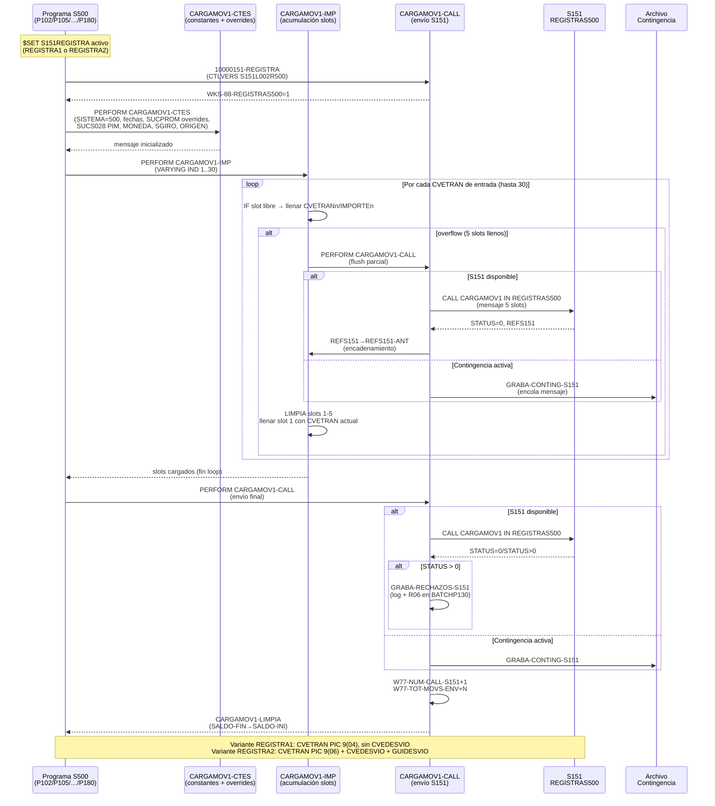

# Capacidad: Operational Reconciliation — Registro S151 Condicional [S500+S151]
> Dominio: 6 · Common Services · Capacidad: **6.7.2 Operational Reconciliation**
> Cobertura: S500+S151 · Mecanismo: **S151REGISTRA** (flag de compilación condicional)
> Variantes: REGISTRA1 (CVETRAN 4 dígitos) · REGISTRA2 (CVETRAN 6 dígitos + CVEDESVIO)
> Reglas vinculadas: RN-S500-153..172 (20 reglas — S151REGISTRA)
> Programas activadores: 15 unidades de compilación S500 (P102/P105/P107/P110/P120/P127/P130/P131/P142/P144/P168/P178/P180 + 2 includes canónicos)

---

## Contexto funcional

`S151REGISTRA` **no es un archivo fuente independiente**: es un flag de compilación condicional de Unisys ClearPath MCP COBOL. Cuando un programa S500 declara `$SET S151REGISTRA`, el preprocessor activa los bloques delimitados por `$SET OMIT = NOT S151REGISTRA` / `$POP OMIT` en dos includes canónicos compartidos por todos los programas S500:

- **`S500_INC_WOR_CAN.txt`** — define la estructura `WS-S151-0101-MOVIMIENTOS` (~230 campos) y los contadores de monitoreo de llamadas.
- **`S500_INC_PRO_CAN.txt`** — implementa los 6 párrafos COBOL de la interfaz CARGAMOV1: `20000151-CARGAMOV1`, `20000151-CARGAMOV1-CALL`, `20000151-CARGAMOV1-IMP`, `20000151-CARGAMOV1-CTES`, `20000151-CARGAMOV1-INI`, `20000151-CARGAMOV1-LIMPIA`.

La librería objeto S151 a la que se conecta es: `(S151)S151/OBJECT/L002/REGISTRAS500`, entrypoint `CARGAMOV1 IN REGISTRAS500`.

**Función de negocio:** toda la contabilidad de cargos y abonos de captación S500 pasa por este mecanismo. Cada movimiento que impacta el saldo de una cuenta genera uno o más registros contables en el GL S151 mediante la función REGMOV (función 1 de CARGAMOV1). La capacidad ORC garantiza que S500 y S151 mantengan consistencia transaccional: todo movimiento aplicado en S500 tiene un asiento correspondiente en S151, y todo rechazo o contingencia queda registrado para reproceso.

**Diferenciador crítico — dos variantes de compilación:**

| Variante | Flag | CVETRAN | IMPORTE | Campos adicionales |
|----------|------|---------|---------|-------------------|
| REGISTRA1 | `$SET S151REGISTRA1` | `PIC 9(04) COMP` | `PIC 9(14)V99 COMP` | — |
| REGISTRA2 | `$SET S151REGISTRA2` | `PIC 9(06) COMP` | `PIC 9(16)V99 COMP` | CVEDESVIO + GUIDESVIO |

Los programas compilados con REGISTRA1 no pueden enviar CVETRANs > 9999 a S151 — si S151 amplía el catálogo de conceptos a 6 dígitos, todos los programas REGISTRA1 requieren recompilación. Esta diferencia estructural en el mensaje es el **riesgo de equivalencia máximo** de la capacidad ORC.

---

## Inventario de Tareas

| ID | Tarea | Programa / Componente | Tipo |
|----|-------|-----------------------|------|
| T-ORC-001 | Validar versión de librería REGISTRAS500 (CTLVERS S151L002R500) — marcar `WKS-88-REGISTRAS500=1` | `S500_INC_PRO_CAN.txt` — `10000151-REGISTRA` | control |
| T-ORC-002 | Inicializar constantes del mensaje S151: SISTEMA=500, fechas, CUENTA, SALDO-INI, IND-EDOCTA, IND-DATOS-ADIC | `S500_INC_PRO_CAN.txt` — `20000151-CARGAMOV1-CTES` | control |
| T-ORC-003 | Aplicar overrides de SUCPROM por CVETRAN (4159/4160→342; 4449→859; 2136/2137/2138→SUCTRAN) | `S500_INC_PRO_CAN.txt` — `20000151-CARGAMOV1-CTES` | contable |
| T-ORC-004 | Aplicar overrides de SUCS028/CAJS028 por perfil PIM y CVETRAN (3002/4001/3018/4016/3027/3047/1153) | `S500_INC_PRO_CAN.txt` — `20000151-CARGAMOV1-CTES` | contable |
| T-ORC-005 | Asignar código de moneda (MONEDA=1 para pesos MXN) por CVETRAN específico | `S500_INC_PRO_CAN.txt` — `20000151-CARGAMOV1-CTES` | contable |
| T-ORC-006 | Clasificar sobregiro (SGIRO=0/1/2) y tipo de proceso (TIPO-PROC=1/10/20) | `S500_INC_WOR_CAN.txt` + programa llamador | validación |
| T-ORC-007 | Clasificar origen de operación (ORIGEN=1 local / 2 foráneo-enviado / 3 foráneo-recibido) | `S500_INC_WOR_CAN.txt` + programa llamador | validación |
| T-ORC-008 | Acumular CVETRANs de entrada en slots 1..5 del mensaje (loop hasta 30 entradas, WS-S151-IND) | `S500_INC_PRO_CAN.txt` — `20000151-CARGAMOV1-IMP` | contable |
| T-ORC-009 | Propagar leyenda de clave principal a claves adicionales de corresponsales (CVETRAN 1119/1120/2200) | `S500_INC_PRO_CAN.txt` — `20000151-CLAVES-CORRESP` | escritura |
| T-ORC-010 | Auto-flush al overflow: enviar mensaje parcial (slots 1-5 llenos) y encadenar con REFS151-ANT | `S500_INC_PRO_CAN.txt` — `20000151-CARGAMOV1-IMP` rama ELSE | contable |
| T-ORC-011 | Llamar `CARGAMOV1 IN REGISTRAS500` con el mensaje acumulado (modo LINEA online) | `S500_INC_PRO_CAN.txt` — `20000151-CARGAMOV1-CALL` | escritura |
| T-ORC-012 | Modo contingencia: encolar mensaje en archivo cuando `WS-88-EN-CONTINGENCIA-S151=TRUE` | `S500_INC_PRO_CAN.txt` — `00000000-GRABA-CONTING-S151` | control |
| T-ORC-013 | Manejar rechazo STATUS > 0: grabar log de rechazos; en modo BATCHP130 escribir al R06 | `S500_INC_PRO_CAN.txt` — post-CALL + `60613000-ESC-MENSAJES` | control |
| T-ORC-014 | Limpiar slots de CVETRANs y actualizar SALDO-FIN → SALDO-INI del siguiente ciclo | `S500_INC_PRO_CAN.txt` — `20000151-CARGAMOV1-LIMPIA` | control |
| T-ORC-015 | Actualizar contadores de monitoreo (W77-NUM-CALL-S151, W77-TOT-MOVS-ENV, W77-NUM-MOVS-ENV) | `S500_INC_PRO_CAN.txt` — `20000151-CARGAMOV1-CALL` + `CARGAMOV1-IMP` | control |

---

## Casuísticas

### CS-ORC-01: REGISTRA1 — programa compilado con CVETRAN 4 dígitos (happy path)
**Tipo:** happy-path · variante de compilación estándar
**Flag de compilación:** `$SET S151REGISTRA1`
**Condición de entrada:** Programa S500 activa S151REGISTRA1; el movimiento genera 1 CVETRAN de 4 dígitos (≤9999); S151 disponible; sin contingencia
**Resultado:** 1 asiento en S151 con CVETRAN de 4 dígitos, IMPORTE en PIC 9(14)V99; STATUS=0 retornado; contadores incrementados
**Secuencia:**
```
T-ORC-001 (valida versión librería)
→ T-ORC-002 (carga constantes CTES)
→ T-ORC-003 (evalúa overrides SUCPROM — no aplica para este CVETRAN)
→ T-ORC-004 (evalúa overrides SUCS028 — no aplica)
→ T-ORC-005 (asigna MONEDA según CVETRAN)
→ T-ORC-006 (clasifica SGIRO)
→ T-ORC-007 (clasifica ORIGEN)
→ T-ORC-008 (llena slot CVETRAN1; WS-S151-IND=1; siguiente entrada=0 → WS-S151-SW=1)
→ T-ORC-011 (CALL CARGAMOV1 IN REGISTRAS500 → STATUS=0)
→ T-ORC-015 (W77-NUM-CALL-S151+1; W77-TOT-MOVS-ENV+1)
→ T-ORC-014 (limpia slots; SALDO-FIN→SALDO-INI)
```
**Diferencia REGISTRA1:** CVETRAN1 es `PIC 9(04) COMP` — catálogo S151 limitado a 4 dígitos; sin CVEDESVIO/GUIDESVIO

---

### CS-ORC-02: REGISTRA2 — programa compilado con CVETRAN 6 dígitos + CVEDESVIO (happy path ampliado)
**Tipo:** happy-path · variante de compilación extendida
**Flag de compilación:** `$SET S151REGISTRA2`
**Condición de entrada:** Programa S500 activa S151REGISTRA2; movimiento genera CVETRAN de 6 dígitos (puede ser >9999); S151 disponible; la operación tiene clave de desvío contable (CVEDESVIO > 0)
**Resultado:** 1 asiento en S151 con CVETRAN de 6 dígitos, IMPORTE en PIC 9(16)V99, CVEDESVIO y GUIDESVIO popolados; STATUS=0; asiento contable con mayor precisión de importe y catálogo ampliado
**Secuencia:**
```
T-ORC-001 (valida versión librería)
→ T-ORC-002 (carga constantes CTES — estructura Format2 activada)
→ T-ORC-003 → T-ORC-004 → T-ORC-005 → T-ORC-006 → T-ORC-007
→ T-ORC-008 (llena slot CVETRAN1 de 6 dígitos + CVEDESVIO1 + GUIDESVIO1)
→ T-ORC-011 (CALL CARGAMOV1 → STATUS=0)
→ T-ORC-015 → T-ORC-014
```
**Diferencia REGISTRA2:** CVETRAN1 es `PIC 9(06) COMP` — soporta catálogo extendido; IMPORTE `PIC 9(16)V99` para mayor capacidad; CVEDESVIO/GUIDESVIO adicionales (solo Format2)

---

### CS-ORC-03: Flag S151REGISTRA ausente — programa no registra a S151
**Tipo:** exclusión de capacidad
**Flag de compilación:** sin `$SET S151REGISTRA`
**Condición de entrada:** Programa S500 no declara el flag; los bloques `$SET OMIT = NOT S151REGISTRA` permanecen inactivos; `WS-S151-0101-MOVIMIENTOS` no existe en Working Storage de ese programa
**Resultado:** El programa S500 ejecuta sin interfaz S151. No se generan asientos GL para los movimientos de este programa. No hay errores de compilación — el código condicional simplemente no se incluye.
**Implicación de migración:** En el target modernizado, si un programa equivalente omite la integración al GL, los movimientos quedan sin asiento — brecha contable sin señal de error. El inventario de los 15 programas activadores es la lista exhaustiva que debe replicarse.

---

### CS-ORC-04: Modo contingencia S151 — S151 no disponible (online)
**Tipo:** error-recovery
**Condición de entrada:** Modo LINEA (transaccional online); `WS-88-EN-CONTINGENCIA-S151=TRUE` (S151 no responde); movimiento válido acumulado en mensaje
**Resultado:** El mensaje NO se envía a S151; se encola en archivo de contingencia (`00000000-GRABA-CONTING-S151`); el movimiento queda aplicado en S500 sin asiento GL — brecha contable temporal. El reproceso es **manual y operativo**, no automático.
**Secuencia:**
```
T-ORC-008 (acumula CVETRAN en mensaje)
→ T-ORC-011 intento de CALL bloqueado por WS-88-EN-CONTINGENCIA-S151=TRUE
→ T-ORC-012 (graba en archivo de contingencia — sin llamar CARGAMOV1)
[Fuera de scope de S500: operaciones reprocesa el archivo antes del cierre contable del día]
```
**Restricción:** El modo contingencia solo existe en la ruta LINEA. El batch no tiene contingencia S151 documentada.

---

### CS-ORC-05: Auto-flush por overflow — movimiento con más de 5 CVETRANs
**Tipo:** happy-path (caso de volumen)
**Condición de entrada:** Un movimiento S500 genera N CVETRANs donde N > 5 (ejemplo: cargo con comisión, IVA, intereses, penalización y fondo = 5; más un cargo adicional = 6)
**Resultado:** Se generan 2 mensajes enlazados a S151 (asientos S151-A y S151-B), ligados por `WS-S151-0101-REFS151-ANT`. S151 sabe que ambos pertenecen al mismo movimiento de negocio por el campo de encadenamiento.
**Secuencia:**
```
T-ORC-008 (llena slots 1..5 — overflow detectado en slot 6)
→ T-ORC-010 (auto-flush: CALL CARGAMOV1 con slots 1-5 → STATUS=0 → S151 retorna REFS151)
  → copiar REFS151 a REFS151-ANT (encadenamiento)
  → T-ORC-014 (limpia slots 1-5)
  → llenar CVETRAN1 con el CVETRAN6 que no cupó
→ T-ORC-015 (contadores: +1 llamada, +5 CVETRANs)
→ [continúa con el loop para CVETRANs 7..N]
→ T-ORC-011 (CALL CARGAMOV1 con slots restantes, REFS151-ANT popolado)
→ T-ORC-015 → T-ORC-014
```
**Riesgo crítico:** Si el target no implementa el campo REFS151-ANT y el mecanismo de encadenamiento, los 2 asientos GL quedan "huérfanos" — S151 no puede asociarlos al mismo movimiento S500. Esto produce discrepancias en la conciliación y reportes CNBV.

---

## Diagrama



---

## Reglas vinculadas

| Tarea | Regla | Componente fuente | Descripción |
|-------|-------|-------------------|-------------|
| T-ORC-001 | RN-S500-153 | `S500_INC_PRO_CAN.txt` — `10000151-REGISTRA` | Validación de versión de librería S151 (CTLVERS S151L002R500); continúa aunque CVEERROR≠0 |
| T-ORC-002 | RN-S500-154 | `S500_INC_WOR_CAN.txt` | Contrato de interfaz CARGAMOV1 — 8 funciones: REGMOV(1), ELIMOV(2), INICIO(11), FIN(12), ELIPASO(21), ELIAUT(22), BLO50(31), BLO01(32) |
| T-ORC-002 | RN-S500-155 | `S500_INC_WOR_CAN.txt` — líneas 4312–4629+ | Dos formatos del mensaje: REGISTRA1 (CVETRAN 4 dígitos) vs REGISTRA2 (CVETRAN 6 dígitos + CVEDESVIO) |
| T-ORC-002 | RN-S500-161 | `S500_INC_PRO_CAN.txt` — `CARGAMOV1-CTES` línea 3300 | IND-DATOS-ADIC siempre = 1 (hardcode de performance; genera trabajo extra en S151) |
| T-ORC-002 | RN-S500-160 | `S500_INC_PRO_CAN.txt` — `CARGAMOV1-CTES` líneas 3288–3292 | IND-EDOCTA: instrumento 6 de producto 500 excluye estado de cuenta (IND-EDOCTA=0); resto = 1 |
| T-ORC-003 | RN-S500-162 | `S500_INC_PRO_CAN.txt` — `CARGAMOV1-CTES` líneas 3388–3389 | SUCPROM override CVETRANs 4159/4160 → 342 (discrepancia: comentario dice 350, código mueve 342) |
| T-ORC-003 | RN-S500-163 | `S500_INC_PRO_CAN.txt` — `CARGAMOV1-CTES` líneas 3399–3408 | SUCPROM/SUCTRAN/SUCS028 override CVETRAN 4449/ACNOMINAPORTA → suc859, caj40 (SPEI, CUT 2018) |
| T-ORC-003 | RN-S500-164 | `S500_INC_PRO_CAN.txt` — `CARGAMOV1-CTES` líneas 3395–3396 | SUCPROM override CVETRANs 2136/2137/2138 → SUCTRAN (P&L a sucursal operadora, no promotora) |
| T-ORC-004 | RN-S500-165 | `S500_INC_PRO_CAN.txt` — `CARGAMOV1-CTES` líneas 3413–3444 | SUCS028/CAJS028 hardcode por perfil PIM: CVETRANs 3002/4001/3018/4016; PIM→caj94, no-PIM→caj79; NODORI=10→suc907, resto→suc904 |
| T-ORC-004 | RN-S500-166 | `S500_INC_PRO_CAN.txt` — `CARGAMOV1-CTES` líneas 3446–3451 | SUCS028 hardcode CVETRAN 3027: cajero 55; NODORI=10→907, resto→904 |
| T-ORC-004 | RN-S500-167 | `S500_INC_PRO_CAN.txt` — `CARGAMOV1-CTES` líneas 3453–3467 | SUCS028 hardcode CVETRANs 3047 (caj92, suc342) y 1153+BIN554492 (caj60, suc7532) |
| T-ORC-005 | RN-S500-168 | `S500_INC_PRO_CAN.txt` — `CARGAMOV1-CTES` líneas 3481–3495 | MONEDA=1 (MXN) para CVETRANs 13/14 + WS-CVE-DDISPNOEFECMN/RNEGAFILMN/RDISPEFECAJMN/RDISPEFEREDMN |
| T-ORC-006 | RN-S500-169 | `S500_INC_WOR_CAN.txt` — campo 88 | SGIRO: 0=no sobregiro, 1=línea vigente, 2=línea vencida (impacto IFRS 9 en provisiones) |
| T-ORC-007 | RN-S500-170 | `S500_INC_WOR_CAN.txt` — campos 88 ORIGEN | ORIGEN: 1=local, 2=foráneo enviado, 3=foráneo recibido (diferenciador para conciliación interbancaria) |
| T-ORC-008 | RN-S500-156 | `S500_INC_PRO_CAN.txt` — `CARGAMOV1-IMP` líneas 4152–4253 | Acumulación de hasta 5 CVETRANs por mensaje (loop 30 entradas; slots 1→2→3→4→5) |
| T-ORC-009 | RN-S500-171 | `S500_INC_PRO_CAN.txt` — `CLAVES-CORRESP` líneas 4260–4267 | Propagación de LEYENDA/INDLEY de clave principal a claves adicionales de corresponsales (CVETRAN 1119/1120/2200 → 1121/2200/2201) |
| T-ORC-010 | RN-S500-157 | `S500_INC_PRO_CAN.txt` — `CARGAMOV1-IMP` rama ELSE líneas 4237–4252 | Auto-flush al overflow: CALL parcial (slots 1-5); REFS151→REFS151-ANT; llenar slot 1 con CVETRAN desbordado |
| T-ORC-011 | RN-S500-158 | `S500_INC_PRO_CAN.txt` — `CARGAMOV1-CALL` líneas 3832–3852 | Modo contingencia S151: si WS-88-EN-CONTINGENCIA-S151=TRUE, encolar en archivo; solo en modo LINEA |
| T-ORC-013 | RN-S500-159 | `S500_INC_PRO_CAN.txt` — post-CALL líneas 3857–3891 | Manejo de rechazos STATUS > 0: log de rechazos; en BATCHP130 también escribe al R06 (5 CVETRANs e importes) |
| T-ORC-015 | RN-S500-172 | `S500_INC_WOR_CAN.txt` líneas 4242–4248 + `CARGAMOV1-CALL` | Contadores de monitoreo: W77-NUM-CALL-S151 (6 dígitos), W77-TOT-MOVS-ENV (8 dígitos), W77-NUM-MOVS-ENV (2 dígitos) |

---

## Hallazgos de migración

| Riesgo | Tarea | Regla | Severidad | Acción requerida |
|--------|-------|-------|-----------|-----------------|
| **Incompatibilidad de formato REGISTRA1 vs REGISTRA2**: CVETRAN de 4 vs 6 dígitos y IMPORTE de tamaño diferente. Si el target unifica en un solo formato, los programas que aún usan REGISTRA1 recibirían respuestas incorrectas de S151. | T-ORC-008, T-ORC-010, T-ORC-011 | RN-S500-155 | 🔴 CRÍTICO | Inventariar cuál de los 15 programas usa REGISTRA1 vs REGISTRA2. El target debe soportar ambas variantes o forzar migración total a REGISTRA2 con validación de todos los CVETRANs afectados |
| **Encadenamiento de asientos por overflow (REFS151-ANT)**: si el target no implementa este campo, movimientos con > 5 CVETRANs generan asientos GL huérfanos — discrepancia de reconciliación auditable por CNBV. | T-ORC-010 | RN-S500-157 | 🔴 CRÍTICO | Implementar campo de encadenamiento equivalente a REFS151-ANT en el GL target; validar con casos de movimientos que históricamente generaron overflow |
| **Discrepancia SUCPROM 342 vs 350**: el comentario en el código dice "sucursal 350" pero el valor hardcodeado es "342". Puede ser un bug latente que afecta la imputación de P&L en el GL. | T-ORC-003 | RN-S500-162 | 🟠 ALTO | Validar con SME de operaciones y catálogo B17 cuál es el valor correcto; si es bug, corregirlo en el target (no replicar el bug) |
| **Modo contingencia sin reproceso automático**: los mensajes encolados en archivo de contingencia requieren reproceso **manual** antes del cierre contable del día. Sin mecanismo automático, un operador olvidado genera brecha contable. | T-ORC-012 | RN-S500-158 | 🟠 ALTO | El target debe incluir un proceso automático de reproceso de contingencia con ventana de tiempo definida y alerting; no replicar el mecanismo manual |
| **Validación de versión de librería continúa en error**: si CTLVERS falla (CVEERROR≠0), el programa no termina — puede operar con una versión incompatible de S151. | T-ORC-001 | RN-S500-153 | 🟠 ALTO | En el target, un desajuste de versión de interfaz GL debe ser error fatal — el programa debe terminar con código de error si la versión no es compatible |
| **Rechazo de S151 no revierte S500**: un movimiento rechazado por S151 queda aplicado en S500 sin asiento GL — brecha contable que solo se detecta en el log de rechazos (no en S500). | T-ORC-013 | RN-S500-159 | 🟠 ALTO | El target debe implementar compensación transaccional: si el GL rechaza, el movimiento en captación debe revertirse automáticamente o quedar en estado "pendiente de reconciliación" con alerting |
| **Campo CVEDESVIO solo en REGISTRA2**: los programas compilados con REGISTRA1 no envían CVEDESVIO a S151. Si la regulación exige este campo para todos los movimientos, los programas REGISTRA1 están incompletos. | T-ORC-008 | RN-S500-155 | 🟠 ALTO | Confirmar con el equipo GL de Banamex si todos los asientos deben llevar CVEDESVIO en el sistema target; si sí, migrar todos los programas a REGISTRA2 |
| **Perfiles PIM hardcoded (10+ flags 88)**: cada nuevo perfil PIM requiere agregar un nuevo flag 88 en el include y recompilar los 15 programas. La lógica PIM no es parametrizable en el sistema actual. | T-ORC-004 | RN-S500-165 | 🟡 MEDIO | En el target, los perfiles PIM deben ser parametrizables desde catálogo (no compilación); verificar con el equipo de captación premium la lista completa de perfiles actuales |
| **SUCPROM override SPEI hardcoded (suc859, caj40)**: si Banamex reorganiza sus puntos de acceso SPEI o modifica los códigos de sucursal/cajero, requiere recompilación. | T-ORC-003 | RN-S500-163 | 🟡 MEDIO | Externalizar como parámetro de configuración en el target; coordinar con el equipo de pagos SPEI (impacto CUT 2018) |
| **ORIGEN no propagado correctamente puede generar movimientos foráneos registrados como locales**: si el programa llamador no setea ORIGEN antes de invocar CARGAMOV1, el campo queda en 0 — sin clasificación. | T-ORC-007 | RN-S500-170 | 🟡 MEDIO | En el target, ORIGEN debe ser campo obligatorio con validación antes del envío al GL; error si ORIGEN=0 en movimientos interbancarios |
| **IND-DATOS-ADIC siempre=1 genera trabajo extra en S151**: la intención original era optimización de performance, pero el efecto es el contrario — S151 siempre procesa el bloque de datos adicionales aunque esté vacío. | T-ORC-002 | RN-S500-161 | 🟢 BAJO | En el target, parametrizar este indicador correctamente según si el mensaje lleva datos adicionales reales; no replicar el hardcode |
| **Límite W77-NUM-MOVS-ENV PIC 9(02)**: se desborda si un solo movimiento genera más de 99 CVETRANs (prácticamente imposible con el límite de 30 entradas y 5 salidas). | T-ORC-015 | RN-S500-172 | 🟢 BAJO | En el target, usar tipo de dato más amplio (int32) para todos los contadores; monitorear volumetría en producción |

---

*cap-orc.md · v1.0 · 2026-07-16*
*Capacidad: 6.7.2 Operational Reconciliation · Sistema: S500+S151 · S151REGISTRA (15 programas)*
*Cross-referencia: RN-S500-153..172 · rules-s500-s151registra-p103fraude.md · capability-map.md*
