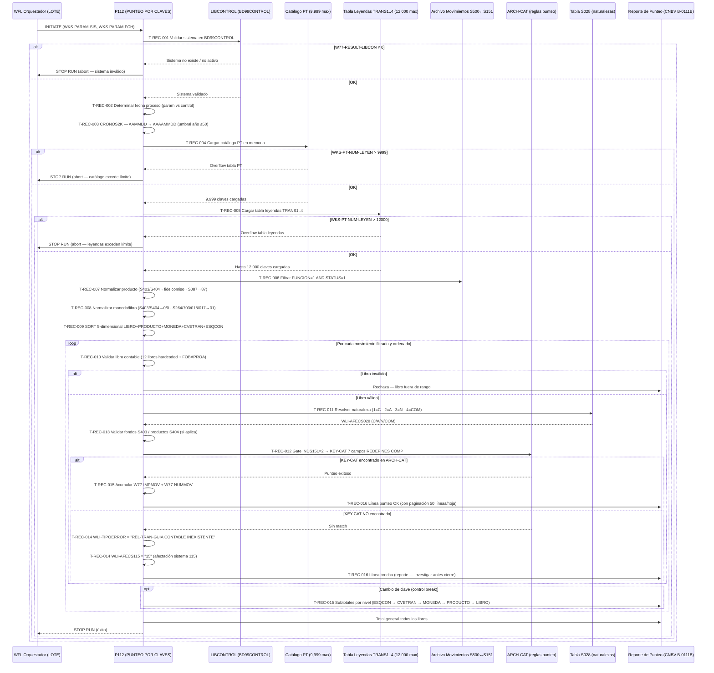

# Capacidad: Financial Reconciliation — Punteo por Claves de Transacción [S151]
> Dominio: 6 · Common Services · Subdominio: Reconciliation
> Capacidad: **6.7.1 Financial Reconciliation**
> Cobertura: S151 · Programa principal: P112 (PUNTEO POR CLAVES DE TRANSACCION)
> Reglas vinculadas: RN-S151-001..020 (20 reglas)
> Contexto: P112 reconcilia diariamente los movimientos S500 (Captación/Cargos y Abonos) contra S151 (GL — Movimientos Contables). Su salida determina si cada movimiento tiene guía contable equivalente en el otro sistema. Las brechas de reconciliación son reportables al regulador (CNBV B-0111B).

---

## Inventario de Tareas

| ID | Tarea | Programa | Componente fuente | Tipo |
|----|-------|----------|-------------------|------|
| T-REC-001 | Validar que el sistema existe y está activo en BD99CONTROL vía LIBCONTROL | P112 | COBOL_P112.txt | validación |
| T-REC-002 | Determinar fecha de proceso: parámetro WKS-PARAM-FCH prevalece sobre base de control | P112 | COBOL_P112.txt | control |
| T-REC-003 | Convertir fecha a 8 dígitos (AAAAMMDD) desde 6 dígitos (AAMMDD) vía parche CRONOS2K (umbral año ≤50 = siglo XXI) | P112 | COBOL_P112.txt | control |
| T-REC-004 | Cargar catálogo paramétrico PT en memoria: máx 9,999 claves (WKS-PT-CGENTRA, NATS028, INDS151, INDBITA) | P112 | COBOL_P112.txt | control |
| T-REC-005 | Cargar tabla de leyendas TRANS1..4 en memoria: máx 12,000 claves distribuidas en 4 segmentos de 3,000 | P112 | COBOL_P112.txt | control |
| T-REC-006 | Filtrar archivo de entrada: solo FUNCION=1 (alta) AND STATUS=1 (pendiente punteo) | P112 | COBOL_P112.txt | validación |
| T-REC-007 | Normalizar campo de producto: S403/S404→número de fideicomiso (A00-R01-FIDEICO); S087→código 87 hardcoded | P112 | COBOL_P112.txt | validación |
| T-REC-008 | Normalizar moneda y libro para lookup: S403/S404→CAT-MON=0·CAT-LIBRO=0; S264/S703/S018/S017→CAT-MON=01 (MXN) | P112 | COBOL_P112.txt | validación |
| T-REC-009 | Ordenar movimientos filtrados por clave 5-dimensional LIBRO+PRODUCTO+MONEDA+CVETRAN+ESQCON (16 posiciones) | P112 | COBOL_P112.txt | control |
| T-REC-010 | Validar libro contable del movimiento contra tabla interna de 12 libros hardcoded (incluye FOBAPROA) | P112 | COBOL_P112.txt | validación |
| T-REC-011 | Resolver naturaleza contable del movimiento consultando tabla S028: 1=CARGO · 2=ABONO · 3=NEUTRO · 4=COMPENSACION | P112 | COBOL_P112.txt | contable |
| T-REC-012 | Gate de equivalencia INDS151=2: construir KEY-CAT 7 campos (REDEFINES COMP) y buscar en ARCH-CAT | P112 | COBOL_P112.txt | contable |
| T-REC-013 | Validar fondos S403 (FIRA/FONATUR/BANCOMEXT/NAFIN) y 9 productos S404 hardcoded | P112 | COBOL_P112.txt | validación |
| T-REC-014 | Reportar brecha: emitir "REL-TRAN-GUIA CONTABLE INEXISTENTE" en WLI-TIPOERROR → WLI-AFECS115=15 | P112 | COBOL_P112.txt | contable |
| T-REC-015 | Acumular totales en control break 5 niveles (LIBRO › PRODUCTO › MONEDA › CVETRAN › ESQCON) con W77-IMPMOV + W77-NUMMOV | P112 | COBOL_P112.txt | contable |
| T-REC-016 | Paginar reporte: 50 líneas/hoja, encabezado con fecha + número de hoja + "....CONTINUA" al pie | P112 | COBOL_P112.txt | escritura |

---

## Casuísticas

### CS-REC-01: Punteo exitoso — movimiento con guía contable en ARCH-CAT (happy path)
**Tipo:** happy-path
**Condición de entrada:** Movimiento con FUNCION=1, STATUS=1, libro válido (01-12), INDS151=2; KEY-CAT (sistema+cvetran+esqcon+moneda+libro+cia+guia) localizado en ARCH-CAT
**Resultado:** Movimiento punteado exitosamente; naturaleza S028 resuelta (CARGO/ABONO); acumulado en totales del grupo de clave; línea de punteo impresa en reporte sin error
**Secuencia:**
```
T-REC-001 (sistema válido) → T-REC-002 → T-REC-003
  → T-REC-004 (PT cargado OK) → T-REC-005 (leyendas OK)
  → T-REC-006 (registro pasa filtro) → T-REC-007 (producto normalizado)
  → T-REC-008 (moneda/libro OK) → T-REC-009 (sort)
  → [ciclo por cada registro]
    → T-REC-010 (libro válido 01-12) → T-REC-011 (naturaleza CARGO/ABONO)
    → T-REC-012 (KEY-CAT → match ARCH-CAT → punteo exitoso)
    → T-REC-015 (acumula W77-IMPMOV + W77-NUMMOV)
    → T-REC-016 (línea reporte)
  → [control break al cambio de clave]
    → T-REC-015 (imprime subtotales por nivel)
```

### CS-REC-02: Brecha de reconciliación — guía contable inexistente en ARCH-CAT
**Tipo:** error-negocio (reportable CNBV)
**Condición de entrada:** Movimiento con FUNCION=1, STATUS=1, INDS151=2; KEY-CAT construido con los 7 campos pero NO localizado en ARCH-CAT
**Resultado:** Brecha registrada: WLI-TIPOERROR = "REL-TRAN-GUIA CONTABLE INEXISTENTE" (35 caracteres exactos), WLI-AFECS115 = "15"; línea de error impresa en reporte; WKS-CONTADOR-BRECHAS incrementado; movimiento no punteado; debe investigarse antes del cierre contable
**Secuencia:**
```
T-REC-010 → T-REC-011 → T-REC-012 (KEY-CAT → NO match en ARCH-CAT)
  → T-REC-014 (emite REL-TRAN-GUIA CONTABLE INEXISTENTE + AFECS115=15)
  → T-REC-016 (imprime línea de error en reporte)
```

### CS-REC-03: Movimiento fiduciario S403 (FIRA/FONATUR/BANCOMEXT/NAFIN)
**Tipo:** happy-path (ruta diferenciada regulatoria)
**Condición de entrada:** A00-R01-IND-CONTA = "S403"; número de fideicomiso válido dentro del fondo (FIRA, FONATUR, BANCOMEXT o NAFIN)
**Resultado:** Producto sustituido por número de fideicomiso en WKS-RS-NUM-PRODUCTO; CAT-MON forzado a 0 (genérico); CAT-LIBRO forzado a 0 (genérico); todos los movimientos del mismo fideicomiso agrupados bajo la misma clave de punteo; segmentación regulatoria CNBV preservada
**Secuencia:**
```
T-REC-006 (pasa filtro) → T-REC-007 (S403 → WKS-RS-NUM-PRODUCTO = A00-R01-FIDEICO)
  → T-REC-008 (S403 → CAT-MON=0 · CAT-LIBRO=0)
  → T-REC-013 (valida fondo FIRA/FONATUR/BANCOMEXT/NAFIN)
  → T-REC-012 (KEY-CAT con producto=fideicomiso, moneda=0, libro=0 → ARCH-CAT)
```

### CS-REC-04: Overflow catálogo PT — abort antes de procesar cualquier movimiento
**Tipo:** error-sistema (crítico)
**Condición de entrada:** El catálogo paramétrico tiene más de 9,999 registros en la ejecución actual
**Resultado:** P112 aborta durante la fase de carga del catálogo PT (T-REC-004) antes de filtrar o puntear ningún movimiento; toda la reconciliación del día falla; el reporte queda vacío; operaciones requieren investigación y reproceso manual
**Secuencia:**
```
T-REC-001 (OK) → T-REC-002 → T-REC-003
  → T-REC-004 (WKS-PT-NUM-LEYEN > 9,999)
    → DISPLAY "ERROR: OVERFLOW CATALOGO PT - LIMITE 9999"
    → STOP RUN (abort total — ningún movimiento procesado)
```

### CS-REC-05: Movimiento S264/SPEI con moneda distinta a MXN — brecha silenciosa
**Tipo:** edge-case (riesgo regulatorio)
**Condición de entrada:** WKS-PARAM-SIS = 264 (SPEI/compensación); movimiento con moneda USD u otra divisa extranjera
**Resultado:** CAT-MON forzado a 01 (MXN) en T-REC-008; KEY-CAT generado con moneda=01 no existe en ARCH-CAT (porque el movimiento es en USD); brecha reportada como "REL-TRAN-GUIA CONTABLE INEXISTENTE" sin indicar que la causa es la restricción de moneda; el equipo contable no identifica la causa raíz en el reporte
**Secuencia:**
```
T-REC-007 (S264 normaliza producto) → T-REC-008 (S264 → CAT-MON=01, forzado a MXN)
  → T-REC-012 (KEY-CAT con moneda=01 → NO match → brecha)
  → T-REC-014 (REL-TRAN-GUIA CONTABLE INEXISTENTE — causa real invisible)
```

### CS-REC-06: Sistema no existente en BD99CONTROL — abort en inicialización
**Tipo:** error-sistema
**Condición de entrada:** WKS-PARAM-SIS recibido del JCL no existe o no está activo en BD99CONTROL; W77-RESULT-LIBCON ≠ 0
**Resultado:** P112 aborta en T-REC-001 antes de cargar catálogos o procesar registros; mensaje "ERROR: SISTEMA NO EXISTE EN BASE DE CONTROL" impreso; sin timeout documentado — si BD99CONTROL no responde, el proceso puede quedar colgado indefinidamente
**Secuencia:**
```
T-REC-001 (CALL LIBCONTROL → W77-RESULT-LIBCON ≠ 0)
  → DISPLAY "ERROR: SISTEMA NO EXISTE EN BASE DE CONTROL"
  → STOP RUN (abort total en inicialización)
```

---

## Diagrama



---

## Reglas vinculadas a tareas

| Tarea | Regla | Componente fuente | Descripción | Tags |
|-------|-------|-------------------|-------------|------|
| T-REC-001 | RN-S151-001 | COBOL_P112.txt | Validación de sistema en BD99CONTROL antes de iniciar | — |
| T-REC-002 | RN-S151-002 | COBOL_P112.txt | Fecha proceso: parámetro prevalece sobre base de control | — |
| T-REC-003 | RN-S151-019 | COBOL_P112.txt | CRONOS2K — conversión año 2 dígitos a 4 (umbral 50) | `[HARDCODE-SOSPECHOSO]` |
| T-REC-004 | RN-S151-013 | COBOL_P112.txt | Límite 9,999 claves en catálogo PT — overflow aborta todo | `[HARDCODE-SOSPECHOSO]` |
| T-REC-005 | RN-S151-012 | COBOL_P112.txt | Límite 12,000 claves en tablas TRANS1..4 — overflow aborta todo | `[HARDCODE-SOSPECHOSO]` |
| T-REC-006 | RN-S151-003 | COBOL_P112.txt | Filtro doble FUNCION=1 AND STATUS=1 — silencioso para otros valores | — |
| T-REC-007 | RN-S151-005 | COBOL_P112.txt | S403/S404 fideicomiso como producto (segmentación CNBV) | `[REGLA-CNBV]` |
| T-REC-007 | RN-S151-006 | COBOL_P112.txt | S087 producto hardcoded=87 sin leer A00-R01-PRODUCTO | `[HARDCODE-SOSPECHOSO]` |
| T-REC-008 | RN-S151-010 | COBOL_P112.txt | Normalización MON=0 · LIBRO=0 para S403/S404 antes de ARCH-CAT | — |
| T-REC-008 | RN-S151-011 | COBOL_P112.txt | S264/S703/S018/S017 solo moneda base MXN (CAT-MON=01) | — |
| T-REC-009 | RN-S151-004 | COBOL_P112.txt | Sort 5-dimensional: LIBRO+PRODUCTO+MONEDA+CVETRAN+ESQCON | — |
| T-REC-010 | RN-S151-015 | COBOL_P112.txt | 12 libros contables hardcoded (incl. FOBAPROA residual 1994-1995) | `[HARDCODE-SOSPECHOSO]` `[REGLA-CNBV]` |
| T-REC-011 | RN-S151-007 | COBOL_P112.txt | Naturaleza S028: 1=CARGO · 2=ABONO · 3=NEUTRO · 4=COMPENSACION | — |
| T-REC-012 | RN-S151-008 | COBOL_P112.txt | Gate equivalencia: INDS151=2 + match ARCH-CAT → punteo | `[RIESGO-EQUIVALENCIA]` |
| T-REC-012 | RN-S151-009 | COBOL_P112.txt | Clave ARCH-CAT: 7 campos REDEFINES COMP (frágil ante cambios layout) | — |
| T-REC-013 | RN-S151-016 | COBOL_P112.txt | S403: fondos válidos hardcoded FIRA/FONATUR/BANCOMEXT/NAFIN | `[HARDCODE-SOSPECHOSO]` |
| T-REC-013 | RN-S151-017 | COBOL_P112.txt | S404: 9 tipos de producto hardcoded — descarte silencioso si hay 10° | `[HARDCODE-SOSPECHOSO]` |
| T-REC-014 | RN-S151-020 | COBOL_P112.txt | "REL-TRAN-GUIA CONTABLE INEXISTENTE" — diagnóstico brecha (texto exacto 35 chars) | `[RIESGO-EQUIVALENCIA]` |
| T-REC-015 | RN-S151-014 | COBOL_P112.txt | 5 niveles de control break — totales jerárquicos del reporte | — |
| T-REC-016 | RN-S151-018 | COBOL_P112.txt | Paginación 50 líneas/hoja + encabezado + literal "....CONTINUA" | — |

---

## Hallazgos de migración críticos

| Riesgo | Tarea | Severidad | Acción requerida |
|--------|-------|-----------|-----------------|
| Gate de equivalencia ARCH-CAT: cualquier cambio en guía contable rompe reconciliación | T-REC-012 | 🟠 CRÍTICO | Externalizar ARCH-CAT a base de datos configurable; implementar versionado de guías contables; pruebas de equivalencia 100% de combinaciones antes de go-live |
| Clave KEY-CAT con REDEFINES COMP — frágil ante cambios de layout | T-REC-012 | 🟠 CRÍTICO | Reescribir acceso como consulta parametrizada con 7 columnas explícitas; nunca usar REDEFINES en arquitectura target |
| Overflow catálogo PT (9,999) / tabla leyendas (12,000) aborta reconciliación total | T-REC-004, T-REC-005 | 🟠 CRÍTICO | Eliminar límites hardcoded; usar estructuras dinámicas (List/Map) en target; monitorear crecimiento del catálogo |
| Texto "REL-TRAN-GUIA CONTABLE INEXISTENTE" exacto de 35 chars — parsers downstream dependen de él | T-REC-014 | 🟠 CRÍTICO | Documentar y versionar el texto exacto como contrato de interfaz; implementar código de error estructurado en target |
| 12 libros hardcoded incl. FOBAPROA — nuevo libro regulatorio CNBV requiere recompilación | T-REC-010 | 🟡 ALTO | Mover catálogo de libros a tabla configurable en base de datos; gestionar via configuración sin recompilación |
| S087 producto=87 hardcoded — nuevos productos ignorados silenciosamente | T-REC-007 | 🟡 ALTO | Reemplazar por lectura real de A00-R01-PRODUCTO; validar con equipo S087 |
| CRONOS2K — datos con año > 50 interpretados como siglo XIX (bomba de tiempo 2051) | T-REC-003 | 🟡 ALTO | Eliminar lógica CRONOS2K; usar tipo DATE nativo del target con 4 dígitos de año |
| Filtro FUNCION=1/STATUS=1 silencioso — STATUS=0 nunca procesado sin traza | T-REC-006 | 🟡 MEDIO | Agregar contadores de registros descartados por filtro; loggear causas de exclusión |
| S264/S703/S018/S017 restringidos a MXN — brecha silenciosa por moneda sin diagnóstico de causa | T-REC-008 | 🟡 MEDIO | Emitir código de error específico "RESTRICCION-MONEDA-BASE" en lugar de caer en la brecha genérica |
| S403 fondos y S404 productos hardcoded — nuevos fondos/productos descartados silenciosamente | T-REC-013 | 🟡 MEDIO | Externalizar listas de fondos y productos a catálogos configurables |

---

## Dependencias de datos del sistema

```
P112 LEE:
  ← Movimientos de S500 (Captación) con estatus y función — entrada primaria
  ← BD99CONTROL (LIBCONTROL) — control de proceso batch
  ← ARCH-CAT — reglas de punteo (7 campos por clave)
  ← Tabla S028 — catálogo de naturalezas contables
  ← WFL JCL — WKS-PARAM-SIS (sistema) y WKS-PARAM-FCH (fecha)

P112 ESCRIBE:
  → Reporte de punteo (CNBV B-0111B) — brechas + totales por 5 dimensiones
  → Sistema 115 (WLI-AFECS115=15) — notificación de brechas de reconciliación

P112 en la secuencia WFL_LOTE.txt:
  P109 (GL posting engine) → P112 (punteo/reconciliación) → P111 (siguiente paso)
```

---

## Trazabilidad completa (ejemplo RN-S151-008)

```
Regla: RN-S151-008 — Gate equivalencia S500↔S151 via INDS151=2 y guía contable
  → Tarea: T-REC-012 — Gate de equivalencia INDS151=2 → lookup ARCH-CAT por KEY-CAT
    → Programa: P112 (PUNTEO POR CLAVES DE TRANSACCION)
      → Componente fuente: COBOL_P112.txt (~3,326 LOC)
        → Párrafo: BUSCA-EN-ARCH-CAT
          → Casuísticas: CS-REC-01 (punteo exitoso) / CS-REC-02 (brecha)
            → Diagrama: rama "KEY-CAT encontrado / NO encontrado en ARCH-CAT"
              → Riesgo de migración: 🟠 CRÍTICO — "Gate de equivalencia ARCH-CAT"
```

---

*cap-rec.md · v1.0 · 2026-07-16 · Capa 4 (Inventario de Tareas) + Capa 5 (Casuísticas + Diagrama Mermaid)*
*Capacidad: 6.7.1 Financial Reconciliation · Sistema: S151 · Programa: P112 (PUNTEO POR CLAVES DE TRANSACCION)*
*Cross-referencia: RN-S151-001..020 · rules-catalog/rules-s151-p112.md · capability-map.md · kb-capa3-capacidades.md*