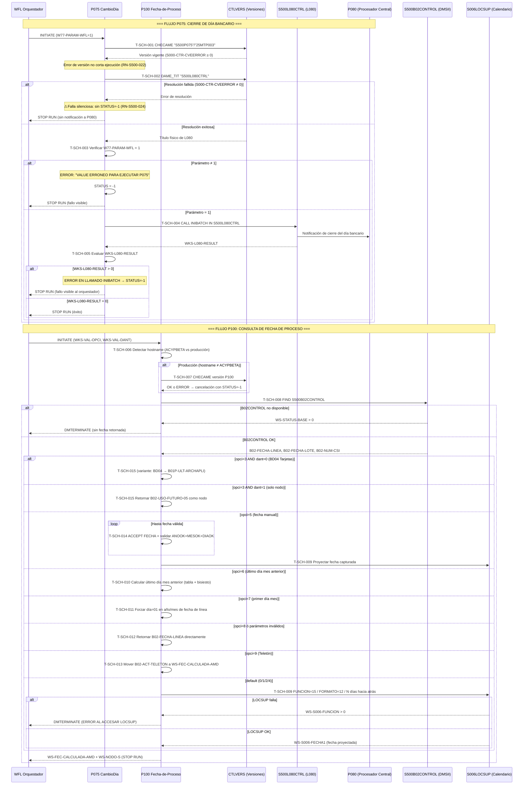

# Capacidad: Business Scheduling — Cierre de Día y Oracle de Fechas [compartida]
> Dominio: 8 · Technology Tools · Subdominio: Business Scheduling · Cobertura: S500+S151
> Programas principales: P075 · P100 · Reglas vinculadas: RN-S500-009..026

---

## Contexto funcional

La capacidad **8.1.1 Business Scheduling** agrupa los dos mecanismos que gobiernan el tiempo operativo del sistema S500 en Unisys ClearPath MCP: el **disparo del cierre del día bancario** (P075 CambioDia) y el **oracle centralizado de fechas de proceso** (P100 Fecha-de-Proceso).

P075 es un programa batch minimalista — 5 reglas, menos de 200 líneas — cuya única responsabilidad es notificar al procesador central L080 (vía entry point INIBATCH) que el día bancario ha concluido. Sin esa notificación, ningún proceso del ciclo nocturno de S500 puede avanzar. El parámetro `W77-PARAM-WFL = 1`, enviado por el WFL orquestador, actúa como llave de seguridad: sin él, el aviso de cierre no se emite aunque todos los programas previos hayan terminado exitosamente.

P100 es el servicio de consulta que el resto del sistema utiliza para obtener cualquier variante de fecha de proceso: fecha de línea, fecha proyectada N días atrás, primer o último día del mes, nodo activo, o fecha capturada manualmente. Sus 13 reglas (opciones 0 a 9, más 31) forman el único punto de verdad temporal del sistema — ningún programa debería calcular fechas de proceso de forma independiente. La librería externa `S006LOCSUP` realiza la aritmética de días hábiles/naturales bancarios.

Ambos programas comparten el patrón de verificación de versión contra `CTLVERS`, acceso al registro de control `S500B02CONTROL`, y terminación vía `CALL SYSTEM DMTERMINATE` en caso de fallo de infraestructura.

---

## Inventario de Tareas

| ID | Tarea | Programa | Componente fuente | Tipo |
|----|-------|----------|-------------------|------|
| T-SCH-001 | Validar versión de P075 contra catálogo central CTLVERS (CHECAME) | P075 | COBOL_P075.txt | validación |
| T-SCH-002 | Resolver título físico de librería L080 vía DAME_TIT IN CTLVERS | P075 | COBOL_P075.txt | control |
| T-SCH-003 | Verificar parámetro de ejecución W77-PARAM-WFL = 1 antes de notificar cierre | P075 | COBOL_P075.txt | validación |
| T-SCH-004 | Invocar INIBATCH de S500L080CTRL para notificar cierre del día bancario a P080 | P075 | COBOL_P075.txt | control |
| T-SCH-005 | Evaluar WKS-L080-RESULT y marcar estatus de fallo si INIBATCH falla | P075 | COBOL_P075.txt | control |
| T-SCH-006 | Detectar entorno de ejecución por hostname (ACYPBETA vs producción) | P100 | COBOL_P100.txt | control |
| T-SCH-007 | Validar versión de P100 contra catálogo central CTLVERS (en producción) | P100 | COBOL_P100.txt | validación |
| T-SCH-008 | Consultar S500B02CONTROL para obtener fecha de línea, fecha de lote y nodo activo | P100 | COBOL_P100.txt | consulta |
| T-SCH-009 | Proyectar fecha de proceso hacia atrás N días hábiles/naturales vía S006LOCSUP función 15 | P100 | COBOL_P100.txt | control |
| T-SCH-010 | Calcular último día del mes anterior a la fecha de línea (opción 6) | P100 | COBOL_P100.txt | control |
| T-SCH-011 | Calcular primer día del mes de la fecha de línea (opción 7) | P100 | COBOL_P100.txt | control |
| T-SCH-012 | Retornar fecha de línea sin proyección (opción 8 / fallback de parámetros inválidos) | P100 | COBOL_P100.txt | consulta |
| T-SCH-013 | Consultar indicador de campaña Teletón activo en S500B02CONTROL (opción 9) | P100 | COBOL_P100.txt | consulta |
| T-SCH-014 | Capturar y validar fecha manual por teclado (opción 5) con bucle de reintentos | P100 | COBOL_P100.txt | validación |
| T-SCH-015 | Retornar nodo activo (B02-USO-FUTURO-05) sin fecha (opción 31) | P100 | COBOL_P100.txt | consulta |

---

## Casuísticas

### CS-SCH-01: Cierre de día bancario exitoso
**Tipo:** happy-path
**Condición de entrada:** WFL lanza P075 con `W77-PARAM-WFL = 1`; versión S500P075/25MTP003 vigente en CTLVERS; librería S500L080CTRL accesible y resoluble
**Resultado:** INIBATCH ejecutado exitosamente (WKS-L080-RESULT = 0); P080 reconoce el cierre del día; P075 termina con STOP RUN sin estatus de fallo; el ciclo batch nocturno puede avanzar
**Secuencia:**
```
T-SCH-001 → T-SCH-002 → T-SCH-003 (param=1 OK)
  → T-SCH-004 → T-SCH-005 (result=0 → OK)
  → STOP RUN
```

### CS-SCH-02: Falla de INIBATCH — error visible al orquestador
**Tipo:** error
**Condición de entrada:** L080 resuelto correctamente, `W77-PARAM-WFL = 1`, pero P080 rechaza la notificación de cierre (`WKS-L080-RESULT > 0`)
**Resultado:** Mensaje "ERROR EN LLAMADO INIBATCH" registrado; `CHANGE ATTRIBUTE STATUS OF MYSELF = -1` emitido; STOP RUN termina el programa con estatus de fallo visible; el WFL orquestador detecta el error y detiene el job stream del ciclo batch
**Secuencia:**
```
T-SCH-001 → T-SCH-002 → T-SCH-003 (param=1 OK)
  → T-SCH-004 → T-SCH-005 (result > 0 → ERROR)
  → CHANGE ATTRIBUTE STATUS = -1 → STOP RUN
```

### CS-SCH-03: Falla silenciosa — L080 no resuelve, cierre omitido sin alarma
**Tipo:** edge-case (riesgo crítico)
**Condición de entrada:** DAME_TIT IN CTLVERS falla al resolver el título físico de S500L080CTRL (`S000-CTR-CVEERROR ≠ 0`)
**Resultado:** Mensaje de error registrado pero el estatus del programa NO se marca como fallido; la condición de la regla (T-SCH-003) queda en falso; P080 nunca recibe la notificación de cierre del día; el ciclo batch nocturno se bloquea silenciosamente sin señal visible al orquestador
**Secuencia:**
```
T-SCH-001 → T-SCH-002 (ERROR: DAME_TIT falla, sin STATUS=-1)
  → condición T-SCH-003 no evaluada (S000-CTR-CVEERROR ≠ 0)
  → STOP RUN sin notificación a P080
```

### CS-SCH-04: Consulta de fecha de proceso estándar (proyección por defecto)
**Tipo:** happy-path
**Condición de entrada:** Workflow invoca P100 sin opción especial (opciones 0/2/4 o sin parámetros); `S500B02CONTROL` legible; `S006LOCSUP` accesible
**Resultado:** Fecha de proceso proyectada 2 días hábiles/naturales hacia atrás desde `B02-FECHA-LINEA` retornada en `WS-FEC-CALCULADA-AMD`; nodo activo en `WS-NODO-S`
**Secuencia:**
```
T-SCH-006 → T-SCH-007 (si producción)
  → T-SCH-008 (leer B02CONTROL)
  → T-SCH-009 (S006LOCSUP func=15, días=2)
  → retornar WS-FEC-CALCULADA-AMD + WS-NODO-S
```

### CS-SCH-05: Override de fecha manual por operador (opción 5)
**Tipo:** edge-case
**Condición de entrada:** Workflow solicita opción 5; operador ingresa fecha manualmente por teclado
**Resultado:** Bucle de captura activo hasta que el operador ingrese fecha con año 1989-2999, mes 1-12, día 1-31; fecha capturada proyectada por S006LOCSUP y retornada como fecha de proceso; la fecha calculada por defecto es descartada y reemplazada por la capturada
**Secuencia:**
```
T-SCH-006 → T-SCH-007 → T-SCH-008
  → T-SCH-009 (proyección inicial)
  → T-SCH-014 (bucle ACCEPT + validación)
  → retornar fecha capturada como WS-FEC-CALCULADA-AMD
```

### CS-SCH-06: Parámetros inválidos — fallback silencioso a fecha de línea
**Tipo:** edge-case
**Condición de entrada:** Workflow envía combinación inválida: opción > 0 Y días > 0 al mismo tiempo, o bien opción 3 con días > 1
**Resultado:** Sin mensaje de error al caller; P100 retorna `B02-FECHA-LINEA` directamente sin proyección; el caller puede no detectar el error de integración — la fecha válida recibida enmascara la combinación incorrecta de parámetros
**Secuencia:**
```
T-SCH-006 → T-SCH-007 → T-SCH-008
  → T-SCH-012 (fallback: retorna B02-FECHA-LINEA directamente)
```

---

## Diagrama



---

## Reglas vinculadas

| Tarea | Regla | Componente fuente | Descripción |
|-------|-------|-------------------|-------------|
| T-SCH-001 | RN-S500-022 | COBOL_P075.txt | Validación de versión sin corte de ejecución |
| T-SCH-002 | RN-S500-024 | COBOL_P075.txt | Resolución dinámica de L080 con falla silenciosa |
| T-SCH-003 | RN-S500-023 | COBOL_P075.txt | Notificación de cierre condicional a L080 y parámetro |
| T-SCH-004 | RN-S500-025 | COBOL_P075.txt | Llamada INIBATCH notifica cierre del día bancario |
| T-SCH-005 | RN-S500-026 | COBOL_P075.txt | Falla INIBATCH marca estatus de error visible |
| T-SCH-006 | RN-S500-009 | COBOL_P100.txt | Detección servidor de desarrollo ACYPBETA |
| T-SCH-007 | RN-S500-010 | COBOL_P100.txt | Cancelación por versión de software no vigente |
| T-SCH-008 | RN-S500-012 | COBOL_P100.txt | Cancelación por registro de control vacío o ilegible |
| T-SCH-009 | RN-S500-021 | COBOL_P100.txt | Proyección por defecto de fecha hacia atrás (S006LOCSUP func=15) |
| T-SCH-009 | RN-S500-018 | COBOL_P100.txt | Cancelación por fallo de acceso a librería LOCSUP |
| T-SCH-010 | RN-S500-017 | COBOL_P100.txt | Cálculo de último día del mes anterior opción 6 |
| T-SCH-011 | RN-S500-019 | COBOL_P100.txt | Retorno del primer día del mes opción 7 |
| T-SCH-012 | RN-S500-020 | COBOL_P100.txt | Retorno de fecha de línea sin proyección opción 8 |
| T-SCH-012 | RN-S500-014 | COBOL_P100.txt | Fallback a fecha de línea por parámetros inválidos |
| T-SCH-013 | RN-S500-016 | COBOL_P100.txt | Consulta indicador campaña Teletón opción 9 |
| T-SCH-014 | RN-S500-015 | COBOL_P100.txt | Captura y validación manual de fecha opción 5 |
| T-SCH-015 | RN-S500-013 | COBOL_P100.txt | Retorno de nodo activo sin fecha con opción 31 |
| T-SCH-015 | RN-S500-011 | COBOL_P100.txt | Selección BD04 Tarjetas vs BD01 Captación opción 3 |

---

## Hallazgos de migración críticos

| Riesgo | Tarea | Severidad | Acción requerida |
|--------|-------|-----------|-----------------|
| Falla silenciosa de resolución L080: P075 no notifica cierre sin emitir STATUS=-1 ni señal al orquestador | T-SCH-002 | 🟠 CRÍTICO | Instrumentar la ruta de falla de DAME_TIT con exit code no-cero; el orquestador cloud no tiene forma de detectar el cierre omitido sin esta señal |
| `CHANGE ATTRIBUTE TITLE` (resolución dinámica de librería MCP) no tiene equivalente en Java/cloud | T-SCH-002, T-SCH-004 | 🟠 CRÍTICO | Reemplazar con service discovery o ConfigMap versionado; el contrato de versionado de L080/INIBATCH debe preservarse explícitamente en el servicio moderno equivalente |
| `CALL SYSTEM DMTERMINATE` como mecanismo de abort (P075 y P100) | T-SCH-004, T-SCH-008, T-SCH-009 | 🟠 CRÍTICO | Reemplazar por exit code no-cero y manejo de excepciones en la plataforma destino; el orquestador cloud debe recibir la señal de fallo para no avanzar al siguiente paso del batch |
| `ACCEPT FECHA` (interacción con terminal MCP) en opción 5 no tiene equivalente en arquitectura batch/API | T-SCH-014 | 🟡 ALTO | Reemplazar por parámetro de entrada explícito (override de fecha) en el API o archivo de configuración de la ejecución; eliminar el ACCEPT en la migración |
| `S006LOCSUP` función 15 es el único calendarizador bancario del sistema; su contrato no está documentado formalmente | T-SCH-009 | 🟡 ALTO | Mapear explícitamente la semántica de "N días hábiles/naturales" de LOCSUP antes de migrar; el servicio de calendario sustituto debe replicar exactamente el mismo resultado para las mismas entradas |
| `B02-USO-FUTURO-05` documentado como "reservado" en DASDL pero usado en producción como identificador de nodo activo | T-SCH-015 | 🟡 ALTO | Renombrar y documentar explícitamente en el modelo de datos destino; si se elimina por "inutilizado", la opción 31 queda sin datos de nodo |
| Fallback silencioso de P100 con parámetros inválidos: retorna fecha válida sin error, enmascarando errores de integración | T-SCH-012 | 🟡 ALTO | En la plataforma moderna retornar código de advertencia o lanzar excepción para combinaciones inválidas de parámetros; el caller debe detectar el error de integración |
| Bug de bisiesto en opción 6: año 2100 calculado como bisiesto (29 días en febrero) cuando el gregoriano real indica 28 | T-SCH-010 | 🟢 BAJO | Corregir la lógica de bisiesto en la migración aplicando la excepción gregoriana de siglo (no bisiesto si divisible entre 100 y no entre 400) |
| Hostname hardcodeado "ACYPBETA. " (con espacio de relleno) como bypass de verificación de versión | T-SCH-006 | 🟢 BAJO | Eliminar o reemplazar por variable de entorno `ENV=DEV`; si se migra literalmente, ningún ambiente de desarrollo moderno activará el bypass |

---

*cap-sch.md · v1.0 · 2026-07-16 · Capa 4 (Inventario de Tareas) + Capa 5 (Casuísticas + Diagrama Mermaid)*
*Capacidad: 8.1.1 Scheduling · Sistema: S500+S151 · Programas: P075 · P100*
*Cross-referencia: RN-S500-022..026 · RN-S500-009..021 · rules-catalog/rules-s500.md · capability-map.md*
