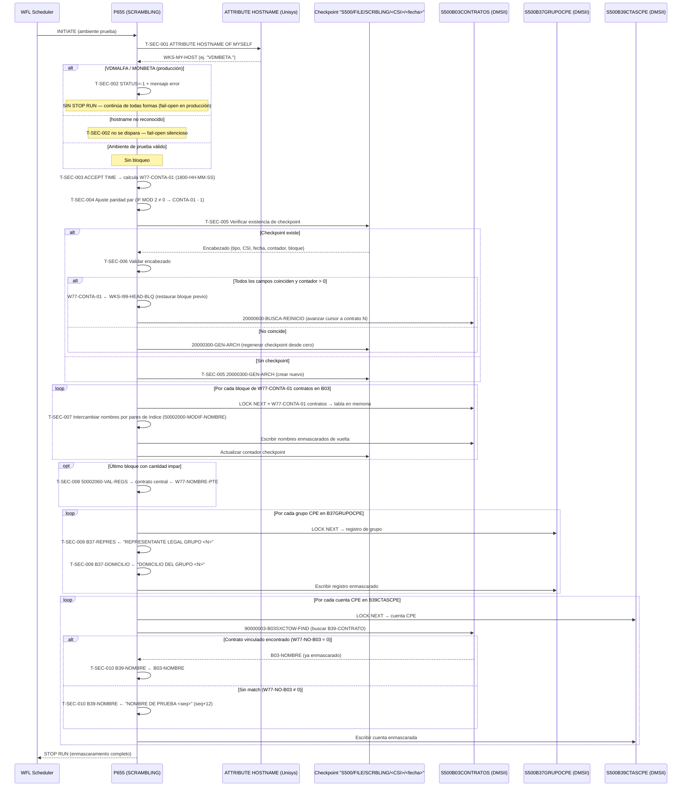

# Capacidad: Security — Enmascaramiento de Datos PII [S500]
> Dominio: T · Transversal · Subdominio: Security
> Capacidad: **T.3.5 Security** (también cubre parcialmente: **10.1.1 Access Control**)
> Cobertura: S500 · Programa principal: P655 (SCRAMBLING)
> Reglas vinculadas: RN-S500-027..036 (10 reglas)
> Contexto: P655 enmascara datos personales (nombres de titulares, representantes legales y domicilios de cuentas de captación) en las bases DMSII de S500 para su uso en ambientes de prueba. Protege PII de acuerdo con PCI-DSS y obligaciones de privacidad de datos bancarios (Banco de México, CNBV). Opera exclusivamente en ambientes no-productivos — pero contiene un defecto de seguridad documentado (fail-open) que permite ejecución en producción si el hostname no está en la lista reconocida.

---

## Inventario de Tareas

| ID | Tarea | Programa | Componente fuente | Tipo |
|----|-------|----------|-------------------|------|
| T-SEC-001 | Clasificar ambiente por hostname: comparar ATTRIBUTE HOSTNAME contra lista cerrada de 7 nombres (VDMALFA/MONBETA=producción; VDMBETA/ACYPGAMA/ACYPBETA/MONALFA/ACYPOMEGA=prueba) | P655 | COBOL_P655.txt | validación |
| T-SEC-002 | Detectar ejecución en producción: emitir mensaje "NO CORRE EN PRODUCCION; HOST: <hostname>", marcar STATUS=-1 — sin STOP RUN (fail-open) | P655 | COBOL_P655.txt | validación |
| T-SEC-003 | Calcular tamaño de bloque de intercambio variable por hora de arranque: ACYPBETA→200-HH-MM-SS; otros→1800-HH-MM-SS | P655 | COBOL_P655.txt | control |
| T-SEC-004 | Ajustar paridad par del bloque: si W77-CONTA-01 MOD 2 ≠ 0, restar 1 para garantizar intercambios simétricos | P655 | COBOL_P655.txt | control |
| T-SEC-005 | Verificar checkpoint en disco ("S500/FILE/SCRBLING/<CSI>/<fecha>"): si existe → intentar reanudación; si no → crear nuevo y arrancar desde cero | P655 | COBOL_P655.txt | control |
| T-SEC-006 | Validar checkpoint (tipo + CSI + fecha + contador): si coincide y contador > 0 → restaurar tamaño de bloque previo (WKS-I99-HEAD-BLQ sobreescribe W77-CONTA-01) y reanudar desde contrato N; si no coincide → regenerar y arrancar desde cero | P655 | COBOL_P655.txt | control |
| T-SEC-007 | Enmascarar nombres de contratos B03CONTRATOS: intercambiar nombres entre pares de contratos dentro del bloque (shuffling por posición de índice WKS-TB-NOM-PREF) | P655 | COBOL_P655.txt | seguridad |
| T-SEC-008 | Manejar último bloque con cantidad impar: al contrato en posición central asignar nombre ya enmascarado del primer contrato leído en el archivo (W77-NOMBRE-PTE) | P655 | COBOL_P655.txt | seguridad |
| T-SEC-009 | Enmascarar representante legal y domicilio de grupos CPE (B37GRUPOCPE): sustituir B37-REPRES por "REPRESENTANTE LEGAL GRUPO <N>" y B37-DOMICILIO por "DOMICILIO DEL GRUPO <N>" | P655 | COBOL_P655.txt | seguridad |
| T-SEC-010 | Enmascarar nombres de cuentas CPE (B39CTASCPE): si contrato vinculado encontrado en B03 → copiar nombre ya enmascarado; si no → generar "NOMBRE DE PRUEBA <seq>" con contador incremental (inicio=10000, paso=12) | P655 | COBOL_P655.txt | seguridad |

---

## Casuísticas

### CS-SEC-01: Enmascaramiento completo exitoso — corrida nueva en ambiente de prueba (happy path)
**Tipo:** happy-path
**Condición de entrada:** Hostname = VDMBETA/ACYPGAMA/MONALFA/ACYPOMEGA (ambiente prueba); sin checkpoint previo; todos los contratos B03, grupos CPE B37 y cuentas CPE B39 disponibles
**Resultado:** Bloque calculado (1800 - HH - MM - SS) ajustado a par; archivo checkpoint creado; nombres de contratos intercambiados por bloques; representantes y domicilios CPE sustituidos; cuentas CPE con nombre consistente con su contrato vinculado; checkpoint actualizado al terminar
**Secuencia:**
```
T-SEC-001 (hostname → prueba) → T-SEC-002 (no bloquea — no producción)
  → T-SEC-003 (bloque = 1800 - tiempo) → T-SEC-004 (ajuste par)
  → T-SEC-005 (no existe checkpoint → crear nuevo)
  → [ciclo B03CONTRATOS por bloques]
    → T-SEC-007 (intercambiar nombres dentro del bloque) × N bloques completos
    → T-SEC-008 (último bloque: si impar → contrato central recibe W77-NOMBRE-PTE)
  → T-SEC-009 (B37GRUPOCPE: LOCK NEXT → sustituir REPRES + DOMICILIO)
  → T-SEC-010 (B39CTASCPE: copiar nombre de B03 o generar sintético)
```

### CS-SEC-02: Fail-open ante hostname no reconocido — enmascaramiento sin control de ambiente
**Tipo:** error-seguridad (🔴 DEFECTO CRÍTICO)
**Condición de entrada:** Hostname no está en ninguno de los 7 nombres reconocidos (p.ej. VDMKAPPA tras failover, o nodo nuevo del banco)
**Resultado:** Ni W77-ES-PRODUCCION ni W77-ES-PRUEBA se activan; el intento de bloqueo (T-SEC-002) no se dispara; el programa trata el host desconocido como no-productivo y ejecuta el enmascaramiento completo sobre las bases DMSII sin ninguna advertencia — inclusive si el host es productivo. Riesgo: el enmascaramiento de datos PII puede ocurrir sobre datos reales de producción
**Secuencia:**
```
T-SEC-001 (hostname NO reconocido → sin clasificación)
  → T-SEC-002 (W77-ES-PRODUCCION = false → no bloquea)
  → T-SEC-003 → T-SEC-004 → ... → T-SEC-010
  [enmascaramiento completo ejecutado sin validación de ambiente]
```

### CS-SEC-03: Reanudación desde checkpoint — corrida interrumpida en contrato N
**Tipo:** happy-path (variante resiliente)
**Condición de entrada:** Corrida anterior interrumpida; archivo "S500/FILE/SCRBLING/<CSI>/<fecha>" existe en disco con encabezado válido (tipo, CSI, fecha y contador > 0 coinciden con la corrida actual)
**Resultado:** Tamaño de bloque del checkpoint (WKS-I99-HEAD-BLQ) sobreescribe el recién calculado (W77-CONTA-01); cursor de B03CONTRATOS avanza hasta el contrato N del checkpoint (20000600-BUSCA-REINICIO); enmascaramiento continúa desde ese punto sin reprocesar contratos anteriores
**Secuencia:**
```
T-SEC-001 → T-SEC-002 → T-SEC-003 → T-SEC-004
  → T-SEC-005 (checkpoint EXISTE)
  → T-SEC-006 (valida → todos los campos coinciden, contador > 0)
    → W77-CONTA-01 = WKS-I99-HEAD-BLQ (restaura bloque previo)
    → cursor B03 avanza a contrato N (20000600-BUSCA-REINICIO)
  → [ciclo B03 retoma desde N]
    → T-SEC-007 / T-SEC-008 → T-SEC-009 → T-SEC-010
```

### CS-SEC-04: "Bloqueo" de producción sin corte real — enmascaramiento continúa en VDMALFA/MONBETA
**Tipo:** error-seguridad (🟠 CRÍTICO)
**Condición de entrada:** Hostname = VDMALFA o MONBETA (servidores productivos del banco); WFL programa P655 en producción por error operativo
**Resultado:** W77-ES-PRODUCCION = true; mensaje "NO CORRE EN PRODUCCION; HOST: <hostname>" emitido; STATUS = -1 marcado; **pero** sin STOP RUN ni GOBACK — el programa continúa abriendo B03CONTRATOS, B37GRUPOCPE y B39CTASCPE productivos y ejecuta el enmascaramiento de PII real sobre la base de datos de producción. El único control real es la disciplina operativa del WFL scheduler
**Secuencia:**
```
T-SEC-001 (hostname = VDMALFA → W77-ES-PRODUCCION = true)
  → T-SEC-002 (STATUS = -1, mensaje error → sin STOP RUN → continúa)
  → T-SEC-003 → T-SEC-004 → T-SEC-005 → T-SEC-006
  → T-SEC-007 → T-SEC-008 → T-SEC-009 → T-SEC-010
  [enmascaramiento completo ejecutado sobre datos PRODUCTIVOS]
```

### CS-SEC-05: Último bloque de contratos con cantidad impar
**Tipo:** edge-case
**Condición de entrada:** Al llegar al fin del cursor B03CONTRATOS (W77-EOF-B03 = 1), el último bloque tiene un número impar de contratos
**Resultado:** Posición central calculada (W77-REG-MEDIO = W77-TOT-DIV + 1); contrato en posición central recibe el nombre ya enmascarado del primer contrato leído en todo el archivo (W77-NOMBRE-PTE, capturado cuando W77-TOT-LEIDOS = 1); el resto de contratos del bloque mantienen el intercambio normal por índice
**Secuencia:**
```
[fin del ciclo B03 → W77-EOF-B03 = 1]
  → T-SEC-008 (50002060-VAL-REGS)
    → DIVIDE W77-LEIDOS BY 2 GIVING W77-TOT-DIV REMAINDER W77-DIV-RESTO
    → IF REMAINDER ≠ 0:
        W77-REG-MEDIO = W77-TOT-DIV + 1
        contrato[W77-REG-MEDIO] ← W77-NOMBRE-PTE (nombre del primer contrato)
    → resto del bloque: intercambio normal por índice
```

### CS-SEC-06: Cuenta CPE sin contrato vinculado en B03 — nombre sintético secuencial
**Tipo:** edge-case
**Condición de entrada:** Cuenta en B39CTASCPE con campo B39-CONTRATO que no localiza match en B03CONTRATOS ya procesados (W77-NO-B03 ≠ 0)
**Resultado:** Nombre generado como "NOMBRE DE PRUEBA <secuencia>" donde la secuencia arranca en 10000 y se incrementa de 12 en 12 por cada cuenta sin match; garantiza que el campo B39-NOMBRE no quede en blanco; la secuencia se reinicia en cada corrida (no persiste en checkpoint)
**Secuencia:**
```
T-SEC-010 (B39-CONTRATO → 90000003-B03SXCTOW-FIND → W77-NO-B03 ≠ 0)
  → W77-SEQ-NOMB = W77-SEQ-NOMB + 12
  → B39-NOMBRE = "NOMBRE DE PRUEBA " + W77-SEQ-NOMB
```

---

## Diagrama



---

## Reglas vinculadas a tareas

| Tarea | Regla | Componente fuente | Descripción | Tags |
|-------|-------|-------------------|-------------|------|
| T-SEC-001 | RN-S500-027 | COBOL_P655.txt | Clasificación ambiente por hostname — lista cerrada 7 nombres | `[HARDCODE-AMBIENTE]` |
| T-SEC-002 | RN-S500-028 | COBOL_P655.txt | Bloqueo de producción sin STOP RUN — fail-open activo | `[DEFECTO-SEGURIDAD]` |
| T-SEC-003 | RN-S500-029 | COBOL_P655.txt | Tamaño de bloque variable por hora de arranque (200/1800 - HH-MM-SS) | `[HARDCODE-SOSPECHOSO]` |
| T-SEC-004 | RN-S500-030 | COBOL_P655.txt | Ajuste de paridad par del bloque (MOD 2 → restar 1 si impar) | — |
| T-SEC-005 | RN-S500-031 | COBOL_P655.txt | Checkpoint en disco — nombre Unisys "S500/FILE/SCRBLING/<CSI>/<fecha>" | `[HARDCODE-SOSPECHOSO]` |
| T-SEC-006 | RN-S500-032 | COBOL_P655.txt | Validación checkpoint (tipo+CSI+fecha+contador) y restauración de bloque | — |
| T-SEC-007 | — | COBOL_P655.txt | Intercambio de nombres en B03CONTRATOS por bloques (shuffling) | — |
| T-SEC-008 | RN-S500-033 | COBOL_P655.txt | Último bloque impar: contrato central recibe nombre del primer contrato (W77-NOMBRE-PTE) | — |
| T-SEC-009 | RN-S500-034 | COBOL_P655.txt | Enmascaramiento B37GRUPOCPE: REPRES + DOMICILIO sintéticos indexados por número de grupo | — |
| T-SEC-010 | RN-S500-035 | COBOL_P655.txt | Enmascaramiento B39CTASCPE: copia nombre de B03 o genera "NOMBRE DE PRUEBA <seq>" | — |
| T-SEC-001 / T-SEC-002 | RN-S500-036 | COBOL_P655.txt | Fail-open ante hostname no reconocido — enmascaramiento sin control de ambiente | `[DEFECTO-SEGURIDAD]` |

---

## Hallazgos de migración críticos

| Riesgo | Tarea | Severidad | Acción requerida |
|--------|-------|-----------|-----------------|
| Fail-open: hostname no reconocido → enmascaramiento sin control de ambiente | T-SEC-001 | 🔴 DEFECTO-PROD | Reemplazar lista hardcoded por mecanismo fail-closed: variable de entorno `ENV=PROD/TEST` externa, verificada al inicio; si no confirmada → STOP RUN real |
| Bloqueo de producción sin STOP RUN — código continúa ejecutando sobre DMSII productiva | T-SEC-002 | 🔴 DEFECTO-PROD | El servicio equivalente en target debe implementar `throw SecurityException` / exit-code no-cero inmediato ante `ENV=PROD`; nunca continuar después de detectar producción |
| Tamaño de bloque variable por hora → no reproducible en pruebas de equivalencia | T-SEC-003 | 🟠 CRÍTICO | Definir en target si el shuffle es un requerimiento funcional o puede reemplazarse por orden determinístico + seed configurable; documentar decisión como ADR |
| Checkpoint nombrado con path Unisys "S500/FILE/SCRBLING/..." — no portátil | T-SEC-005 | 🟡 ALTO | Migrar checkpoint a base de datos (tabla de estado) o blob storage; clave = (CSI, fecha) persistida como registro estructurado |
| W77-NOMBRE-PTE: estado global capturado una sola vez — dependencia frágil en reanudación | T-SEC-008 | 🟡 ALTO | En target, persistir W77-NOMBRE-PTE en el checkpoint; no asumir que el primer contrato del archivo es siempre el mismo entre corridas interrumpidas |
| Orden de procesamiento B03→B37→B39 como dependencia implícita (B39 depende de B03 ya enmascarado) | T-SEC-010 | 🟡 ALTO | Documentar como restricción explícita de pipeline en target; prohibir paralelismo entre los tres flujos |
| Secuencia W77-SEQ-NOMB (inicio 10000, paso 12) se reinicia en cada corrida — inconsistencia entre ejecuciones | T-SEC-010 | 🟡 MEDIO | En target, persistir la secuencia en el checkpoint o usar UUID para nombres sintéticos de cuentas sin contrato |
| Lista de 7 hostnames desactualizable — nodo VDMKAPPA nunca contemplado | T-SEC-001 | 🟡 MEDIO | La lista cerrada ya está incompleta (VDMKAPPA falta); confirmar topología real del banco antes de migrar |
| `ATTRIBUTE HOSTNAME OF MYSELF` — instrucción propietaria Unisys MCP | T-SEC-001 | 🟡 MEDIO | En target, reemplazar por lectura de variable de entorno `HOSTNAME` o label de pod/contenedor; no replicar la instrucción MCP |

---

## Datos personales bajo protección (PII)

P655 enmascara los siguientes campos clasificados como PII bancaria:

| Dataset DMSII | Campo | Dato protegido | Técnica de enmascaramiento |
|---------------|-------|---------------|---------------------------|
| S500B03CONTRATOS | B03-NOMBRE | Nombre del titular de la cuenta | Intercambio entre contratos del bloque (shuffling) |
| S500B37GRUPOCPE | B37-REPRES | Nombre del representante legal del grupo CPE | Sustitución sintética "REPRESENTANTE LEGAL GRUPO <N>" |
| S500B37GRUPOCPE | B37-DOMICILIO | Domicilio del grupo CPE | Sustitución sintética "DOMICILIO DEL GRUPO <N>" |
| S500B39CTASCPE | B39-NOMBRE | Nombre del titular de la cuenta CPE | Copia del enmascarado B03, o "NOMBRE DE PRUEBA <seq>" |

> **Nota:** El nombre o razón social del grupo (B37-NOMBRE) y el número de cuenta NO se enmascaran — solo los campos de identidad personal y domicilio.

---

## Dependencia con capacidad 10.1.1 Access Control

P655 comparte su lógica de clasificación de ambiente (hostname → producción/prueba) con el control de acceso a bases DMSII de S500. Las reglas RN-S500-027 y RN-S500-036 aplican también a `cap-acc.md` (10.1.1 Access Control) — mismo defecto de fail-open ante host no reconocido que debe resolverse de forma unificada en la migración.

---

## Trazabilidad completa (ejemplo RN-S500-036)

```
Regla: RN-S500-036 — Riesgo de fail-open ante hostname no reconocido
  → Tarea: T-SEC-001 — Clasificar ambiente por hostname (lista cerrada)
    → Programa: P655 (SCRAMBLING)
      → Componente fuente: COBOL_P655.txt (~línea 291)
        → Párrafo: 10000200-AMBIENTE (clasificación) + 10000300-PRODUCCION (intento bloqueo)
          → Casuística: CS-SEC-02 (fail-open sin clasificación) / CS-SEC-04 (bloqueo sin STOP RUN)
            → Diagrama: rama "hostname no reconocido — sin clasificación"
              → Riesgo: 🔴 DEFECTO-PROD — "Fail-open: hostname no reconocido"
```

---

*cap-sec.md · v1.0 · 2026-07-16 · Capa 4 (Inventario de Tareas) + Capa 5 (Casuísticas + Diagrama Mermaid)*
*Capacidad: T.3.5 Security (+ parcial 10.1.1 Access Control) · Sistema: S500 · Programa: P655 (SCRAMBLING)*
*Cross-referencia: RN-S500-027..036 · rules-catalog/rules-s500.md · capability-map.md · kb-capa3-capacidades.md*