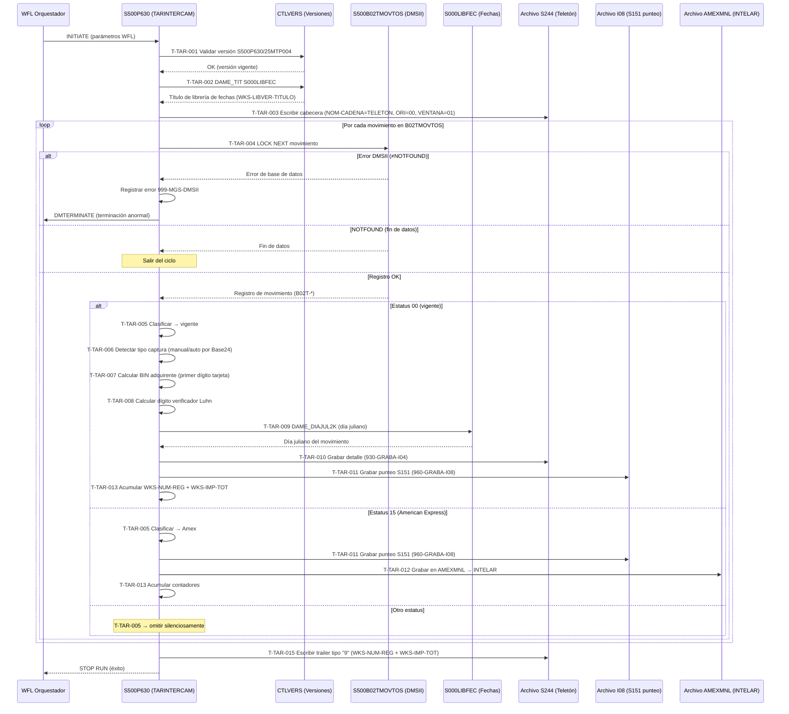

# Capacidad: ATM · PoS — Liquidación de Tarjetas de Intercambio [S500]
> Dominio: 2 · Channels · Subdominio: Un-Assisted Touchpoints
> Capacidades: **2.2.6 ATM** · **2.2.7 PoS** — comparten el mismo flujo batch en P630
> Cobertura: S500 · Programa principal: S500P630 (TARINTERCAM)
> Reglas vinculadas: RN-S500-037..055 (19 reglas)
> Nota: ATM y PoS se documentan en un solo archivo porque P630 procesa tarjetas de intercambio para ambos canales con la misma lógica. La diferenciación ATM vs. PoS reside en el origen del movimiento (campo B02T-TIPO-CANAL en S500B02TMOVTOS), no en la lógica de liquidación.

---

## Inventario de Tareas

| ID | Tarea | Programa | Componente fuente | Tipo |
|----|-------|----------|-------------------|------|
| T-TAR-001 | Validar versión del programa contra catálogo central CTLVERS | S500P630 | COBOL_S500P630.txt | validación |
| T-TAR-002 | Resolver librería de cálculo de fechas vía DAME_TIT IN CTLVERS | S500P630 | COBOL_S500P630.txt | control |
| T-TAR-003 | Inicializar archivo de salida S244 con cabecera (cadena Teletón) | S500P630 | COBOL_S500P630.txt | escritura |
| T-TAR-004 | Leer siguiente movimiento de tarjeta de S500B02TMOVTOS (LOCK NEXT) | S500P630 | COBOL_S500P630.txt | consulta |
| T-TAR-005 | Clasificar estatus contable del movimiento (00=vigente · 15=Amex · otros=omitir) | S500P630 | COBOL_S500P630.txt | validación |
| T-TAR-006 | Detectar tipo de captura (manual = Base24 vacío/000000 · automática = Base24 válido) | S500P630 | COBOL_S500P630.txt | validación |
| T-TAR-007 | Calcular BIN adquirente por primer dígito de tarjeta (3/4→454061 · otros→543006) | S500P630 | COBOL_S500P630.txt | validación |
| T-TAR-008 | Calcular dígito verificador Luhn para referencia de 23 posiciones (WKS-I04-RE-*) | S500P630 | COBOL_S500P630.txt | validación |
| T-TAR-009 | Calcular día juliano del movimiento vía librería S000LIBFEC (DAME_DIAJUL2K) | S500P630 | COBOL_S500P630.txt | consulta |
| T-TAR-010 | Grabar registro de detalle en archivo S244 (paragraph 930-GRABA-I04) | S500P630 | COBOL_S500P630.txt | escritura |
| T-TAR-011 | Grabar registro de punteo hacia S151 en archivo I08 (paragraph 960-GRABA-I08) | S500P630 | COBOL_S500P630.txt | contable |
| T-TAR-012 | Grabar registro American Express en archivo AMEXMNL → INTELAR | S500P630 | COBOL_S500P630.txt | escritura |
| T-TAR-013 | Acumular contador e importe en variables de cierre (WKS-NUM-REG / WKS-IMP-TOT) | S500P630 | COBOL_S500P630.txt | control |
| T-TAR-014 | Capturar interrupción externa (TASKVALUE) y registrar rastro de auditoría | S500P630 | COBOL_S500P630.txt | control |
| T-TAR-015 | Escribir trailer de cierre en archivo S244 con contadores acumulados | S500P630 | COBOL_S500P630.txt | escritura |

---

## Casuísticas

### CS-TAR-01: Cargo por tarjeta ATM/PoS vigente — captura automática (happy path)
**Tipo:** happy-path
**Condición de entrada:** Movimiento en S500B02TMOVTOS con estatus contable 00, autorización Base24 válida (≠ "000000"/espacios), primer dígito 4 (Visa)
**Resultado:** Registro de detalle en S244 con BIN 454061 y tipo-tran=0 (automático); registro de punteo en I08 hacia S151; acumuladores incrementados; ciclo continúa con siguiente movimiento
**Secuencia:**
```
T-TAR-001 → T-TAR-002 → T-TAR-003
  → [ciclo] T-TAR-004 → T-TAR-005 (estatus 00)
    → T-TAR-006 (automática) → T-TAR-007 (BIN 454061)
    → T-TAR-008 → T-TAR-009
    → T-TAR-010 → T-TAR-011 → T-TAR-013
  → [siguiente] T-TAR-004 ...
  → [fin] T-TAR-015
```

### CS-TAR-02: Cargo por tarjeta ATM/PoS vigente — captura manual
**Tipo:** happy-path (variante)
**Condición de entrada:** Movimiento con estatus 00, campo B02T-AUT-B24 = "000000" o espacios
**Resultado:** Registro en S244 con tipo-tran=1 (manual); procesamiento idéntico al CS-TAR-01 en lo demás
**Secuencia:**
```
T-TAR-004 → T-TAR-005 (estatus 00) → T-TAR-006 (manual: tipo-tran=1)
  → T-TAR-007 → T-TAR-008 → T-TAR-009 → T-TAR-010 → T-TAR-011 → T-TAR-013
```

### CS-TAR-03: Movimiento American Express
**Tipo:** happy-path (ruta diferenciada)
**Condición de entrada:** Movimiento con estatus contable 15 ("no contable referido")
**Resultado:** Sin registro en S244 (Teletón); registro de punteo en I08 hacia S151; registro en AMEXMNL para INTELAR
**Secuencia:**
```
T-TAR-004 → T-TAR-005 (estatus 15 = Amex)
  → T-TAR-011 → T-TAR-012 → T-TAR-013
```

### CS-TAR-04: Movimiento con estatus no procesable
**Tipo:** edge-case
**Condición de entrada:** Movimiento con estatus contable ≠ 00 y ≠ 15
**Resultado:** Sin ningún archivo de salida; el movimiento se omite silenciosamente; ciclo continúa
**Secuencia:**
```
T-TAR-004 → T-TAR-005 (estatus no procesable) → T-TAR-004 (siguiente movimiento)
```

### CS-TAR-05: Error DMSII durante lectura de movimientos
**Tipo:** error
**Condición de entrada:** La lectura LOCK NEXT sobre S500B02TMOVTOS retorna error distinto de NOTFOUND (fin de datos)
**Resultado:** Error registrado en log (999-MGS-DMSII); terminación forzada vía CALL SYSTEM DMTERMINATE — proceso termina anormalmente, sin escribir trailer de S244
**Secuencia:**
```
T-TAR-004 (error DMSII) → CALL SYSTEM DMTERMINATE (terminación forzada, sin T-TAR-015)
```

### CS-TAR-06: Interrupción externa durante procesamiento (TASKVALUE)
**Tipo:** edge-case
**Condición de entrada:** El orquestador batch envía señal de interrupción (cambio de TASKVALUE tipo HI) durante el ciclo de procesamiento de un movimiento
**Resultado:** Registro de la autorización en curso en el log de auditoría; proceso continúa o termina según el valor TASKVALUE recibido (por ejemplo, TASKVALUE=3016 = DIVESTITURE flag)
**Secuencia:**
```
T-TAR-004 → T-TAR-014 (interrupción capturada → registro de auditoría) → continúa o termina
```

---

## Diagrama



---

## Reglas vinculadas a tareas

| Tarea | Regla | Componente fuente | Descripción |
|-------|-------|-------------------|-------------|
| T-TAR-001 | RN-S500-038 | COBOL_S500P630.txt | Validación de versión autorizada antes de procesar |
| T-TAR-002 | RN-S500-039 | COBOL_S500P630.txt | Resolución dinámica de librería de fechas CTLVERS |
| T-TAR-003 | RN-S500-040 | COBOL_S500P630.txt | Etiquetado de archivo S244 como cadena Teletón |
| T-TAR-004 | RN-S500-041 | COBOL_S500P630.txt | Control de lectura y terminación ante errores DMSII |
| T-TAR-005 | RN-S500-042 | COBOL_S500P630.txt | Doble salida vigente hacia S244 y S151 (estatus 00) |
| T-TAR-005 | RN-S500-043 | COBOL_S500P630.txt | Ruta diferenciada para movimientos American Express (estatus 15) |
| T-TAR-006 | RN-S500-044 | COBOL_S500P630.txt | Clasificación manual o automática por campo Base24 |
| T-TAR-007 | RN-S500-045 | COBOL_S500P630.txt | Asignación de BIN adquirente por primer dígito (3/4→454061 · otros→543006) |
| T-TAR-008 | RN-S500-046 | COBOL_S500P630.txt | Dígito verificador tipo Luhn para referencia 23 |
| T-TAR-014 | RN-S500-037 | COBOL_S500P630.txt | Rastro de auditoría ante interrupción de proceso (TASKVALUE) |

> **Reglas RN-S500-047..055** (9 reglas aún no mapeadas a tareas): contienen lógica adicional de P630 — cálculo de día juliano, armado de campos de punteo I08 para S151, manejo de datos del archivo AMEXMNL, contadores de cierre y manejo de fin de ciclo. Se vincularán en la siguiente iteración tras lectura completa de esas reglas.

---

## Hallazgos de migración críticos

| Riesgo | Tarea | Severidad | Acción requerida |
|--------|-------|-----------|-----------------|
| `USE AS INTERRUPT PROCEDURE` (nativo MCP) | T-TAR-014 | 🟡 ALTO | Reemplazar por mecanismo de señal/signal handler en JVM o cloud |
| `CALL SYSTEM DMTERMINATE` (propietario DMSII) | T-TAR-004 (error) | 🟡 ALTO | Reemplazar por exit-code no-cero al orquestador cloud |
| `CTLVERS` catálogo centralizado (2 llamadas) | T-TAR-001, T-TAR-002 | 🟡 ALTO | Reemplazar por ConfigMap / parameter store / service registry |
| BINs 454061 / 543006 hardcodeados | T-TAR-007 | 🟡 MEDIO | Mover a tabla de parámetros configurable; ISO 7812 puede cambiar rangos |
| Doble salida S244 + I08 no atómica | T-TAR-010 + T-TAR-011 | 🟠 CRÍTICO | Garantizar atomicidad (saga, outbox, 2PC) — divergencia = gap de conciliación |
| Nombre Teletón y parámetros hardcodeados (I04-NOM-CADENA) | T-TAR-003 | 🟡 MEDIO | Parametrizar para soportar múltiples cadenas comerciales |
| Archivos S244 / AMEXMNL como contratos de interfaz | T-TAR-010, T-TAR-012 | 🟠 CRÍTICO | Documentar schema y validar con equipos S244 e INTELAR antes de migrar |

---

## Trazabilidad completa (ejemplo RN-S500-045)

```
Regla: RN-S500-045 — Asignación de BIN adquirente por primer dígito
  → Tarea: T-TAR-007 — Calcular BIN adquirente
    → Programa: S500P630
      → Componente fuente: COBOL_S500P630.txt
        → Párrafo: 935-ARMA-REF23 (~línea 197)
          → Casuística: CS-TAR-01 (happy path) / CS-TAR-02 (manual)
            → Diagrama: paso "T-TAR-007 Calcular BIN adquirente"
```

---

*cap-tar.md · v1.0 · 2026-07-16 · Piloto Capa 4 (Inventario de Tareas) + Capa 5 (Casuísticas + Diagrama Mermaid)*
*Capacidades: 2.2.6 ATM · 2.2.7 PoS · Sistema: S500 · Programa: S500P630 (TARINTERCAM)*
*Cross-referencia: RN-S500-037..055 · rules-catalog/rules-s500.md · capability-map.md · kb-capa3-capacidades.md*