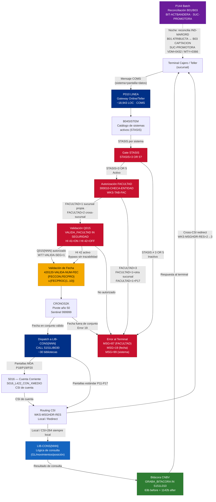

# Capacidad: Teller — Gateway Online/Sucursal [S151 + S500]
> Dominio: 2 · Channels · Capacidad: 2.1.1 · Teller
> Cobertura: S151 (GL) + S500 (Captación) · Programa principal: P010 (LINEA) · Contexto: P144 (Reconciliación B01/B03)
> Reglas vinculadas: 33 · Tareas: 19
> Generado: 2026-07-16

---

## Contexto funcional

El programa **P010 (LINEA)** es el **gateway online de cajero/teller** del sistema S151 — General Ledger de Banamex sobre plataforma **Unisys ClearPath MCP**. Su rol es exclusivamente de dispatcher: recibe cada petición del terminal de cajero (sucursal), evalúa seguridad, determina el sistema y la pantalla destino, y delega la lógica de consulta a la biblioteca `LIB-CONS{NNN}` correspondiente (hasta ~30 bibliotecas hardcoded). P010 **no registra asientos contables ni genera movimientos GL** por sí mismo; toda la lógica de negocio reside en las bibliotecas destino. El proceso corre como un **daemon persistente** (loop `PERFORM UNTIL W77-FIN=1`) que atiende mensajes de forma continua y se detiene únicamente mediante interrupciones del operador (HI 4/HI 6).

La capacidad Teller en S151 abarca las operaciones de consulta y administración de cajero de sucursal: consultas de movimientos del día (P11-P29), consultas por medio de acceso MDA (P18/P19/P20), administración de fechas (P81), nombres de archivos batch (P82), ciclos de proceso (P83) y estatus de sistemas (P86). El modelo de seguridad se basa en tres niveles de **FACULTAD** (1=sucursal propia, 2=cross-sucursal, 3=denegado) evaluados por sistema×sucursal, con validación externa mediante códigos `Q015{NNN}` hardcodeados por pantalla. El principio de doble control se implementa en operaciones administrativas (P81/P82/P83) mediante clave de supervisor (`CVE-SUP`).

La integración S500-S151 en el dominio Teller se materializa en dos flujos: el routing de consultas de movimientos vía MDA hacia el sistema S016 (cuenta corriente), y la reconciliación de indicadores de ordenante entre BD07 ATRIBUCTA y BD01 CAPTACION por el programa P144. La regla **RN-S500-143** establece que la sucursal promotora en los registros de activación masiva (`BIT-ACTBANDERA`) se determina por CSI local: VDM→0432, MTY→0366. Esta topología distribuida VDM/MTY es una constante arquitectural del ecosistema que no tiene equivalente directo en plataformas cloud-native y representa uno de los vectores de mayor riesgo en la migración.

---

## Inventario de Tareas

| ID | Nombre | Tipo | Programa / Componente | Reglas vinculadas |
|----|--------|------|-----------------------|-------------------|
| T-TEL-001 | Inicialización del gateway: carga de sistemas y bibliotecas | configuración | P010 — LIB-CONS{NNN}, B04SISTEM | RN-S151-241, RN-S151-258 |
| T-TEL-002 | Control del ciclo de vida del proceso online (daemon) | control | P010 — W77-FIN, SMCOMS | RN-S151-257, RN-S151-261 |
| T-TEL-003 | Gestión de tres fechas independientes de proceso | validación | P010 — P81, P84, CRONOS2K | RN-S151-242, RN-S151-253, RN-S151-254 |
| T-TEL-004 | Gate de estatus de sistema: STASIS=3/5 | control | P010 — B04SISTEM, P86 | RN-S151-243 |
| T-TEL-005 | Autorización por FACULTAD y control de acceso | seguridad | P010 — WKS-TAB-FAC, SEGURIDAD | RN-S151-244, RN-S151-247, RN-S151-262 |
| T-TEL-006 | Validación de seguridad Q015 y toggle HI 41/42 | seguridad | P010 — WS-FAC-CVETRAN, W77-VALIDA-SEG | RN-S151-245, RN-S151-246 |
| T-TEL-007 | Configuración de bases de datos por TIPBD y ciclos de proceso | configuración | P010 — B03, P83 | RN-S151-249, RN-S151-266 |
| T-TEL-008 | Retención histórica: ciclo de hasta 10 fechas archivadas | consulta | P010 — B01, WKS-TAB-FECPROC | RN-S151-250 |
| T-TEL-009 | Routing entre nodos CSI: restricción, redirect y excepciones | arquitectura | P010 — WKS-MSGHDR-RES, S016_L422 | RN-S151-251, RN-S151-255, RN-S151-267, RN-S151-269 |
| T-TEL-010 | Gestión del Medio de Acceso (MDA) y campo NIO | consulta | P010 — P18/P19/P20, WKS-ENT-P18MDA | RN-S151-252, RN-S151-263 |
| T-TEL-011 | Control especial de sistemas 1, 66 y 264 | control | P010 — WKS-SIS-NUME, LIB-CONS0264 | RN-S151-256, RN-S151-270 |
| T-TEL-012 | Sucursal 859 hardcodeada en Panel 24 | configuración | P010 — W77-SUC-CAPTURA, P24 | RN-S151-248 |
| T-TEL-013 | Bitácora de auditoría CNBV (before/after) | auditoría | P010 — GRABA_BITACORA, S151L010 | RN-S151-259 |
| T-TEL-014 | Monitor de traza y control dinámico de bases de datos | operación | P010 — W77-MONITOR, HI 40NNN/44NNN | RN-S151-260, RN-S151-268 |
| T-TEL-015 | Administración de archivos batch P82 (NOMARC/NOMPAC) | configuración | P010 — P82, WKS-ENT-P82NOMARC | RN-S151-265 |
| T-TEL-016 | Validación numérica universal vía JUSTIFIER IN LOCSUP | validación | P010 — LOCSUP (S006), WKS-FUNCION | RN-S151-264 |
| T-TEL-017 | Menú de selección de pantalla (P01, 1-99) | UI | P010 — WKS-ENT-P01NUMTRA | RN-S151-271 |
| T-TEL-018 | Validación de supervisor y doble control administrativo | seguridad | P010 — CVE-SUP, ERR035 | RN-S151-272 |
| T-TEL-019 | SUC-PROMOTORA por CSI en activaciones masivas BIT-ACTBANDERA | escritura | P144 — WKS-SUC-PROMOTORA, WKS-CSIL | RN-S500-143 |

---

## Casuísticas principales

### Caso 1: Consulta de movimientos del día desde terminal de cajero (flujo nominal)

El cajero en su terminal selecciona desde el menú P01 la pantalla 11 (movimientos del día). P010 recibe el mensaje del terminal via COMS y extrae el número de sistema (`WKS-ENT-ENTNUMSIS`) y pantalla (`WKS-PAN-ENTNUMPAN`).

1. **T-TEL-004** — Gate de estatus: P010 verifica `WKS-TAB-STASIS(sistema) = 3 OR 5`; si el sistema está inactivo, rechaza la petición sin dispatch.
2. **T-TEL-005** — Autorización: `300010-CHECA-ENTIDAD` evalúa `W77-FACULTAD` de la tabla WKS-TAB-FAC (sucursal × sistema). Si FACULTAD=1 y la sucursal del cajero coincide con la sucursal de captura, CVE-RESOL=1 (autorizado).
3. **T-TEL-006** — Seguridad Q015: MOVE "Q015111" TO WS-FAC-CVETRAN; si `W77-VALIDA-SEG=1`, llama a `VALIDA_FACULTAD IN SEGURIDAD`. Si autorizado, continúa.
4. **T-TEL-003** — Validación de fecha: `420120-VALIDA-NUM-FEC` verifica que la fecha solicitada pertenezca al conjunto {FECCON, FECPRO} ∪ {FECPROC(1..10)}; si inválida, emite error 19.
5. **T-TEL-001** — Dispatch: `CALL "S151LIB030 IN LIB-CONS0011"` delega la consulta a la biblioteca destino.
6. **T-TEL-013** — Bitácora: si la operación implica cambio de parámetro, `GRABA_BITACORA` registra before/after en S151L010 con nómina, hora y pantalla.

**Resultado:** Pantalla de movimientos del día retornada al terminal del cajero. S151 no generó asiento GL; solo lectura via LIB-CONS0011.

---

### Caso 2: Acceso denegado por FACULTAD insuficiente (consulta cross-sucursal sin permiso)

El cajero de la sucursal A (con FACULTAD=1 para el sistema) intenta consultar movimientos de la sucursal B.

1. **T-TEL-004** — Gate STASIS: sistema activo (STASIS=3), dispatch habilitado.
2. **T-TEL-005** — Autorización FACULTAD: `300010-CHECA-ENTIDAD` evalúa: FACULTAD=1 + sucursal_solicitada ≠ sucursal_propia → `MOVE 3 TO W77-CVE-RESOL` + `MOVE 87 TO W77-RES-MSG`.
3. P010 retorna el error 87 ("SEG; NIVEL DE FACULTADES INSUFICIENTE") al terminal. No se realiza dispatch a ninguna LIB-CONS.
4. **T-TEL-013** — Bitácora: el código de resultado 3 (denegado) se registra en `WKS-BIT-CVE-RESULT`.

**Variante**: Si el mismo cajero solicita la Pantalla P17 (Totales Nacionales) con FACULTAD=1, el bloqueo opera por regla RN-247 adicional al check de sucursal, siempre con error 87. Solo FACULTAD=2 puede acceder a P17.

**Resultado:** Terminal recibe error 87. Sin dispatch GL. La denegación queda registrada en bitácora CNBV.

---

### Caso 3: Operación administrativa — actualización de fechas del sistema (P81) con doble control

El operador de sistemas necesita actualizar la fecha contable (FECCON) del sistema 500 para el día siguiente.

1. **T-TEL-017** — Menú P01: operador selecciona pantalla 81 (Administración) desde el menú.
2. **T-TEL-006** — Seguridad Q015: MOVE "Q015181A" TO WS-FAC-CVETRAN; validación contra SEGURIDAD.
3. **T-TEL-018** — Doble control: `420100-VALIDA-CVE-SUP` verifica que el campo CVE-SUP sea numérico y > 0; si inválido, error 35 ("ERR035") y bloqueo.
4. **T-TEL-003** — Actualización de fechas: operador ingresa nuevo FECCON en `WKS-ENT-P81FECCON`; P010 valida con CRONOS2K (pivote año 50) que la fecha sea coherente. Las tres fechas FECCON, FECPRO y FEC151 pueden quedar en valores distintos (asíncrono).
5. **T-TEL-013** — Bitácora: `GRABA_BITACORA IN S151L010` registra before (63b) y after (1142b) con nómina del operador, hora de inicio, hora de fin, tipo M (modificación), sistema y pantalla 81A. Si CSI=32 y MSGHDR-RES=2: bitácora omitida (gap de compliance).
6. **T-TEL-007** — Dataset B01/B03: la nueva FECCON se escribe al dataset de configuración del sistema seleccionado.

**Resultado:** Fecha contable del sistema 500 actualizada. Bitácora CNBV registrada. Divergencia FECCON≠FECPRO es válida y esperada para ajustes diferidos.

---

### Caso 4: Consulta de movimientos por Medio de Acceso (MDA) — canal teller con integración S016/S500

El cajero consulta movimientos asociados a un medio de acceso (tarjeta/instrumento) en pantalla P18.

1. **T-TEL-010** — MDA: P010 extrae del buffer `CVEMDA(2) + SUCMDA(4) + NUMMDA(16)` del mensaje de entrada. Si NUMMDA(16) contiene número de tarjeta: riesgo PCI-DSS latente.
2. **T-TEL-009** — Routing S016: P010 llama a `S016_L422_CON_XMEDIO` para obtener el CSI de la cuenta. Si retorno=10 → cuenta no existe (error negocio). Si CSI_cuenta ≠ CSI_local → redirect cross-CSI.
3. **T-TEL-010** — NIO: el campo `WKS-SAL-P11NIO` (X(16)) se incluye en la respuesta al terminal, identificando la operación SPEI asociada al movimiento (si aplica).
4. **T-TEL-019** — SUC-PROMOTORA (S500, P144): en el ciclo batch de reconciliación, si la activación masiva es generada en VDM (CSI=10), SUC-PROMOTORA=0432; si en MTY (CSI=04), SUC-PROMOTORA=0366 (RN-S500-143).

**Resultado:** Movimientos del medio de acceso retornados al terminal, con NIO incluido. Routing cross-CSI transparente al cajero. El indicador de ordenante se reconcilia nocturnamente via P144.

---

## Diagrama de flujo

---

## Reglas vinculadas

| Tarea | Regla | Componente fuente | Descripción |
|-------|-------|-------------------|-------------|
| T-TEL-001 | RN-S151-241 | P010 — WKS-ENT-ENTNUMSIS, WKS-PAN-ENTNUMPAN | P010 (LINEA) es dispatcher puro, no motor GL. Recibe sistema+pantalla, delega a LIB-CONS{NNN}. ~30 bibliotecas de consulta. Sin lógica GL en su PROCEDURE DIVISION |
| T-TEL-001 | RN-S151-258 | P010 — B04SISTEM, CHANGE ATTRIBUTE TITLE | Inicialización: carga B04SISTEM FUN=02 + 16+ CHANGE ATTRIBUTE TITLE hardcodeados (S017, S018, S500, S151, S264…). Sistema 501 comentado y excluido deliberadamente |
| T-TEL-002 | RN-S151-257 | P010 — W77-FIN, HI 4/HI 6 | Loop principal daemon: PERFORM UNTIL W77-FIN=1. HI 4=fin normal, HI 6=emergencia; ambos activan W77-FIN=1. Error fatal también invoca 999999-FIN directamente |
| T-TEL-002 | RN-S151-261 | P010 — SMCOMS DISABLE PROGRAM, 999999-FIN | Terminación ordenada: 999999-FIN llama SMCOMS DISABLE PROGRAM para desregistrar el proceso del sistema de mensajes antes de STOP RUN. Error en SMCOMS no detiene la terminación |
| T-TEL-003 | RN-S151-242 | P010 — WKS-ENT-P81FECCON, WKS-ENT-P81FEC151, WKS-ENT-P84FECPRO | Tres fechas independientes por sistema: FECPRO (proceso), FECCON (contabilización GL), FEC151 (interna S151). Pueden diverger; permite ajustes diferidos entre procesamiento y cierre |
| T-TEL-003 | RN-S151-253 | P010 — CRONOS2K, A2K-BASE-YEAR=50 | Y2K pivote año 50: AA < 50 → siglo 20, AA ≥ 50 → siglo 19. Sentinel 999999 = fecha nula → mapea a 99999999. Bug latente: a partir de 2050, AA=50 se interpretará como 1950 |
| T-TEL-003 | RN-S151-254 | P010 — 420120-VALIDA-NUM-FEC, WKS-TAB-FECCON/FECPRO/FECPROC | Fecha válida debe pertenecer a {FECCON, FECPRO} ∪ {FECPROC(1..10)} del sistema. Error 19 si fuera del conjunto. Validación numérica previa vía JUSTIFIER IN LOCSUP |
| T-TEL-004 | RN-S151-243 | P010 — WKS-TAB-STASIS, P86, B04SISTEM | Gate de estatus: solo STASIS=3 (normal) o STASIS=5 (alternativo) habilitan routing online. Cargado de B04SISTEM; modificable vía P86. STASIS=5 no equivale a STASIS=3 en todos los flujos |
| T-TEL-005 | RN-S151-244 | P010 — W77-FACULTAD, WKS-TAB-FAC (1-4999 sucursales) | Modelo de autorización FACULTAD: 1=solo sucursal propia, 2=cross-sucursal autorizado, 3=denegado. Tabla en memoria hasta 5000 sucursales × sistemas. CNBV CUB — segregación de funciones |
| T-TEL-005 | RN-S151-247 | P010 — WKS-PAN-ENTNUMPAN=17, FACULTAD=1 | Pantalla P17 (Totales Nacionales) explícitamente bloqueada para FACULTAD=1. CVE-RESOL=3 + error 87. Solo FACULTAD=2 puede ver totales nacionales. No hay excepción de superusuario |
| T-TEL-005 | RN-S151-262 | P010 — W77-CVE-RESOL, VALIDA_FACULTAD, W77-RES-MSG | Mapeo resultado de FACULTAD: 0=no evaluado, 1=autorizado, 3=denegado+error 87. Externo VALIDA_FACULTAD retorna -9=suspendido (MSG=78), -11..-2=error validación (MSG=78) |
| T-TEL-006 | RN-S151-245 | P010 — WS-FAC-CVETRAN Q015{NNN}, SEGURIDAD | Códigos Q015{NNN} hardcodeados por pantalla (111-130C, 181A/B/M/C). Verificación contra SEGURIDAD vía VALIDA_FACULTAD antes del dispatch. 25+ pantallas con su propio código |
| T-TEL-006 | RN-S151-246 | P010 — W77-VALIDA-SEG, HI 41/HI 42 | Toggle de seguridad en tiempo real: HI 41 → VALIDA-SEG=1 (habilitada), HI 42 → VALIDA-SEG=2 (deshabilitada). Sin trazabilidad en bitácora. CNBV CUB — riesgo de compliance severo |
| T-TEL-007 | RN-S151-249 | P010 — WKS-B03-TIPBD (1-7), BD10/BD11/BD12/BD13 | TIPBD 1-7 como máscara implícita: BD10 siempre activa. TIPBD=1 activa las 4; valores 2-7 combinaciones parciales. TIPBD=0 o >7: estado indefinido. Cargado de B03 vía P83 |
| T-TEL-007 | RN-S151-266 | P010 — WKS-ENT-P83BDUSAR, NUMCICDIA, NUMCICMES | P83 configura ciclos de proceso: NUMCICDIA (por día) y NUMCICMES (por mes). BDUSAR alimenta TIPBD. Los 4 slots de BD de movimientos rotativas se administran aquí. Requiere CVE-SUP |
| T-TEL-008 | RN-S151-250 | P010 — WKS-B01-FECARCMOV(1..10), WKS-TAB-FECPROC | Ciclo de archivo: hasta 10 fechas históricas de proceso por sistema. Slot=0 no disponible. Límite fijo OCCURS 10: un 11° día histórico no puede consultarse online. LIC Art. 56 — 7 años |
| T-TEL-009 | RN-S151-251 | P010 — WKS-B03-RESCSI, WKS-NUMCSI-HOST | Restricción CSI-nodo: RESCSI define a qué nodo CSI está restringido el sistema. MODSIS=0 sobreride la restricción. Evalúa si petición puede procesarse localmente o debe redirigirse |
| T-TEL-009 | RN-S151-255 | P010 — WKS-MSGHDR-RES=2, sistema 264 excepción | Ruteo inter-CSI: MSGHDR-RES=2 → redirect (cambia a 3, copia CCR-ORG→CCR-DES). Sistema 264 = NEXT SENTENCE (siempre local). Valores 11/12 = routing red; valor 1 = terminación |
| T-TEL-009 | RN-S151-267 | P010 — S016_L422_CON_XMEDIO, WKS-CSI-CTES | Routing de consultas MDA: llama a S016 para obtener CSI de la cuenta. Error 10=cuenta no existe. CSI_cuenta ≠ CSI_local → redirect cross-CSI. CSI=32: override a NUMCSI-HOST |
| T-TEL-009 | RN-S151-269 | P010 — WKS-NUMCSI-HOST=32 | Nodo especial CSI=32: 3 bypasses — (1) omite carga de entidades de sucursal, (2) fuerza CSI de cuenta al host, (3) omite bitácora cuando MSGHDR-RES=2. Comportamiento no parametrizable |
| T-TEL-010 | RN-S151-252 | P010 — WKS-ENT-P18CVEMDA(2), SUCMDA(4), NUMMDA(16) | MDA (Medio de Acceso) = 22 bytes: CVEMDA+SUCMDA+NUMMDA. Clasifica movimientos por canal (sucursal/ATM/SPEI). NUMMDA(16) puede contener número de tarjeta → riesgo PCI-DSS |
| T-TEL-010 | RN-S151-263 | P010 — WKS-SAL-P11NIO X(16), FTF 2006-07-28 | Campo NIO (Número de Identificación de Operación) agregado en P12/P14/P18 el 2006-07-28. Tamaño X(16) en salida: posible NIO SPEI Banxico. Confianza media — semántica requiere validación HITL |
| T-TEL-011 | RN-S151-256 | P010 — WKS-SIS-NUME IN (1,66), WKS-SUC-NUME | Sistemas 1 y 66 son "nacionales sin sucursal": si SUC-NUME>0 → error 99. Consulta nacional válida solo con SUC-NUME=0. Redirect forzado si MSGHDR-RES=2 |
| T-TEL-011 | RN-S151-270 | P010 — SISTEMA=264 NEXT SENTENCE, LIB-CONS0264 | Sistema 264: doble excepción — inicialización especial + siempre proceso local. Sistema 501 comentado en inicialización Y en NEXT SENTENCE: fue incluido, luego excluido deliberadamente |
| T-TEL-012 | RN-S151-248 | P010 — W77-SUC-CAPTURA=859, Panel 24 | Sucursal 859 hardcodeada en Panel 24. Presuntamente sucursal centralizada/virtual. Afecta lógica de FACULTAD=1 para P24. No parametrizable: cambio requiere recompilación de LINEA |
| T-TEL-013 | RN-S151-259 | P010 — GRABA_BITACORA IN S151L010, WKS-BIT-MSG-ANT(63b)+POST(1142b) | Bitácora CNBV: registra operaciones administrativas P81-P86 con before/after. Campos: nómina, fecha/hora inicio/fin, estación, sistema, pantalla, tipo (A/M/B), CVE-RESULT. Excepción: CSI=32+RES=2 omite bitácora |
| T-TEL-014 | RN-S151-260 | P010 — W77-MONITOR, HI 2/HI 3 | Monitor de traza en producción: HI 2 → MONITOR=1 (debug activado, DISPLAYs adicionales), HI 3 → MONITOR=0. Sin persistencia al reinicio. Overhead de I/O en MCP cuando activo |
| T-TEL-014 | RN-S151-268 | P010 — HI 40NNN/HI 44NNN/HI 45, WKS-TAB-STABD10..13 | Control dinámico de BD en runtime: HI 40NNN = toggle BD10 de sistema NNN; HI 44NNN = toggle las 4 BDs del sistema; HI 45 = todas las BDs de todos los sistemas. Toggle no idempotente |
| T-TEL-015 | RN-S151-265 | P010 — WKS-ENT-P82NOMARC(34), NOMPAC(17), P82 | P82 administra NOMARC/NOMPAC de 13 subsistemas batch (028, 250, 030, 015, 050SDO, 050MOV…). Son paths del filesystem Unisys DMSII/MCP. Sin validación de existencia antes de escribir B01 |
| T-TEL-016 | RN-S151-264 | P010 — JUSTIFIER IN LOCSUP (S006), WKS-FUNCION | Validación numérica universal: >25 paragraphs invocan JUSTIFIER IN LOCSUP. WKS-FUNCION>0 = campo no numérico. Fallo de LOCSUP afecta toda validación numérica del hub. Librería propietaria Unisys |
| T-TEL-017 | RN-S151-271 | P010 — WKS-ENT-P01NUMTRA (1-99), P01 | Menú de entrada del hub S151: NUMTRA 1-99 selecciona la pantalla destino. Valores válidos hardcodeados (11,12,13,15,18,19…) en IF-ELSE cascada. Error en P01 bloquea acceso completo al hub |
| T-TEL-018 | RN-S151-272 | P010 — CVE-SUP, 420100-VALIDA-CVE-SUP, ERR035 | Doble control administrativo: CVE-SUP debe ser numérico y >0 para P81/P82/P83/P84/P86. Error 35 si inválido. No verifica existencia de nómina en IAM. 6+ puntos de invocación. CNBV CUB |
| T-TEL-019 | RN-S500-143 | P144 — WKS-SUC-PROMOTORA, WKS-CSIL | SUC-PROMOTORA en BIT-ACTBANDERA: si CSI=10 (VDM) → 0432; si CSI=04 (MTY) → 0366. Sucursales virtuales de proceso que identifican origen geográfico de activaciones masivas. Sin lógica paramétrica |

---

## Hallazgos de migración

| # | Hallazgo | Impacto | Recomendación |
|---|---------|---------|---------------|
| H-TEL-01 | **CHANGE ATTRIBUTE TITLE: 16+ bibliotecas hardcodeadas en inicialización** (RN-258). El mecanismo de linking tardío de Unisys (`CHANGE ATTRIBUTE TITLE OF "LIB-CONS{NNN}"`) no tiene equivalente en plataformas modernas. El catálogo de 16+ sistemas es estático: añadir un sistema requiere recompilación de LINEA. Sistema 501 excluido deliberadamente (comentado) — su semántica de exclusión puede perderse en la migración. | Alto — deuda de arquitectura | Reemplazar por tabla de routing dinámica (service registry, ConfigMap en Kubernetes, o API Gateway routing table). Cada LIB-CONS{NNN} se convierte en un microservicio de consulta independiente. Documentar la razón de exclusión de sistema 501 con SME antes de transpilación |
| H-TEL-02 | **Toggle HI 41/42 de seguridad sin trazabilidad** (RN-246). El operador puede deshabilitar en producción toda la validación Q015 enviando HI 42, sin registro en bitácora de quién lo hizo ni cuándo. El estado inicial del proceso (W77-VALIDA-SEG=0) implica que en el arranque la seguridad está desactivada hasta que se envíe HI 41. Riesgo de compliance CNBV CUB severo. | Crítico — cumplimiento regulatorio | Implementar en target como feature flag auditado con: (1) aprobación de 4-eyes, (2) registro inmutable de activación/desactivación en audit log, (3) notificación automática al CISO. El proceso debe arrancar con seguridad habilitada (no con VALIDA-SEG=0) |
| H-TEL-03 | **Y2K pivote año 50 — bug latente 2050** (RN-253). `A2K-BASE-YEAR=50`: a partir del año 2050, una fecha con AA=50 será interpretada como 1950 en lugar de 2050. La ventana se agota en menos de 24 años. El sentinel 999999 debe mantenerse durante migraciones parciales y reemplazarse por NULL en el target. | Alto — corrección urgente | Todas las fechas en el target deben almacenarse en formato AAAAMMDD de 8 dígitos. Migrar sentinel 999999/99999999 a NULL en BD relacional. Eliminar el código de pivote de año en la transpilación. Auditar todos los campos de fecha de 6 dígitos en S151 y S500 |
| H-TEL-04 | **Tres fechas desacopladas (FECCON, FECPRO, FEC151)** (RN-242). El modelo de tres fechas independientes por sistema rompe la unicidad temporal asumida por BDs relacionales modernas. FECCON>FECPRO es un caso válido (ajuste diferido), lo que complica la integridad referencial. Divergencia FEC151≠FECCON introduce riesgo en reconciliación CNBV. | Alto — integridad de datos | Modelar explícitamente las tres fechas como columnas separadas en el esquema del sistema target (`fecha_proceso`, `fecha_contabilizacion`, `fecha_interna`). Implementar reglas de negocio de validación entre ellas en la capa de servicio. Documentar los casos de divergencia válidos |
| H-TEL-05 | **Nodo especial CSI=32 con tres bypasses silenciosos** (RN-269). Un mismo valor de configuración (WKS-NUMCSI-HOST=32) activa: (1) skip de carga de entidades de sucursal, (2) override del CSI de cuenta, (3) omisión de bitácora CNBV. Estos comportamientos no están documentados en ningún artefacto visible. Si CSI=32 existe en producción (vs solo en QA), hay un gap de auditoría activo. | Alto — compliance y arquitectura | Identificar con SME de operaciones si CSI=32 existe en producción o solo en entornos no-productivos. Formalizar cada bypass como configuración de entorno explícita (env variable o parámetro). Nunca omitir bitácora en producción — crear modo de entorno DEV/QA sin registro, no un bypass hardcodeado por nodo |
| H-TEL-06 | **Sucursal 859 hardcodeada en Panel 24** (RN-248). El valor 859 es un literal en el código sin parámetro externo. La semántica exacta (¿oficina central? ¿proceso nocturno? ¿sucursal virtual?) no está documentada en el código fuente. Su relación con la excepción de enrutamiento del sistema 264 (SIS-NUME=264 AND SUC-NUME=859) crea una dependencia implícita entre dos reglas hardcodeadas. | Medio — riesgo de negocio | Validar con SME de operaciones el rol de la sucursal 859 antes de la migración. Externalizar como parámetro de configuración (tabla de sucursales virtuales / archivo de parámetros). Documentar la invariante 264+859 como regla de negocio explícita en el microservicio de routing |
| H-TEL-07 | **JUSTIFIER IN LOCSUP: biblioteca propietaria con >25 dependencias** (RN-264). La biblioteca S006 de Unisys es el único mecanismo de validación numérica en todo el hub P010. Su fallo afectaría a todas las validaciones de entrada del gateway. La condición WKS-FUNCION=0 no distingue "válido" de "no evaluado", creando riesgo de skip silencioso de validación. | Medio — deuda técnica y robustez | Reemplazar en target por framework estándar de validación (Bean Validation en Java, Pydantic en Python). Mapear cada uno de los 25+ paragraphs de validación a validadores tipados. Asegurar que el estado inicial de validación sea explícitamente "no válido" (fail-closed), no "no evaluado" |

---

*cap-tel.md · v1.0 · 2026-07-16*
*BIAN 2.1.1 · Teller · Channels*
*Sistema: S151 GL + S500 Captación · Programa: P010 LINEA (Gateway Online/Teller) · Contexto: P144*
*Reglas: 33 (RN-S151-241..272 + RN-S500-143) · Tareas: 19*
*Cross-referencia: rules-s151-p010.md · rules-s500-p020-p142-p144.md · cap-pay.md*
